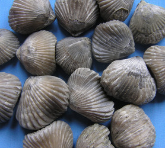

---
aliases:
- armfotingar
- armfotinger
- armfætlur
- armfødder
- armføtingar
- Armfüsser
- Armfüßer
- Armpotigen
- Brachiopod
- Brachiopoda
- Braciopod
- Braciopodo
- Brakiopoda
- Brakiopodo
- Brakiopodoj
- Braquiòpode
- Braquiópodos
- Braxïopodtar
- Chʼosh bitsʼaʼígíí bigaan dahólónígíí
- Dallı bacaklılar
- Iarempuater
- Kombe-kikonyo
- Käsijalgsed
- lonkerojalkaiset
- Mananap nga adunay tiil ang kamot
- Ngành Tay cuộn
- Oarmpôtign
- pleckāji
- pörgekarúak
- Ramenonošci
- Ramenonožce
- ramenonožci
- ramienionogi
- Yelka oyoqlilar
- Çiyinayaqlılar
- Školjke svetiljke
- Βραχιόποδα
- Брахиоподтар
- Омуроо буттуулар
- плечаногія
- плеченогие
- плечоногі
- раменоноги
- Шкољке светиљке
- ուսոտանիներ
- ברכיופודים
- بازوپایان
- براحىيوپودتار
- عضديات الأرجل
- عضديات الارجل
- ब्रैकियोपोडा
- แบรคิโอพอด
- მხარფეხიანები
- 腕足动物门
- 腕足動物
- 腕足動物門
- 완족동물
title: Brachiopoda
has_id_wikidata: Q178272
dv_has_:
  name_:
    af: Brachiopoda
    an: Brachiopoda
    ar: عضديات الأرجل
    arz: عضديات الارجل
    ast: Brachiopoda
    az: Çiyinayaqlılar
    be: плечаногія
    be_tarask: плечаногія
    bg: раменоноги
    bs: Brachiopoda
    ca: Braquiòpode
    ceb: Mananap nga adunay tiil ang kamot
    cs: ramenonožci
    cy: Braciopod
    da: armfødder
    de: Armfüßer
    de_ch: Armfüsser
    el: Βραχιόποδα
    en: Brachiopoda
    en_ca: Brachiopod
    en_gb: Brachiopod
    eo: Brakiopodoj
    es: Brachiopoda
    et: Käsijalgsed
    eu: Brachiopoda
    ext: Brachiopoda
    fa: بازوپایان
    fi: lonkerojalkaiset
    fr: Brachiopoda
    frr: Iarempuater
    ga: Brachiopoda
    gl: Braquiópodos
    he: ברכיופודים
    hi: ब्रैकियोपोडा
    hr: Ramenonošci
    hu: pörgekarúak
    hy: ուսոտանիներ
    ia: Brachiopoda
    id: Brakiopoda
    ie: Brachiopoda
    io: Brakiopodo
    is: armfætlur
    it: Brachiopoda
    ja: 腕足動物
    ka: მხარფეხიანები
    kk: Брахиоподтар
    kk_arab: براحىيوپودتار
    kk-cn: براحىيوپودتار
    kk_cyrl: Брахиоподтар
    kk-kz: Брахиоподтар
    kk_latn: Braxïopodtar
    kk-tr: Braxïopodtar
    ko: 완족동물
    ky: Омуроо буттуулар
    la: Brachiopoda
    lfn: Braciopodo
    lv: pleckāji
    mul: Brachiopoda
    nb: armfotinger
    nl: Armpotigen
    nn: armføtingar
    nv: Chʼosh bitsʼaʼígíí bigaan dahólónígíí
    oc: Brachiopoda
    pl: ramienionogi
    pt: Brachiopoda
    pt_br: Brachiopoda
    ro: Brachiopoda
    ru: плеченогие
    sco: Brachiopod
    sh: Ramenonošci
    sk: Ramenonožce
    sl: ramenonožci
    sq: Brachiopoda
    sr: Шкољке светиљке
    sr_ec: Шкољке светиљке
    sr_el: Školjke svetiljke
    sv: armfotingar
    sw: Kombe-kikonyo
    th: แบรคิโอพอด
    tl: Brachiopoda
    tr: Dallı bacaklılar
    uk: плечоногі
    uz: Yelka oyoqlilar
    vi: Ngành Tay cuộn
    vls: Oarmpôtign
    vo: Brachiopoda
    war: Brachiopoda
    wuu: 腕足动物门
    zh: 腕足动物门
    zh_cn: 腕足动物门
    zh_hans: 腕足动物门
    zh_hant: 腕足動物門
    zh_hk: 腕足動物門
    zh_sg: 腕足动物门
    zh_tw: 腕足動物門
---

# [[Brachiopoda]]

## Lamp shells 

 
 

## #has_/text_of_/abstract 

> Brachiopods (), phylum **Brachiopoda**, are a phylum of animals that have hard "valves" (shells) on the upper and lower surfaces, unlike the left and right arrangement in bivalve molluscs. Brachiopod valves are hinged at the rear end, while the front can be opened for feeding or closed for protection. 
>
> Two major categories are traditionally recognized, articulate and inarticulate brachiopods. The word "articulate" is used to describe the tooth-and-groove structures of the valve-hinge which is present in the articulate group, and absent from the inarticulate group. This is the leading diagnostic skeletal feature, by which the two main groups can be readily distinguished as fossils. Articulate brachiopods have toothed hinges and simple, vertically oriented opening and closing muscles. Conversely, inarticulate brachiopods have weak, untoothed hinges and a more complex system of vertical and oblique (diagonal) muscles used to keep the two valves aligned. In many brachiopods, a stalk-like pedicle projects from an opening near the hinge of one of the valves, known as the pedicle or ventral valve. The pedicle, when present, keeps the animal anchored to the seabed but clear of sediment which would obstruct the opening.
>
> Brachiopod lifespans range from three to over thirty years. Ripe gametes (ova or sperm) float from the gonads into the main coelom and then exit into the mantle cavity. The larvae of inarticulate brachiopods are miniature adults, with lophophores (a feeding organ consisting of an array of tentacles) that enable the larvae to feed and swim for months until the animals become heavy enough to settle to the seabed. The planktonic larvae of articulate species do not resemble the adults, but rather look like blobs with yolk sacs, and remain among the plankton for only a few days before metamorphosing and leaving the water column.
>
> Brachiopods live only in the sea, and most species avoid locations with strong currents or waves. The larvae of articulate species settle in quickly and form dense populations in well-defined areas while the larvae of inarticulate species swim for up to a month and have wide ranges. Fish and crustaceans seem to find brachiopod flesh distasteful and seldom attack them.
>
> The word "brachiopod" is formed from the Ancient Greek words brachion ("arm") and podos ("foot"). They are often known as "lamp shells", since the curved shells of the class Terebratulida resemble pottery oil-lamps.
>
> Although superficially resembling bivalves, brachiopods are not particularly closely related, and evolved their two valved structure independently, an example of convergent evolution. Brachiopods are part of the broader group Lophophorata, alongside Bryozoa and Phoronida, with which they share the characteristic lophophores. 
>
> Brachiopods are thought to have evolved from "tommotiid" ancestors during the Early Cambrian. 
> Brachiopods were highly diverse during the Paleozoic era, when their diversity exceeded that of bivalves. 
> 
> Their diversity was strongly affected by the end-Capitanian and end-Permian mass extinction events, 
> from which their diversity would never recover to its former Paleozoic levels, 
> with bivalves subsequently ascending to dominance in marine ecosystems. 
> Today, there are around 400 living species of brachiopods, in comparison to around 9,200 species of bivalves. 
> 
> Brachiopods now live mainly in cold water and low light.
>
> Among brachiopods, only the lingulids (Lingula sp.) have been fished commercially, on a very small scale.
>
> [Wikipedia](https://en.wikipedia.org/wiki/Brachiopod) 

## Phylogeny 

-   « Ancestral Groups  
    -  [Bilateria](../Bilateria.md) 
    -  [Animals](../../Animals.md) 
    -  [Eukarya](../../../Eukarya.md) 
    -   [Tree of Life](../../../Tree_of_Life.md)

-   ◊ Sibling Groups of  Bilateria
    -   [Deuterostomia](Deutero.md)
    -  [Arthropoda](Arthropoda.md) 
    -  [Onychophora](Onychophora.md) 
    -   [Tardigrade](Tardigrade.md)
    -  [Nematoda](Nematoda.md) 
    -  [Nematomorpha](Nematomorpha.md) 
    -  [Kinorhyncha](Kinorhyncha.md) 
    -  [Loricifera](Loricifera.md) 
    -  [Priapulida](Priapulida.md) 
    -   [Arrow_Worm](Arrow_Worm.md)
    -  [Gastrotricha](Gastrotricha.md) 
    -  [Rotifera](Rotifera.md) 
    -  [Gnathostomulida](Gnathostomulida.md) 
    -   [Limnognathia maerski](Limnognathia_maerski)
    -  [Cycliophora](Cycliophora.md) 
    -  [Mesozoa](Mesozoa.md) 
    -  [Platyhelminthes](Platyhelminthes.md) 
    -  [Annelida](Annelida.md) 
    -  [Bryozoa](Bryozoa.md) 
    -  [Sipuncula](Sipuncula.md) 
    -  [Mollusca](Mollusca.md) 
    -  [Nemertea](Nemertea.md) 
    -  [Entoprocta](Entoprocta.md) 
    -  [Phoronida](Phoronida.md) 
    -   Brachiopoda

-   » Sub-Groups 
	-   *Rhynchonelliformea*
	-   *Linguliformea*
	-   *Craniiformea*

## Title Illustrations

---------------------------------------------------------------------------

scientific_name ::     Brachiopoda
Creator              Photograph by P. Crawford, UPEI
specimen_condition ::  Live Specimen
copyright ::            © [BIODIDAC](http://biodidac.bio.uottawa.ca/index.htm) 

----------------------------------------------------------- 
 
scientific_name ::     Brachiopoda
location ::           Upper Fullers Earth Clays, West Bay, Dorset UK
Acknowledgements     The copyright owner has released this image under the [Attribution-NonCommercial-NoDerivs 2.0 Creative Commons License](http://creativecommons.org/licenses/by-nc-nd/2.0/).
specimen_condition ::  Fossil
copyright ::            © 2006 [Steve Makin](http://flickr.com/people/stevemakin/)

## Confidential Links & Embeds: 

### #is_/same_as :: [[/_Standards/bio/bio~Domain/Eukarya/Animal/Bilateria/Brachiopoda|Brachiopoda]] 

### #is_/same_as :: [[/_public/bio/bio~Domain/Eukarya/Animal/Bilateria/Brachiopoda.public|Brachiopoda.public]] 

### #is_/same_as :: [[/_internal/bio/bio~Domain/Eukarya/Animal/Bilateria/Brachiopoda.internal|Brachiopoda.internal]] 

### #is_/same_as :: [[/_protect/bio/bio~Domain/Eukarya/Animal/Bilateria/Brachiopoda.protect|Brachiopoda.protect]] 

### #is_/same_as :: [[/_private/bio/bio~Domain/Eukarya/Animal/Bilateria/Brachiopoda.private|Brachiopoda.private]] 

### #is_/same_as :: [[/_personal/bio/bio~Domain/Eukarya/Animal/Bilateria/Brachiopoda.personal|Brachiopoda.personal]] 

### #is_/same_as :: [[/_secret/bio/bio~Domain/Eukarya/Animal/Bilateria/Brachiopoda.secret|Brachiopoda.secret]] 

