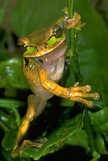
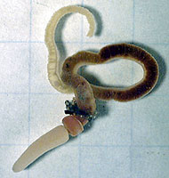
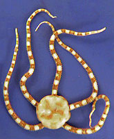

---
aliases:
  - Deuter
  - Deuterostomia
  - Deutero
title: Deuterostomia
---

# [[Deuterostomia]] 

   

Deuterostomia is a superphylum of animals characterized by 
specific embryonic developmental patterns and molecular genetic features. 
The parent group of Deuterostomia is the larger clade of Bilateria, 
which includes animals with bilateral symmetry. 
Here are the main differences between Deuterostomia and their parent group:

### Embryonic Development: 
One of the most significant differences between Deuterostomia and other Bilateria 
is the pattern of embryonic development. 
Deuterostomes undergo a process called deuterostomy, 
where the blastopore (the opening formed during gastrulation) becomes the anus, 
and the mouth forms secondarily. 
In contrast, protostomes, the other major group within Bilateria, undergo protostomy, 
where the blastopore becomes the mouth and the anus forms secondarily.

### Cleavage Pattern: 
Deuterostomes typically exhibit radial cleavage during early embryonic development, 
where cell divisions are perpendicular or at right angles to the axis of the embryo. 
This cleavage pattern contrasts with the spiral cleavage observed in many protostomes, 
where cell divisions are diagonal to the axis of the embryo.

### Fate of Blastopore: 
In deuterostomes, the blastopore develops into the anus, 
forming the first opening of the digestive tract. 
This process is known as enterocoely, 
where the coelom (body cavity) forms from outpocketings of the primitive gut. 
In contrast, in protostomes, the blastopore becomes the mouth, 
and the anus forms secondarily from a different region of the embryo.

### Regulative Development: 
Deuterostomes typically exhibit regulative development, 
where early embryonic cells have the ability to regulate their fate 
and adjust to changes in cell number or position. 
This allows for greater flexibility and robustness in development 
compared to mosaic development, which is more common in protostomes.

### Molecular Signatures: 
Deuterostomes are characterized by specific molecular genetic features, 
including the presence of certain genes and gene expression patterns 
that are unique to this group. 

For example, genes involved in early embryonic development, 
such as those encoding transcription factors and signaling molecules, 
often show conserved sequences and expression patterns across deuterostomes.

Overall, the differences between Deuterostomia and their parent group, Bilateria, 
primarily revolve around embryonic development, 
including the fate of the blastopore, cleavage pattern, and molecular genetic features. 

These differences reflect distinct evolutionary pathways and developmental strategies 
that have shaped the diversity of deuterostome animals.

## Phylogeny 

-   « Ancestral Groups  
    -  [Bilateria](../Bilateria.md))
    -  [Animals](../../Animals.md))
    -  [Eukarya](../../../Eukarya.md))
    -   [Tree of Life](../../../Tree_of_Life.md)

-   ◊ Sibling Groups of  Bilateria
    -   Deuterostomia
    -  [Arthropoda](Arthropoda.md))
    -  [Onychophora](Onychophora.md))
    -   [Tardigrada](Tardigrada)
    -  [Nematoda](Nematoda.md))
    -  [Nematomorpha](Nematomorpha.md))
    -  [Kinorhyncha](Kinorhyncha.md))
    -  [Loricifera](Loricifera.md))
    -  [Priapulida](Priapulida.md))
    -   [Arrow_Worm](Arrow_Worm.md)
    -  [Gastrotricha](Gastrotricha.md))
    -  [Rotifera](Rotifera.md))
    -  [Gnathostomulida](Gnathostomulida.md))
    -   [Limnognathia maerski](Limnognathia_maerski)
    -  [Cycliophora](Cycliophora.md))
    -  [Mesozoa](Mesozoa.md))
    -  [Platyhelminthes](Platyhelminthes.md))
    -  [Annelida](Annelida.md))
    -  [Bryozoa](Bryozoa.md))
    -  [Sipuncula](Sipuncula.md))
    -  [Mollusca](Mollusca.md))
    -  [Nemertea](Nemertea.md))
    -  [Entoprocta](Entoprocta.md))
    -  [Phoronida](Phoronida.md))
    -  [Brachiopoda](Brachiopoda.md))

-   » Sub-Groups

    -   [Echinodermata](Deutero/Echinodermata.md)
    -   [Hemichordata](Deutero/Hemichordata.md)
    -   [Chordata](Deutero/Chordata.md)

Relationships after Cameron et al. 2000.

Containing group:[Bilateria](../Bilateria.md))

### References

Jaime E. Blair, J. E. and S. B. Hedges. 2005. Molecular phylogeny and
divergence times of deuterostome animals. Molecular Biology and
Evolution 22:2275-2284.

Bromham, L. D. and B. M. Degnan. 1999. Hemichordates and deuterostome
evolution: robust molecular phylogenetic support for a hemichordate plus
echinoderm clade. Evolution and Development 1:166-171.

Bourlat, S., C. Nielsen, A. Lockyer, D. T. Littlewood, and M. Telford.
2003. Xenoturbella is a deuterostome that eats molluscs. Nature
424:925-928.

Cameron, C.B., J. R. Garey, and B. J. Swalla. 2000. Evolution of the
chordate body plan: New insights from phylogenetic analyses of
deuterostome phyla. Proceedings of the National Academy of Sciences USA
97:4469-4474.

Castresana, J., G. Feldmaier-Fuchs, S. Yokobori, N. Satoh, and S. P?abo.
1998. The mitochondrial genome of the hemichordate Balanoglossus
carnosus and the evolution of deuterostome mitochondria. Genetics
150:1115-1123.

Chea, H. K., C. V. Wright, and B. J. Swalla. 2005. Nodal signaling and
the evolution of deuterostome gastrulation. Developmental Dynamics
234:269-278.

Dominguez, P., A. G. Jacobson, and R. P. S. Jefferies. 2002. Paired gill
slits in a fossil with a calcite skeleton. Nature 417:841-844.

Halanych, K. M. 1995. The phylogenetic position of the pterobranch
hemichordates based on 18S rDNA sequence data. Molecular Phylogenetics
and Evolution 4:72-76.

Henry, J. Q., K. Tagawa and M. Q. Martindale. 2001. Deuterostome
evolution: early development in the enteropneust hemichordate,
Ptychodera flava. Evolution and Development3:375-390.

Jefferies, R. P. S. , N. A. Brown, and P. E. J. Daley. 1996. The early
phylogeny of chordates and echinoderms and the origin of chordate
left-right asymmetry and bilateral symmetry. Acta Zoologica 77:101-122.

Lacalli, T. C. 2002. Vetulicolians - are they deuterostomes? chordates?
BioEssays 24:208-211.

Ruta, M. 1999. Brief review of the stylophoran debate. Evolution and
Development 1:123-135.

Shu, D. G., S. Conway Morris, J. Han, L. Chen, X. L. Zhang, Z. F. Zhang,
H. Q. Liu, Y. Li, and J. N. Liu. 2001. Primitive deuterostomes from the
Chengjiang Lagerstatte (Lower Cambrian, China). Nature 414:419-424.

Swalla, B. J., C. B. Cameron, L. S. Corley, and J. R. Garey. 2000.
Urochordates are monophyletic within the deuterostomes. Systematic
Biology 49:52-64.

Turbeville, J. M., J. R. Schulz and R. A. Raff. 1994. Deuterostome
phylogeny and the sister group of the chordates: evidence from molecules
and morphology. Molecular Biology and Evolution 11:648-655.

Wada, H. and N. Satoh. 1994. Details of the Evolutionary History from
Invertebrates to Vertebrates, as Deduced from the Sequences of 18S rDNA.
Proceedings of the National Academy of Sciences USA 91:1801-1804.

Winchell, C. J., J. Sullivan, C. B. Cameron, B. J. Swalla, and J.
Mallatt. 2002. Evaluating hypotheses of deuterostome phylogeny and
chordate evolution with new LSU and SSU ribosomal DNA data. Molecular
Biology and Evolution 19:762-776.

## Title Illustrations
)

  ----------------------------------------------------------------------------
  Scientific Name ::  Smilisca phaeota
  Location ::        Costa Rica, cloud forest on Caribbean slope
  Copyright ::         © [Greg and Marybeth Dimijian](http://www.dimijianimages.com/) 
  ----------------------------------------------------------------------------
)

  -------------------------------------------------------------------------------
  Scientific Name ::  Saccoglossus kowalevskii
  Creator           David Remsen
  Copyright ::         © 1995 [Marine Biological Laboratory, Woods Hole](http://www.mbl.edu/) 
  -------------------------------------------------------------------------------
)

  ---------------------------------------------------------------------------
  Scientific Name ::     Ophiuroidea
  Creator              J. Houseman
  Specimen Condition   Dead Specimen
  Copyright ::            © [BIODIDAC](http://biodidac.bio.uottawa.ca/index.htm) 
  ---------------------------------------------------------------------------

## Confidential Links & Embeds: 

### #is_/same_as :: [Deutero](/_Standards/bio/bio~Domain/Eukarya/Animal/Bilateria/Deutero.md) 

### #is_/same_as :: [Deutero.public](/_public/bio/bio~Domain/Eukarya/Animal/Bilateria/Deutero.public.md) 

### #is_/same_as :: [Deutero.internal](/_internal/bio/bio~Domain/Eukarya/Animal/Bilateria/Deutero.internal.md) 

### #is_/same_as :: [Deutero.protect](/_protect/bio/bio~Domain/Eukarya/Animal/Bilateria/Deutero.protect.md) 

### #is_/same_as :: [Deutero.private](/_private/bio/bio~Domain/Eukarya/Animal/Bilateria/Deutero.private.md) 

### #is_/same_as :: [Deutero.personal](/_personal/bio/bio~Domain/Eukarya/Animal/Bilateria/Deutero.personal.md) 

### #is_/same_as :: [Deutero.secret](/_secret/bio/bio~Domain/Eukarya/Animal/Bilateria/Deutero.secret.md)

