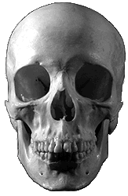
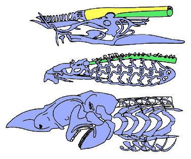

---
aliases:
- Craniate
- Craniata
title: Craniata
---

# [[Craniata]] 

#is_/instance_of :: [[Clade]] 

Craniata is a subphylum of chordates that includes vertebrates and their closest relatives. 
The parent group of Craniata within the phylum Chordata 
includes organisms such as lancelets (cephalochordates) and tunicates (urochordates). 
The key differences between Craniata and their parent group 
lie primarily in the presence of a distinct head with a brain and specialized sensory organs. 

Craniate Head: 
The most significant difference is the presence of a distinct head in craniates, 
which contains a brain and specialized sensory organs such as eyes, ears, and olfactory organs. 
This development represents a major evolutionary innovation 
that facilitates complex sensory perception, integration of information, and motor control.

### Cranium (Skull): 

Craniates typically have a well-developed cranium, or skull, 
which encloses and protects the brain and sensory organs of the head. 
This bony structure provides structural support and protection 
for the delicate neural tissues and sensory structures within the head region.

### Complex Sensory Organs: 

Craniates often possess advanced sensory organs, 
including well-developed eyes with lenses and retinas for image formation, 
specialized mechanoreceptors in the skin for touch and pressure sensation, 
and chemoreceptors in the nose and tongue for detecting odors and tastes. 
These sensory adaptations allow craniates 
to perceive and respond to their environment in sophisticated ways.

### Brain: 

Craniates have a well-developed brain, 
which is housed within the cranium and controls sensory processing, 
motor coordination, and behavioral responses. 
The evolution of a centralized nervous system with a complex brain 
represents a major step forward in neural organization and integration 
compared to the decentralized nerve cord found in non-craniate chordates.

### Neural Crest Cells 

Craniates have a unique embryonic tissue called neural crest cells, 
which migrate throughout the developing embryo 
and give rise to a variety of tissues and structures, 
including parts of the skull, teeth, and peripheral nervous system. 
The presence of neural crest cells is considered a key innovation in craniate evolution.

Overall, the evolution of a distinct head with a brain, cranium, complex sensory organs, 
and neural crest cells represents major innovations 
that distinguish Craniata from their non-craniate chordate ancestors 
and have contributed to their evolutionary success and diversity.

## Phylogeny 

-   « Ancestral Groups  
    -   [Chordata](../Chordata.md)
    -   [Deuterostomia](../../Deutero.md)
    -  [Bilateria](../../../Bilateria.md))
    -  [Animals](../../../../Animals.md))
    -  [Eukarya](../../../../../Eukarya.md))
    -   [Tree of Life](../../../../../Tree_of_Life.md)

-   ◊ Sibling Groups of  Chordata
    -   Craniata

-   » Sub-Groups
    -   [Hyperotreti](Craniata/Hyperotreti.md)
    -   [Vertebrata](Craniata/Vertebrata.md)

## Animals with skulls 

[Philippe Janvier](http://www.tolweb.org/)

-   *[Hyperotreti](Craniata/Hyperotreti.md "go to ToL page")*
    [(hagfishes)]
-   *[Vertebrata](Craniata/Vertebrata.md "go to ToL page")* [(lampreys
    and jawed vertebrates)]

## Introduction

The Craniata, or craniates, include all animals having a skull (or
cranium, hence their name), be it cartilaginous or bony. A skull is a
box of hard tissues which encloses the brain, olfactory organs, eyes,
and internal ear. Craniates comprise all fishes - including such jawless
fishes as hagfishes and lampreys - amphibians, reptiles, birds and
mammals, including Man. The earliest known undisputed craniates are
jawless fishes which lived 480 millions years ago. Their evolutionary
history took place first in the sea, then in fresh waters. Some
craniates, the tetrapods or four-legged vertebrates, became terrestrial
and arose about 370 millions years ago from fish ancestors. Now, the
majority of the craniate species are represented by one group of fish,
the actinopterygians, and the tetrapods. Other craniate groups (jawless
fishes, sharks and chimeras, the coelacanth, lungfishes) are
considerably depauperate, by comparison with their past diversity.

The Craniata fall into two major clades, the Hyperotreti, or hagfishes,
and the Vertebrata. Since the early nineteenth Century, and until
recently, the hagfishes were regarded as the sister-group of lampreys
(Hyperoartia). The two groups were gathered into the clade Cyclostomi
(see below: Discussion of phylogenetic relationships). However, lampreys
share with jawed vertebrates, or Gnathostomata, a large number of
morphological and physiological characteristics that occur neither in
hagfishes, nor in non-craniate chordates (cephalochordates and
tunicates). There is, therefore, a rather broad consensus over the
theory that hagfishes are the sister-group of the Vertebrata (lampreys
and gnathostomes).

### Characteristics

The Craniata are characterized by a skull (initially cartilaginous and
fibrous), which includes three types of sensory organs derived in
ontogeny from ectodermal placodes; that is, thickened patches of the
embryonic skin that sink inward toward the brain where they develop into
sensory chambers. Anteriormost of these is the olfactory organ, which is
initially unpaired, and becomes paired in the Vertebrata. Behind it are
the paired eyes, the photoreceptors that develop as lateral outgrowths
of the brain. The skin and connective tissues adjacent to the neural
(photoreceptive) part of the eye add secondary structures in the
Vertebrata (lens, intrinsic muscles, and eye lids). Posteriormost of
these sensory organs in the head are the paired acoustic organs or inner
ears. The inner ears are mechanoreceptors concerned with hearing,
balance, and perception of position of movement. The sensory cells of
the inner ear are enclosed in a cavity filled with a liquid, the
endolymph, and which develops from one to three semicircular canals. The
acoustic organs also comprise a special component, the lateral sensory
system, which is lost in most terrestrial craniates (Amniota). It
consists of lateralis nerve fibres derived from the acoustic nerve and
superficial mechanoreceptors, the neuromasts, which are housed in
grooves or canals on the surface of the head. These extend onto the body
in the Vertebrata. True neuromasts, however, seem to be unique to the
Vertebrata, and have never been observed in hagfishes.

The craniates are characterized by a skull; that is, a complex ensemble
of skeletal elements which surrounds the brain and sensory capsules. The
skull of hagfishes (top) consists of cartilaginous bars (blue), but the
brain is mostly surrounded by a fibrous sheath (yellow) underlain by the
notochord (green). The skull of lampreys (middle) has a more elaborate
braincase and comprises a large \"branchial basket\" surrounding the
gills. In the gnathostomes (bottom), the braincase is generally closed
(after Janvier 1996b).

The skull also encloses the brain, always comprising five parts referred
to as the rhombencephalon, metencephalon, mesencephalon, diencephalon,
and telencephalon. The metencephalon is developed into a cerebellum in
the Gnathostomata and some fossil jawless vertebrates. The nerve fibres
are primitively non-myelinated and become myelinated only in the
gnathostomes. The brain is continued posteriorly by the spinal cord,
which is ribbon-shaped but becomes thicker in the gnathostomes. As in
cephalochordates, the dorsal (sensory) and ventral (motor) spinal nerves
are initially separate, but unite in the gnathostomes. In all craniates,
the olfactory (I), optic (II), trigeminal (V), facial (VII), acoustic
(VIII), glossopharyngeal (IX) and vagus (X) cranial nerves are present.
Additional cranial nerves, the oculomotor (III), trochlear (IV) and
abducent (VI) nerves occur only in the Vertebrata. Some consider that
the latter have been secondarily lost in hagfishes.

The olfactory organ opens into a median duct, the nasopharyngeal duct,
which also serves the intake of the respiratory water. In most
vertebrates, however, this duct becomes a blind tube and the intake of
respiratory water is made through the mouth or the gill slits. The
nasopharyngeal duct lies ventrally against the diencephalon and there,
in ontogeny, induces the formation of an important gland, the
hypophysis, or pituitary organ, which comprises neural (neurohypophysis)
and glandular (adenohypophysis) parts. The adenohypophysis is
particularly complex in the Vertebrata, but very simple in hagfishes.

Craniates possess a unique embryonic tissue, the neural crest, that
appears dorsal and lateral to the neural tube and which contributes to a
great variety of adult tissues and structures including: sensory neurons
(nerve cells), some skeletal and connective tissues in the skull, and
some pigment containing cells and other integumentary tissues. In the
skull, the neural crest cells give rise to the gill arches, jaws and
parts of the braincase floor. In the gnathostomes and a number of fossil
jawless vertebrates, the neural crest cells are also involved in the
formation of the dermal skeleton (scales, teeth, and dermal bones).

The gills of craniates comprise gill filaments, made up by primary and
secondary gill lamellae which insure gas exchanges. In hagfishes, the
gills have no skeletal support, and are enclosed in pouches connected to
the pharynx. Among vertebrates, a similar structure occurs in adult
lampreys only, but here skeletal supports (gill arches) are present. The
gills are derived from tissues of the embryonic gut (endoderm), but
cells from the embryonic skin (ectoderm) are involved in their formation
in the gnathostomes. The respiratory water flow is ensured by a special
pumping and anti-reflux organ, the velum, situated at the limit between
the mouth and the pharynx. There is a theory that the jaws of the
gnathostomes are derived from the velum.

As chordates, all craniates develop a notochord, which is primitively
large (hagfishes, lampreys), but becomes transitory in most vertebrates
and is replaced by elements of the vertebral column, the centra and
arcualia.

All craniates (except most tetrapods) possess a caudal fin strengthened
by a number of cartilaginous radials. In vertebrates appear dorsal and
anal fins, as well as radial muscles which ensure undulatory movements
of the fin web. In the gnathostomes and some fossil jawless vertebrates,
there are paired pectoral fins. Only the gnathostomes possess both
pectoral and pelvic fins, which are modified into locomotory limbs in
tetrapods.

All craniates possess an endoskeleton, which is primitively
cartilaginous but becomes mineralized in various ways (bone, calcified
cartilage) in the vertebrates. Only the gnathostomes and a number of
fossil jawless vertebrates possess a mineralized exoskeleton which
develops in the skin tissues. The exoskeleton is made up by a variety of
tissues (bone, dentine, enamel).

Craniates have a circulatory system of arteries, capillaries and veins,
and a chambered, muscular main heart located ventrally and anteriorly in
the trunk. In the Vertebrata, the circulatory system is entirely closed.
The two heart chambers, the atrium and ventricle are well apart. There
are additional accessory venous hearts in the head and tail, which help
in venous blood circulation, but these are lost in the Vertebrata. In
gill-breathing craniates, the heart pumps venous blood anteriorly into
arteries and capillaries in the gills for gas (oxygen and carbon
dioxide) exchange with water. Oxygenated blood then collects dorsal to
the gills and flows anteriorly to the head and posteriorly to the organs
and muscles, and back to the heart. In some Vertebrata (Osteichthyes)
diverticles of the digestive tract (lungs or air bladder) supplements or
replaces gills as the repiratory organ.

The digestive tract of craniates is longitudinally differentiated into
mouth and oral cavity, pharynx, esophagus, intestine, rectum and anus. A
stomach is developed in the Gnathostomata and some fossil jawless
Vertebrates. All craniates have a pancreas that produces digestive
enzymes and hormones (insulin and glucagon) that regulate blood sugar
level. The pancreas was ancestrally disseminated along the anterior part
of the gut, but becomes condensed into a well-defined organ in the
Vertebrata.

All craniates and the related cephalochordates have a liver or hepatic
organ that serves many functions including food storage and production
of fat emulsifiers (bile).

The kidneys are the chief excretory organs of vertebrates and these
organs play an important role in water and salt balance. Although
kidneys vary greatly in size, shape and position among species, all
contain nephrons as the basic functional units. Each nephron is a nearly
microscopic tubule that receives a filtrate of blood (lacking blood
cells and very large molecules). The filtrate is processed by selective
secretion and reabsorption of materials to produce an excretory product
(generally called urine) that contains nitrogenous waste and other
materials. Long and complex kidney tubules occur only in the
vertebrates.

### Reproductive Biology

The reproductive biology of craniates is highly diverse. The majority of
species are bisexual with distinct male and female individuals. Of
course, male and female sexes are always distinct in the type of gonads
they possess (testes or ovaries), and sex cells they produce (gametes:
sperm or ova). Sperm is shed directly into the coelom and then toward
the exterior through a pore. In the Gnathostomata, however, testes are
linked with the kidneys and sperm pass through the excretory ducts.
External sex dimorphism may be non-existent to dramatically pronounced.
There are some fishes that are naturally hermaphroditic. In certain
hermaphroditic species individuals are \"protogynous,\" i.e. first
functioning as females that may later transform into functional males.
In other species the opposite sequence of sex change obtains \--
\"protandrous.\" There are a few \"all-female\" species of fishes,
amphibians and lizards in which mothers produce only female offspring.
In many of these mating with males of related species is necessary to
trigger egg development, but fathers do not contribute to the genetic
perpetuation of the \"all-female\" lineages. Among the more typical
bisexual craniates there is a very broad spectrum of reproductive mode.
The majority of fish and amphibian species are oviparous (egg-laying)
with external fertilization of the eggs by the male\'s sperm. Other
fishes, amphibians, many reptiles, all birds and the monotreme mammals
(platypus and spiny anteaters of the Australian region) are also
oviparous but fertilization is internal. Opposite these are the
\"live-bearers\" or viviparous species in which fertilization is
necessarily internal and young develop within the mother\'s reproductive
tract. Here the mother must provide some form nutriment to the embryo
(either yolk in the egg or via the blood across permeable placental
membranes). Also, the viviparous species have mechanisms for embryonic
gas exchange and waste removal. Viviparity has evolved many times in the
craniates - among cartilaginous and bony fishes, a handful of
amphibians, several snakes and lizards, and most mammals.

### Discussion of Phylogenetic Relationships

When initially erected by Linnaeus (1758), the name Craniata was coupled
with Vertebrata to include lampreys and all other vertebrates. Hagfishes
were, however, regarded as \"intestinal worms\", yet possibly
representing a link between worms and fishes. Dumeril (1806) grouped
hagfishes and lampreys (see Hyperoartia) in the taxon Cyclostomi,
characterized by horny teeth borne by a peculiar tongue-like apparatus,
a large notochord, and pouch-shaped gills. During most of the nineteenth
century, the cyclostomes were variously regarded as either degenerate
cartilaginous fishes or primitive vertebrates. The latter view, assuming
that the cyclostomes are the sister-group of jawed vertebrates has been
widely accepted until recently:\

Cope (1889) coined the name Agnatha (\"jawless\") for a group that
included the cyclostomes and a number of fossil groups in which jaws
could not be observed. From this time on, the vertebrates were divided
into two major sister-groups, the Agnatha and the Gnathostomata (jawed
vertebrates). The fact that gills were of endodermal origin in the
former and of ectodermal origin of the latter was regarded as further
support to this classification. As evolutionary ideas progressed, the
search for ancestors to the gnathostomes has led some paleontologists to
consider that some fossil agnathans (generally the Heterostraci or the
Thelodonti) could be more closely related to the gnathostomes than to
the cyclostomes or other fossil groups. Consequently, it was more and
more widely accepted that agnathans are a grade. As for the living
agnathans, the cyclostomes, Stensiö (1927) suggested that they were
diphyletic, with hagfishes and lampreys arising separately from two
fossil groups of armored agnathans, but retained the opinion that
agnathans, as a whole, formed a clade. Løvtrup (1977), however, showed
that the characteristics shared uniquely by lampreys and the
gnathostomes largely outnumber those shared by hagfishes and lampreys
(cyclostome characteristics), thereby suggesting that the cyclostomes
are paraphyletic. In other words, the cyclostome characteristics (e.g.,
horny teeth, \"tongue\", gill pouches) are primitive craniate
characteristics, lost or modified in the gnathostomes. Since only
lampreys and the gnathostomes possess vertebral elements, or arcualia,
and since hagfishes, lampreys and the gnathostomes all possess a skull,
Janvier (1978) proposed to use Linnaeus\' initial names Vertebrata and
Craniata for the two nested taxa defined by these respective
characteristics:\

There remains the question of the relationships of the numerous groups
of fossil \"agnathans\" (see, for review, Janvier 1996). Until recently,
it was currently admitted that lampreys formed a clade, the
Cephalaspidomorphi, with two fossil taxa, the Anaspida and Osteostraci,
with which they share the dorsal position of the nasohypophysial opening
(external opening of the blind nasopharyngeal duct). Since these fossils
possess a well ossified skeleton and paired fins, it was believed that
lampreys have lost the exoskeleton and paired fins (Janvier 1978, Forey
1984). Other armored fossil agnathans (e.g. Heterostraci) were thought
to be the sister-group of the Cephalaspidomorphi and Gnathostomata, or
of the Gnathostomata alone. With the progress of computerized
phylogenetic analyses, and the consideration of a large number of
characteristics, more parsimonious theories arose, which group with the
gnathostomes all fossil agnathans possessing a mineralized exoskeleton
(Gagnier 1993, Forey and Janvier 1994). Therefore, all these fossil taxa
formerly referred to as \"ostracoderms\" are treated on the vertebrate
page (Vertebrata).

### References

Blieck, A. (1992). At the origin of chordates; Géobios, 25, 101-113.

Forey, P. L. (1984). Yet more reflections on agnathan-gnathostome
relationships. Journal of Vertebrate Paleontology, 4, 330-343.

Forey, P. L., and Janvier, P. (1993). Agnathans and the origin of jawed
vertebrates. Nature, 361, 129-134.

Forey, P. L., and Janvier, P. (1994). Evolution of the early
vertebrates. American Scientist, 82, 554-565.

Gagnier, P. Y. (1993a). Sacabambaspis janvieri, Vertébré ordovicien de
Bolivie. 1, Analyse morphologique. Annales de Paléontologie, 79, 19-69.

Gans, C. (1989). Stages in the origin of vertebrates: analysis by means
of scenarios. Biological Reviews, 64, 221-268.

Gans, C. (1993). Evolutionary origin of the vertebrate skull. In The
skull (ed. J. Hanken and B. K. Hall), Vol. 2, pp. 1-35. The University
of Chicago Press.

Gans, C. and Northcutt, R.G. (1983). Neural crest and the origin of
vertebrates: A new head. Science, 220, 268-274.

Gee, H. (1996). Before the backbone. Chapman & Hall, London.

Hardisty, M. W. (1982). Lampreys and hagfishes: Analysis of cyclostome
relationships. In The Biology of Lampreys, (ed. M. W. Hardisty and I. C.
Potter), Vol.4B, pp. 165-259. Academic Press, London.

Janvier, P. (1981). The phylogeny of the Craniata, with particular
reference to the significance of fossil \'agnathans\'. Journal of
Vertebrate Paleontology, 1, 121-159.

Janvier, P. (1993). Patterns of diversity in the skull of jawless
fishes. In The skull (ed. J. Hanken and B. K. Hall), Vol. 2, pp.
131-188. The University of Chicago Press.

Janvier, P. (1996a). The dawn of the vertebrates: characters versus
common ascent in current vertebrate phylogenies. Palaeontology, 39,
259-287.

Janvier, P. (1996b). Early vertebrates. Oxford Monographs in Geology and
Geophysics, 33, Oxford University Press, Oxford.

Jefferies, R. P. S.(1986). The ancestry of the vertebrates. British
Museum (Natural History), London.

Løvtrup, S. (1977). The Phylogeny of Vertebrata. Wiley, New York.

Maisey, J. G. (1986). Heads and tails: a chordate phylogeny. Cladistics,
2, 201-256.

Maisey, J. G. (1988). Phylogeny of Early vertebrate skeletal induction
and ossification pattern. Evolutionary Biology, 22, 1-36.

Moy-Thomas, J. A. and Miles, R. S. (1971). Palaeozoic Fishes, 2nd edn,
extensively revised by R. S. Miles. Chapman and Hall, London.

Nelson, G. J. (1969). Gill arches and the phylogeny of fishes, with
notes on the classification of vertebrates. Bulletin of the American
Museum of Natural History, 141, 475-552.

Nelson, G. J. (1989). Phylogeny of major fish groups. In The hierarchy
of life (ed. B. Fernholm, K. Bremer, and H. Jörnvall), pp. 325-336,
Excerpta Medica, Amsterdam.

Northcutt, R.G. and Gans, C. (1983). The genesis of neural crest and
epidermal placodes: a reinterpretation of vertebrate origins. The
Quarterly Review of Biology, 58, 1-28.

Schaeffer, B. and Thomson, K. S. (1980). Reflections on
agnathan-gnathostome relationships. In Aspects of vertebrate life (ed.
L. L. Jacobs), pp. 19-33. Museum of Northern Arizona Press, Flagstaff.

Yalden, D. W. (1985). Feeding mechanisms as evidence for cyclostome
monophyly. Zoological Journal of the Linnean Society, 84, 291-300.

## Title Illustrations

)

  ---------------
  Scientific Name ::   Homo sapiens
  Acknowledgements   The Digital Human Osteology Guide
  Body Part          skull
  Copyright ::          © 1997 John Kappelman
  ---------------

## Confidential Links & Embeds: 

### #is_/same_as :: [Craniata](/_Standards/bio/bio~Domain/Eukarya/Animal/Bilateria/Deutero/Chordata/Craniata.md) 

### #is_/same_as :: [Craniata.public](/_public/bio/bio~Domain/Eukarya/Animal/Bilateria/Deutero/Chordata/Craniata.public.md) 

### #is_/same_as :: [Craniata.internal](/_internal/bio/bio~Domain/Eukarya/Animal/Bilateria/Deutero/Chordata/Craniata.internal.md) 

### #is_/same_as :: [Craniata.protect](/_protect/bio/bio~Domain/Eukarya/Animal/Bilateria/Deutero/Chordata/Craniata.protect.md) 

### #is_/same_as :: [Craniata.private](/_private/bio/bio~Domain/Eukarya/Animal/Bilateria/Deutero/Chordata/Craniata.private.md) 

### #is_/same_as :: [Craniata.personal](/_personal/bio/bio~Domain/Eukarya/Animal/Bilateria/Deutero/Chordata/Craniata.personal.md) 

### #is_/same_as :: [Craniata.secret](/_secret/bio/bio~Domain/Eukarya/Animal/Bilateria/Deutero/Chordata/Craniata.secret.md)

