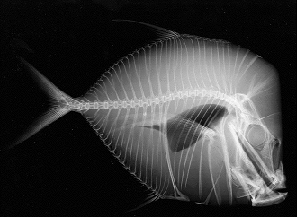
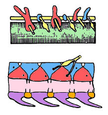

---
aliases:
  - Vertebrata
  - Vertebrate
  - virveldyr
  - 脊椎动物亚门
has_id_wikidata: Q25241
Biology_Online_Biology_Dictionary_entry: vertebrata
Colon_Classification: K9
Commons_category: Vertebrata
Commons_gallery: Vertebrata
described_by_source:
  - '[[../../../../../../../../WikiData/WD~Brockhaus_and_Efron_Encyclopedic_Dictionary,602358]]'
  - '[[_Standards/WikiData/WD~Encyclopædia_Britannica_11th_edition,867541]]'
  - '[[_Standards/WikiData/WD~Armenian_Soviet_Encyclopedia,2657718]]'
  - '[[_Standards/WikiData/WD~Small_Brockhaus_and_Efron_Encyclopedic_Dictionary,19180675]]'
  - '[[_Standards/WikiData/WD~Meyers_Konversations_Lexikon,_4th_edition_(1885_1890),19219752]]'
EPPO_Code: 1VERTQ
equivalent_class: http://kbpedia.org/kko/rc/Vertebrate
GS1_GPC_code: 89020200
homonymous_taxon: '[[_Standards/WikiData/WD~Vertebrata,3556237]]'
image:
  - http://commons.wikimedia.org/wiki/Special:FilePath/Lizard%20on%20leaf%20cutted.jpg
  - http://commons.wikimedia.org/wiki/Special:FilePath/Tiliqua%20scincoides%20scincoides.jpg
instance_of: '[[_Standards/WikiData/WD~taxon,16521]]'
ITIS_TSN: 331030
MeSH_tree_code: B01.050.150.900
mode_of_reproduction: '[[_Standards/WikiData/WD~sexual_reproduction,182353]]'
montage_image: http://commons.wikimedia.org/wiki/Special:FilePath/Vertebrates.png
OmegaWiki_Defined_Meaning: 3963
opposite_of: '[[_Standards/WikiData/WD~invertebrate,43806]]'
permanent_duplicated_item: '[[_Standards/WikiData/WD~Q25681521,25681521]]'
start_time: -525000000-01-01
studied_by: '[[_Standards/WikiData/WD~vertebrate_zoology,18358830]]'
taxon_common_name:
  - virveldyr
  - 脊椎动物亚门
taxon_name: Vertebrata
taxon_rank: '[[_Standards/WikiData/WD~subphylum,1153785]]'
this_taxon_is_source_of: '[[_Standards/WikiData/WD~offal,157484]]'
title: Vertebrata
topic_s_main_template:
  - '[[_Standards/WikiData/WD~Template_Taxonomy_Vertebrata,10966653]]'
  - '[[_Standards/WikiData/WD~Template_Vertebrates,26138979]]'
union_of: '[[_Standards/WikiData/WD~list_of_values_as_qualifiers,23766486]]'
---

# [[Vertebrata]] 

#is_/instance_of :: [[SubPhylum]]  
#is_/same_as :: [[../../../../../../../../WikiData/WD~Vertebrata,25241|WD~Vertebrata,25241]] 

The parent group of Vertebrata within the phylum Chordata 
includes organisms such as lancelets (cephalochordates) and tunicates (urochordates). 
The key differences between Vertebrata and their parent group 
lie primarily in the presence of a vertebral column and other advanced anatomical features. 

### Vertebral Column: 
The most significant difference is the presence of a vertebral column (backbone) in Vertebrata, 
which provides structural support and protection for the spinal cord. 
This segmented axial skeleton is composed of individual vertebrae, 
which allows for greater mobility and support 
compared to the notochord found in non-vertebrate chordates.

### Cranium (Skull): 
Vertebrates typically have a well-developed cranium, or skull, 
which encloses and protects the brain and sensory organs such as the eyes and inner ears. 
This bony structure is absent or rudimentary in non-vertebrate chordates.

### Endoskeleton: 
Vertebrates possess an endoskeleton composed of bone or cartilage, 
providing structural support and attachment sites for muscles. 
In contrast, non-vertebrate chordates may have a simple, cartilaginous rod (notochord) 
or a supportive tunic (in tunicates) as their primary axial support structure.

### Complex Organ Systems: 
Vertebrates typically have more complex organ systems compared to non-vertebrate chordates. This includes a well-developed circulatory system with a chambered heart, 
respiratory system with specialized gas exchange structures (e.g., lungs or gills), 
and digestive system with specialized organs (e.g., stomach, liver, and intestines).

### Advanced Sensory Organs: 
Vertebrates often possess advanced sensory organs, 
including well-developed eyes with lenses and retinas for image formation, 
specialized mechanoreceptors in the skin for touch and pressure sensation, 
and chemoreceptors in the nose and tongue for detecting odors and tastes.

### Muscular System: 
Vertebrates have a muscular system consisting of skeletal muscles attached to the endoskeleton, 
allowing for voluntary movement and locomotion. 
This advanced musculature enables vertebrates 
to exhibit complex behaviors and locomotor patterns compared to non-vertebrate chordates.

### Neural Crest Cells: 
Vertebrates have a unique embryonic tissue called neural crest cells, 
which migrate throughout the developing embryo 
and give rise to a variety of tissues and structures, 
including parts of the skull, teeth, and peripheral nervous system. 
The presence of neural crest cells is considered a key innovation in vertebrate evolution.

Overall, the evolution of a vertebral column, cranium, endoskeleton, complex organ systems, 
advanced sensory organs, muscular system, and neural crest cells represents major innovations 
that distinguish Vertebrata from their non-vertebrate chordate ancestors 
and have contributed to their evolutionary success and diversity.

## Phylogeny 

-   « Ancestral Groups  
    -   [Craniata](../Craniata.md)
    -   [Chordata](../../Chordata.md)
    -   [Deuterostomia](../../../Deutero.md)
    -  [Bilateria](../../../../Bilateria.md))
    -  [Animals](../../../../../Animals.md))
    -  [Eukarya](../../../../../../Eukarya.md))
    -   [Tree of Life](../../../../../../Tree_of_Life.md)

-   ◊ Sibling Groups of  Craniata
    -   [Hyperotreti](Hyperotreti.md)
    -   Vertebrata

-   » Sub-Groups
    -   [Hyperoartia](Vertebrata/Hyperoartia.md)
    -   [Euconodonta](Vertebrata/Euconodonta.md)
    -   [Pteraspidomorphi](Vertebrata/Pteraspidomorphi.md)
    -   [Thelodonti](Vertebrata/Thelodonti.md)
    -   [Anaspida](Vertebrata/Anaspida.md)
    -   [Galeaspida](Vertebrata/Galeaspida.md)
    -   [Pituriaspida](Vertebrata/Pituriaspida.md)
    -   [Osteostraci](Vertebrata/Osteostraci.md)
    -   [Gnathostomata](Vertebrata/Gnath.md)

## Animals with backbones 

 

Interrelationships of the fossil and Recent Vertebrata. 
(All terminal taxa are clades, except for the Thelodonti, 
which are possibly paraphyletic - see Thelodonti page).

## Introduction

[Philippe Janvier]() 

The Vertebrata, or vertebrates, is a very diverse group, ranging from
lampreys to Man. It includes all craniates, except hagfishes, and are
characterized chiefly by a vertebral column, hence their name. The
majority of the extant vertebrates are the jawed vertebrates, or
gnathostomes, but lampreys are jawless vertebrates. However, in Late
Silurian or Early Devonian times, about 420 to 400 million years ago,
the situation was reverse, and the majority of the vertebrate species
were jawless fishes (the \"ostracoderms\", presumably more closely
related to the gnathostomes than to lampreys). The decline of the
jawless vertebrates and the subsequent rise of the gnathostomes took
place about 380 million years ago.

Extant vertebrates comprise two clades: the Hyperoartia, or lampreys,
and the Gnathostomata, or jawed vertebrates. In addition, there is a
number of taxa of fossil jawless vertebrates which were formerly
referred to as the \"ostracoderms\" (\"shell-skinned\") because most of
them possess an extensive, bony endo- and exoskeleton. The
\"ostracoderms\" lived from the Early ordovician (about 480 million
years ago) to the Late Devonian (about 370 million years ago). The
relationships of the various groups of \"ostracoderms\" has been the
subject of considerable debate since the mid-nineteenth Century, and the
theory of relationship proposed here is far from definitive, yet the
best supported by the currently available data. The \"ostracoderms\" are
represented by five major groups, four of which are almost certainly
clades: the Heterostraci, Osteostraci, Galeaspida, Anaspida, and
Thelodonti (the monophyly of the latter being debated, Thelodonti page).
In addition, there are minor groups which only include a few species:
the Arandaspida, Astraspida, Eriptychiida, and Pituriaspida. The
Arandaspida, Astraspida, Eriptychiida, and Heterostraci are regarded as
forming a clade, the Pteraspidomorphi. Some monospecific genera,
Jamoytius, Endeiolepis, and Euphanerops, formerly referred to the
Anaspida, are now removed from that clade and may be more closely
related to lampreys (see Hyperoartia). A large but still poorly known
group, the Euconodonta, has recently been included in the Craniata, and
possibly the Vertebrata. It is currently referred to as \'conodonts\',
but the only forms that can reliably be regarded as craniates belong to
a subgroup of conodonts known as euconodonts.

### Characteristics

The Vertebrata have all the characteristics of the Craniata but share,
in addition, a number of unique characteristics which do not occur in
hagfishes (Hyperotreti). These characteristics are:

-   Metamerically arranged endoskeletal elements flanking the spinal
    cord. There are primitively two pairs of such elements in each
    metamere and on each side: the interdorsals and basidorsals. In the
    gnathostomes, there are two additional pairs ventrally to the
    notochord: the interventrals and basiventrals. These elements are
    called arcualia and can fuse to a notochordal calcification, the
    centrum. The ensemble of the arcualia , centrum is the vertebra, and
    the ensemble of the vertebrae is the vertebral column.

    
    The vertebrates are characterized by a vertebral column; that is, a
    variable number of endoskeletal elements aligned along the notochord
    (green) and flanking the spinal cord (yellow). In lampreys (top),
    the vertebral elements are only the basidorsal (red) and the
    interdorsals (blue). In the gnathostomes, there are in addition
    ventral elements, the basiventrals (purple) and interventrals
    (orange), and the notochord may calcify into centra (pink). (After
    Janvier 1996).

-   Extrinsic eye muscles. These muscles are attached to the eyeball and
    orbital wall, and ensure eye movements
-   Radial muscles in fins. These are small muscles associated with each
    of the cartilaginous radials of the unpaired and paired fins. They
    ensure the undulatory movements of the fin web.
-   Atrium and ventricle of heart closely-set.
-   Nervous regulation of heart. The heart in the embryo of the
    vertebrates is aneural, like the heart of adult hagfishes. In adult
    vertebrates, however, the heart is innervated by a branch of the
    vagus nerve.
-   Typhlosole in the intestine. This is a spirally coiled fold of the
    intestinal wall. In the Gnathostomes, it can be developed into a
    complex spiral valve.
-   At least two vertical semicircular canals in the labyrinth
-   True neuromasts in the sensory-line system

There are many other vertebrate characteristics, both anatomical and
physiological.

### Discussion of Phylogenetic Relationships

As for extant vertebrates, the main question is whether lampreys are the
sister-group of the gnathostomes, or that of hagfishes. In the latter
case there would be no reason to distinguish the Vertebrata from the
Craniata, as it was formerly done. Although there is good evidence for
the lamprey-gnathostome sister-group relationship, the theory that the
cyclostomes (lampreys,hagfishes) are a clade is still supported by a
number of zoologists. Considering the large number of anatomical,
physiological and molecular data that are available now to test these
theories, one can expect a definitive clue in a near future (for
discussion, see Craniata).

The question of the relationships of the numerous extinct vertebrate
groups is, in contrast, far from being resolved. This chiefly concerns
the Palaeozoic taxa formerly referred to as \"ostracoderms\"; that is,
armored jawless craniates, which are likely to be vertebrates and are
now considered as being all more closely related to the gnathostomes
than to lampreys.

During most of the nineteenth century, the \"ostracoderms\" known at
that time (i.e. the Heterostraci and Osteostraci) were regarded as bony
fishes, until Cope (1889) suggested to include them with lampreys and
hagfishes in the taxon Agnatha (\"jawless\"). In the beginning of the
twentieth century, Kiaer (1924) and Stensiö (1927) showed that the
Anaspida and Osteostraci share with lampreys a median, dorsally placed
\"nostril\" (in fact a nasohypophysial opening) and suggested to include
these three groups in a clade Cephalaspidomorphi. In addition, Stensiö
(1927) proposed that hagfishes were derived from the Heterostraci and
should be grouped with them in the Pteraspidomorphi. At that time,
however, the Agnatha were regarded as a clade, whose sister-group was
the Gnathostomata, as illustrated by Stensiö\'s (1927) diagram:

                                    !---hagfishes
             !---Pteraspidomorphi--!
             !                      !---Heterostraci ,
    !Agnatha-!                            !-lampreys
    !        !                         !--!
    !        !                         !  !-Anaspida ,
    !        !---Cephalaspidomorphi---!
    !                                  !--Osteostraci ,
    !------------Gnathostomata

This theory implied the diphyletic origin of the Recent \"cyclostomes\"
(hagfishes and lampreys). Although they accepted the monophyly of the
Cephalaspidomorphi, most paleontologists rejected that of the
Pteraspidomorphi (as including hagfishes). In contrast, until the
1970\'s, it was widely accepted that the Heterostraci are more closely
related, or ancestral to the gnathostomes, mainly because they lacked
the specializations of the Cephalaspidomorphi and because they had
paired olfactory capsules, like the gnathostomes. With the rise of
cladistics, in the late 1970\'s and the 1980\'s, and following
Løvtrup\'s (1977) suggestion that extant cyclostomes were paraphyletic,
a number of trees were published, which all showed the \"ostracoderms\"
(and the Agnatha as a whole) as paraphyletic. However, all these trees
implied that lampreys had lost several characteristics, in particular
the paired fins, mineralized skeleton, and sensory-line canals. A major
change was Gagnier\'s (1993) first computer-generated tree, in which
these reversions were avoided by considering all \"ostracoderms\" as
more closely related to the gnathostomes than to either lampreys and
hagfishes. Further analyses (Forey & Janvier 1994, Janvier 1996b)
largely confirmed the higher degree of parsimony of this phylogeny.
Although there are variations as to the position of certain taxa, the
Galeaspida and Osteostraci constantly group together with the
Gnathostomes, whereas the Astraspida, Eriptychiida, Arandaspida, and
Heterostraci form a clade, the Pteraspidomorphi, albeit poorly
supported. One of the consequences of this tree is that the dorsal
nasohypophysial opening (formerly the characteristic of the
Cephalaspidomorphi) either occurred more than once, or is a general
feature of the Vertebrata.

In this tree, four fossil groups are positioned with a question mark. In
the case of the Euconodonta, Anaspida and Pituriaspida, this uncertainty
is largely due to the scarcity of the characters available from the
material (in particular as to the internal anatomy). In the case of the
Thelodonti, it is due to their controversial status, as they are likely
to be a paraphyletic assemblage of stem Heterostraci and possibly stem
forms of other \"ostracoderm\" groups, yet some authors regard them as a
clade (see Thelodonti page).

## Title Illustrations

--------
Radiograph of the lookdown fish **Selene vomer** prepared by Tierney
Thys, Duke University. Copyright © 1995, Tierney Thys.

Copyright ::   © 1995 Tierney Thys

## Confidential Links & Embeds: 

### #is_/same_as :: [Vertebrata](/_Standards/bio/bio~Domain/Eukarya/Animal/Bilateria/Deutero/Chordata/Craniata/Vertebrata.md) 

### #is_/same_as :: [Vertebrata.public](/_public/bio/bio~Domain/Eukarya/Animal/Bilateria/Deutero/Chordata/Craniata/Vertebrata.public.md) 

### #is_/same_as :: [Vertebrata.internal](/_internal/bio/bio~Domain/Eukarya/Animal/Bilateria/Deutero/Chordata/Craniata/Vertebrata.internal.md) 

### #is_/same_as :: [Vertebrata.protect](/_protect/bio/bio~Domain/Eukarya/Animal/Bilateria/Deutero/Chordata/Craniata/Vertebrata.protect.md) 

### #is_/same_as :: [Vertebrata.private](/_private/bio/bio~Domain/Eukarya/Animal/Bilateria/Deutero/Chordata/Craniata/Vertebrata.private.md) 

### #is_/same_as :: [Vertebrata.personal](/_personal/bio/bio~Domain/Eukarya/Animal/Bilateria/Deutero/Chordata/Craniata/Vertebrata.personal.md) 

### #is_/same_as :: [Vertebrata.secret](/_secret/bio/bio~Domain/Eukarya/Animal/Bilateria/Deutero/Chordata/Craniata/Vertebrata.secret.md)

