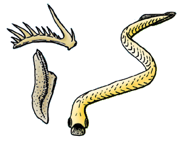

# [[Euconodonta]]

## #has_/text_of_/abstract 

> Conodonts, are an extinct group of marine jawless vertebrates belonging to the class Conodonta 
> (from Ancient Greek κῶνος (kōnos), meaning "cone", and ὀδούς (odoús), meaning "tooth"). 
> 
> They are primarily known from their hard, mineralised tooth-like structures 
> called "conodont elements" that in life were present in the oral cavity and used to process food. 
> 
> Rare soft tissue remains suggest that they had elongate eel-like bodies with large eyes. 
> 
> Conodonts were a long-lasting group with over 300 million years of existence from the Cambrian 
> (over 500 million years ago) to the beginning of the Jurassic (around 200 million years ago). 
> 
> Conodont elements are highly distinctive to particular species 
> and are widely used in biostratigraphy as indicative of particular periods of geological time.
>
> [Wikipedia](https://en.wikipedia.org/wiki/Conodont) 

## Introduction

[Philippe Janvier]() 

Euconodonts have long been an enigmatic group of fossil marine animals,
represented by minute, comb-shaped or claw-shaped denticles - the
\'conodonts\' - which were widely used by stratigraphers for dating and
correlating geological formations. They are known from the Middle
Cambrian (540 million years) to the Late Triassic (230 million years).
These denticles, which are made of calcium phosphate, like the
vertebrate bones and teeth, have been variously referred to annelids,
arthropods, molluscs, chaetognaths, and even plants, although it has
been sometimes suggested that they were fish teeth. The clue came in
1983 when the first articulated \"conodont animal\" was discovered in
the Carboniferous of Scotland. Later, yet another \"conodont animal\"
was found in the Ordovician of South Africa. Both forms show an
elongated body, with imprints of chevron-shaped muscles, a trace of the
notochord, large paired eyes, and a caudal fin strengthened by radials.
The conodont organs (i.e. the denticles) are situated in the head,
presumably at the entrance of the pharynx. Recent histological studies
on the euconodonts have brought to light a variety of hard tissues which
recall the enamel, dentine and bone of the vertebrates, but their
homology with vertebrate tissues remains controversial.

### Characteristics

Euconodonts are characterized by:

-   a feeding apparatus which generally consists of three or four types
    of mineralized denticles. The denticles have a crown of superficial,
    lamellar, enamel-like tissue which covers a core of dentine- or
    bone-like tissue (the \'white matter\'). These two tissues overlay a
    third type of tissue, the \'basal body\', which has been interpreted
    as globular calcified cartilage.
-   very large, anteriorly-placed eyes

### Discussion of Phylogenetic Relationships

The undoubted presence of well-developed eyes and caudal fin radials in
euconodonts are enough to place them among the Craniata, although there
position within the craniates is the subject of controversies. Some
consider them as the sister-group of all other craniates, others regard
them as more closely related to either hagfishes or lampreys, and others
place them as the sister-group of all \"ostracoderms\" + gnathostomes,
sharing with them the ability to produce a phosphatic exoskeleton (see
Vertebrata page).

The Euconodonta are classically gathered with two other taxa, the
Protoconodonta and Paraconodonta, in the phylum Conodonta, despite quite
different histological structures. To date, only articulated specimens
of the Euconodonta are known, and it is not ruled out that the two other
groups have nothing to do with the latter. There is some evidence, for
example, that the Protoconodonta are related to modern chaetognaths.
There are several classifications of the Euconodonta, but most of them
are largely phenetic. They usually include seven orders, the
Proconodonta, Belodellida, Protopanderodontida, Panderodontida,
Prionodontida, Prioniodinida, and Ozarkodinida.

## Phylogeny 

-   « Ancestral Groups  
    -   [Vertebrata](../Vertebrata.md)
    -   [Craniata](../../Craniata.md)
    -   [Chordata](../../../Chordata.md)
    -   [Deuterostomia](../../../../Deutero.md)
    -  [Bilateria](../../../../../Bilateria.md))
    -  [Animals](../../../../../../Animals.md))
    -  [Eukarya](../../../../../../../Eukarya.md))
    -   [Tree of Life](../../../../../../../Tree_of_Life.md)

-   ◊ Sibling Groups of  Vertebrata
    -   [Hyperoartia](Hyperoartia.md)
    -   Euconodonta
    -   [Pteraspidomorphi](Pteraspidomorphi.md)
    -   [Thelodonti](Thelodonti.md)
    -   [Anaspida](Anaspida.md)
    -   [Galeaspida](Galeaspida.md)
    -   [Pituriaspida](Pituriaspida.md)
    -   [Osteostraci](Osteostraci.md)
    -   [Gnathostomata](Gnath.md)

-   » Sub-Groups 

## Title Illustrations

The inclusion of euconodonts in the vertebrates, or even craniates, is
still controversial. Admittedly, the tissue structure of the
\"conodonts\" (i.e; the denticles situated in their mouth; left) is at
odds with conventional vertebrate hard tissues. Nevertheless, the eyes,
body shape, and tail stucture of the euconodonta are strikingly
vertebrate-like. (After Purnell et al. 1995.)

----------)
Copyright ::   © 1997 Philippe Janvier

## Confidential Links & Embeds: 

### #is_/same_as :: [Euconodonta](/_Standards/bio/bio~Domain/Eukarya/Animal/Bilateria/Deutero/Chordata/Craniata/Vertebrata/Euconodonta.md) 

### #is_/same_as :: [Euconodonta.public](/_public/bio/bio~Domain/Eukarya/Animal/Bilateria/Deutero/Chordata/Craniata/Vertebrata/Euconodonta.public.md) 

### #is_/same_as :: [Euconodonta.internal](/_internal/bio/bio~Domain/Eukarya/Animal/Bilateria/Deutero/Chordata/Craniata/Vertebrata/Euconodonta.internal.md) 

### #is_/same_as :: [Euconodonta.protect](/_protect/bio/bio~Domain/Eukarya/Animal/Bilateria/Deutero/Chordata/Craniata/Vertebrata/Euconodonta.protect.md) 

### #is_/same_as :: [Euconodonta.private](/_private/bio/bio~Domain/Eukarya/Animal/Bilateria/Deutero/Chordata/Craniata/Vertebrata/Euconodonta.private.md) 

### #is_/same_as :: [Euconodonta.personal](/_personal/bio/bio~Domain/Eukarya/Animal/Bilateria/Deutero/Chordata/Craniata/Vertebrata/Euconodonta.personal.md) 

### #is_/same_as :: [Euconodonta.secret](/_secret/bio/bio~Domain/Eukarya/Animal/Bilateria/Deutero/Chordata/Craniata/Vertebrata/Euconodonta.secret.md)

