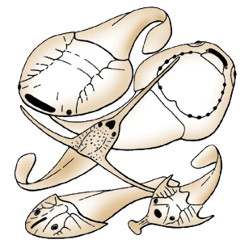
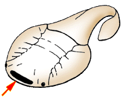

---
aliases:
  - Galeaspida
title: Galeaspida
---

# [[Galeaspida]]

  

Interrelationships of the Galeaspida:

The main characteristics supporting the nodes of this phylogeny are:

-   **Node 1**: narrower median dorsal opening. Orbits dorsally placed.
-   **Node 2**: only one dorsal, transversal commissural sensory-line
    canal.
-   **Node 3**: More than ten and up to 45 gill openings and gill units.

## #has_/text_of_/abstract 

> **Galeaspida** (from Latin, 'Helmet shields') is an extinct taxon of jawless marine and freshwater fish. The name is derived from galea, the Latin word for helmet, and refers to their massive bone shield on the head. Galeaspida lived in shallow, fresh water and marine environments during the Silurian and Devonian times (430 to 370 million years ago) in what is now Southern China, Tibet and Vietnam. Superficially, their morphology appears more similar to that of Heterostraci than Osteostraci, there being currently no evidence that the galeaspids had paired fins. A galeaspid Tujiaaspis vividus from the Silurian period of China was described in 2022 as having a precursor condition to the form of paired fins seen in Osteostraci and gnathostomes. Earlier than this, Galeaspida were already in fact regarded as being more closely related to Osteostraci, based on the closer similarity of the morphology of the braincase.
>
> [Wikipedia](https://en.wikipedia.org/wiki/Galeaspida) 

## Introduction

[Philippe Janvier]()

The Galeaspida, or galeaspids, are a highly diversified group of fossil,
armored, jawless vertebrates, which lived in Silurian and Devonian times
(430 to 370 million years ago). The head of galeaspids is a massive
endo- and exoskeletal shield, which is generally oval or
horseshoe-shaped, but can be produced into large rostral and lateral
processes. The mouth and gill openings are situated on the ventral side
of the head, which is flat and suggests that they were bottom-dwellers
(as are the Osteostraci) The body is covered with minute scales, and
there is no other fin than the caudal fin. The most peculiar feature of
galeaspids is a large, median dorsal opening in the headshield, which
communicates ventrally with the pharynx and gill chamber. It is assumed
to have served both the olfaction and the intake of the respiratory
water, like the nasopharyngeal duct of hagfishes (see Hyperotreti).
Galeaspids are the vertebrates which have the largest number of gills,
as some species had up to 45 gill openings.

Galeaspids are known exclusively in the Silurian and Devonian rocks of
China (including Tibet) and northern Vietnam, and are likely to have
been endemic to these areas. They lived in shallow water, deltaic and
lagoonal marine environments, and are most diverse in the Lower Devonian
(-400 million years ago).

### Characteristics

Galeaspids are characterised by:

-   A large, dorsally placed median opening in the headshield.

    ------------------------

    

    Galeaspids are characterized by a large, median dorsal inhalent
    opening (red arrow).

    ------------------------

-   The scallopped pattern of the dorsal sensory-line canals of the
    headshield.

Galeaspids somewhat resemble the Osteostraci in having a massive
headshield, in which both the endo- and exoskeleton are ossified. The
endoskeletal skull is a single mass of cartilage lined with a thin layer
of perichondral bone and calcified cartilage. The exoskeleton contains
no dentine and is made up by a thick layer of acellular bone (aspidine),
as in anaspids. The tubercles of the dermal ornamentation are capped
with an enamel-like tissue. The body is covered with minute scales
arranged in oblique rows. Galeaspids possess no paired fins and no
dorsal and anal fins. The caudal fin is poorly known, but seems to have
been pad-shaped or slightly hypocercal, as in the Thelodonti.

The endoskeletal headshield contains cavities and canals for the brain,
eyes, labyrinth, nerves, and blood vessels. It is hollowed ventrally by
a large cavity, the oralobranchial cavity, which contained the gills and
pharynx. The mouth is ventral and opens along the anterior rim of the
oralobranchial cavity, and the gill openings along the lateral rim. The
oralobranchial cavity is closed by one or two large median dermal
plates. Dorsally the oralobranchial cavity opens to the exterior through
the median dorsal opening. This opening is currently considered as being
chiefly for the intake of the respiratory water, and homologous to the
nasopharyngeal duct of hagfishes. However, it also served the olfaction,
as the paired olfactory capsules open into it. The nerve canals are
still poorly described, but it seems that the foremost gill arch was
innervated by the facial nerve.

The brain cavity is quite similar to that of the Osteostraci, with a
well-developed, paired recess for the cerebellum. The labyrinth has two
vertical semicircular canals, and its is flanked laterally by a large,
dorsal jugular vein. The orbits are generally small, and there is a
pineal foramen. The sensory-lines are enclosed in very large canals
which open to the exterior by a few, large pores.

The highly peculiar shape of the headshield of some galeaspids (with a
spatulate rostral process, or very long lateral processes) probably
reflects special habits, which are still unknown.

### Discussion of Phylogenetic Relationships

There are about seventy species of galeaspids, most of them being
distributed into two major clades, the Eugaleaspidiformes and the
Polybranchiaspidida (\"Polybranchiaspidiformes\" + Huananaspidiformes).
Some genera, such as Hanyangaspis, Dayongaspis, or Xiushuiaspis are
basal galeaspids. The Eugaleaspidiformes and Polybranchiaspidida are
sister-groups and share a single, transverse, commissural dorsal
sensory-line canal, contrary to these three genera, which have two such
canals, like heterostracans and thelodonts (generalized condition).

The Eugaleaspidiformes are characterized by a slit-shaped median dorsal
opening and a horseshoe-shaped headshield which mimates that of the
Osteostraci. Like basal galeaspids, they have only six to eight gill
openings and a corresponding number of branchial fossae which housed the
gills.

The Polybranchiaspidida are characterized by a very large number of gill
openings and branchial fossae (more than ten and up to 45). They include
a number of forms (currently referred to as the
\"Polybranchiaspidiformes\") with an oval headshield, which is probably
the general condition for the group, and a clade, the
Huannanaspidiformes, characterized by long rostral and lateral processes
of the headshield. Such processes, however, also occur in some
Eugaleaspidiformes, as homoplasies.

## Phylogeny 

-   « Ancestral Groups  
    -   [Vertebrata](../Vertebrata.md)
    -   [Craniata](../../Craniata.md)
    -   [Chordata](../../../Chordata.md)
    -   [Deuterostomia](../../../../Deutero.md)
    -  [Bilateria](../../../../../Bilateria.md) 
    -  [Animals](../../../../../../Animals.md) 
    -  [Eukarya](../../../../../../../Eukarya.md) 
    -   [Tree of Life](../../../../../../../Tree_of_Life.md)

-   ◊ Sibling Groups of  Vertebrata
    -   [Hyperoartia](Hyperoartia.md)
    -   [Euconodonta](Euconodonta.md)
    -   [Pteraspidomorphi](Pteraspidomorphi.md)
    -   [Thelodonti](Thelodonti.md)
    -   [Anaspida](Anaspida.md)
    -   Galeaspida
    -   [Pituriaspida](Pituriaspida.md)
    -   [Osteostraci](Osteostraci.md)
    -   [Gnathostomata](Gnath.md)

-   » Sub-Groups 

## Title Illustrations

Galeaspids are known from the Silurian and Devonian of China and
Vietnam. They are characterized by a large, median dorsal inhalent
opening and a scallopped pattern of the sensory-lines. Their mouth and
gill openings are situated on the ventral surface of the head (top
right). In the most primitive forms, such as the Silurian genus
Hanyangaspis (top), the median dorsal inhalent opening is broad and
situated anteriorly. In other galeaspids, its is more posterior in
position and can be oval, rounded, heart-shaped or slit-shaped. In some
Devonian galeaspids, such as the hunanaspidiforms Lungmenshanaspis
(middle) and Sanchaspis (bottom right), the headshield is produced
laterally and anteriorly into slender processes. The eugaleaspidiforms,
such as Eugaleaspis (bottom left) have a horseshoe-shaped headshield and
a slit-shaped median dorsal opening, which mimates the aspect of the
headshield of osteostracans. (Based on Liu 1975 and Pan 1992.)
 
Copyright ::   © 1997 Philippe Janvier

## Confidential Links & Embeds: 

### #is_/same_as :: [[/_Standards/bio/bio~Domain/Eukarya/Animal/Bilateria/Deutero/Chordata/Craniata/Vertebrata/Galeaspida|Galeaspida]] 

### #is_/same_as :: [[/_public/bio/bio~Domain/Eukarya/Animal/Bilateria/Deutero/Chordata/Craniata/Vertebrata/Galeaspida.public|Galeaspida.public]] 

### #is_/same_as :: [[/_internal/bio/bio~Domain/Eukarya/Animal/Bilateria/Deutero/Chordata/Craniata/Vertebrata/Galeaspida.internal|Galeaspida.internal]] 

### #is_/same_as :: [[/_protect/bio/bio~Domain/Eukarya/Animal/Bilateria/Deutero/Chordata/Craniata/Vertebrata/Galeaspida.protect|Galeaspida.protect]] 

### #is_/same_as :: [[/_private/bio/bio~Domain/Eukarya/Animal/Bilateria/Deutero/Chordata/Craniata/Vertebrata/Galeaspida.private|Galeaspida.private]] 

### #is_/same_as :: [[/_personal/bio/bio~Domain/Eukarya/Animal/Bilateria/Deutero/Chordata/Craniata/Vertebrata/Galeaspida.personal|Galeaspida.personal]] 

### #is_/same_as :: [[/_secret/bio/bio~Domain/Eukarya/Animal/Bilateria/Deutero/Chordata/Craniata/Vertebrata/Galeaspida.secret|Galeaspida.secret]] 

