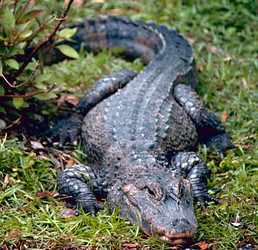

---
aliases:
- archosaur
- Archosaurer
- Archosauria
- Archosauři
- Archozaurai
- archozaury
- arcosaures
- Arcosauros
- arkosaurar
- Arkosaurer
- Arkosaurit
- Arkosauro
- Arkosaŭroj
- Arkozor
- Arxozavrlar
- Härskarödlor
- uralkodógyíkok
- αρχόσαυρος
- архазаўр
- архазаўры
- Архозавралар
- архозаври
- Архозаврлар
- Архозаврсем
- архозавры
- Арцхосауриа
- արխոզավրեր
- ארכוזאוריה
- آرکوسار
- آرکوسورها
- أركوصورات
- ارحوزاۆرلار
- आर्कोसोरिया
- ആർച്ചോസോർ
- อาร์โคซอร์
- არქოზავრები
- 主竜類
- 主龍類
- 主龙类
- 조룡류
title: Archosauria
has_id_wikidata: Q130910
dv_has_:
  name_:
    af: Archosauria
    an: Archosauria
    ar: أركوصورات
    ast: Archosauria
    az: Arxozavrlar
    be: архазаўры
    be_tarask: архазаўр
    bg: архозаври
    br: Archosauria
    ca: arcosaures
    ceb: Archosauria
    cs: Archosauři
    cv: Архозаврсем
    da: Archosaurer
    de: Archosauria
    el: αρχόσαυρος
    en: archosaur
    eo: Arkosaŭroj
    es: Archosauria
    eu: Archosauria
    fa: آرکوسورها
    fi: Arkosaurit
    fr: Archosauria
    ga: Archosauria
    gl: Arcosauros
    he: ארכוזאוריה
    hi: आर्कोसोरिया
    hu: uralkodógyíkok
    hy: արխոզավրեր
    ia: Archosauria
    id: Archosauria
    it: Archosauria
    ja: 主竜類
    ka: არქოზავრები
    kk: Архозаврлар
    kk_arab: ارحوزاۆرلار
    kk-cn: ارحوزاۆرلار
    kk_cyrl: Архозаврлар
    kk-kz: Архозаврлар
    kk_latn: Arxozavrlar
    kk-tr: Arxozavrlar
    ko: 조룡류
    ky: Архозавралар
    la: Archosauria
    lt: Archozaurai
    ml: ആർച്ചോസോർ
    mul: Archosauria
    nb: Arkosaurer
    nl: Archosauria
    nn: arkosaurar
    oc: Archosauria
    or: Archosaur
    pl: archozaury
    pnb: آرکوسار
    pt: archosauria
    ro: Archosauria
    ru: архозавры
    scn: Archosauria
    sco: archosaur
    sh: Archosauria
    sk: Archosauria
    sl: Archosauria
    sq: Archosauria
    sr: Archosauria
    sr_ec: Арцхосауриа
    sr_el: Archosauria
    sv: Härskarödlor
    th: อาร์โคซอร์
    tl: Archosauria
    tr: Arkozor
    uk: архозаври
    uz: Arxozavrlar
    vi: Archosauria
    war: Arkosauro
    wuu: 主龙类
    zh: 主龙类
    zh_cn: 主龙类
    zh_hans: 主龙类
    zh_hant: 主龍類
    zh_hk: 主龍類
    zh_sg: 主龙类
    zh_tw: 主龍類
---
# [[Archosauria]] 

    

## #has_/text_of_/abstract 

> **Archosauria** (lit. 'ruling reptiles') or archosaurs is a clade of diapsid sauropsid tetrapods, 
> with birds and crocodilians being the only extant representatives. 
> 
> Although broadly classified as reptiles, which traditionally exclude birds, 
> the cladistic sense of the term includes all living and extinct relatives of birds and crocodilians 
> such as non-avian dinosaurs, pterosaurs, phytosaurs, aetosaurs and rauisuchians 
> as well as many Mesozoic marine reptiles. 
> 
> Modern paleontologists define Archosauria as a crown group 
> that includes the most recent common ancestor of living birds and crocodilians, and all of its descendants.
>
> The base of Archosauria splits into two clades: 
> - Pseudosuchia, which includes crocodilians and their extinct relatives; and 
> - Avemetatarsalia, which includes birds and their extinct relatives (such as non-avian dinosaurs and pterosaurs). 
> 
> Older definitions of the group Archosauria rely on shared morphological characteristics, such as an antorbital fenestra in the skull, serrated teeth, and an upright stance. Some extinct reptiles, such as proterosuchids and euparkeriids, also possessed these features yet originated prior to the split between the crocodilian and bird lineages. The older morphological definition of Archosauria nowadays roughly corresponds to Archosauriformes, a group named to encompass crown-group archosaurs and their close relatives.
>
> The oldest true archosaur fossils are known from the Early Triassic period, though the first archosauriforms and archosauromorphs (reptilians closer to archosaurs than to lizards or other lepidosaurs) appeared in the Permian. Archosaurs quickly diversified in the aftermath of the Permian-Triassic mass extinction (~252 Ma), which wiped out most of the then-dominant therapsid competitors such as the gorgonopsians and anomodonts, and the subsequent arid Triassic climate allowed the more drought-resilient archosaurs (largely due to their uric acid-based urinary system) to eventually become the largest and most ecologically dominant terrestrial vertebrates from the Middle Triassic period up until the Cretaceous–Paleogene extinction event (~66 Ma). Birds and several crocodyliform lineages were the only archosaurs to survive the K-Pg extinction, rediversifying in the subsequent Cenozoic era. Birds in particular have become among the most species-rich groups of terrestrial vertebrates in the present day.
>
> [Wikipedia](https://en.wikipedia.org/wiki/Archosaur) 

### Information on the Internet

-   [Taxon Search: Stem     Archosauria](http://www.taxonsearch.org/Archive/stem-archosauria-1.0.php).
    Paul Sereno.
-   [Bibliography of Crocodilian     Biology](http://utweb.ut.edu/faculty/mmeers/bcb/index.html).
    Maintained by Mason Meers.
-   [Crocodilians. Natural History &     Conservation](http://www.flmnh.ufl.edu/natsci/herpetology/brittoncrocs/cnhc.html).
    Created by Adam Britton.
-   [Crocodilians on the     Net](http://geowww.geo.tcu.edu/faculty/crocodile.html). List of
    links maintained by Arthur Busbey.
-   [Geologists At UNC-CH Discover State\'s \"Most Spectacular\"     Fossils](http://www.sciencedaily.com/releases/1999/08/990818071044.htm).
    Information about the recent discovery of a new species of Late
    Triassic rauisuchian. ScienceDaily.
-   [Introduction to     Euparkeria](http://www.ucmp.berkeley.edu/diapsids/euparkeria.html).
    UCMP Berkeley.
-   [Introduction to the     Pterosauria](http://www.ucmp.berkeley.edu/diapsids/pterosauria.html).
    UCMP Berkeley.

## Phylogeny 

-   « Ancestral Groups  
    -   [Archosauromorpha](../Archosauromorpha.md)
    -   [Diapsida](../../Diapsida.md)
    -   [Amniota](../../../../../Amniota.md)
    -   [Terrestrial Vertebrates](../../../../Terrestrial.md)
    -   [Sarcopterygii](../../../../../../../Sarc.md)
    -   [Gnathostomata](../../../../../../../../Gnath.md)
    -   [Vertebrata](../../../../../../../../../Vertebrata.md)
    -   [Craniata](../../../../../../../../../../Craniata.md)
    -   [Chordata](../../../../../../../../../../../Chordata.md)
    -   [Deuterostomia](../../../../../../../../../../../../Deutero.md)
    -   [Bilateria](../../../../../../../../../../../../../Bilateria.md)
    -   [Animals](../../../../../../../../../../../../../../Animals.md)
    -   [Eukarya](../../../../../../../../../../../../../../../Eukarya.md)
    -   [Tree of Life](../../../../../../../../../../../../../../../Tree_of_Life.md)

-   ◊ Sibling Groups of  Archosauromorpha
    -   Archosauria

-   » Sub-Groups
    -   [Dinosaur](Archosauria/Dinosaur.md)
	-   *Pterosauria* †
	-   *Lagosuchis* †
	-   *Ornithosuchidae* †
	-   *Euparkeria* †
	-   *Parasuchia* †
	-   *Aetosauria* †
	-   *Rauisuchia* †
	-   *Crocodylomorpha* [(crocodiles and their extinct relatives)]

## Title Illustrations

-----------------------

scientific_name ::     Alligator sinensis
Comments             Chinese alligator
Creator              Photograph by Gary M. Stolz
Acknowledgements     Photograph courtesy of the U.S. Fish and Wildlife Service
specimen_condition ::  Live Specimen

-----------------------

scientific_name ::     Pteranodon
Creator              Heinrich Harder
specimen_condition ::  Fossil \-- Period: Cretaceous

## Confidential Links & Embeds: 

### #is_/same_as :: [[/_Standards/bio/bio~Domain/Eukarya/Animal/Bilateria/Deutero/Chordata/Craniata/Vertebrata/Gnath/Sarc/Tetrapods/Amniota/Sauropsida/Reptile/Diapsida/Archosauromorpha/Archosauria|Archosauria]] 

### #is_/same_as :: [[/_public/bio/bio~Domain/Eukarya/Animal/Bilateria/Deutero/Chordata/Craniata/Vertebrata/Gnath/Sarc/Tetrapods/Amniota/Sauropsida/Reptile/Diapsida/Archosauromorpha/Archosauria.public|Archosauria.public]] 

### #is_/same_as :: [[/_internal/bio/bio~Domain/Eukarya/Animal/Bilateria/Deutero/Chordata/Craniata/Vertebrata/Gnath/Sarc/Tetrapods/Amniota/Sauropsida/Reptile/Diapsida/Archosauromorpha/Archosauria.internal|Archosauria.internal]] 

### #is_/same_as :: [[/_protect/bio/bio~Domain/Eukarya/Animal/Bilateria/Deutero/Chordata/Craniata/Vertebrata/Gnath/Sarc/Tetrapods/Amniota/Sauropsida/Reptile/Diapsida/Archosauromorpha/Archosauria.protect|Archosauria.protect]] 

### #is_/same_as :: [[/_private/bio/bio~Domain/Eukarya/Animal/Bilateria/Deutero/Chordata/Craniata/Vertebrata/Gnath/Sarc/Tetrapods/Amniota/Sauropsida/Reptile/Diapsida/Archosauromorpha/Archosauria.private|Archosauria.private]] 

### #is_/same_as :: [[/_personal/bio/bio~Domain/Eukarya/Animal/Bilateria/Deutero/Chordata/Craniata/Vertebrata/Gnath/Sarc/Tetrapods/Amniota/Sauropsida/Reptile/Diapsida/Archosauromorpha/Archosauria.personal|Archosauria.personal]] 

### #is_/same_as :: [[/_secret/bio/bio~Domain/Eukarya/Animal/Bilateria/Deutero/Chordata/Craniata/Vertebrata/Gnath/Sarc/Tetrapods/Amniota/Sauropsida/Reptile/Diapsida/Archosauromorpha/Archosauria.secret|Archosauria.secret]] 

