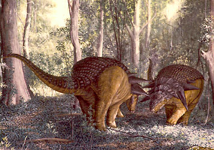
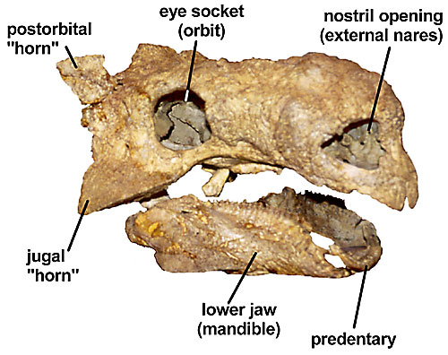
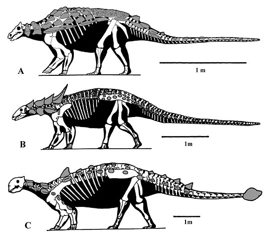

---
Commons_category: Ankylosaurus
Commons_gallery: Ankylosaurus
end_time: -65000000-01-01
has_id_wikidata: Q40621
image: "http://commons.wikimedia.org/wiki/Special:FilePath/Ankylosaur%20head%20-%20cast%20-%20Custer%20County%20Montana%20-%20Museum%20of%20the%20Rockies%20-%202013-07-08.jpg"
instance_of: '[[_Standards/WikiData/WD~fossil_taxon,23038290]]'
length: 8
location_of_discovery:
- '[[_Standards/WikiData/WD~Hell_Creek_Formation,917642]]'
- '[[_Standards/WikiData/WD~Ferris_Formation,5445371]]'
- '[[_Standards/WikiData/WD~Lance_Formation,6483389]]'
- '[[_Standards/WikiData/WD~Scollard_Formation,7434305]]'
- '[[_Standards/WikiData/WD~Frenchman_Formation,14874947]]'
- '[[_Standards/WikiData/WD~Canada,16]]'
main_food_source: '[[_Standards/WikiData/WD~herbivore,59099]]'
mass: 6
parent_taxon: '[[_Standards/WikiData/WD~Ankylosaurini,110051810]]'
size_comparison_diagram:
- "http://commons.wikimedia.org/wiki/Special:FilePath/Ankylosaurus%20estimated%20size%2001.png"
- "http://commons.wikimedia.org/wiki/Special:FilePath/Ankylosaurus%20Scale%20V2.svg"
start_time: -68000000-01-01
subreddit: ankmemes
taxon_name: Ankylosaurus
taxon_rank: '[[_Standards/WikiData/WD~genus,34740]]'
title: Ankylosauria
Wolfram_Language_entity_code: "Entity[\"Dinosaur\", \"Genus:Ankylosaurus\"]"
---

# [[Ankylosauria]]

Armored-plated dinosaurs 

#is_/same_as :: [[../../../../../../../../../../../../../../../../WikiData/WD~Ankylosaurus,40621|WD~Ankylosaurus,40621]] 

## #has_/text_of_/abstract 

> **Ankylosauria** is a group of herbivorous dinosaurs of the clade Ornithischia. It includes the great majority of dinosaurs with armor in the form of bony osteoderms, similar to turtles. Ankylosaurs were bulky quadrupeds, with short, powerful limbs. They are known to have first appeared in North Africa during the Middle Jurassic, and persisted until the end of the Late Cretaceous. The two main families of ankylosaurians, Nodosauridae and Ankylosauridae primarily originated from the Northern Hemisphere (North America, Europe and Asia), but the more basal Parankylosauria originated from southern Gondwana (South America, Australia and Antarctica) during the Cretaceous.
>
> Ankylosauria was first named by Henry Fairfield Osborn in 1923. In the Linnaean classification system, the group is usually considered either a suborder or an infraorder. It is contained within the group Thyreophora, which also includes the stegosaurs, armored dinosaurs known for their combination of plates and spikes.
>
> [Wikipedia](https://en.wikipedia.org/wiki/Ankylosauria) 

## Introduction

[Kenneth Carpenter](http://www.tolweb.org/)

The ankylosaurs, or armored-plated dinosaurs, first appeared in the
Kimmeridgian (\~156-152 my) of the Late Jurassic, and persisted 91
million years until they became extinct at the end of the Cretaceous (65
my). They had a global distribution, including Antarctica (Gasparini et
al., 1996). As fossils, ankylosaurs are most abundant in upper Lower
Cretaceous strata (Barremian to Albian, \~127-98.2 my) and in upper
Upper Cretaceous strata (Campanian and Maastrichtian, \~83.5-65 my)
(Carpenter, 1990, 1997a,b; Carpenter and Kirkland 1998; Carpenter et al,
1999). Not surprisingly, these intervals also mark their greatest
taxonomic diversity. The specimens from the Upper Cretaceous include
some exceptionally well preserved skeletons with much of the armor
preserved in its original position (Carpenter, 1982; Maryanska, 1977).

Ankylosaurs from the Kimmeridgian of Colorado and Wyoming include two
taxa, *Gargoyleosaurus* and *Mymoorapelta* from the dinosaur-rich
Morrison Formation (Carpenter et al, 1998; Kirkland and Carpenter,
1994). These two taxa belong to the primitive ankylosaur family
*Polacanthidae* (Carpenter 2001), first identified from the Lower
Cretaceous of Europe (Mantell, 1833). One member, *Gastonia*, is perhaps
the single most abundant ankylosaur known. It is represented by
thousands of elements from three bone beds, as well as a few isolated
occurrences, in the Cedar Mountain Formation of eastern Utah. One
monospecific bonebed contains a minimum of 22 individuals (Carpenter, in
preparation).

*Minmi* is an enigmatic ankylosaur from the Lower Cretaceous of
Australia. It is more derived than *Scelidosaurus* in having a skull
that is wider than tall, closed opening in front of the orbit and atop
the skull, and a nearly closed hip socket. However, it lacks any of the
derived characters that would place it in one of the three ankylosaur
families (Carpenter, 2001).

Ankylosaurs underwent their greatest evolution during the Cretaceous
(142-65 my), especially in the northern hemisphere. The Early Cretaceous
was especially momentous for ankylosaur evolution in that two ankylosaur
families, the *Nodosauridae* and *Ankylosauridae*, first appear in the
fossil record (Carpenter 2001). Their synapomorphies, however, indicate
a much longer evolutionary history, with ghost lineages possibly
extending back to the Middle Jurassic (Carpenter 2001). The slight
temporal overlap between the *Nodosauridae* and *Polacanthidae* in the
Cedar Mountain Formation (Lower Cretaceous) raises the possibility of
competitive extinction of the polacanthids by the end of the Aptian
(Carpenter 2001, fig. 21.11). Nodosaurid taxa dominate the ankylosaur
fossil record in the late Early Cretaceous (Aptian-Albian, 121-98.5 my)
and middle Cretaceous (Cenomanian-Santonian, 98.5-83.5). Many of the
nodosaurid occurrences are from marine deposits. These specimens
represent carcasses of individuals that were carried to sea from their
near-shore coastal plain habitat. The absence of ankylosaurids from
marine deposits suggests a preference for more inland or upland
habitats. Since nonmarine strata are rare for the middle Cretaceous, the
observed dominance of nodosaurids may be more apparent than real.

Nevertheless, this dominance changed during the latest Cretaceous
(Campanian-Maastrichtian, 83.5-65 my) when ankylosaurids increased in
diversity and relative abundance. They are especially diverse in Asia,
where nodosaurids are as yet unknown. In marked contrast, ankylosaurids
are unknown in Europe. The Asian and North American ankylosaurids are
known from both arid (eolian) and lowland coastal environments.

The extinction of the ankylosaurs at the end of the Cretaceous does not
appear to have been abrupt. Both their relative abundance and diversity
shows a decline during the last three million years of the Cretaceous in
North America (Carpenter and Breithaupt, 1986), suggesting that, in
North America at least, they became extinct before the asteroid impact
(Hildebrand et al., 1991).

### Characteristics

Ankylosaurs are quadrupedal ornithischians with a wide, low body. Their
armor is typical of ankylosaurs (Carpenter, 1997a, b), and its
development is so extreme in some forms, that, for example,
*Euoplocephalus* has armored eyelids (Coombs, 1972), and *Panoplosaurus*
and *Edmontonia* have armored cheek plates (Carpenter, 1990). The body
armor typically consists of oval to rectangular plates, having a keel or
ridge extending their length; in ankylosaurids and polacanthids, these
plates may be strongly concave ventrally. Gaps between the plates and
undersides of the body, as well as the legs, are encased in small,
marble- to pea-sized bone armor. In the nodosaurids, the armor plates
are supplemented with long spines or spikes projecting from the neck and
shoulders, while in polacanthids, the armor includes dorso-ventrally
flattened, triangular spines projecting laterally from the sides of the
neck, body and tail (Carpenter, 2001; Gaston et al., 2001), and in
ankylosaurids, the armor is supplemented by a large bone club on the end
of the tail.

The skull of ankylosaurs has traditionally been thought to have armor
fused to its surface (e.g., Maryanska, 1977; Sereno 1986; Carpenter
1997a,b). However, new evidence indicates that the \"armor\" is
partially (Vickaryous et al., 2001) or entirely (Carpenter et al. 2001)
the result of remodeling of the bone surface. Hence, the term
\"ornamentation\" is preferred to \"armor\" in referring to this surface
texture. The ornamentation apparently corresponds to the former
overlying scales (Vickaryous et al., 2001). In nodosaurids, the
ornamentation consists of a few, large scale patterns symmetrically
arranged on the top and sides of the skull and lower jaw (Coombs,
1978a). In contrast, the ornamentation in polacanthids and ankylosaurids
consisted of many, small, asymmetrically arranged scale patterns.

The overall shape of the skulls of the three families differs markedly,
although there are more similarities between polacanthids and
ankylosaurids (Kirkland, 1998). The skull of nodosaurids is
significantly longer than wide, whereas it is nearly as wide or wider
than long in polacanthids and ankylosaurids (Coombs, 1978a; Carpenter,
2001). In addition, two of the five pairs of skull openings
characteristic of most dinosaurs have fused shut. These two pairs of
openings are the antorbital fenestrae located in front of the orbits,
and the supratemporal fenestrae located atop the skull roof. In
addition, in ankylosaurids, a third pair of openings, the lateral
temporal fenestrae located behind the orbits, are also closed.

**Figure 1**. Typical ankylosaur skull showing some of the major
features (*Tarchia gigantea* from the Upper Cretaceous of Mongolia).

Premaxillary teeth are present in primitive members of all families
(Carpenter, 2001). The cheek teeth of nodosaurids tend to be
proportionally larger than in polacanthids and ankylosaurids. Except in
polacanthids, the base of the crown often has a shelf or cingulum on
both sides. In ankylosaurids, this cingulum may be replaced by a
swelling of the crown base, but in polacanthids, the primitive
ornithischian non-cingulated, non-swollen crown is retained. Wear
patterns on the swollen bases and cingula indicate that chewing was more
complex than simple orthal adduction (Rybczynski and Vickaryous, 2001).
The muzzle and beaks of nodosaurids are much narrower than those of
ankylosaurids, suggesting that nodosaurids were browsers, selectively
cropping plant parts or particular types of vegetation; in contrast,
ankylosaurids were grazers, cropping all low vegetation (Carpenter,
1982, 1984). Polacanthids are variable, *Gargoyleosaurus* having a
narrow muzzle and *Gastonia* a wider one; both share in having an
unusual inverted U-shaped notch in the upper beak, the function of which
is unknown.

The vertebral column in ankylosaurs consists of seven or eight
cervicals, about 16 dorsals, three or four sacrals, and 20 caudals in
ankylosaurids and 40 or more in nodosaurids (Carpenter, 1997a) and
polacanthids. The neck region is typically short, whereas the trunk is
very long. The facets for the ribs are often angled upwards so that the
ribs produce a wide, barrel-like body. The pelvis is also wide, with the
ilium rotated into a long, nearly horizontal structure that angles away
from the midline. To provide this pelvis greater stability, the
posterior five or more dorsals are fused to the sacrum producing a
synsacral rod. These fused vertebrae prevent rotation of the pelvis
about the vertebral column. The caudals are typically short near the
pelvis, and the first one or two may actually fuse to the sacrum. The
caudals rapidly become elongated and in ankylosaurids the distal third
of the tail may be fused to provide a rigid \"handle\" for the terminal
tail club; in nodosaurids and polacanthids, the caudals remain long
until near the end of the tail where the last three or so shorten
rapidly.

**Figure 2**. Representatives of the *Ankylosauria*: A) the polacanthid
*Gargoyleosaurus*, B) the nodosaurid *Sauropelta* and C) the
ankylosaurid *Euoplocephalus*. The characteristic features include a
low, wide skull with remodeled surface or small pieces of armor fused to
it, and a completely modified pelvis to accommodate a wide gut.

The limbs of ankylosaurs are short relative to body length, especially
in ankylosaurids. The scapula of polacanthids is a thin flange folded
ventrolaterally towards the glenoid from the dorsal border of the
scapula, whereas it is a long finger-like spur or prong near the glenoid
in nodosaurids; in ankylosaurids, the acromion is typically a thickened
area along the dorsal border of the scapula (in *Pinacosaurus* it is a
polacanthid-like flange, although much smaller). The coracoid is usually
longer than wide in nodosaurids, but about as long as wide in
ankylosaurids and polacanthids. The limb bones are rather stoutly built
to carry the ponderous body. The humerus of ankylosaurs has a well
developed deltopectoral crest for several muscles involved in locomotion
(Coombs, 1978a). The humerus is proportionally more slender in
nodosaurids than in ankylosaurids (Coombs, 1978b) and is intermediate in
polacanthids (Carpenter, 2001). The olecranon on the ulna in ankylosaurs
is well developed and provides a tall lever for extensor muscles of the
elbow. The pelvis is unusual among ornithischians because the ilium has
expanded horizontally to form a broad, wide surface. In addition, the
acetabulum, or hip socket, is not open in typical dinosaur fashion, but
is cup-like, being closed off internally by the ischium and ilium; the
pubis only contributes to a small portion of the acetabulum. Most of the
body weight was carried over the hind legs; consequently, the femur is
straight and pillar-like, and the tibia and fibula are short and stout.
Both the fore- and hind-feet are short and stout as well. The femur of
nodosaurids and polacanthids is more slender in build than in
ankylosaurids (Coombs, 1978a).

### Discussion of Phylogenetic Relationships

Traditionally, there has been a general consensus that the
*Nodosauridae* and *Ankylosauridae* share a common ancestry among basal
thyreophorans (e.g., Sereno, 1986; Maryanska and Osmolska, 1985;
Fastovsky and Weishampel, 1996). The recent recognition of the
*Polacanthidae* (Carpenter 2001) does not refute this origin. Basically,
all three families plus *Minmi* (which cannot be placed into a family),
differ from all other ornithischians in having skull surfaces modified
by remodeling under the influence of the overlying skin, closure of the
supratemporal and antorbital fenestrae, armor encasing the neck, body
and tail, a horizontal ilium, complete or near complete closure of the
acetabulum, and reduction of the pubis to a small rectangular block.

## Phylogeny 

-   « Ancestral Groups  
    -   [Ankylosauromorpha](../Ankylosauromorpha.md)
    -   [Ornithischia](../../Ornithischia.md)
    -   [Dinosauria](../../../Dinosauria.md)
    -   [Archosauria](../../../../Archosauria.md)
    -   [Archosauromorpha](../../../../../Archosauromorpha.md)
    -   [Diapsida](../../../../../../Diapsida.md)
    -  [Amniota](../../../../../../../../../Amniota.md))
    -   [Terrestrial Vertebrates](../../../../../../../../Terrestrial.md)
    -  [Sarcopterygii](../../../../../../../../../../../Sarc.md))
    -  [Gnathostomata](../../../../../../../../../../../../Gnath.md))
    -  [Vertebrata](../../../../../../../../../../../../../Vertebrata.md))
    -  [Craniata](../../../../../../../../../../../../../../Craniata.md))
    -  [Chordata](../../../../../../../../../../../../../../../Chordata.md))
    -  [Deuterostomia](../../../../../../../../../../../../../../../../Deutero.md))
    -  [Bilateria](../../../../../../../../../../../../../../../../Bilateria.md))
    -  [Animals](../../../../../../../../../../../../../../../../../Animals.md))
    -  [Eukarya](../../../../../../../../../../../../../../../../../../Eukarya.md))
    -  [Tree of Life](../../../../../../../../../../../../../../../../../../../Tree_of_Life.md))

-   ◊ Sibling Groups of  Ankylosauromorpha
    -   Ankylosauria

-   » Sub-Groups
    -   [Nodosauridae](Nodosauridae)
    -   [Polacanthidae](Polacanthidae)
    -   [Ankylosauridae](Ankylosauridae)

## Title Illustrations

----------------------------------------------------------------)
Scientific Name ::     Edmontonia
Location ::           North America
Comments             Life restoration. Two males are shown in a shoving contest of strength.
Specimen Condition   Fossil \-- Period: Late Cretaceous
Sex ::                Male
Copyright ::            © 1983 Brian Franczak 

## Confidential Links & Embeds: 

### #is_/same_as ::[Ankylosauria](Ankylosauria.md)) 

### #is_/same_as :: [Ankylosauria.public](/_public/bio/bio~Domain/Eukarya/Animal/Bilateria/Deutero/Chordata/Craniata/Vertebrata/Gnath/Sarc/Tetrapods/Amniota/Diapsida/Archosauromorpha/Archosauria/Dinosauria/Ornithischia/Ankylosauromorpha/Ankylosauria.public.md) 

### #is_/same_as :: [Ankylosauria.internal](/_internal/bio/bio~Domain/Eukarya/Animal/Bilateria/Deutero/Chordata/Craniata/Vertebrata/Gnath/Sarc/Tetrapods/Amniota/Diapsida/Archosauromorpha/Archosauria/Dinosauria/Ornithischia/Ankylosauromorpha/Ankylosauria.internal.md) 

### #is_/same_as :: [Ankylosauria.protect](/_protect/bio/bio~Domain/Eukarya/Animal/Bilateria/Deutero/Chordata/Craniata/Vertebrata/Gnath/Sarc/Tetrapods/Amniota/Diapsida/Archosauromorpha/Archosauria/Dinosauria/Ornithischia/Ankylosauromorpha/Ankylosauria.protect.md) 

### #is_/same_as :: [Ankylosauria.private](/_private/bio/bio~Domain/Eukarya/Animal/Bilateria/Deutero/Chordata/Craniata/Vertebrata/Gnath/Sarc/Tetrapods/Amniota/Diapsida/Archosauromorpha/Archosauria/Dinosauria/Ornithischia/Ankylosauromorpha/Ankylosauria.private.md) 

### #is_/same_as :: [Ankylosauria.personal](/_personal/bio/bio~Domain/Eukarya/Animal/Bilateria/Deutero/Chordata/Craniata/Vertebrata/Gnath/Sarc/Tetrapods/Amniota/Diapsida/Archosauromorpha/Archosauria/Dinosauria/Ornithischia/Ankylosauromorpha/Ankylosauria.personal.md) 

### #is_/same_as :: [Ankylosauria.secret](/_secret/bio/bio~Domain/Eukarya/Animal/Bilateria/Deutero/Chordata/Craniata/Vertebrata/Gnath/Sarc/Tetrapods/Amniota/Diapsida/Archosauromorpha/Archosauria/Dinosauria/Ornithischia/Ankylosauromorpha/Ankylosauria.secret.md)

