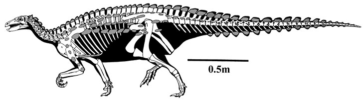
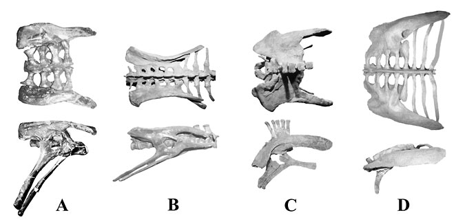


# [[Ankylosauromorpha]] 

Armored-plated dinosaurs 
) 

## #has_/text_of_/abstract 

> Ankylosauria is a group of herbivorous dinosaurs of the clade Ornithischia. 
> It includes the great majority of dinosaurs with armor in the form of bony osteoderms, similar to turtles. 
> Ankylosaurs were bulky quadrupeds, with short, powerful limbs. 
> 
> They are known to have first appeared in North Africa during the Middle Jurassic, 
> and persisted until the end of the Late Cretaceous. 
> 
> The two main families of ankylosaurians, Nodosauridae and Ankylosauridae 
> primarily originated from the Northern Hemisphere (North America, Europe and Asia), 
> but the more basal Parankylosauria originated from southern Gondwana (South America, Australia and Antarctica) during the Cretaceous.
>
> Ankylosauria was first named by Henry Fairfield Osborn in 1923. 
> In the Linnaean classification system, the group is usually considered either a suborder or an infraorder. 
> It is contained within the group Thyreophora, which 
> also includes the stegosaurs, armored dinosaurs known for their combination of plates and spikes. 
>
> [Wikipedia](https://en.wikipedia.org/wiki/Ankylosauria) 

## Introduction

[Kenneth Carpenter](http://www.tolweb.org/)

Ankylosauromorphs are more popularly known as the armored-plated
dinosaurs. They first appeared in the Early Jurassic (\~208-204 my) and
became extinct at the end of the Cretaceous (65 my) (Carpenter 2001).
Their fossils are known from every continent, including Antarctica
(which was not ice covered during the Mesozoic) (Gasparini et al.,
1996). Ankylosauromorphs are taxonomically most diverse in the last half
of the Early Cretaceous (\~130-112 my) and again in the later half of
the Late Cretaceous (\~83.5-65 my) (Carpenter and Kirkland 1998;
Carpenter et al, 1999).

The oldest ankylosauromorph is *Scelidosaurus* from the Sinemurian
(204-198 my) of England (Carpenter 2001). It bears many of the hallmarks
of later ankylosaurs (see below) indicating an earlier origin for the
ankylosauromorphs, possibly in the Hettangian (208-204 my). Although
*Scelidosaurus* is unequivocally an ankylosaur, its primitiveness
prevents it from being assigned to any of the three ankylosaur families,
grouped as the *Ankylosauria* (Carpenter, 2001); it is the closest
sister taxon of the *Ankylosauria*.

### Characteristics

Ankylosauromorphs are quadrupedal ornithischians with a proportionally
wider body than seen in most other ornithischians. This wide body
accommodates a large gut, suggesting that hindgut fermentation
(analogous to that seen in horses) was important to break down their
vegetation diet. The most distinctive feature of ankylosauromorphs is
the armor that encases the entire body (Carpenter 2001). The armor was
undoubtedly embedded within the skin, much like the armor of crocodiles
today. The armor consisted of outwardly projecting spines and larger,
narrower spikes, thin walled cone-like plates, keeled nearly flat
plates, solid, keeled scutes, and small rounded ossicles that filled the
gaps between the larger armor, as well as covered the belly. The armor
is arranged along the top and sides of the neck as bands or half-rings,
in rows or alternating rows along the back, sides and tail. As in
crocodiles, this armor was arranged in distinct patterns in the
different genera, especially in the neck region (Carpenter, 1982, 1984,
1990). In *Scelidosaurus*, the armor is predominately thin-walled,
laterally compressed cones, although some smaller solid scutes also
occur. The armor on the neck consists of two rows, and that on the body
is arranged in rows extending parallel to the body.

The skull surface of ankylosauromorphs is extensively modified either by
reworking of the bone surface by the overlying scales, or by fusion of
armor (Vickaryous et al., 2001; Carpenter, 2001; Carpenter et al. 2001).
The rough textured surface is called \"ornamentation\", although at one
time it was thought be to exclusively fused armor (see
[*Ankylosauria*](tree?group=Ankylosauria&contgroup=Ankylosauromorpha)).
In *Scelidosaurus*, remodeling of the bone is confined to the
postorbital, maxilla, jugal, and mid-section of the lower jaw.

*Scelidosaurus* retains the primitive ornithischian shaped skull, which
is taller than wide, unlike the low, wide skull of the *Ankylosauria*.
Furthermore, *Scelidosaurus* still retains the five pairs of skull
openings characteristic of primitive ornithischians. These openings are
the nares at the front of the snout, the antorbital fenestrae located in
front of the orbits, the orbits, the supratemporal fenestrae located
atop the skull roof, and the lateral temporal fenestra located behind
the orbit. In the Ankylosauria, the antorbital and supratemporal
fenestra have fused shut, and the lateral temporal fenestra is covered
over in one family (*Ankylosauridae*).

Premaxillary teeth are present in *Scelidosaurus*, as well as
primitively in the *Ankylosauria* (Carpenter 2001). The characteristic
cropping beak of the *Ankylosauria* is not developed in *Scelidosaurus*,
suggesting that it was a selective feeder. The cheek region in
*Scelidosaurus* is not inset to the great extent seen in the
*Ankylosauria* The cheek teeth are leaf-shaped, much like those of the
primitive ornithischian, *Lesothosaurus*. Wear facets on the teeth
indicate a puncture-crushing method of food processing between the teeth
(Barrett, 2001). In many, but not all, ankylosaurs, the teeth are
modified and are less leaf-shaped, especially by the development of a
cingulum, or expansion of the crown just above the root.

The vertebral column in ankylosauromorphs consists of seven or eight
cervicals, about 16 dorsals, three or four sacrals, and around 40 or
more caudals. The neck region is typically short, whereas the trunk is
very long. The pelvis retains the three pairs of bones seen in other
dinosaurs, the large upper ilium, the lower, forward positioned pubis,
and the lower, rearward projecting ischium. However, ankylosauromorphs
have modified these bones from the standard ornithischian pattern. The
ilium is expanded horizontally and angled away from the midline, thus
producing a wide hip to accommodate a wide gut. The width of the pelvis
is even greater in the *Ankylosauria* than in *Scelidosaurus* indicating
the increased importance in hindgut fermentation. The pubis retains the
primitive overall shape seen in *Lesothosaurus*, but the pubic body is
expanded and rotated to partially close the back wall of the acetabulum.
This trend is continued in the *Ankylosauria* until it is completely
closed off so that the acetabulum is a cup. The caudals are typically
short near the pelvis and become elongated near the middle of the tail.
The limbs of ankylosauromorphs are rather stoutly built to carry the
ponderous body, even more so in the wider-bodied *Ankylosauria*.

**Figure 1**. Pelvis of *Scelidosaurus* in top and side view (A),
compared with that of a more \"primitive\", bipedal ornithischian
*Thescelosaurus* (B), *Stegosaurus* (C) and the ankylosaur
*Euoplocephalus* (D). Note that in side view, the pelvis of
*Scelidosaurus* retains the primitive ornithischian appearance (most
similar to that of *Thescelosaurus* in side view). However in top view,
the pelvis is more like that of the ankylosaur *Euoplocephalus*. The
horizontal expansion of the entire ilium (upper pelvic bone) is a
uniquely ankylosaur character. In *Stegosaurus*, only a part of the
ilium is expanded horizontally. Modified from Carpenter 2001.

### Discussion of Phylogenetic Relationships

Traditionally, *Scelidosaurus* was considered the closest sister taxon
to the *Stegosauria* and *Ankylosauria* (Sereno 1986; Maryanska and
Osmolska, 1985; Fastovsky and Weishampel, 1996). Together, these three
taxa, plus several other armored forms, constituted the *Thyreophora*
(Sereno 1986). But a restudy of *Scelidosaurus* shows that it has
several of the apomorphies of the *Ankylosauria* in the pelvis and
armor, thus cannot be a close sister taxon to the *Stegosauria* (see
above; also Carpenter 2001). On the other hand, these apomorphies occur
in the *Ankylosauria*, so are plesiomorphic for the group. To show this
relationship, the *Ankylosauromorpha* consists of *Scelidosaurus* +
*Ankylosauria*.

## Phylogeny 

-   « Ancestral Groups  
    -   [Ornithischia](../Ornithischia.md)
    -   [Dinosauria](../../Dinosauria.md)
    -   [Archosauria](../../../Archosauria.md)
    -   [Archosauromorpha](../../../../Archosauromorpha.md)
    -   [Diapsida](../../../../../Diapsida.md)
    -  [Amniota](../../../../../../../../Amniota.md))
    -   [Terrestrial Vertebrates](../../../../../../../Terrestrial.md)
    -  [Sarcopterygii](../../../../../../../../../../Sarc.md))
    -  [Gnathostomata](../../../../../../../../../../../Gnath.md))
    -  [Vertebrata](../../../../../../../../../../../../Vertebrata.md))
    -  [Craniata](../../../../../../../../../../../../../Craniata.md))
    -  [Chordata](../../../../../../../../../../../../../../Chordata.md))
    -  [Deuterostomia](../../../../../../../../../../../../../../../Deutero.md))
    -  [Bilateria](../../../../../../../../../../../../../../../../Bilateria.md))
    -  [Animals](../../../../../../../../../../../../../../../../../Animals.md))
    -  [Eukarya](../../../../../../../../../../../../../../../../../../Eukarya.md))
    -  [Tree of Life](../../../../../../../../../../../../../../../../../../Tree_of_Life.md))

-   ◊ Sibling Groups of  Ornithischia
    -   Ankylosauromorpha

-   » Sub-Groups
    -   [Ankylosauria](Ankylosauromorpha/Ankylosauria.md)

-   *[Ankylosauria](Ankylosauromorpha/Ankylosauria.md "go to ToL page")*

## Title Illustrations

------------------------------------------------) 
  Scientific Name ::     Scelidosaurus harrisoni
  Location ::           England
  Comments             Skeletal reconstruction. The most characteristic feature of all ankylosauromorphs is extensive development of bone armor (tinted grey).
  Specimen Condition   Fossil \-- Period: Early Jurassic
  Body Part            skeleton
  Copyright ::            © 1987 Gregory Paul

## Confidential Links & Embeds: 

### #is_/same_as ::[Ankylosauromorpha](Ankylosauromorpha.md)) 

### #is_/same_as :: [Ankylosauromorpha.public](/_public/bio/bio~Domain/Eukarya/Animal/Bilateria/Deutero/Chordata/Craniata/Vertebrata/Gnath/Sarc/Tetrapods/Amniota/Diapsida/Archosauromorpha/Archosauria/Dinosauria/Ornithischia/Ankylosauromorpha.public.md) 

### #is_/same_as :: [Ankylosauromorpha.internal](/_internal/bio/bio~Domain/Eukarya/Animal/Bilateria/Deutero/Chordata/Craniata/Vertebrata/Gnath/Sarc/Tetrapods/Amniota/Diapsida/Archosauromorpha/Archosauria/Dinosauria/Ornithischia/Ankylosauromorpha.internal.md) 

### #is_/same_as :: [Ankylosauromorpha.protect](/_protect/bio/bio~Domain/Eukarya/Animal/Bilateria/Deutero/Chordata/Craniata/Vertebrata/Gnath/Sarc/Tetrapods/Amniota/Diapsida/Archosauromorpha/Archosauria/Dinosauria/Ornithischia/Ankylosauromorpha.protect.md) 

### #is_/same_as :: [Ankylosauromorpha.private](/_private/bio/bio~Domain/Eukarya/Animal/Bilateria/Deutero/Chordata/Craniata/Vertebrata/Gnath/Sarc/Tetrapods/Amniota/Diapsida/Archosauromorpha/Archosauria/Dinosauria/Ornithischia/Ankylosauromorpha.private.md) 

### #is_/same_as :: [Ankylosauromorpha.personal](/_personal/bio/bio~Domain/Eukarya/Animal/Bilateria/Deutero/Chordata/Craniata/Vertebrata/Gnath/Sarc/Tetrapods/Amniota/Diapsida/Archosauromorpha/Archosauria/Dinosauria/Ornithischia/Ankylosauromorpha.personal.md) 

### #is_/same_as :: [Ankylosauromorpha.secret](/_secret/bio/bio~Domain/Eukarya/Animal/Bilateria/Deutero/Chordata/Craniata/Vertebrata/Gnath/Sarc/Tetrapods/Amniota/Diapsida/Archosauromorpha/Archosauria/Dinosauria/Ornithischia/Ankylosauromorpha.secret.md)

