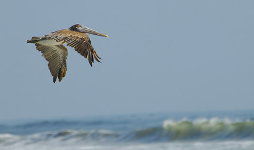

# [[Coelurosauria]]

Birds, tyrannosaurs, velociraptors, etc. 

 ![[Coelurosauria/Tyrannosauroid.jpg]]] 

## #has_/text_of_/abstract 

> **Coelurosauria** (; from Greek, meaning "hollow-tailed lizards") is the clade containing 
> all theropod dinosaurs more closely related to birds than to carnosaurs.
>
> Coelurosauria is a subgroup of theropod dinosaurs that includes compsognathids, tyrannosauroids, ornithomimosaurs, maniraptorans, and over the recent years, megaraptorans (Although position within the clade is unclear). Maniraptora includes birds, the only known dinosaur group alive today. In the past, Coelurosauria was used to refer to all small theropods, but this classification has since been amended.
>
> Most feathered dinosaurs discovered so far have been coelurosaurs. Philip J. Currie had considered it likely and probable that all coelurosaurs were feathered. However, several skin impressions found for some members of this group show pebbly, scaly skin, indicating that feathers did not completely replace scales in all taxa.
>
> [Wikipedia](https://en.wikipedia.org/wiki/Coelurosauria) 

## Phylogeny 

-   « Ancestral Groups  
    -   [Theropoda](../Theropoda.md)
    -   [Dinosauria](../../Dinosauria.md)
    -   [Archosauria](../../../Archosauria.md)
    -   [Archosauromorpha](../../../../Archosauromorpha.md)
    -   [Diapsida](../../../../../Diapsida.md)
    -  [Amniota](../../../../../../../../Amniota.md))
    -   [Terrestrial Vertebrates](../../../../../../../Terrestrial.md)
    -  [Sarcopterygii](../../../../../../../../../../Sarc.md))
    -  [Gnathostomata](../../../../../../../../../../../Gnath.md))
    -  [Vertebrata](../../../../../../../../../../../../Vertebrata.md))
    -  [Craniata](../../../../../../../../../../../../../Craniata.md))
    -  [Chordata](../../../../../../../../../../../../../../Chordata.md))
    -  [Deuterostomia](../../../../../../../../../../../../../../../Deutero.md))
    -  [Bilateria](../../../../../../../../../../../../../../../../Bilateria.md))
    -  [Animals](../../../../../../../../../../../../../../../../../Animals.md))
    -  [Eukarya](../../../../../../../../../../../../../../../../../../Eukarya.md))
    -  [Tree of Life](../../../../../../../../../../../../../../../../../../Tree_of_Life.md))

-   ◊ Sibling Groups of  Theropoda
    -   Coelurosauria

-   » Sub-Groups
    -   [Tyrannosauroidea](Coelurosauria/Tyrannosauroidea.md)
    -  [Bird](../../../../../../../../Bird.md))
	-   *Compsognathidae* †
	-   *Alvarezsauridae* †
	-   *Ornithomimidae* †
	    [(ostrich-like dinosaurs)]
	-   *Therizinosauridae* †
	-   *[Tyrannosauroidea](Coelurosauria/Tyrannosauroidea.md "go to ToL page")*
	    †
	-   *Maniraptora*
	    -   *Oviraptorosauria* †
	    -   *Dromaeosauridae* †
	        [(Velociraptor and relatives)]
	    -   *Troodontidae* †
	    -   [Bird](../../../../../../../../Bird.md "go to ToL page"))*
	        [(birds)]

### Information on the Internet

-   [Are Birds Really     Dinosaurs?](http://www.ucmp.berkeley.edu/diapsids/avians.html)
    DinoBuzz, UCMP Berkeley.

-   [China's Feathered     Dinosaurs](http://www.peabody.yale.edu/exhibits/cfd/). Yale Peabody
    Museum of Natural History online exhibit.

-   [Dinosaurs and     Birds](http://www.enchantedlearning.com/subjects/dinosaurs/Dinobirds.html).
    Enchanted Learning Software.

-   [Jeff Poling\'s Journal of Dinosaur     Paleontology](http://www.dinosauria.com/jdp/jdp.htm) has online
    articles about Dromaeosaurids, Oviraptorids, and Tyrannosaurids.

-   Information about the discovery of **Sinosauropteryx prima**, a
    small theropod that may be related to **Compsognathus** (Chen et al.
    1998):
    -   [Bones of Contention](http://www.acnatsci.org/news/china.html).
        The Philadelphia Inquirer.
    -   [Professor Finds Clues to Origin of         Birds](http://www.enn.com/enn-news-archive/1997/04/042997/04299711.asp).
        Environmental News Network.
    -   [Dino Feathers Stir         Debate](http://abcnews.go.com/sections/science/DailyNews/dinofeathers0107.html).
        ABC News Science.

-   [Another Dino with     'Feathers'](http://abcnews.go.com/sections/science/DailyNews/dinofeather990526.html).
    Information about **Beipaosaurus inexpectus**, a therizinosauroid
    theropod (Xu et al. 1999a). ABC News Science.

-   [Bambiraptor Home Page](http://www.bambiraptor.com/). Fossil Work
    Laboratories.

-   [Museum unveils bird-like     dinosaur](http://www.enn.com/enn-subsciber-news-archive/2000/03/03182000/ap_birddinosaur_11180.asp).
    Information about Bambiraptor feinbergi. Environmental News Network.

-   [Fluffy \'raptors discovered in     China](http://www.bbc.co.uk/dinosaurs/dig_deeper/news_article_5.shtml).
    Information about **Sinornithosaurus millenii**, a dromaeosaurid
    theropod (Xu et al. 1999b). BBC Online.

-   Information about the discovery of **Protarchaeopteryx robusta** and
    **Caudipteryx zoui** (Ji & al. 1998):

    -   [A Feathered         Dinosaur?](http://abcnews.go.com/sections/science/DailyNews/dinobird980623.html)
        . ABC News Science.
    -   [Dinos of a         Feather](http://204.202.137.111/sections/science/DailyNews/dinobird990225.html).
        ABC News Science.
    -   [Feathered Creatures From China Boost Dinosaur-Bird         Connection](http://www.nationalgeographic.com/events/releases/pr980623.html).
        National Geographic Press Release.
    -   [Birds from         Dinosaurs?](http://www.sciencefriday.com/pages/1998/Jun/hour1_062698.html)
        Science Friday radio program.

    For additional web resources on the phylogenetic position of birds
    consult the **Information on the Internet** section on the
    [**Aves**](tree?group=Aves&contgroup=Coelurosauria#www)
    page.

## Title Illustrations

  ------------------------------------------------------------
  Scientific Name ::     Pelecanus occidentalis
  Location ::           Florida, USA
  Specimen Condition   Live Specimen
  Behavior             flying
  Source               [Brown Pelican](http://www.flickr.com/photos/mikebrsm/234069036/)
  Source Collection    [Flickr](http://flickr.com/)
  Image Use ::    [Attribution-NoDerivs 2.0 Creative Commons License](http://creativecommons.org/licenses/by-nd/2.0/).
  Copyright ::            © 2006 [mike blache\'](http://flickr.com/people/82074368@N00)
  ------------------------------------------------------------

  -------------------------------------------------------------
  Scientific Name ::     Tyrannosaurus rex
  Location ::           Oxford University Museum
  Specimen Condition   Model
  Source               [trexhead](http://www.flickr.com/photos/86624586@N00/10196981/)
  Source Collection    [Flickr](http://flickr.com/)
  Image Use ::    [Attribution-NonCommercial 2.0 Creative Commons License](http://creativecommons.org/licenses/by-nc/2.0/).
  Copyright ::            © 2004 [Kevin Walsh](http://flickr.com/people/86624586@N00)
  -------------------------------------------------------------

## Confidential Links & Embeds: 

### #is_/same_as ::[Coelurosauria](Coelurosauria.md)) 

### #is_/same_as :: [Coelurosauria.public](/_public/bio/bio~Domain/Eukarya/Animal/Bilateria/Deutero/Chordata/Craniata/Vertebrata/Gnath/Sarc/Tetrapods/Amniota/Diapsida/Archosauromorpha/Archosauria/Dinosauria/Theropoda/Coelurosauria.public.md) 

### #is_/same_as :: [Coelurosauria.internal](/_internal/bio/bio~Domain/Eukarya/Animal/Bilateria/Deutero/Chordata/Craniata/Vertebrata/Gnath/Sarc/Tetrapods/Amniota/Diapsida/Archosauromorpha/Archosauria/Dinosauria/Theropoda/Coelurosauria.internal.md) 

### #is_/same_as :: [Coelurosauria.protect](/_protect/bio/bio~Domain/Eukarya/Animal/Bilateria/Deutero/Chordata/Craniata/Vertebrata/Gnath/Sarc/Tetrapods/Amniota/Diapsida/Archosauromorpha/Archosauria/Dinosauria/Theropoda/Coelurosauria.protect.md) 

### #is_/same_as :: [Coelurosauria.private](/_private/bio/bio~Domain/Eukarya/Animal/Bilateria/Deutero/Chordata/Craniata/Vertebrata/Gnath/Sarc/Tetrapods/Amniota/Diapsida/Archosauromorpha/Archosauria/Dinosauria/Theropoda/Coelurosauria.private.md) 

### #is_/same_as :: [Coelurosauria.personal](/_personal/bio/bio~Domain/Eukarya/Animal/Bilateria/Deutero/Chordata/Craniata/Vertebrata/Gnath/Sarc/Tetrapods/Amniota/Diapsida/Archosauromorpha/Archosauria/Dinosauria/Theropoda/Coelurosauria.personal.md) 

### #is_/same_as :: [Coelurosauria.secret](/_secret/bio/bio~Domain/Eukarya/Animal/Bilateria/Deutero/Chordata/Craniata/Vertebrata/Gnath/Sarc/Tetrapods/Amniota/Diapsida/Archosauromorpha/Archosauria/Dinosauria/Theropoda/Coelurosauria.secret.md)

