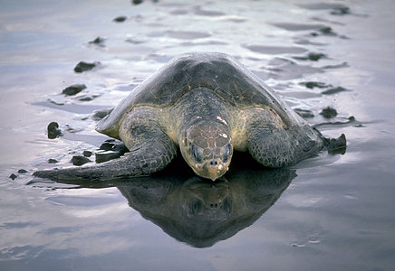
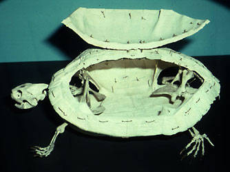

# [[Turtle]]

#is_/same_as :: [[../../../../../../../../../../../../../../../../../../WikiData/WD~Turtle,223044|WD~Turtle,223044]] 

Turtles, tortoises and terrapins 

## #has_/text_of_/abstract 

> Turtles are reptiles of the order **Testudines**, characterized by a special shell developed mainly from their ribs. 
> 
> Modern turtles are divided into two major groups, 
> - the Pleurodira (side necked turtles) and 
> - Cryptodira (hidden necked turtles), 
> which differ in the way the head retracts. 
> 
> There are 360 living and recently extinct species of turtles, including land-dwelling tortoises and freshwater terrapins. 
> They are found on most continents, some islands and, 
> in the case of sea turtles, much of the ocean. 
> 
> Like other amniotes (reptiles, birds, and mammals) they breathe air 
> and do not lay eggs underwater, although many species live in or around water. 
>
> Turtle shells are made mostly of bone; the upper part is the domed carapace, while the underside is the flatter plastron or belly-plate. 
> Its outer surface is covered in scales made of keratin, the material of hair, horns, and claws. The carapace bones develop from ribs that grow sideways and develop into broad flat plates that join up to cover the body. Turtles are ectotherms or "cold-blooded", meaning that their internal temperature varies with their direct environment. They are generally opportunistic omnivores and mainly feed on plants and animals with limited movements. Many turtles migrate short distances seasonally. Sea turtles are the only reptiles that migrate long distances to lay their eggs on a favored beach.
>
> Turtles have appeared in myths and folktales around the world. Some terrestrial and freshwater species are widely kept as pets. Turtles have been hunted for their meat, for use in traditional medicine, and for their shells. Sea turtles are often killed accidentally as bycatch in fishing nets. Turtle habitats around the world are being destroyed. As a result of these pressures, many species are extinct or threatened with extinction.
>
> [Wikipedia](https://en.wikipedia.org/wiki/Turtle) 

### Information on the Internet

-   The UC Museum of Paleontology also has phylogenetic information
    concerning
    [Testudines](http://www.ucmp.berkeley.edu/anapsids/testudines/testudines.html),
    as well as a listing of other Internet sites- [Internet Turtle     Resources](http://www.ucmp.berkeley.edu/anapsids/testudines/turtlinks.html).
-   [Order     Testudines](http://animaldiversity.ummz.umich.edu/chordata/reptilia/testudines.html).
    The University of Michigan Museum of Zoology Animal Diversity Web.
-   [Phylogeny of Turtles](http://research.amnh.org/users/esg/).
    Eugene S. Gaffney.
-   [Chelonian Research Foundation](http://www.chelonian.org/) publishes
    the [Turtle and Tortoise Newsletter](http://www.chelonian.org/ttn/).
-   [Turtles of the World](http://bufo.geo.orst.edu/turtle/). A
    prototype for a global database of turtle and tortoise distribution.
-   [Crocodilian, Tuatara and Turtle Species of the     World](http://www.flmnh.ufl.edu/natsci/herpetology/turtcroclist/).
    An online taxonomic and geographic reference.
-   [Turtle Photographic     Collection](http://aerg.canberra.edu.au/pub/aerg/herps/turtles.htm)

## Introduction

[Peter A. Meylan](http://www.tolweb.org/)

Several different scientific names are used for turtles including
Chelonia, Chelonii, Testudines, and Testudinata. The earliest fossils
are from the beginning of the age of dinosaurs, in the late Triassic.
The Testudines reached its greatest diversity by the end of the
Cretaceous. Today only 260 species representing 13 families survive.
Although turtles are abundant in the tropics, they also are quite
diverse in temperate regions and have been recorded in Arctic waters.

Records from Olduvai Gorge indicate that men have eaten turtles for at
least 2 million years. We have had a severe impact on turtles, causing
the extinction of many forms, especially land tortoises. Today the
problem is quite serious with many land tortoises, sea turtles and
aquatic forms facing extinction. Loss and degradation of habitat and
continued killing of reproductive females on the nesting beach and
removal of their eggs are the biggest problems. The future of many of
these survivors from the age of dinosaurs will depend on a conscious
effort on our part.

Turtles (including tortoises and terrapins) are characterized by a shell
that completely encloses both of the limb girdles. The shell is composed
of a dorsal carapace of dermal bone that incorporates endochondral
contributions from the vertebrae and ribs and a ventral plastron of
clavicles and interclavicles anteriorly and abdominal ribs posteriorly.
No turtles have teeth on their jaws, and all have the external ear
supported by a large, semicircular quadrate.

Figure 1- The turtle shell makes all members of this group immediately
identifiable. This specimen has been prepared to show that the shoulder
girdle and pelvis are enclosed within the shell, a feature that is
unique to turtles. Photograph copyright © E. S. Gaffney.
### Characteristics

The monophyly of turtles has never been questioned. The following
characters are synamorphies for the group:

-   All turtles have a bony shell consisting of a carapace formed from
    costal bones with fused ribs, neural bones with fused thoracic
    vertebrae, and peripheral bones; a plastron formed from
    interclavicle, clavicle, and three to five additional pairs of
    dermal bones sutured together. The carapace and plastron articulate
    at the lateral margin, enclosing the shoulder girdle and pelvic
    girdle. It is incorporation of the ribs into the carapace that
    results in the girdles being enclosed by ribs (see Ruckes, 1929),
    for developmental studies. It is the incorporation of the ribs into
    the carapace that results in the girdles being enclosed by ribs (see
    Ruckes, 1929 for developmental studies.
-   In all turtles the quadrate is concave posteriorly and exposed
    laterally on the cheek. The squamosal is limited to the dorsal half
    of the cheek, and the quadratojugal and quadrate are relatively
    large. This is in contrast to the primitive amniote condition in
    which the quadrate is small and entirely covered laterally by a
    large squamosal.
-   Postparietals are absent so that the post-temporal fenestra is
    bordered only by parietals and supratemporal in the most primitve
    turtle Proganochelys (Gaffney 1990).
-   The maxilla, premaxilla, and dentary are without teeth but rather
    covered by a horny triturating surface.
-   The stapes is solid and rod-like, without a foramen or process as
    seen in captorhinids and generalized amniotes (Gaffney 1979).
-   The postfrontal is absent, resulting in broad contact between
    prefrontal and postorbital, and between the frontal and postorbital
    (Gaffney 1990).

Proganochelys is the most primitive turtle (for an illustration see the
[Amniotes](../../../../../Amniota.md) page). Essentially, all other
turtles are placed in the Casichelydia.

#### Casichelydia

Much of the early evolution of turtles involved a reduction in the
number of bones of the skull.

-   The generalized amniote condition of a lacrimal bone and lacrimal
    duct is present in Proganochelys (Gaffney, 1990), but absent in all
    other turtles.
-   More than one vomer (usually a pair) seems to be primitive for all
    amniotes (Romer, 1956). Proganochelys (Gaffney, 1990) has two, while
    all other turtles have one.
-   The supratemporal bone present in the primitive tetrapods, primitive
    amniotes, and Proganochelys (Gaffney,1990) is also absent in all
    other turtles.

In addition to the reduction in the number of elements there is also a
closing up of the skull which results in a more solid structure.

-   The moveable articulation between the neurocranium and the
    palatoquadrate elements found in more generalized amniotes
    (Romer, 1956) is retained in Proganochelys but these units are
    tightly sutured in all other turtles (Gaffney, 1979).
-   Generalized amniotes, such as captorhinids (Heaton, 1979; Gaffney,
    1990), have a middle ear region that is open at least laterally and
    ventrally. Proganochelys also has an open ear region, but in all
    other turtles there is a variably developed flange of the quadrate
    that forms at least a partial lateral wall to the middle ear region.
-   Proganochelys agrees with the primitive amniote condition in having
    an opisthotic paroccipital process that is only loosely sutured to
    the more anterior elements (Gaffney, 1990). In the advanced
    condition, found in all other turtles, this process is tightly fused
    along its anterior margin to the quadrate and squamosal (Gaffney,
    1979, 1990).

#### Cryptodira

Most of the diversity of living turtles (10 of 13 families) belong to
this group of turtles. All living members can pull their neck inside the
shell between the shoulder girdles, hence the name Cryptodira, which
means \"hidden neck\".

-   All living cryptodires have the main adductor tendon for the lower
    jaws directed over a process on the otic chamber formed by the
    prootic and quadrate (Schumacher, 1973; Gaffney, 1975, 1979), the
    processus trochlearis octicum. Although the tendon itself is never
    fossilized, the thickened bone on the anterodorsal surface of the
    prootic, quadrate, and sometimes the parietal, is preserved in
    fossil skulls. Proganochelys lacks an otic process and this
    thickening is absent in all other amniotes (Gaffney, 1990), and this
    is interpreted as the primitive chelonian condition. Pleurodires
    have no indication of thickening or of an otic trochlea, rather they
    have the condition seen in Proganochelys (Gaffney, 1990). Although
    thickened bone in the prootic and the quadrate per se is a
    relatively simple feature, the entire system that redirects muscle
    action is complex. It includes a cartilaginous covering of the
    process, and a true synovial capsule making up the articular region
    (all described in Gaffney, 1975, 1979).
-   All cryptodirans have a vertical flange on the external process of
    the pterygoid. Proganochelys has a small pterygoid flange (in
    turtles termed the processus pterygoidus externus) that has a rolled
    edge rather than a swollen one (Gaffney 1990). Cryptodires have a
    vertical plate, oriented anteroposteriorly that bears the cartilage
    and mundplatte laterally. No other turtles or generalized amniotes
    have this vertical plate on the processus pterygoidus externus,
    which is, therefore, interpreted as a crytpodire synapomorphy. In
    pleurodires, the processus pterygoidus externus is laterally
    directed and is covered by a curved anterolateral facing plate.
-   In cryptodires there is always contact between the prefrontal and
    vomer. In Proganochelys the ventral process of the prefrontal is
    extensive but does not reach the vomer (Gaffney 1990). In
    pleurodires, the prefrontal also does not reach the vomer.

#### Selmacryptodira

The Selmacryptodira includes all crytpodires other than Kayentchelys
aprix from the Jurassic of Arizona.

-   Within the cryptodires only Kayentachelys lacks a posteromedial
    process of the pterygoid that prevents ventral exposure of the
    prootic and forms the floor of the middle ear. Before the discovery
    of Kayentachelys (Gaffney et al., 1987), Gaffney (1975) considered
    this feature a cryptodiran synamorphy. Now it is interpreted as a
    synamorphy of the Selmacryptodira (Gaffney and Meylan, 1988), the
    group consisting of all cryptodires except Kayentachelys. This
    feature does not occur outside of turtles. In pleurodires the
    prootic is ventrally exposed.
-   Among amniotes, the presence of palatal teeth is widespread.
    Proganochelys has palatal teeth and this is interpreted as the
    primitive condition. All pleurodires lack palatal teeth and all
    cryptodires, except Kayentachelys, also lack them. Given the strong
    evidence that Kayentachelys is a cryptodire, palatal teeth are
    apparently lost independently in pleurodires and cryptodires.

#### Paracryptodira

The Paracryptodira includes two, largely Cretaceous families that are
now extinct, the Pleurosternidae and Baenidae. The Pleurosternidae is
known from North America, Europe, and possibly Asia. The Baenidae is
only known from North America. The Paracryptodira includes those
cryptodires with a more advanced pattern of blood flow to the head and a
simplified plastron.

-   In all known members the canalis caroticus internus (internal
    carotid canal) is partially formed by the pterygoid. In generalized
    amniotes, the foramen by which the internal carotid artery enters
    the skull is formed entirely within the basisphenoid. This is also
    the case in Proganochelys and Kayentachelys (for Pleurodire
    condition see below) (Gaffney, 1990). In all other cryptodires, an
    extension of the pterygoid posteriorly and medially forms at least
    the lateral wall. In pleurosternids and baenids, both the pterygoid
    and the basisphenoid form the actual entry foramen of the carotid
    (supporting monophyly of the Paracryptodira), while in other
    cryptodires the canals are buried within the pterygoid (Gaffney,
    1979; Gaffney and Meylan, 1988).

#### Eucryptodira

-   In all members of this group the canalis caroticus is entirely
    formed by the pterygoid.
-   All Eucryptodires also lack a mesoplastra. The complete absence of
    mesoplastra also characterizes the pleurodiran family Chelidae. The
    presence of mesoplastra in Proganochelys and most Pleurodires is
    interpreted as the primitive condition and their absence is derived.

#### Centrocryptodira

The Centrocryptodira includes those cryptodires with a more advanced
condition of the cervical vertebrae.

-   The Centrocryptodira get their name from the presence of formed
    (concave or convex) articulations between succeeding cervical
    vertebrae. In plesiochelyids the cervical centra are amphicoelus and
    this is interpreted as the primitive chelonian condition
    (Gaffney,1990). If the baenid cladogram of Gaffney (1972) and
    Gaffney and Meylan (1988) is accepted, then the primitive baenids
    are amphicoelous and advanced ones have formed centra. Formed centra
    appear independently within a number of other amniote groups, and
    the widely divergent central articulation pattern in turtle necks
    (Williams, 1950) is also evidence of homoplasy. In the phylogenetic
    arrangement used here they would have to appear independently within
    Pleurodira, Centrocryptodira, and Baenidae.
-   A thick floor of the canalis caroticus internus in the pterygoid is
    also a feature of this group. Within those turtles in which the
    pterygoid forms the canalis caroticus internus, the plesiochelyids
    have a thin floor, here interpreted as the primitive condition. In
    some specimens of Plesiochelys (Gaffney, 1976), the seam or suture
    closing the canalis is still present. The thick condition lacks
    indication of a suture and is seen in all other eucryptodires.
    Presumably the thick, seamless condition is more advanced because
    during development the canalis floor is thin at first and shows the
    enclosing of the carotid (Kunkel, 1912).

### Fossil Forms

The major groups of turtles already were in existence by the late
Triassic, about 210 million years ago. Thus, the origin of turtles must
have occurred before this time. The Permian reptile Eunotosaurus in the
past was proposed as the ancestor to turtles. This idea has been based
on the shell-like structure covering its body which was made up of
broadly expanded ribs. However, it has been pointed out recently that
the shell of turtles is made up of narrow ribs covered by dermal bone,
not broadly expanded ribs. The make-up of the shell and the presence of
an ectopterygoid bone in the skull suggest that this genus is not close
to the origin of turtles.

Another potential candidate for the closest relatives of turtles
identified during the 1970\'s (Gaffney & Meylan 1988, Gauthier et al.
1988) is the \"cotylosaur\" family, Captorhinidae. Like all turtles,
members of this group lack the ectopterygoid and temporal bones and have
a large medial process of the jugal. These lizard-like anapsids show no
sign of a shell, and there are still no fossils that show a partly
developed turtle shell. However, \"parareptile\" groups including
procolophonids (Laurin & Reisz 1995) and pareiasaurs (Lee 1997) have
subsequently been argued to be closer to the origin of turtles than
captorhinids. More recently, an old idea, that the origin of turtles
actually lies among the diapsids, has received new support from some
morphologists (deBraga & Rieppel 1997). Molecular biologists have also
provided data that suggest that turtles are diapsids and now consider
that the main question is where among the diapsids turtles have their
origin (Hedges & Poling 1999, Cao et al. 2000). Go to the [Discussion of Phylogenetic Relationships on the Amniota page](http://www.tolweb.org/Amniota/14990#DiscussionofPhylogeneticRelationships)
for more information.

There are many interesting and important turtles that are only known as
fossils. The most important of these is the most primitive turtle,
Proganochelys. This turtle shows primitive features absent from modern
turtles that make it useful as a benchmark for turtle evolution. Equally
as old as Proganochelys is the oldest known sideneck, Proterochersis. It
has several of the same features of other sidenecks such as the pelvis
fused into the shell. Its presence in the late Triassic indicates that
the Pleurodire-Cryptodire dichotomy (see phylogeny and classification
below) had taken place by this time. The earliest known cryptodire is
Kayentachelys from the middle Jurassic of North America. By the late
Jurassic marine cryptodires were common in many areas of Europe and
Asia. Many of these belong to the extinct family Plesiochelyidae. Two
closely related families, the Pleurosternidae and Baenidae, were
important groups at the close of the Cretaceous, but both were extinct
soon after.

### Discussion of Phylogenetic Relationships

Gaffney (1984) provides a complete historical overview of theories of
interrelationships among different groups of turtles, from Linnaeus\`
concept of the single genus Testudo to the more recent views of the last
several decades. The starting point for modern discussions of turtle
phylogeny is Williams (1950). Although the emphasis of Williams\` work
was an analysis of variation in the structure of the cervical vertebrae,
he provided a complete classification of fossil and living turtles.
Since the mid 1970\'s, Gaffney and coworkers (Gaffney, 1975, 1984, 1996;
Gaffney and Meylan, 1988; Gaffney et al., 1991) have challenged much of
the phylogenetic arrangement of the major groups proposed by Williams
using an extensive morphological data set. Because it is the most
complete analysis to date, we follow their arrangement for the turtle
pages of the Tree of Life. In addition to the morphological studies, a
few papers have examined higher relationships of turtles using
nonmorphological data: Chen et al. (1980) used an immunological distance
approach, and Bickham and Carr (1983) analyzed variation in chromosome
number and morphology among the families of the Cryptodira.

Shaffer, Meylan, and McKnight (1997) published the first study using
genetic sequence data to determine the higher relationships among
turtles. They studied two genes in 23 living genera of turtles and
combined their findings with a new morphological data set. This study
supports much of the phylogenetic hypothesis of Gaffney and coworkers.
The major differences are in the relationships among the living families
of cryptodires (Polycryptodira) and among members of the Chelidae
(Pleurodira). See the [molecular phylogeny](http://www.tolweb.org/accessory/Turtle_Molecular_Phylogeny?acc_id=583)
page for more details.

The morphological evidence of Gaffney and coworkers (especially Gaffney
and Meylan, 1988; Gaffney et al., 1991) supports the long-held view that
two major living groups (often recognized as suborders), the Pleurodira
and Cryptodira, are each monophyletic (see Gaffney (1984) for history).
Genetic sequence data (Shaffer et al., 1997) strongly supports this
dichotomy.

Within the Cryptodira the Jurassic turtle, Kayentachelys aprix, is
considered to be the sister group of all other crytodires (Gaffney et al
1989). The Pleurosternidae (Pleurosternon, Glyptops, Mesochelys) is a
group of Cretaceous cryptodires that is most likely the sister group of
the Baenidae (Gaffney, 1975, 1996). The Baenidae is a distinctive family
of Cretaceous to Eocene North American turtles in which the dorsal
lappet of the prefrontal is small or absent. The Pleurosternidae and
Baenidae form the Paracryptodira which is the sister group of advanced
cryptodires. The latter group has been given the name Eucryptodira,
which means true cryptodires. All of the \"true\" cryptodires have the
carotid artery hidden within the pterygoid bone.

The Plesiochelyidae is an extinct late Jurassic to early Cretaceous
radiation of marine turtles. This is a separate marine radiation from
the one to which living sea turtles belong. It constitutes the sister
group of all eucryptodires that have formed (not amphicoelus) cervical
vertebrae, a group called the Centrocryptodira.

The sister group of all other centrocryptodires is the Meiolaniidae.
This is an extinct family (Cretaceous- Pleistocene) of horned turtles
found only in South America, and Australia and adjacent islands.

### Ecology

All turtles lay eggs. Most bury their eggs in soil, sand or rotting
vegetation, but some lay them on the ground in the open. Turtles do not
incubate their eggs or attend them in any way, nor do they exhibit any
care of the young. The eggs are incubated by environmental heat. The
young break free of the egg using an egg tooth or caruncle after some 45
to 90 days of development and fend for themselves from hatching. The
primitive condition for turtles appears to be to lay large clutches of
round eggs. Snapping turtles, sea turtles, and soft-shells lay dozens to
hundreds of round eggs in a single clutch. Certain side-necks, mud and
musk turtles, land tortoises and many pond turtles lay fewer eggs per
clutch, sometimes only one or two, and many of these turtles lay oblong
rather than round eggs. Many turtles are capable of producing more than
one clutch of eggs per year, and sea turtles have been known to produce
as many as ten clutches in a single year. It has been determined
recently that the sex of most species of turtle is determined by
environmental factors, that is to say, sex is not determined genetically
but rather by such factors as the temperature of incubation.

Turtles are herbivorous, carnivorous and omnivorous. The majority of
turtles are omnivorous, but many have highly specialized diets. Certain
land tortoises and sea turtles are strict herbivores, and one marine
species has the capacity to digest cellulose. Other marine species are
specialists on jellyfish (the leatherback) and sponges (the hawksbill).
Turtles of several families specialize on mollusks and have broadly
expanded jaws for crushing their prey. Others that specialize on
swimming prey have developed a vacuum cleaner approach to feeding
(snappers, softshells, and some side-necks), using a strong hyoid
apparatus to suck prey into their mouths.

### Physiology

Turtles belong to the reptilian grade of physiological organization.
They are ectothermic and have relatively low metabolic rates. Being
ectotherms, their body temperature remains close to the temperature of
their environment, and they are entirely reliant on external sources of
heat. Many turtles bask in the sun to raise their body temperature to a
point where bodily functions can operate optimally. One species, the
leatherback, can maintain a body temperature above that of its
environment, but how this is achieved is yet to be determined. Most
turtles cannot be active during very hot or very cold periods.
Therefore, hibernation in winter and aestivation in summer is common for
members of this group.

Turtles breathe with lungs located inside of a rigid ribcage. They
therefore must use a different mechanism for breathing than most
vertebrates. Muscles in the region of the leg pockets act to inflate the
lungs, muscles on the surface of the lungs dorsally and ventrally
deflate them. Many turtles augment gas exchange at the lungs with gas
exchange in the throat or in the cloaca.

In addition to providing protection for the turtle, the shell of at
least some species has an important physiological function. It acts as a
\"calcium bank\". Calcium and other cations are taken from the carapace
and plastron to buffer the blood during hibernation when metabolic acids
are likely to build up. In other species, it appears that in
reproductively active females, calcium is removed from the shell and
incorporated into eggshells forming around follicles in the oviducts.

## Phylogeny 

-   « Ancestral Groups  
    -  [Amniota](../../../../../Amniota.md))
    -   [Terrestrial Vertebrates](../../Terrestrial.md)
    -  [Sarcopterygii](../../../../../../../Sarc.md))
    -  [Gnathostomata](../../../../../../../../Gnath.md))
    -  [Vertebrata](../../../../../../../../../Vertebrata.md))
    -  [Craniata](../../../../../../../../../../Craniata.md))
    -  [Chordata](../../../../../../../../../../../Chordata.md))
    -  [Deuterostomia](../../../../../../../../../../../../Deutero.md))
    -   [Bilateria](../../../../../../../../../../../../../Bilateria.md)
    -   [Animals](../../../../../../../../../../../../../../Animals.md)
    -   [Eukarya](../../../../../../../../../../../../../../../Eukarya.md)
    -  [Tree of Life](../../../../../../../../../../../../../../../Tree_of_Life.md))

-   ◊ Sibling Groups of  Amniota
    -   [Synapsida](../../../../Synapsida.md)
    -   Testudines
    -   [Diapsida](../../Diapsida.md)

-   » Sub-Groups 

## Title Illustrations

------------------------------------------------------------------------------)
Scientific Name ::     Lepidochelys olivacea
Location ::           Nancite Beach, Costa Rica
Comments             Olive ridley turtle
Specimen Condition   Live Specimen
Copyright ::            © 1996 [Greg and Marybeth Dimijian](http://www.dimijianimages.com/) 

## Confidential Links & Embeds: 

### #is_/same_as :: [Testudines](/_Standards/bio/bio~Domain/Eukarya/Animal/Bilateria/Deutero/Chordata/Craniata/Vertebrata/Gnath/Sarc/Tetrapods/Amniota/Sauropsida/Reptile/Diapsida/Archosauromorpha/Testudines.md) 

### #is_/same_as :: [Testudines.public](/_public/bio/bio~Domain/Eukarya/Animal/Bilateria/Deutero/Chordata/Craniata/Vertebrata/Gnath/Sarc/Tetrapods/Amniota/Sauropsida/Reptile/Diapsida/Archosauromorpha/Testudines.public.md) 

### #is_/same_as :: [Testudines.internal](/_internal/bio/bio~Domain/Eukarya/Animal/Bilateria/Deutero/Chordata/Craniata/Vertebrata/Gnath/Sarc/Tetrapods/Amniota/Sauropsida/Reptile/Diapsida/Archosauromorpha/Testudines.internal.md) 

### #is_/same_as :: [Testudines.protect](/_protect/bio/bio~Domain/Eukarya/Animal/Bilateria/Deutero/Chordata/Craniata/Vertebrata/Gnath/Sarc/Tetrapods/Amniota/Sauropsida/Reptile/Diapsida/Archosauromorpha/Testudines.protect.md) 

### #is_/same_as :: [Testudines.private](/_private/bio/bio~Domain/Eukarya/Animal/Bilateria/Deutero/Chordata/Craniata/Vertebrata/Gnath/Sarc/Tetrapods/Amniota/Sauropsida/Reptile/Diapsida/Archosauromorpha/Testudines.private.md) 

### #is_/same_as :: [Testudines.personal](/_personal/bio/bio~Domain/Eukarya/Animal/Bilateria/Deutero/Chordata/Craniata/Vertebrata/Gnath/Sarc/Tetrapods/Amniota/Sauropsida/Reptile/Diapsida/Archosauromorpha/Testudines.personal.md) 

### #is_/same_as :: [Testudines.secret](/_secret/bio/bio~Domain/Eukarya/Animal/Bilateria/Deutero/Chordata/Craniata/Vertebrata/Gnath/Sarc/Tetrapods/Amniota/Sauropsida/Reptile/Diapsida/Archosauromorpha/Testudines.secret.md)

