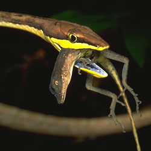

# [[Lepidosauromorpha]]

Lizards, snakes, Sphenodon, and their extinct relatives 

One squamate eating another: Vine Snake, Oxybelis brevirostris, with captured anole, Norops sp. 
La Selva Biological Station, Costa Rica. 
Photograph copyright © 2000 [Greg and Mary Beth Dimijian](http://www.dimijianimages.com/).

## #has_/text_of_/abstract 

> **Lepidosauromorpha** (in PhyloCode known as Pan-Lepidosauria) is a group of reptiles comprising all diapsids closer to lizards than to archosaurs (which include crocodiles and birds). The only living sub-group is the Lepidosauria, which contains two subdivisions, Squamata, which contains lizards and snakes, and Rhynchocephalia, the only extant species of which is the tuatara.
>
> Lepidosauromorphs are distinguishable from archosauromorphs (reptiles closer to archosaurs) by their primitive sprawling gait (allowing for the same sinusoidal trunk and tail movement seen in fish), the sliding "joint" between the coracoids and the sternum (for a longer stride), and their pleurodont dentition. In contrast, Archosauromorphs possess a parasagittal gait, a reduction in their dermal girdle, a reduction and/or loss of the sternum, and a more thecodont dentition. Living lepidosauromorphs have retained an ectothermic ("cold blooded") metabolism, unlike the ancestral condition in archosauromorphs. 
>
> While some putative stem-lepidosauromorphs like Palaeagama are known from the Late Permian, the oldest definitive lepidosauromorphs, Sophineta and Paliguana, are known from the Early Triassic. Taytalura from the early Late Triassic of Argentina is the most complete fossil of an early lepidosauromorph and is one of the few fossils robustly inferred as an early evolving lepidosauromorph. The Kuehneosauridae, a family of reptiles with elongated ribs which allowed them to glide akin to living gliding lizards have been historically typically considered early lepidosauromorphs. However, several recent studies have been found them in other positions within Sauria, including Archosauromorpha. Almost all non-lepidosaurian lepidosauromorphs became extinct by the end of the Triassic, the with the latest non lepidosaur-lepidosauromorphs being Marmoretta from the Middle Jurassic of Britain and an indeterminate form from the Middle Jurassic Moskvoretskaya Formation of Russia, which appear to be closely related to Fraxinisaura from the Middle Triassic of Germany. Other studies have recovered Marmoretta as a stem-squamate.
>
> [Wikipedia](https://en.wikipedia.org/wiki/Lepidosauromorpha) 

## Phylogeny 

-   « Ancestral Groups  
    -   [Diapsida](../Diapsida.md)
    -   [Amniota](../../../../Amniota.md)
    -   [Terrestrial Vertebrates](../../../Terrestrial.md)
    -   [Sarcopterygii](../../../../../../Sarc.md)
    -   [Gnathostomata](../../../../../../../Gnath.md)
    -   [Vertebrata](../../../../../../../../Vertebrata.md)
    -   [Craniata](../../../../../../../../../Craniata.md)
    -   [Chordata](../../../../../../../../../../Chordata.md)
    -   [Deuterostomia](../../../../../../../../../../../Deutero.md)
    -   [Bilateria](../../../../../../../../../../../../Bilateria.md)
    -   [Animals](../../../../../../../../../../../../../Animals.md)
    -   [Eukarya](../../../../../../../../../../../../../../Eukarya.md)
    -   [Tree of Life](../../../../../../../../../../../../../../Tree_of_Life.md)

-   ◊ Sibling Groups of  Diapsida
    -   [Archosauromorpha](Archosauromorpha.md)
    -   Lepidosauromorpha

-   » Sub-Groups
    -   [Squamata](Lepidosauromorpha/Squamata.md)

## Confidential Links & Embeds: 

### #is_/same_as :: [Lepidosauromorpha](Lepidosauromorpha.md) 

### #is_/same_as :: [Lepidosauromorpha.public](/_public/bio/bio~Domain/Eukarya/Animal/Bilateria/Deutero/Chordata/Craniata/Vertebrata/Gnath/Sarc/Tetrapods/Amniota/Diapsida/Lepidosauromorpha.public.md) 

### #is_/same_as :: [Lepidosauromorpha.internal](/_internal/bio/bio~Domain/Eukarya/Animal/Bilateria/Deutero/Chordata/Craniata/Vertebrata/Gnath/Sarc/Tetrapods/Amniota/Diapsida/Lepidosauromorpha.internal.md) 

### #is_/same_as :: [Lepidosauromorpha.protect](/_protect/bio/bio~Domain/Eukarya/Animal/Bilateria/Deutero/Chordata/Craniata/Vertebrata/Gnath/Sarc/Tetrapods/Amniota/Diapsida/Lepidosauromorpha.protect.md) 

### #is_/same_as :: [Lepidosauromorpha.private](/_private/bio/bio~Domain/Eukarya/Animal/Bilateria/Deutero/Chordata/Craniata/Vertebrata/Gnath/Sarc/Tetrapods/Amniota/Diapsida/Lepidosauromorpha.private.md) 

### #is_/same_as :: [Lepidosauromorpha.personal](/_personal/bio/bio~Domain/Eukarya/Animal/Bilateria/Deutero/Chordata/Craniata/Vertebrata/Gnath/Sarc/Tetrapods/Amniota/Diapsida/Lepidosauromorpha.personal.md) 

### #is_/same_as :: [Lepidosauromorpha.secret](/_secret/bio/bio~Domain/Eukarya/Animal/Bilateria/Deutero/Chordata/Craniata/Vertebrata/Gnath/Sarc/Tetrapods/Amniota/Diapsida/Lepidosauromorpha.secret.md)

