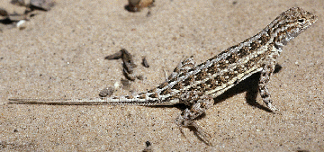

# [[Squamata]]

Lizards and snakes 

[Kevin de Queiroz and Emilia P. Martins](http://www.tolweb.org/)

## #has_/text_of_/abstract 

> **Squamata** (, Latin squamatus, 'scaly, having scales') is the largest order of reptiles; most members of which are commonly known as lizards, with the group also including snakes. With over 11,991 species, it is also the second-largest order of extant (living) vertebrates, after the perciform fish. Squamates are distinguished by their skins, which bear horny scales or shields, and must periodically engage in molting. They also possess movable quadrate bones, making possible movement of the upper jaw relative to the neurocranium. This is particularly visible in snakes, which are able to open their mouths very widely to accommodate comparatively large prey. Squamates are the most variably sized living reptiles, ranging from the 16 mm (0.63 in) dwarf gecko (Sphaerodactylus ariasae) to the 6.5 m (21 ft) reticulated python (Malayopython reticulatus). The now-extinct mosasaurs reached lengths over 14 m (46 ft).
>
> Among other reptiles, squamates are most closely related to the tuatara, the last surviving member of the once diverse Rhynchocephalia, with both groups being placed in the clade Lepidosauria.
>
> [Wikipedia](https://en.wikipedia.org/wiki/Squamata) 

## Phylogeny 

-   « Ancestral Groups  
    -   [Lepidosauromorpha](../Lepidosauromorpha.md)
    -   [Diapsida](../../Diapsida.md)
    -  [Amniota](../../../../../Amniota.md))
    -   [Terrestrial Vertebrates](../../../../Terrestrial.md)
    -  [Sarcopterygii](../../../../../../../Sarc.md))
    -  [Gnathostomata](../../../../../../../../Gnath.md))
    -  [Vertebrata](../../../../../../../../../Vertebrata.md))
    -  [Craniata](../../../../../../../../../../Craniata.md))
    -  [Chordata](../../../../../../../../../../../Chordata.md))
    -  [Deuterostomia](../../../../../../../../../../../../Deutero.md))
    -  [Bilateria](../../../../../../../../../../../../../Bilateria.md))
    -  [Animals](../../../../../../../../../../../../../../Animals.md))
    -  [Eukarya](../../../../../../../../../../../../../../../Eukarya.md))
    -  [Tree of Life](../../../../../../../../../../../../../../../Tree_of_Life.md))

-   ◊ Sibling Groups of  Lepidosauromorpha
    -   Squamata

-   » Sub-Groups
    -   [Iguania](Squamata/Iguania.md)

### Information on the Internet

-   [Assembling the Tree of Life: Deep     Scaly](http://www.fieldmuseum.org/deepscaly/about.html). A
    large-scale, collaborative effort by eight investigators at seven
    institutions (one Australian and six U.S. institutions) to determine
    the evolutionary relationships among the major lineages of squamate
    reptiles.

## Confidential Links & Embeds: 

### #is_/same_as :: [Squamata](/_Standards/bio/bio~Domain/Eukarya/Animal/Bilateria/Deutero/Chordata/Craniata/Vertebrata/Gnath/Sarc/Tetrapods/Amniota/Sauropsida/Reptile/Diapsida/Lepidosauromorpha/Squamata.md) 

### #is_/same_as :: [Squamata.public](/_public/bio/bio~Domain/Eukarya/Animal/Bilateria/Deutero/Chordata/Craniata/Vertebrata/Gnath/Sarc/Tetrapods/Amniota/Sauropsida/Reptile/Diapsida/Lepidosauromorpha/Squamata.public.md) 

### #is_/same_as :: [Squamata.internal](/_internal/bio/bio~Domain/Eukarya/Animal/Bilateria/Deutero/Chordata/Craniata/Vertebrata/Gnath/Sarc/Tetrapods/Amniota/Sauropsida/Reptile/Diapsida/Lepidosauromorpha/Squamata.internal.md) 

### #is_/same_as :: [Squamata.protect](/_protect/bio/bio~Domain/Eukarya/Animal/Bilateria/Deutero/Chordata/Craniata/Vertebrata/Gnath/Sarc/Tetrapods/Amniota/Sauropsida/Reptile/Diapsida/Lepidosauromorpha/Squamata.protect.md) 

### #is_/same_as :: [Squamata.private](/_private/bio/bio~Domain/Eukarya/Animal/Bilateria/Deutero/Chordata/Craniata/Vertebrata/Gnath/Sarc/Tetrapods/Amniota/Sauropsida/Reptile/Diapsida/Lepidosauromorpha/Squamata.private.md) 

### #is_/same_as :: [Squamata.personal](/_personal/bio/bio~Domain/Eukarya/Animal/Bilateria/Deutero/Chordata/Craniata/Vertebrata/Gnath/Sarc/Tetrapods/Amniota/Sauropsida/Reptile/Diapsida/Lepidosauromorpha/Squamata.personal.md) 

### #is_/same_as :: [Squamata.secret](/_secret/bio/bio~Domain/Eukarya/Animal/Bilateria/Deutero/Chordata/Craniata/Vertebrata/Gnath/Sarc/Tetrapods/Amniota/Sauropsida/Reptile/Diapsida/Lepidosauromorpha/Squamata.secret.md)

