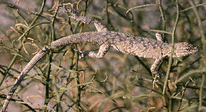

---
aliases:
- Azyagur
- Iguania
- Iguanios
- Iguanis
- Iguānveidīgie
- Leeguanoortagen
- Leguaanachtigen
- leguaanimaiset
- Leguanartige
- leguánalakúak
- Leguány
- Phân bộ Kỳ nhông
- İquanalar
- ігуаноподібні
- Игуанæхуызтæ
- Игуана ганьывлӓ
- Игуанообразни
- игуанообразные
- իգուանաներ
- דמויי איגואנה
- إغوانيات
- اغوانيات
- ایگوآناسانان
- ایگوانیا
- इगुआनोमोर्फा
- イグアナ下目
- 端生齿鬣蜥亚目
- 鬣蜥亞目
- 이구아나류
title: Iguania
has_id_wikidata: Q661136
dv_has_:
  name_:
    an: Iguania
    ar: إغوانيات
    arz: اغوانيات
    ast: Iguania
    az: İquanalar
    bg: Игуанообразни
    ca: Iguanis
    ceb: Iguania
    cs: Iguania
    de: Leguanartige
    el: Iguania
    en: Iguania
    eo: Iguania
    es: Iguania
    eu: Iguania
    ext: Iguania
    fa: ایگوآناسانان
    fi: leguaanimaiset
    fr: Iguania
    frr: Leeguanoortagen
    ga: Iguania
    gl: Iguanios
    he: דמויי איגואנה
    hi: इगुआनोमोर्फा
    hu: leguánalakúak
    hy: իգուանաներ
    ia: Iguania
    id: Iguania
    ie: Iguania
    io: Iguania
    it: Iguania
    ja: イグアナ下目
    kab: Azyagur
    ko: 이구아나류
    la: Iguania
    lv: Iguānveidīgie
    mrj: Игуана ганьывлӓ
    mul: Iguania
    nb: Iguania
    nl: Leguaanachtigen
    oc: Iguania
    os: Игуанæхуызтæ
    pl: Iguania
    pnb: ایگوانیا
    pt: Iguania
    pt_br: Iguania
    ro: Iguania
    ru: игуанообразные
    sk: Leguány
    sl: Iguania
    sq: Iguania
    sr: Iguania
    sv: Iguania
    tr: Iguania
    uk: ігуаноподібні
    vi: Phân bộ Kỳ nhông
    vo: Iguania
    war: Iguania
    zh: 端生齿鬣蜥亚目
    zh_cn: 端生齿鬣蜥亚目
    zh_hans: 端生齿鬣蜥亚目
    zh_tw: 鬣蜥亞目
---

# [[Iguania]] 

[Kevin de Queiroz and Emilia P. Martins](http://www.tolweb.org/) 

## #has_/text_of_/abstract 

> **Iguania** is an infraorder of squamate reptiles that includes iguanas, chameleons, agamids, and New World lizards like anoles and phrynosomatids. Using morphological features as a guide to evolutionary relationships, the Iguania are believed to form the sister group to the remainder of the Squamata, which comprise nearly 11,000 named species, roughly 2000 of which are iguanians. However, molecular information has placed Iguania well within the Squamata as sister taxa to the Anguimorpha and closely related to snakes. The order has been under debate and revisions after being classified by Charles Lewis Camp in 1923 due to difficulties finding adequate synapomorphic morphological characteristics. Most iguanians are arboreal but there are several terrestrial groups. They usually have primitive fleshy, non-prehensile tongues, although the tongue is highly modified in chameleons. Today they are scattered occurring in Madagascar, the Fiji and Friendly Islands and Western Hemisphere.
>
> [Wikipedia](https://en.wikipedia.org/wiki/Iguanomorpha) 

## Phylogeny 

-   « Ancestral Groups  
    -   [Squamata](../Squamata.md)
    -   [Lepidosauromorpha](../../Lepidosauromorpha.md)
    -   [Diapsida](../../../Diapsida.md)
    -  [Amniota](../../../../../../Amniota.md) 
    -   [Terrestrial Vertebrates](../../../../../Terrestrial.md)
    -  [Sarcopterygii](../../../../../../../../Sarc.md) 
    -  [Gnathostomata](../../../../../../../../../Gnath.md) 
    -  [Vertebrata](../../../../../../../../../../Vertebrata.md) 
    -  [Craniata](../../../../../../../../../../../Craniata.md) 
    -  [Chordata](../../../../../../../../../../../../Chordata.md) 
    -  [Deuterostomia](../../../../../../../../../../../../../Deutero.md) 
    -  [Bilateria](../../../../../../../../../../../../../../Bilateria.md) 
    -  [Animals](../../../../../../../../../../../../../../../Animals.md) 
    -  [Eukarya](../../../../../../../../../../../../../../../../Eukarya.md) 
    -  [Tree of Life](../../../../../../../../../../../../../../../../Tree_of_Life.md) 

-   ◊ Sibling Groups of  Squamata
    -   Iguania

-   » Sub-Groups
    -   [Phrynosomatidae](Iguania/Phrynosomatidae.md)

## Confidential Links & Embeds: 

### #is_/same_as :: [[/_Standards/bio/bio~Domain/Eukarya/Animal/Bilateria/Deutero/Chordata/Craniata/Vertebrata/Gnath/Sarc/Tetrapods/Amniota/Sauropsida/Reptile/Diapsida/Lepidosauromorpha/Squamata/Iguania|Iguania]] 

### #is_/same_as :: [[/_public/bio/bio~Domain/Eukarya/Animal/Bilateria/Deutero/Chordata/Craniata/Vertebrata/Gnath/Sarc/Tetrapods/Amniota/Sauropsida/Reptile/Diapsida/Lepidosauromorpha/Squamata/Iguania.public|Iguania.public]] 

### #is_/same_as :: [[/_internal/bio/bio~Domain/Eukarya/Animal/Bilateria/Deutero/Chordata/Craniata/Vertebrata/Gnath/Sarc/Tetrapods/Amniota/Sauropsida/Reptile/Diapsida/Lepidosauromorpha/Squamata/Iguania.internal|Iguania.internal]] 

### #is_/same_as :: [[/_protect/bio/bio~Domain/Eukarya/Animal/Bilateria/Deutero/Chordata/Craniata/Vertebrata/Gnath/Sarc/Tetrapods/Amniota/Sauropsida/Reptile/Diapsida/Lepidosauromorpha/Squamata/Iguania.protect|Iguania.protect]] 

### #is_/same_as :: [[/_private/bio/bio~Domain/Eukarya/Animal/Bilateria/Deutero/Chordata/Craniata/Vertebrata/Gnath/Sarc/Tetrapods/Amniota/Sauropsida/Reptile/Diapsida/Lepidosauromorpha/Squamata/Iguania.private|Iguania.private]] 

### #is_/same_as :: [[/_personal/bio/bio~Domain/Eukarya/Animal/Bilateria/Deutero/Chordata/Craniata/Vertebrata/Gnath/Sarc/Tetrapods/Amniota/Sauropsida/Reptile/Diapsida/Lepidosauromorpha/Squamata/Iguania.personal|Iguania.personal]] 

### #is_/same_as :: [[/_secret/bio/bio~Domain/Eukarya/Animal/Bilateria/Deutero/Chordata/Craniata/Vertebrata/Gnath/Sarc/Tetrapods/Amniota/Sauropsida/Reptile/Diapsida/Lepidosauromorpha/Squamata/Iguania.secret|Iguania.secret]] 

