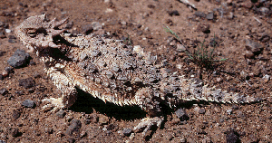

---
aliases:
- békagyíkfélék
- Frinosomàtid
- Frynosomowate
- Naʼashǫ́ʼii dichʼízhii dóó bikʼéí
- Phrynosomatidae
- Qurbağayabənzər kərtənkələlər
- Stekelleguanen
- Xincoyōtl
- Πρυνοσωματίδες
- Фринозома йишвлӓ
- Фринозомові
- לטאות מקרינות
- سحالى ذات القرون
- سحالي ذات القرون
- شاخیمارمولکان
- کنڈیلے ایگوانے
- फ्रायनोसोमाटिडाए
- ツノトカゲ科
- 角蜥科
- 뿔도마뱀과
title: Phrynosomatidae
has_id_wikidata: Q852822
dv_has_:
  name_:
    an: Phrynosomatidae
    ar: سحالي ذات القرون
    arz: سحالى ذات القرون
    ast: Phrynosomatidae
    az: Qurbağayabənzər kərtənkələlər
    bg: Phrynosomatidae
    ca: Frinosomàtid
    ceb: Phrynosomatidae
    de: Phrynosomatidae
    el: Πρυνοσωματίδες
    en: Phrynosomatidae
    eo: Phrynosomatidae
    es: Phrynosomatidae
    eu: Phrynosomatidae
    ext: Phrynosomatidae
    fa: شاخیمارمولکان
    fi: Phrynosomatidae
    fr: Phrynosomatidae
    ga: Phrynosomatidae
    gl: Phrynosomatidae
    he: לטאות מקרינות
    hi: फ्रायनोसोमाटिडाए
    hu: békagyíkfélék
    ia: Phrynosomatidae
    id: Phrynosomatidae
    ie: Phrynosomatidae
    io: Phrynosomatidae
    it: Phrynosomatidae
    ja: ツノトカゲ科
    ko: 뿔도마뱀과
    la: Phrynosomatidae
    mrj: Фринозома йишвлӓ
    mul: Phrynosomatidae
    nah: Xincoyōtl
    nb: Phrynosomatidae
    nl: Stekelleguanen
    nv: Naʼashǫ́ʼii dichʼízhii dóó bikʼéí
    oc: Phrynosomatidae
    pl: Frynosomowate
    pnb: کنڈیلے ایگوانے
    pt: Phrynosomatidae
    pt_br: Phrynosomatidae
    ro: Phrynosomatidae
    ru: Phrynosomatidae
    sq: Phrynosomatidae
    sr: Phrynosomatidae
    sv: Phrynosomatidae
    tr: Phrynosomatidae
    uk: Фринозомові
    vi: Phrynosomatidae
    vo: Phrynosomatidae
    war: Phrynosomatidae
    zh: 角蜥科
    zh_cn: 角蜥科
    zh_hans: 角蜥科
---
# [[Phrynosomatidae]] 

 

## #has_/text_of_/abstract 

> The **Phrynosomatidae** are a diverse family of lizards, sometimes classified as a subfamily (Phrynosomatinae), found from Panama to the extreme south of Canada. Many members of the group are adapted to life in hot, sandy deserts, although the spiny lizards prefer rocky deserts or even relatively moist forest edges, and the short-horned lizard lives in prairie or sagebrush environments. The group includes both oviparous (egg-laying) and viviparous species, with the latter being more common in species living at high elevations. Oviparous and viviparous species of Phrynosomatidae lizards co-localize in certain areas of the United States, including New Mexico.
>
> The earliest fossil remains of this group are known from the Late Cretaceous of Mongolia and belong to the genus Desertiguana. As phrynosomatids are only known from North America, these remains indicate that phrynosomatids likely had a wider distribution in prehistoric times.
>
> [Wikipedia](https://en.wikipedia.org/wiki/Phrynosomatidae) 

## Phylogeny 

-   « Ancestral Groups  
    -   [Iguania](../Iguania.md)
    -   [Squamata](../../Squamata.md)
    -   [Lepidosauromorpha](../../../Lepidosauromorpha.md)
    -   [Diapsida](../../../../Diapsida.md)
    -  [Amniota](../../../../../../../Amniota.md) 
    -   [Terrestrial Vertebrates](../../../../../../Terrestrial.md)
    -  [Sarcopterygii](../../../../../../../../../Sarc.md) 
    -  [Gnathostomata](../../../../../../../../../../Gnath.md) 
    -  [Vertebrata](../../../../../../../../../../../Vertebrata.md) 
    -  [Craniata](../../../../../../../../../../../../Craniata.md) 
    -  [Chordata](../../../../../../../../../../../../../Chordata.md) 
    -  [Deuterostomia](../../../../../../../../../../../../../../Deutero.md) 
    -  [Bilateria](../../../../../../../../../../../../../../../Bilateria.md) 
    -  [Animals](../../../../../../../../../../../../../../../../Animals.md) 
    -  [Eukarya](../../../../../../../../../../../../../../../../../Eukarya.md) 
    -  [Tree of Life](../../../../../../../../../../../../../../../../../Tree_of_Life.md) 

-   ◊ Sibling Groups of  Iguania
    -   Phrynosomatidae

-   » Sub-Groups 

## Confidential Links & Embeds: 

### #is_/same_as :: [[/_Standards/bio/bio~Domain/Eukarya/Animal/Bilateria/Deutero/Chordata/Craniata/Vertebrata/Gnath/Sarc/Tetrapods/Amniota/Sauropsida/Reptile/Diapsida/Lepidosauromorpha/Squamata/Iguania/Phrynosomatidae|Phrynosomatidae]] 

### #is_/same_as :: [[/_public/bio/bio~Domain/Eukarya/Animal/Bilateria/Deutero/Chordata/Craniata/Vertebrata/Gnath/Sarc/Tetrapods/Amniota/Sauropsida/Reptile/Diapsida/Lepidosauromorpha/Squamata/Iguania/Phrynosomatidae.public|Phrynosomatidae.public]] 

### #is_/same_as :: [[/_internal/bio/bio~Domain/Eukarya/Animal/Bilateria/Deutero/Chordata/Craniata/Vertebrata/Gnath/Sarc/Tetrapods/Amniota/Sauropsida/Reptile/Diapsida/Lepidosauromorpha/Squamata/Iguania/Phrynosomatidae.internal|Phrynosomatidae.internal]] 

### #is_/same_as :: [[/_protect/bio/bio~Domain/Eukarya/Animal/Bilateria/Deutero/Chordata/Craniata/Vertebrata/Gnath/Sarc/Tetrapods/Amniota/Sauropsida/Reptile/Diapsida/Lepidosauromorpha/Squamata/Iguania/Phrynosomatidae.protect|Phrynosomatidae.protect]] 

### #is_/same_as :: [[/_private/bio/bio~Domain/Eukarya/Animal/Bilateria/Deutero/Chordata/Craniata/Vertebrata/Gnath/Sarc/Tetrapods/Amniota/Sauropsida/Reptile/Diapsida/Lepidosauromorpha/Squamata/Iguania/Phrynosomatidae.private|Phrynosomatidae.private]] 

### #is_/same_as :: [[/_personal/bio/bio~Domain/Eukarya/Animal/Bilateria/Deutero/Chordata/Craniata/Vertebrata/Gnath/Sarc/Tetrapods/Amniota/Sauropsida/Reptile/Diapsida/Lepidosauromorpha/Squamata/Iguania/Phrynosomatidae.personal|Phrynosomatidae.personal]] 

### #is_/same_as :: [[/_secret/bio/bio~Domain/Eukarya/Animal/Bilateria/Deutero/Chordata/Craniata/Vertebrata/Gnath/Sarc/Tetrapods/Amniota/Sauropsida/Reptile/Diapsida/Lepidosauromorpha/Squamata/Iguania/Phrynosomatidae.secret|Phrynosomatidae.secret]] 

