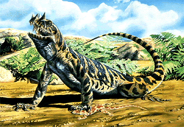
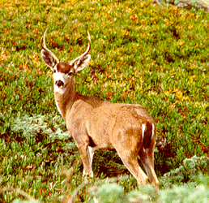
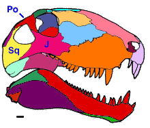

---
aliases:
  - Synapsida
title: Synapsida
---

# [[Synapsida]]

Mammals and their extinct relatives 

## #has_/text_of_/abstract 

> **Synapsida** is a diverse group of tetrapod vertebrates that includes all mammals and their extinct relatives. 
> It is one of the two major clades of the group Amniota, 
> the other being the more diverse group Sauropsida (which includes all extant reptiles and therefore, birds). 
> 
> Unlike other amniotes, synapsids have a single temporal fenestra, 
> an opening low in the skull roof behind each eye socket, leaving a bony arch beneath each; this accounts for the name "synapsid". 
> The distinctive temporal fenestra developed about 318 million years ago during the Late Carboniferous period, 
> when synapsids and sauropsids diverged, but was subsequently merged with the orbit in early mammals.
>
> The basal amniotes (reptiliomorphs) from which synapsids evolved were historically simply called "reptiles". Therefore, stem group synapsids were then described as mammal-like reptiles in classical systematics, and non-therapsid synapsids were also referred to as pelycosaurs or pelycosaur-grade synapsids. These paraphyletic terms have now fallen out of favor and are only used informally (if at all) in modern literature, as it is now known that all extant reptiles are more closely related to each other and birds than to synapsids, so the word "reptile" has been re-defined to mean only members of Sauropsida or even just an under-clade thereof. In a cladistic sense, synapsids are in fact a monophyletic sister taxon of sauropsids, rather than a part of the sauropsid lineage. Therefore, calling synapsids "mammal-like reptiles" is incorrect under the new definition of "reptile", so they are now referred to as stem mammals, proto-mammals, paramammals or pan-mammals. Most lineages of pelycosaur-grade synapsids were replaced by the more advanced therapsids, which evolved from sphenacodontoid pelycosaurs, at the end of the Early Permian during the so-called Olson's Extinction.
>
> Synapsids were the largest terrestrial vertebrates in the Permian period (299 to 251 mya), rivalled only by some large pareiasaurian parareptiles such as Scutosaurus. They were the dominant land predators of the late Paleozoic and early Mesozoic, with eupelycosaurs such as Dimetrodon, Titanophoneus and Inostrancevia being the apex predators during the Permian, and theriodonts such as Moschorhinus during the Early Triassic. Synapsid population and diversity were severely reduced by the Capitanian mass extinction event and the Permian–Triassic extinction event, and only two groups of therapsids, the dicynodonts and eutheriodonts (consisting of therocephalians and cynodonts) are known to have survived into the Triassic. These therapsids rebounded as disaster taxa during the early Mesozoic, with the dicynodont Lystrosaurus making up as much as 95% of all land species at one time, but declined again after the Smithian–Spathian boundary event with their dominant niches largely taken over by the rise of archosaurian sauropsids, first by the pseudosuchians and then by the pterosaurs and dinosaurs. The cynodont group Probainognathia, which includes the group Mammaliaformes, were the only synapsids to survive beyond the Triassic, and mammals are the only synapsid lineage that have survived past the Jurassic, having lived mostly nocturnally to avoid competition with dinosaurs. After the Cretaceous-Paleogene extinction wiped out all non-avian dinosaurs and pterosaurs, synapsids (as mammals) rose to dominance once again during the Cenozoic.
>
> [Wikipedia](https://en.wikipedia.org/wiki/Synapsida)

Synapsida is a group of amniotes (tetrapods with eggs adapted for terrestrial environments) 
that includes mammals and their extinct relatives. 
The parent group of Synapsida is the class[[../Amniota]]], which also includes reptiles and birds. 
The transition from reptiles to synapsids marked an important evolutionary shift 
toward mammal-like characteristics. 

## Characteristics 

Here are some key differences between Synapsida and their parent group:

### Temporal Fenestration: 
One of the most significant differences between reptiles and synapsids 
is the development of temporal fenestration in the skull. 
Temporal fenestrae are openings in the skull behind the eye sockets, 
and they are associated with muscle attachment points. 
In synapsids, the temporal fenestrae became larger and more pronounced, 
allowing for the attachment of larger jaw muscles. 
This is considered a key feature of mammal-like reptiles and eventually mammals.

### Dental Differentiation: 
Synapsids exhibit greater dental differentiation compared to reptiles. 
This includes the development of specialized teeth for different functions, 
such as incisors for cutting, canines for puncturing and tearing, and molars for grinding food. 
This dental differentiation reflects adaptations for a more varied diet 
and increased efficiency in food processing.

### Secondary Palate: 
Many synapsids developed a secondary palate, 
a bony structure that separates the nasal passages from the oral cavity. 
The presence of a secondary palate allows for simultaneous breathing and chewing, 
which is an adaptation seen in mammals. 
This separation of respiratory and digestive passages is essential 
for maintaining a constant flow of air to the lungs during chewing and swallowing.

### Posture and Gait: 
Synapsids exhibit modifications in posture and gait compared to reptiles. 
They have more erect limbs positioned beneath the body, 
which is indicative of a more efficient stance for terrestrial locomotion. 
This change in posture is a step toward the more upright stance seen in mammals, 
which is characterized by a more efficient gait for sustained locomotion.

### Endothermy and Metabolism: 
While endothermy (the ability to generate internal body heat) likely evolved gradually 
within the synapsid lineage, many synapsids show evidence of increased metabolic rates 
compared to their reptilian ancestors. 
This metabolic shift may have been facilitated by adaptations 
such as an enlarged temporal fenestra and improved respiratory systems, 
which allowed for greater oxygen intake and more efficient energy production.

Overall, the transition from reptiles to synapsids represented a significant step 
toward the evolution of mammal-like characteristics. 
These differences reflect adaptations for a more active and energy-efficient lifestyle, 
setting the stage for the eventual emergence of true mammals.

## Phylogeny 
Phylogeny of synapsids, after Reisz (1986) and Laurin (1993).
Terminology after Kemp (1982), Reisz (1986), and Reisz et al. (1992).

## Phylogeny 

-   « Ancestral Groups  
    -   [Amniota](../Amniota.md)
    -   [Terrestrial Vertebrates](../../Terrestrial.md)
    -   [Sarcopterygii](../../../Sarc.md)
    -   [Gnathostomata](../../../../Gnath.md)
    -   [Vertebrata](../../../../../Vertebrata.md)
    -   [Craniata](../../../../../../Craniata.md)
    -   [Chordata](../../../../../../../Chordata.md)
    -   [Deuterostomia](../../../../../../../../Deutero.md)
    -  [Bilateria](../../../../../../../../../Bilateria.md))
    -  [Animals](../../../../../../../../../../Animals.md))
    -  [Eukarya](../../../../../../../../../../../Eukarya.md))
    -   [Tree of Life](../../../../../../../../../../../Tree_of_Life.md)

-   ◊ Sibling Groups of  Amniota
    -   Synapsida
    - [Turtle](Sauropsida/Reptile/Diapsida/Archosauromorpha/Turtle.md)))
    -  [Diapsida](Sauropsida/Reptile/Diapsida.md))

-   » Sub-Groups
    -   [Therapsida](Synapsida/Therapsida.md)

### Information on the Internet

For a general introduction to mammals, see the page on [Phylogeny of the Mammals (UCMP, Berkeley)](http://www.ucmp.berkeley.edu/mammal/mammal.html)

[Michel Laurin and Robert R. Reisz]()

## Introduction

Synapsids include mammals and all extinct amniotes more closely related
to mammals than to reptiles. Synapsids are the dominant large
terrestrial animals worldwide, and they have also invaded the oceans
(whales, pinnipeds) and the air (bats). The oldest known synapsid is an
ophiacodontid from the Middle Pennsylvanian (320 million years ago) of
**Joggins**, Nova Scotia. By the Lower Permian, therapsids (the group
that includes mammals and most of their Upper Permian and more recent
relatives) had appeared (Laurin and Reisz, 1990, 1996). However, the
oldest known mammal only dates back to the Jurassic (Rowe, 1988). The
fossil record of synapsids is one of the most extensive of any groups of
vertebrates. This fossil record has been used to illustrate the concept
of evolution (Hopson, 1987) and to test macroevolutionary patterns
(Kemp, 1985). The largest gap in this fossil record is between the
Permo-Carboniferous synapsids and therapsids.

The fossil record provides conclusive evidence that synapsids are the
first amniotes to diversify. Synapsids quickly became the most diverse,
widespread and most common amniotes in the Late Carboniferous, and they
maintained this predominant position throughout the Paleozoic. Only
during the Early Mesozoic are the synapsids eclipsed by the evolutionary
radiation of reptiles (Benton, 1983; Charig, 1984). Within the Late
Carboniferous and Early Permian, two different herbivorous and several
faunivorous synapsid groups can be recognized.

The fossil record suggests that during the Carboniferous and Early
Permian, synapsids and other amniotes were restricted to the
paleoequatorial and subequatorial regions. During the Late Permian, the
distribution of synapsids, and of some of the other amniotes becomes
cosmopolitan. However, the evidence for this pattern rests on rather
weak negative evidence (i. e., no Permo-Carboniferous synapsids have
been found outside paleoequatorial regions, but other areas have not
been prospected intensively).

Early synapsids had a sprawling posture and a small brain, like most
early tetrapods. The parasagittal gait characteristic of most mammals
(Fig. 1) appeared gradually because some therapsids were apparently
capable of sprawling and parasagittal gait, and this character may have
appeared in the hind limb before the fore limb. Early synapsids were
moderately large (body length between 50 cm and 3 m) and most were
carnivorous or insectivorous, but caseids and *Edaphosaurus* were
herbivorous. Mammals include the largest tetrapods that ever lived (the
blue whale is larger than any dinosaur), as well as very small species.

Most mammals are viviparous, but the platypus (a monotreme) is
oviparous, and most, if not all, non-mammalian synapsids were probably
oviparous. All mammals have mammary glands, but the presence of these
structures cannot be determined in extinct taxa. The oldest preserved
synapsid hair appears to belong to a Middle Jurassic docodontan
mammaliaform (a stem-synapsid) from China (Ji et al., 2006). However,
hair is infrequently fossilized and the next oldest record is from a
Paleocene multituberculate (Meng and Wyss, 1997). Therefore, its real
date of appearance is unknown. The position of this group has been
debated, but they are probably mammals (Rowe, 1988), so the presence of
hair in multituberculates was predictible.

**Figure 1.** An extant synapsid (a black-tailed deer). Like most of
the\
other 3500 extant synapsid species, it is endothermic and has fur, but
these\
features were certainly absent in all Paleozoic synapsids. Photograph by
Roger Laurin.

### Characteristics

All known early synapsids had a lateral temporal fenestra (a hole in the
lateral surface of the skull behind the orbit) that is still present in
a modified form in mammals. Primitively, the lateral temporal fenestra
was bordered by only three bones (Fig. 2).

**Figure 2.** Temporal fenestration primitively found in synapsids.\
Abbreviations: J, jugal; Po, postorbital; Sq, squamosal. Scale equals 1
cm.

The occiput was broad and it faced posterodorsally. In other early
amniotes, the endochondral bones of the braincase formed a narrower
surface, and it was more or less vertical.

The pubis had a long, ridged anterodorsal edge.

### Physiology

The earliest synapsids were probably ectothermic (their body temperature
depended on the environment), as shown by the presence of a large
\"sail\" on the back of edaphosaurids and some sphenacodontids. This
sail was composed of greatly elongated neural spines that was grooved
anteriorly and posteriorly to accommodate blood vessels, and skin
probably connected all the neural spines together. This sail may have
allowed these early synapsids to raise their body temperature faster
than similarly-sized tetrapods lacking a sail. It was also thought that
the sail was used to radiate excess heat into the environment, but
recent studies suggest otherwise (Haack, 1986). The presence of the sail
suggests that early synapsids lacked hair. Hair usually does not
fossilize, but its presence in most monotremes, marsupials, and
placentals suggests that it was present in their last common ancestor.
Endothermy is also difficult to determine in extinct taxa, but it
probably appeared slightly before the first mammal was born. The
presence of epidermal horny scales cannot be determined in most fossil
taxa, but bony ventral scales were primitively present, as shown by
their presence in most reasonably complete fossils of early synapsids.

### Discussion of Phylogenetic Relationships

Early synapsid phylogeny is relatively uncontroversial. Recent studies
by Reisz (1980, 1986), Brinkman and Eberth (1983), Gauthier et al.
(1988), and Laurin (1993) have resolved the relationships between the
largest groups of early synapsids. More recent studies by Reisz et al.
(1992) and Berman et al. (1995) have confirmed these findings.

Reisz (1980) produced the first phylogeny of synapsids using
phylogenetic systematics. He argued that most carnivorous synapsids
(ophiacodontids, varanopseids, sphenacodontines, and therapsids formed a
clade that excluded the herbivorous edaphosaurids and caseids.

            ============ Eothyrididae
         ===|
         |  ============ Caseidae
         |
         |  ============ Edaphosauridae
         |  |
    =====|  |  ========= Ophiacodontidae
         |  |  |
         ===|  |  ====== Varanopseidae
            ===|  |
               ===|  === Sphenacodontidae
                  ===|
                     === Therapsida

Brinkman and Eberth (1983) argued that varanopseids were closely related
to caseids and that edaphosaurids were closely related to
sphenacodontids:

            ========= Caseidae
         ===|
         |  ========= Varanopseidae
         |
         |  ========= Ophiacodontidae
    =====|  |
         |  |  ====== Edaphosauridae
         ===|  |
            ===|  === Sphenacodontidae
               ===|
                  === Therapsida

Reisz (1986) agreed with Brinkman and Eberth (1983) that edaphosaurids
were closely related to sphenacodontids, but he argued that varanopseids
were more closely related to ophiacodontids than to caseids:

            ============ Eothyrididae
         ===|
         |  ============ Caseidae
         |
         |  ============ Varanopseidae
         |  |
    =====|  |  ========= Ophiacodontidae
         |  |  |
         ===|  |  ====== Edaphosauridae
            ===|  |
               ===|  === Sphenacodontidae
                  ===|
                     === Therapsida

This new position of varanopseids has not been directly questioned by
subsequent studies. The phylogeny of Gauthier et al. (1988) resembled
that of Brinkman and Eberth (1983), but they did not test the monophyly
of the varanopseid-caseid clade.

Gauthier et al. (1989), Hopson (1991), and Reisz et al. (1992) suggested
that Haptodus, previously believed to be a sphencodontid, did not belong
to this group:

         =============== Varanopseidae
         |
         |  ============ Ophiacodontidae
         |  |
         |  |  ========= Edaphosauridae
    =====|  |  |
         ===|  |  ====== Haptodus
            ===|  |
               ===|  === Sphenacodontidae
                  ===|
                     === Therapsida

Laurin (1993) studied the relationships of several problematic taxa
previously called haptodontines. He suggested that haptodontines were a
paraphyletic group:

======================== Varanopseidae
         |
         |  ===================== Ophiacodontidae
         |  |
         |  |  ================== Edaphosauridae
         |  |  |                                         
         |  |  |  =============== Haptodus garnettensis  |
         |  |  |  |                                      |
    =====|  |  |  |  ============ Palaeohatteria         |
         ===|  |  |  |                                   | "haptodontines"
            ===|  |  |  ========= Pantelosaurus          |
               ===|  |  |                                |
                  ===|  |  ====== Cutleria               |
                     ===|  |
                        ===|  === Sphenacodontidae
                           ===|
                              === Therapsida

See the page on [Evolution of early synapsids](http://www.tolweb.org/accessory/Synapsid_Classification_&_Apomorphies?acc_id=466)
for synapomorphies justifying the latest phylogenies and for anatomical
drawings.

### References

Benton M. J. 1983. Dinosaur success in the Triassic: a noncompetitive
ecological model. Quarterly Review of Biology 58: 29-55.

Berman D. S., R. R. Reisz, J. R. Bolt, and D. Scott. 1995. The cranial
anatomy and relationships of the synapsid Varanosaurus (Eupelycosauria:
Ophiacodontidae) from the Early Permian of Texas and Oklahoma. Annals of
Carnegie Museum 64: 99-133.

Brinkman, D. and D. A. Eberth. 1983. The interrelationships of
pelycosaurs. Breviora 473: 1-35.

Charig A. 1984. Competition between therapsids and archosaurs during the
Triassic period: a review and synthesis of current theories. In: M. W.
J. Ferguson (ed.) The structure, development and evolution of reptiles:
597-628. London: Academic Press.

Gauthier, J., A. G. Kluge, and T. Rowe. 1988. Amniote phylogeny and the
importance of fossils. Cladistics 4: 105-209.

Gauthier J., D. C. Cannatella, K. De Queiroz, A. G. Kluge, and T. Rowe.
1989. Tetrapod phylogeny. In: B. Fernholm, K. Bremer, and H. Jornvall
(ed.) The Hierarchy of Life: 337-353. New York: Elsevier Science
Publishers B. V. (Biomedical Division).

Haack, S. C. 1986. A thermal model of the sailback pelycosaur.
Paleobiology 12: 450-458.

Hopson J. A. 1987. The Mammal-like Reptiles. A study of transitional
fossils. The American biology teacher 49: 16-26.

Hopson J. A. 1991. Systematics of the nonmammalian Synapsida and
implications for patterns of evolution in synapsids. In: H.-P. Schultze
and L. Trueb (ed.) Origins of the higher groups of
tetrapods---Controversy and Consensus: 635-693. Ithaca: Cornell
University Press.

Ji Q., Z.-X. Luo, C.-X. Yuan, & A. R. Tabrum. 2006. A swimming
mammaliaform from the Middle Jurassic and ecomorphological
diversification of early mammals. Science 311: 1123-1127.

Kemp, T. S. 1982. Mammal-like Reptiles and the Origin of Mammals.
Academic press, New York, 363 pp.

Kemp T. S. 1985. Synapsid reptiles and the origin of higher taxa.
Special Papers in Palaeontology 33: 175-184.

Laurin, M. 1993. Anatomy and relationships of Haptodus garnettensis, a
Pennsylvanian synapsid from Kansas. Journal of Vertebrate Paleontology
13: 200-229.

Laurin, M. and R. R. Reisz. 1990. Tetraceratops is the oldest known
therapsid. Nature 345: 249-250.

Laurin M. and R. R. Reisz. 1996. The osteology and relationships of
Tetraceratops insignis, the oldest known therapsid. Journal of
Vertebrate Paleontology 16: 95-102.

Meng J. and A. R. Wyss. 1997. Multituberculate and other mammal hair
recovered from Palaeogene excreta. Nature 385: 712-714.

Reisz R. R. 1980. The Pelycosauria: A review of phylogenetic
relationships. In: A. L. Panchen (ed.) The Terrestrial Environment and
the Origin of Land Vertebrates: 553-592. London: Academic Press.

Reisz, R. R. 1986. Pelycosauria. Encyclopedia of Paleoherpetology 17A:
1-102.

Reisz, R. R., D. S. Berman, and D. Scott. 1992. The cranial anatomy and
relationships of Secodontosaurus, an unusual mammal-like reptile
(Pelycosauria: Sphenacodontidae) from the early Permian of Texas.
Zoological Journal of the Linnean Society 104: 127-184.

Rowe T. 1988. Definition, diagnosis, and origin of Mammalia. Journal of
Vertebrate Paleontology 8: 241-264.

Zimmer C. Meet the relatives. Discover, 1991, 56-57.

## Title Illustrations

)

  ---------------------------------------------------------------------
  Scientific Name ::     Tetraceratops
  Location ::           Texas
  Comments             Tetraceratops, the oldest known therapsid. This strange synapsid, found in Texas in the last century, has recently been reinterpreted as the only known Lower Permian therapsid (Laurin and Reisz, 1990).
  Reference            Zimmer C. 1991. Meet the relatives. Discover, 1991, 56-57
  Creator              Drawing by Steve Kirk
  Specimen Condition   Fossil \-- Period: Lower Permian
  Copyright ::            © 1991 Discover Magazine
  ---------------------------------------------------------------------

## Confidential Links & Embeds: 

### #is_/same_as :: [Synapsida](/_Standards/bio/bio~Domain/Eukarya/Animal/Bilateria/Deutero/Chordata/Craniata/Vertebrata/Gnath/Sarc/Tetrapods/Amniota/Synapsida.md) 

### #is_/same_as :: [Synapsida.public](/_public/bio/bio~Domain/Eukarya/Animal/Bilateria/Deutero/Chordata/Craniata/Vertebrata/Gnath/Sarc/Tetrapods/Amniota/Synapsida.public.md) 

### #is_/same_as :: [Synapsida.internal](/_internal/bio/bio~Domain/Eukarya/Animal/Bilateria/Deutero/Chordata/Craniata/Vertebrata/Gnath/Sarc/Tetrapods/Amniota/Synapsida.internal.md) 

### #is_/same_as :: [Synapsida.protect](/_protect/bio/bio~Domain/Eukarya/Animal/Bilateria/Deutero/Chordata/Craniata/Vertebrata/Gnath/Sarc/Tetrapods/Amniota/Synapsida.protect.md) 

### #is_/same_as :: [Synapsida.private](/_private/bio/bio~Domain/Eukarya/Animal/Bilateria/Deutero/Chordata/Craniata/Vertebrata/Gnath/Sarc/Tetrapods/Amniota/Synapsida.private.md) 

### #is_/same_as :: [Synapsida.personal](/_personal/bio/bio~Domain/Eukarya/Animal/Bilateria/Deutero/Chordata/Craniata/Vertebrata/Gnath/Sarc/Tetrapods/Amniota/Synapsida.personal.md) 

### #is_/same_as :: [Synapsida.secret](/_secret/bio/bio~Domain/Eukarya/Animal/Bilateria/Deutero/Chordata/Craniata/Vertebrata/Gnath/Sarc/Tetrapods/Amniota/Synapsida.secret.md)

