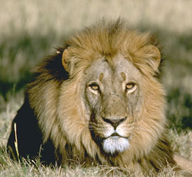
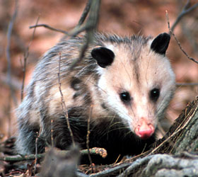

---
aliases:
- Afọmúbọ́mọ
- Biby mampinono
- Bidił Daazdoígíí dóó Daʼałtʼoʼígíí
- Biesse ås tetes
- Binatang manyusuan
- Biŋkɔbigu
- bronneged
- Bronnvil
- Buô-ṳ̄ dông-ŭk
- Chhī-leng tōng-bu̍t
- Cicavce
- Cycaki
- Cyckocze
- Doenghduz nyamhcij
- Dzinoyamwisa
- däggdjur
- emlősök
- Gjitarët
- Guhandar
- Hosiftotta
- Imetaiživatad
- imetajad
- Imetäjä
- IsiNcelisi
- Kpɩnɛ hɩɖɛ ñɩnɖɛ
- Lãdziviwo
- lớp Thú
- mabru
- mamach
- Mamal
- Mamalia
- Mamalya
- Mamel
- Mamele
- Mamendéieren
- Mamifer
- mamifero
- Mamifè
- mamifèros
- Mamifèrs
- Mamipero
- Mammal
- Mammalia
- Mammals
- Mammifere
- Mammiferes
- Mammiferi
- mammiferu
- Mammifère
- mammifères
- Mammiféthe
- mammìfiru
- mamuloj
- Mamìfari
- Mamìfer
- mamífero
- mamíferos
- mamífers
- Mamíferu
- Manmifè
- memeliler
- māmela
- məməlilər
- Naasley
- nisäkkäät
- njeeǯǯla
- njiččehasat
- njomâtteijeeh
- Nyama ya mabele
- Nyama ya mabɛ́lɛ
- Okambúva
- pattedyr
- paycucuay
- Phú-nen thung-vu̍t
- Saigedier
- savci
- sesalci
- Sheeintagh
- sisari
- Sisavac
- sisavci
- soogdier
- soweli pi nena mama
- spendýr
- Spofiecha
- ssaki
- Sut emizuvchilar
- Suugedierte
- sycedēor
- Säugetier
- Säugetiere
- Söögdeerten
- Súgdjór
- Sút emiziwshiler
- sûchdieren
- süganim
- süt emiciler
- Süüger
- Tetjdiarten
- Timsiffatin
- ugaztun
- Whakangote
- Zoogbêestn
- zoogdeers
- Zoogdiere
- Zoogdieren
- zīdītāji
- Æхсырæйхæсджытæ
- Çıçıkıni
- Ñuñuq
- Ñuñuri
- šytəhəjon
- žinduoliai
- Žvierē
- θηλαστικό
- бозайници
- Дакхадийнаташ
- декха дийнаташ
- Желиндүүлөр
- имезүчеләр
- Кыыл
- Лофцта потяйхтне
- млекопитающие
- Некхъвадайбур
- Нимӧтчиссез
- нонӥсьёс
- Сĕтпе ӳсекенсем
- сисари
- ссавці
- Ссавцї
- сысуны
- Сүт чемиштиг амытаннар
- Сүтқоректілер
- Хүхэтэн
- Хөхтөн
- цицачи
- Ширхӯр
- ШэрыпӀхэр
- Шӧр пукшышо
- Шӹшер качшы вольыквлӓ
- Үсн теҗәлтнр
- Һөтимәрҙәр
- կաթնասուն
- זויגער
- יונקים
- بزوليات
- تھݨ دار
- تی لرونکی
- ثدييات
- شیردهئون
- ممهلیلر
- مۄمَل جانور
- پستانداران
- پستانیہ
- ٿڻ وارو جانور
- گوانداران
- ܬܕܝܬܐ
- ߦߙߍߡߊ
- दुरुप्वः दुपिं
- मैमल
- सस्तन प्राणी
- सस्तनः
- स्तनधारी
- स्तनधारी प्राणी
- स्तनपायी
- স্তন্যপায়ী
- স্তন্যপায়ী প্ৰাণী
- ਥਣਧਾਰੀ
- ସ୍ତନ୍ୟପାୟୀ
- பாலூட்டி
- క్షీరదాలు
- ಸಸ್ತನಿ
- സസ്തനി
- ක්ෂීරපායීන්
- สัตว์เลี้ยงลูกด้วยน้ำนม
- ສັດລ້ຽງລູກດ້ວຍນ້ຳນົມ
- འུ་འཐུང་སྲོག་ཆགས།
- နို့တိုက်သတ္တဝါ
- ძუძუმწოვრები
- ძუძუშმაწუალეფი
- ጡት አጥቢ
- ᎺᎹᎵ
- ᐱᓱᒃᑎ
- ថនិកសត្វ
- ⵜⵉⵎⵙⵓⵟⴰⴹ
- 哺乳动物
- 哺乳動物
- 哺乳纲
- 哺乳類
- 포유류
- "\U0001033C\U00010339\U0001033B\U0001033F\U0001033A\U00010343\U00010346\U00010349\U00010333\U0001033E\U00010330"
has_id_wikidata: Q7377
Colon_Classification: K97
Commons_category: Mammalia
Commons_gallery: Mammalia
described_by_source:
- '[[../../../../../../../../../../../../../../../WikiData/WD~Brockhaus_and_Efron_Encyclopedic_Dictionary,602358]]'
- '[[_Standards/WikiData/WD~Encyclopædia_Britannica_11th_edition,867541]]'
- "[[_Standards/WikiData/WD~Collier's_New_Encyclopedia,_1921,19047539]]"
- '[[_Standards/WikiData/WD~Small_Brockhaus_and_Efron_Encyclopedic_Dictionary,19180675]]'
- '[[_Standards/WikiData/WD~New_Encyclopedic_Dictionary,19190511]]'
- '[[_Standards/WikiData/WD~Meyers_Konversations-Lexikon,_4th_edition_(1885–1890),19219752]]'
- '[[_Standards/WikiData/WD~Great_Soviet_Encyclopedia_(1926–1947),20078554]]'
- '[[_Standards/WikiData/WD~The_Domestic_Encyclopædia;_Or,_A_Dictionary_Of_Facts,_And_Useful_Knowledge,56441911]]'
Dewey_Decimal_Classification: 599
different_from: '[[_Standards/WikiData/WD~Mammals,2036485]]'
EPPO_Code: 1MAMMC
equivalent_class:
- http://dbpedia.org/ontology/Mammal
- http://kbpedia.org/kko/rc/Mammal
Iconclass_notation: 25F2
image: http://commons.wikimedia.org/wiki/Special:FilePath/Mammal%20Diversity%202011-less%20depressing.png
instance_of: '[[_Standards/WikiData/WD~taxon,16521]]'
ITIS_TSN: 179913
Krugosvet_article: nauka_i_tehnika/biologiya/MLEKOPITAYUSHCHIE.html
MeSH_tree_code: B01.050.150.900.649
montage_image: http://commons.wikimedia.org/wiki/Special:FilePath/Mammalia%200.jpg
said_to_be_the_same_as: '[[_Standards/WikiData/WD~mammal,110551885]]'
spoken_text_audio: http://commons.wikimedia.org/wiki/Special:FilePath/Nl-Zoogdieren-article.ogg
Stack_Exchange_site_URL: https://biology.stackexchange.com/tags/mammals
Stack_Exchange_tag: https://biology.stackexchange.com/tags/mammals
start_time: -160000000-01-01
studied_in: '[[_Standards/WikiData/WD~mammalogy,183904]]'
taxon_common_name:
- Mammal
- pattedyr
- Mammifère
- Mammiferi
- 哺乳纲
taxon_name: Mammalia
taxon_rank: '[[_Standards/WikiData/WD~class,37517]]'
this_taxon_is_source_of:
- '[[_Standards/WikiData/WD~hide,3291230]]'
- '[[_Standards/WikiData/WD~mammal_meat,124748491]]'
- '[[_Standards/WikiData/WD~milk,8495]]'
title: Mammalia
topic_s_main_template:
- '[[_Standards/WikiData/WD~Q10725256,10725256]]'
- '[[_Standards/WikiData/WD~Template_Mammals,11153721]]'
topic_s_main_Wikimedia_portal: '[[_Standards/WikiData/WD~Portal_Mammals,11116931]]'
UMLS_CUI: C0024660
U_S_National_Archives_Identifier: 10638722
dv_has_:
  name_:
    af: soogdier
    am: ጡት አጥቢ
    an: mammalia
    ang: sycedēor
    anp: स्तनपायी
    ar: ثدييات
    arc: ܬܕܝܬܐ
    ary: بزوليات
    arz: ثدييات
    as: স্তন্যপায়ী প্ৰাণী
    ast: mamíferos
    ay: Ñuñuri
    az: məməlilər
    azb: ممهلیلر
    ba: Һөтимәрҙәр
    ban: Mammalia
    bar: Spofiecha
    bcl: Mamalya
    be: сысуны
    be_tarask: сысуны
    bg: бозайници
    bho: मैमल
    bn: স্তন্যপায়ী
    bo: འུ་འཐུང་སྲོག་ཆགས།
    br: bronneged
    bs: sisari
    bxr: Хүхэтэн
    ca: mamífers
    cdo: Buô-ṳ̄ dông-ŭk
    ce: декха дийнаташ
    ceb: Mamipero
    chr: ᎺᎹᎵ
    ckb: گوانداران
    co: Mammiferu
    crh: süt emiciler
    cs: savci
    cv: Сĕтпе ӳсекенсем
    cy: mamal
    da: Pattedyr
    dag: Biŋkɔbigu
    de: Säugetiere
    diq: Çıçıkıni
    dsb: Cycaki
    ee: Lãdziviwo
    el: θηλαστικό
    en: mammal
    en_ca: mammal
    en_gb: mammal
    eo: mamuloj
    es: mamíferos
    et: imetajad
    eu: ugaztun
    ext: Mamíferu
    fa: پستانداران
    fi: nisäkkäät
    fo: Súgdjór
    fr: mammifères
    frp: mamifèros
    frr: Tetjdiarten
    fy: sûchdieren
    ga: mamach
    gcr: Manmifè
    gd: Mamal
    gl: mamífero
    gn: Okambúva
    gor: Mamalia
    got: "\U0001033C\U00010339\U0001033B\U0001033F\U0001033A\U00010343\U00010346\U00010349\U00010333\U0001033E\U00010330"
    gsw: Süüger
    gv: Sheeintagh
    hak: Phú-nen thung-vu̍t
    haw: māmela
    he: יונקים
    hi: स्तनधारी
    hif: Mammal
    hr: sisavci
    hsb: Cycaki
    ht: Mamifè
    hu: emlősök
    hy: կաթնասուն
    ia: Mammalia
    id: mamalia
    ie: Mammiferes
    ilo: Mamalia
    inh: Дакхадийнаташ
    io: mamifero
    is: spendýr
    it: mammiferi
    iu: ᐱᓱᒃᑎ
    ja: 哺乳類
    jam: Mamal
    jbo: mabru
    jv: mamalia
    ka: ძუძუმწოვრები
    kaa: Sút emiziwshiler
    kab: Timsiffatin
    kbd: ШэрыпӀхэр
    kbp: Kpɩnɛ hɩɖɛ ñɩnɖɛ
    kg: Nyama ya mabele
    ki: Mammal
    kk: Сүтқоректілер
    km: ថនិកសត្វ
    kn: ಸಸ್ತನಿ
    knc: Mammal
    ko: 포유류
    koi: Нимӧтчиссез
    ks: مۄمَل جانور
    ku: Guhandar
    kw: Bronnvil
    ky: Желиндүүлөр
    la: Mammalia
    lb: Mamendéieren
    lez: Некхъвадайбур
    lfn: mamal
    li: Zoogdiere
    lij: Mammalia
    lld: Mamifer
    lmo: Mamifer
    ln: Nyama ya mabɛ́lɛ
    lo: ສັດລ້ຽງລູກດ້ວຍນ້ຳນົມ
    lt: žinduoliai
    lv: zīdītāji
    mad: Mamalia
    mai: स्तनधारी प्राणी
    mdf: Лофцта потяйхтне
    mg: Biby mampinono
    mhr: Шӧр пукшышо
    mi: Whakangote
    min: Binatang manyusuan
    mk: цицачи
    ml: സസ്തനി
    mn: Хөхтөн
    mr: सस्तन प्राणी
    mrj: Шӹшер качшы вольыквлӓ
    ms: mamalia
    mt: mammiferu
    mul: Mammalia
    my: နို့တိုက်သတ္တဝါ
    mzn: شیردهئون
    nah: Mammalia
    nan: Chhī-leng tōng-bu̍t
    nap: Mammifere
    nb: pattedyr
    nds: Söögdeerten
    nds_nl: zoogdeers
    ne: स्तनधारी प्राणी
    new: दुरुप्वः दुपिं
    nl: zoogdieren
    nn: pattedyr
    nov: Mammalia
    nqo: ߦߙߍߡߊ
    nrm: Mammiféthe
    nv: Bidił Daazdoígíí dóó Daʼałtʼoʼígíí
    oc: Mamifèrs
    om: Hosiftotta
    or: ସ୍ତନ୍ୟପାୟୀ
    os: Æхсырæйхæсджытæ
    pa: ਥਣਧਾਰੀ
    pam: Mammal
    pfl: Saigedier
    pl: ssaki
    pms: Mamìfer
    pnb: تھݨ دار
    ps: تی لرونکی
    pt: mamíferos
    pt_br: mamíferos
    qu: Ñuñuq
    rm: Mammals
    ro: mamifer
    ru: млекопитающие
    rue: Ссавцї
    sa: सस्तनः
    sah: Кыыл
    scn: mammìfiru
    sco: mammal
    sd: ٿڻ وارو جانور
    se: njiččehasat
    sgs: Žvierē
    sh: Sisavac
    si: ක්ෂීරපායීන්
    sk: Cicavce
    sl: sesalci
    sm: Mamele
    smn: njomâtteijeeh
    sms: njeeǯǯla
    sn: Dzinoyamwisa
    so: Naasley
    sq: Gjitarët
    sr: сисари
    stq: Suugedierte
    su: mamalia
    sv: däggdjur
    sw: Mamalia
    szl: Cyckocze
    szy: paycucuay
    ta: பாலூட்டி
    te: క్షీరదాలు
    tet: Mamíferu
    tg: Ширхӯр
    th: สัตว์เลี้ยงลูกด้วยน้ำนม
    tl: Mamalya
    tly: šytəhəjon
    tok: soweli pi nena mama
    tpi: Mamel
    tr: memeliler
    tt: имезүчеләр
    tt_cyrl: имезүчеләр
    tyv: Сүт чемиштиг амытаннар
    udm: нонӥсьёс
    uk: ссавці
    ur: پستانیہ
    uz: Sut emizuvchilar
    vec: Mamìfari
    vep: Imetaiživatad
    vi: lớp Thú
    vls: Zoogbêestn
    vo: süganim
    vro: Imetäjä
    wa: Biesse ås tetes
    war: Mamalya
    wuu: 哺乳動物
    xal: Үсн теҗәлтнр
    xmf: ძუძუშმაწუალეფი
    yi: זויגער
    yo: Afọmúbọ́mọ
    yue: 哺乳動物
    za: Doenghduz nyamhcij
    zea: Zoogdieren
    zgh: ⵜⵉⵎⵙⵓⵟⴰⴹ
    zh: 哺乳動物
    zh_cn: 哺乳动物
    zh_hans: 哺乳动物
    zh_hant: 哺乳動物
    zh_hk: 哺乳動物
    zh_mo: 哺乳动物
    zh-my: 哺乳动物
    zh_sg: 哺乳动物
    zh_tw: 哺乳動物
    zu: IsiNcelisi
---
# [[Mammal]]

Mammals 

)   

#is_/same_as :: [[../../../../../../../../../../../../../../../WikiData/WD~Mammal,7377|WD~Mammal,7377]] 

## #has_/text_of_/abstract 

> A **Mammal** (from Latin  mamma 'breast') is a vertebrate animal of the class Mammalia (). Mammals are characterised by the presence of milk-producing mammary glands for feeding their young, a broad neocortex region of the brain, fur or hair, and three middle ear bones. These characteristics distinguish them from reptiles and birds, from which their ancestors diverged in the Carboniferous Period over 300 million years ago. Around 6,640 extant species of mammals have been described and divided into 27 orders. The study of mammals is called mammalogy.
>
> The largest orders of mammals, by number of species, are the rodents, bats, and eulipotyphlans (including hedgehogs, moles and shrews). The next three are the primates (including humans, monkeys and lemurs), the even-toed ungulates (including pigs, camels, and whales), and the Carnivora (including cats, dogs, and seals).
>
> Mammals are the only living members of Synapsida; this clade, together with Sauropsida (reptiles and birds), constitutes the larger Amniota clade. Early synapsids are referred to as "pelycosaurs." The more advanced therapsids became dominant during the Guadalupian. Mammals originated from cynodonts, an advanced group of therapsids, during the Late Triassic to Early Jurassic. Mammals achieved their modern diversity in the Paleogene and Neogene periods of the Cenozoic era, after the extinction of non-avian dinosaurs, and have been the dominant terrestrial animal group from 66 million years ago to the present.
>
> The basic mammalian body type is quadrupedal, with most mammals using four limbs for terrestrial locomotion; but in some, the limbs are adapted for life at sea, in the air, in trees or underground. The bipeds have adapted to move using only the two lower limbs, while the rear limbs of cetaceans and the sea cows are mere internal vestiges. Mammals range in size from the 30–40 millimetres (1.2–1.6 in) bumblebee bat to the 30 metres (98 ft) blue whale—possibly the largest animal to have ever lived. Maximum lifespan varies from two years for the shrew to 211 years for the bowhead whale. All modern mammals give birth to live young, except the five species of monotremes, which lay eggs. The most species-rich group is the viviparous placental mammals, so named for the temporary organ (placenta) used by offspring to draw nutrition from the mother during gestation.
>
> Most mammals are intelligent, with some possessing large brains, self-awareness, and tool use. Mammals can communicate and vocalise in several ways, including the production of ultrasound, scent marking, alarm signals, singing, echolocation; and, in the case of humans, complex language. Mammals can organise themselves into fission–fusion societies, harems, and hierarchies—but can also be solitary and territorial. Most mammals are polygynous, but some can be monogamous or polyandrous.
>
> Domestication of many types of mammals by humans played a major role in the Neolithic Revolution, and resulted in farming replacing hunting and gathering as the primary source of food for humans. This led to a major restructuring of human societies from nomadic to sedentary, with more co-operation among larger and larger groups, and ultimately the development of the first civilisations. Domesticated mammals provided, and continue to provide, power for transport and agriculture, as well as food (meat and dairy products), fur, and leather. Mammals are also hunted and raced for sport, kept as pets and working animals of various types, and are used as model organisms in science. Mammals have been depicted in art since Paleolithic times, and appear in literature, film, mythology, and religion. Decline in numbers and extinction of many mammals is primarily driven by human poaching and habitat destruction, primarily deforestation.
>
> [Wikipedia](https://en.wikipedia.org/wiki/Mammal) 

Mammalia, the class of vertebrates that includes mammals, 
exhibits several specific differences from their parent group within the superclass [[Tetrapoda]]. 

### Hair and Mammary Glands: 
Mammals are characterized by the presence of hair (fur) covering their bodies, 
which serves various functions including insulation, protection, and sensory perception. 
Additionally, all mammals possess mammary glands 
that produce milk to nourish their offspring, a defining feature of the class.

## Endothermy: 
Most mammals are endothermic, 
meaning they keep up their body temperature internally through metabolic processes. 
This allows mammals to maintain relatively stable body temperatures 
regardless of external environmental conditions, 
enabling them to inhabit diverse habitats worldwide.

### Viviparity: 
Mammals are typically viviparous, giving birth to live young 
that are nourished by maternal placental circulation during gestation. 
This reproductive strategy contrasts with oviparous tetrapods (such as reptiles and birds), 
which lay eggs externally and often rely on environmental heat sources for incubation.

### Specialized Dentition: 
Mammals have a specialized dentition adapted to their diverse dietary habits. 
They possess a combination of incisors, canines, premolars, and molars, 
with tooth morphology often reflecting their specific feeding preferences, 
whether herbivorous, carnivorous, or omnivorous.

### Three Middle Ear Bones: 
Mammals possess a unique set of three middle ear bones (the malleus, incus, and stapes) 
that transmit vibrations from the tympanic membrane to the inner ear. 
These ossicles are derived from bones of the ancestral jaw 
joint found in non-mammalian tetrapods and are essential for hearing.

### Diaphragm: 
Mammals have a muscular diaphragm separating the thoracic and abdominal cavities, 
which aids in breathing by expanding and contracting the lungs. 
The presence of a diaphragm enhances respiratory efficiency 
and allows for more controlled breathing compared to non-mammalian tetrapods.

## Advanced Brain and Behavior: 
Mammals typically have relatively large brains compared to body size 
and exhibit advanced cognitive abilities, sensory perception, and social behaviors. 
These neurological adaptations contribute to the diverse behavioral repertoire seen in mammals, 
from complex social interactions to sophisticated problem-solving skills.

### Mammary Glands: 
Mammals possess specialized mammary glands that produce milk to nourish their young. 
These glands are a defining characteristic of the class 
and play a crucial role in parental care and offspring development.

These specific differences distinguish mammals from their parent group [[Tetrapoda]] 
and reflect their unique evolutionary adaptations for diverse ecological roles and lifestyles.

## Phylogeny 

-   « Ancestral Groups  
    -   [Therapsida](../Therapsida.md)
    -   [Synapsida](../../Synapsida.md)
    -   [Amniota](../../../Amniota.md)
    -   [Terrestrial Vertebrates](../../../../Terrestrial.md)
    -   [Sarcopterygii](../../../../../Sarc.md)
    -   [Gnathostomata](../../../../../../Gnath.md)
    -   [Vertebrata](../../../../../../../Vertebrata.md)
    -   [Craniata](../../../../../../../../Craniata.md)
    -   [Chordata](../../../../../../../../../Chordata.md)
    -   [Deuterostomia](../../../../../../../../../../Deutero.md)
    -  [Bilateria](../../../../../../../../../../../Bilateria.md) 
    -  [Animals](../../../../../../../../../../../../Animals.md) 
    -  [Eukarya](../../../../../../../../../../../../../Eukarya.md) 
    -   [Tree of Life](../../../../../../../../../../../../../Tree_of_Life.md)

-   ◊ Sibling Groups of  Therapsida
    -   Mammalia

-   » Sub-Groups
    -  [Monotremata](Mammal/Monotremata.md) 
    -  [Marsupialia](Mammal/Marsupialia.md) 
    -  [Eutheria](Mammal/Eutheria.md) 

### Information on the Internet

-   [Division of     Mammals.](http://www.nmnh.si.edu/vert/mammals/mammals.html) National
    Museum of Natural History. Smithsonian Institution.

-   [Mammal species of the world.](http://www.nmnh.si.edu/msw/)
    Smithsonian Institution.

-   [North American Mammals](http://web4.si.edu/mna/). Smithsonian
    Institution.

-   [The Hall of     Mammals.](http://www.ucmp.berkeley.edu/mammal/mammal.html) UC
    Berkeley.

-   [Class     Mammalia](http://animaldiversity.ummz.umich.edu/chordata/mammalia.html).
    Animal Diversity Web. University of Michigan Museum of Zoology.

-   [BIOSIS BiologyBrowser:     Mammalia.](http://www.biologybrowser.org/bb/Organism/Chordata/Vertebrata/Mammalia/index.shtml)

-   [MANIS.](http://manisnet.org/) Mammal Networked Information System.

-   [The American Society of     Mammalogists.](http://www.mammalsociety.org/)
    -   [Mammalian         Species.](http://www.science.smith.edu/departments/Biology/VHAYSSEN/msi/)
    -   [Mammal Image         Library.](http://www.mammalsociety.org/imagelibrary/index.html)
    -   [State Lists of         Mammals.](http://www.mammalsociety.org/statelists/index.html)

-   [Department of     Mammalogy.](http://research.amnh.org/mammalogy/index.html) American
    Museum of Natural History.

-   [Illinois Natural History Survey Mammal     Collection.](http://www.inhs.uiuc.edu/cbd/collections/mammal.html)

-   [University of Alaska Museum Mammal     Collection.](http://www.uaf.edu/museum/mammal/) Arctic, boreal, and
    North Pacific mammals.

-   [The Mammals of Texas. On-line     Edition.](http://www.nsrl.ttu.edu/tmot1/)

-   [Animal Info.](http://www.animalinfo.org/) Information on Rare,
    Threatened and Endangered Mammals.

-   [Mammals of     Tasmania.](http://www.dpiwe.tas.gov.au/inter.nsf/ThemeNodes/LBUN-5362ZN?open)
    Parks and Wildlife Service, Tasmania.

-   [Embryo Images Normal and Abnormal Mammalian     Development](http://www.med.unc.edu/embryo_images/).

-   [Comparative Mammalian Brain Collections.](http://brainmuseum.org/)
    University of Wisconsin.

-   [Will\'s Skull Page.](http://www.skullsite.co.uk/) Skulls of British
    mammals & more.

-   [Mammal Skulls of     Utah](http://www.surweb.org/surweb/images/msu/coverpage/msu.htm).

-   [Natural History Notebooks:     Mammals](http://www.nature.ca/notebooks/english/mammpg.htm).
    Canadian Museum of Nature Online.

-   [Amazing     Animals](http://www.bbc.co.uk/reallywild/amazing/index.shtml). BBC
    Nature Online: The Really Wild Zone.

-   [Images of     Mammals.](http://www.photovault.com/Link/Animal/MammalsMaster.html)
    Wernher Krutein and Photovault.

-   [Images of Mammals.](http://nature-wildlife.com/mammals.htm) Spook
    Skelton, Nature Photographer.

    Links to sites focussing on **African and European mammals** can be
    found on the
    [Eutheria](tree?group=Eutheria&contgroup=Mammalia)
    page.

**Fossil Mammals**

-   [Faunamap.](http://www.museum.state.il.us/research/faunmap/) An
    electronic database for the late Quaternary distribution of mammal
    species in the United States.
-   [North American Fossil Mammal Systematics     Database.](http://www.nceas.ucsb.edu/%7Ealroy/nafmsd.html)
    Phylogenies, taxonomic histories, age-ranges, and body mass
    estimates for genera and species of Cretaceous and Cenozoic North
    American fossil mammals. Compiled by John Alroy.
-   [World Heritage Australian Fossil Mammal Sites     (Riversleigh/Naracoorte)](http://www.deh.gov.au/heritage/worldheritage/sites/fossil/).
    Pleistocene Australian mammals.
-   [Discovering a Missing     Link](http://www.carnegiemuseums.org/cmag/bk_issue/1998/marapr/feat3.htm).
    Information about Zhangheotherium quinquescuspidens, a Mesozoic
    symmetrodont. Carnegie Museum of Natural History.

## Title Illustrations

------------------------------------------------------------------------------ 
 
scientific_name ::     Panthera leo
location ::           Okavango Delta, Botswana
Comments             African lion
specimen_condition ::  Live Specimen
copyright ::            © 2000 [Greg and Marybeth Dimijian](http://www.dimijianimages.com/) 

------------------------------------------------------------------------------

scientific_name ::     Didelphis virginiana
location ::           Twin Swamps Nature Preserve, Indiana, USA
Comments             Virginia opossum
specimen_condition ::  Live Specimen
Identified By        Katja Schulz
Image Use ::    [Attribution-NonCommercial 2.5 Creative Commons License](http://creativecommons.org/licenses/by-nc/2.5/).
copyright ::            © 1990 [Katja Schulz](mailto:treegrow@ag.arizona.edu) 

## Confidential Links & Embeds: 

### #is_/same_as :: [[/_Standards/bio/bio~Domain/Eukarya/Animal/Bilateria/Deutero/Chordata/Craniata/Vertebrata/Gnath/Sarc/Tetrapods/Amniota/Synapsida/Therapsida/Mammal|Mammal]] 

### #is_/same_as :: [[/_public/bio/bio~Domain/Eukarya/Animal/Bilateria/Deutero/Chordata/Craniata/Vertebrata/Gnath/Sarc/Tetrapods/Amniota/Synapsida/Therapsida/Mammal.public|Mammal.public]] 

### #is_/same_as :: [[/_internal/bio/bio~Domain/Eukarya/Animal/Bilateria/Deutero/Chordata/Craniata/Vertebrata/Gnath/Sarc/Tetrapods/Amniota/Synapsida/Therapsida/Mammal.internal|Mammal.internal]] 

### #is_/same_as :: [[/_protect/bio/bio~Domain/Eukarya/Animal/Bilateria/Deutero/Chordata/Craniata/Vertebrata/Gnath/Sarc/Tetrapods/Amniota/Synapsida/Therapsida/Mammal.protect|Mammal.protect]] 

### #is_/same_as :: [[/_private/bio/bio~Domain/Eukarya/Animal/Bilateria/Deutero/Chordata/Craniata/Vertebrata/Gnath/Sarc/Tetrapods/Amniota/Synapsida/Therapsida/Mammal.private|Mammal.private]] 

### #is_/same_as :: [[/_personal/bio/bio~Domain/Eukarya/Animal/Bilateria/Deutero/Chordata/Craniata/Vertebrata/Gnath/Sarc/Tetrapods/Amniota/Synapsida/Therapsida/Mammal.personal|Mammal.personal]] 

### #is_/same_as :: [[/_secret/bio/bio~Domain/Eukarya/Animal/Bilateria/Deutero/Chordata/Craniata/Vertebrata/Gnath/Sarc/Tetrapods/Amniota/Synapsida/Therapsida/Mammal.secret|Mammal.secret]] 

