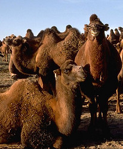
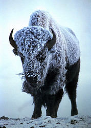

---
aliases:
- Artiodactyla
- Paarhufer
- Artiodactyls
- Artiodactyl
- Cetartiodactyl
- anoplothere
- cainotheriid
- merycoidodont
- entelodont
- anthracother
- basilosaurid
- palaeomerycid
code_of_nomenclature: '[[_Standards/WikiData/WD~International_Code_of_Zoological_Nomenclature,13011]]'
Commons_category: Artiodactyla
described_by_source:
- '[[_Standards/WikiData/WD~Brockhaus_and_Efron_Encyclopedic_Dictionary,602358]]'
- '[[_Standards/WikiData/WD~Encyclopædia_Britannica_11th_edition,867541]]'
EPPO_Code: 1ARTIO
has_id_wikidata: Q25329
image: "http://commons.wikimedia.org/wiki/Special:FilePath/Aepyceros%20melampus%20-%20001.jpg"
instance_of: '[[_Standards/WikiData/WD~taxon,16521]]'
ITIS_TSN: 180692
MeSH_tree_code: B01.050.150.900.649.313.500
montage_image: "http://commons.wikimedia.org/wiki/Special:FilePath/The%20Cetartiodactyla.jpg"
name: "even-toed ungulate"
NBN_System_Key: NHMSYS0000376178
parent_taxon: '[[_Standards/WikiData/WD~Paraxonia,68119354]]'
start_time: -55000000-01-01
taxon_common_name:
- klovdyr
- artadachtail
taxon_name: Artiodactyla
taxon_rank: '[[_Standards/WikiData/WD~order,36602]]'
taxon_synonym: '[[_Standards/WikiData/WD~Cetartiodactyla,27850]]'
title: Artiodactyla
---

# [[Artiodactyla]]

## Even-toed ungulates 

    ) 

#is_/same_as :: [[../../../../../../../../../../../../../../../../../WikiData/WD~Artiodactyla,25329|WD~Artiodactyla,25329]] 

## #has_/text_of_/abstract 

> Artiodactyls are placental mammals belonging to the order **Artiodactyla** 
> ( AR-tee-oh-DAK-tih-lə, from Ancient Greek  ἄρτιος, ártios 'even' and  δάκτυλος, dáktylos 'finger, toe'). 
> 
> Typically, they are ungulates which bear weight equally on two (an even number) of their five toes 
> (the third and fourth, often in the form of a hoof). 
> The other three toes are either present, absent, vestigial, or pointing posteriorly. 
> 
> By contrast, most perissodactyls bear weight on an odd number of the five toes. 
> Another difference between the two orders is that many artiodactyls (except for Suina) 
> digest plant cellulose in one or more stomach chambers rather than in their intestine (as perissodactyls do). 
> 
> Molecular biology, along with new fossil discoveries, has found that cetaceans (whales, dolphins, 
> and porpoises) fall within this taxonomic branch, being most closely related to hippopotamuses. 
> Some modern taxonomists thus apply the name Cetartiodactyla to this group, 
> while others opt to include cetaceans within the existing name of Artiodactyla. 
> 
> Some researchers use "even-toed ungulates" to exclude cetaceans 
> and only include terrestrial artiodactyls, making the term paraphyletic in nature.
>
> The roughly 270 land-based even-toed ungulate species include pigs, peccaries, hippopotamuses, antelopes, deer, giraffes, camels, llamas, alpacas, sheep, goats and cattle. 
> 
> Many are herbivores, but suids are omnivorous, and cetaceans are entirely carnivorous. 
> Artiodactyls are also known by many extinct groups such as anoplotheres, cainotheriids, merycoidodonts, entelodonts, anthracotheres, basilosaurids, and palaeomerycids. 
> 
> Many artiodactyls are of great dietary, economic, and cultural importance to humans.
>
> [Wikipedia](https://en.wikipedia.org/wiki/Artiodactyl) 

## Phylogeny 

-   « Ancestral Groups  
    -  [Eutheria](../Eutheria.md))
    -  [Mammal](../../Mammal.md))
    -   [Therapsida](../../../Therapsida.md)
    -   [Synapsida](../../../../Synapsida.md)
    -   [Amniota](../../../../../Amniota.md)
    -   [Terrestrial Vertebrates](../../../../../../Terrestrial.md)
    -   [Sarcopterygii](../../../../../../../Sarc.md)
    -   [Gnathostomata](../../../../../../../../Gnath.md)
    -   [Vertebrata](../../../../../../../../../Vertebrata.md)
    -   [Craniata](../../../../../../../../../../Craniata.md)
    -   [Chordata](../../../../../../../../../../../Chordata.md)
    -   [Deuterostomia](../../../../../../../../../../../../Deutero.md)
    -  [Bilateria](../../../../../../../../../../../../../Bilateria.md))
    -  [Animals](../../../../../../../../../../../../../../Animals.md))
    -  [Eukarya](../../../../../../../../../../../../../../../Eukarya.md))
    -   [Tree of Life](../../../../../../../../../../../../../../../Tree_of_Life.md)

-   ◊ Sibling Groups of  Eutheria
    -   [Edentata](Edentata.md)
    -   [Pholidota](Pholidota.md)
    -  [Lagomorpha](Glires/Lagomorpha.md))
    -   [Rodentia](Rodentia.md)
    -   [Macroscelididae](Macroscelididae.md)
    -   [Primates](Primates.md)
    -   [Scandentia](Scandentia.md)
    -   [Chiroptera](Chiroptera.md)
    -   [Dermoptera](Dermoptera.md)
    -   [Insectivora](Insectivora.md)
    -   [Carnivora](Carnivora.md)
    -   Artiodactyla
    -   [Whale](Whale.md)
    -   [Tubulidentata](Tubulidentata.md)
    -   [Perissodactyla](Perissodactyla.md)
    -   [Hyracoidea](Hyracoidea.md)
    -   [Sirenia](Sirenia.md)
    -   [Proboscidea](Eukarya/Animal/Bilateria/Deutero/Chordata/Craniata/Vertebrata/Gnath/Sarc/Terrestrial/Amniota/Synapsida/Therapsida/Mammal/Eutheria/Proboscidea.md)

-   » Sub-Groups
    -  [Suidae](Artiodactyla/Suidae.md))
    -  [Tayassuidae](Artiodactyla/Tayassuidae.md))
    -  [Hippopotamidae](Artiodactyla/Hippopotamidae.md))
    -  [Tylopoda](Artiodactyla/Tylopoda.md))
    -   [Ruminants](Artiodactyla/Ruminants.md)
    -   [Miscellaneous fossil         artiodactyls](Miscellaneous_fossil_artiodactyls)

### Information on the Internet

-   [Introduction to the     Artiodactyla](http://www.ucmp.berkeley.edu/mammal/artio/artiodactyla.html).
    UCMP Berkeley.
-   [Order     Artiodactyla](http://animaldiversity.ummz.umich.edu/chordata/mammalia/artiodactyla.html).
    Animal Diversity Web. University of Michigan Museum of Zoology.
-   [Artiodactyla](http://www.ultimateungulate.com/artiodactyla.html).
    The Ultimate Ungulate Page.
-   [Transitional Vertebrate Fossils: Artiodactyls (cloven-hoofed     animals)](http://www.talkorigins.org/faqs/faq-transitional/part2c.html).
    The Talk.Origins Archive.
-   [Cetartiodactyla](http://www.isem.univ-montp2.fr/PPP/PM/RES/Phylo/Cet/@Cetartiodactyla.php).
    Molecular Phylogeny Group.
-   [Artiodactyla: Whose Tooth is     This?](http://www.flmnh.ufl.edu/natsci/vertpaleo/resources/fossil_id/art_id.htm)
    Information about the teeth of fossil Florida artiodactyls. Florida
    Museum of Natural History.
-   [Pigs, Peccaries, and Hippos Specialist Group     Report](http://iucn.org/themes/ssc/sgs/pphsg/home.htm). IUCN - The
    World Conservation Union. Species Survival Commission.

## Title Illustrations

------------------------------------------------------------------------------

Scientific Name ::     Camelus bactrianus
Location ::           Gobi Desert (Mongolia)
Creator              Robert Thomas and Margaret Orr
Specimen Condition   Live Specimen
Source Collection    [CalPhotos](http://calphotos.berkeley.edu/)
Copyright ::            © 2001 [California Academy of Sciences](http://www.calacademy.org/) 

------------------------------------------------------------------------------

Scientific Name ::     Potamochoerus porcus
Location ::           Arusha, Tanzania
Comments             Young captive specimen probably from the Mt Meru population.
Specimen Condition   Live Specimen
Identified By        David Bygott
Life Cycle Stage ::     Young adult
View                 Lateral
Copyright ::            © 2005 [David Bygott](mailto:davidbygott@yahoo.com) 

-------------------)
Scientific Name ::     Bison bison
Comments             American bison
Creator              Steve Maslowski
Acknowledgements     Photo courtesy U. S. Fish and Wildlife Service
Specimen Condition   Live Specimen

## Confidential Links & Embeds: 

### #is_/same_as :: [Artiodactyla](/_Standards/bio/bio~Domain/Eukarya/Animal/Bilateria/Deutero/Chordata/Craniata/Vertebrata/Gnath/Sarc/Tetrapods/Amniota/Synapsida/Therapsida/Mammal/Eutheria/Artiodactyla.md) 

### #is_/same_as :: [Artiodactyla.public](/_public/bio/bio~Domain/Eukarya/Animal/Bilateria/Deutero/Chordata/Craniata/Vertebrata/Gnath/Sarc/Tetrapods/Amniota/Synapsida/Therapsida/Mammal/Eutheria/Artiodactyla.public.md) 

### #is_/same_as :: [Artiodactyla.internal](/_internal/bio/bio~Domain/Eukarya/Animal/Bilateria/Deutero/Chordata/Craniata/Vertebrata/Gnath/Sarc/Tetrapods/Amniota/Synapsida/Therapsida/Mammal/Eutheria/Artiodactyla.internal.md) 

### #is_/same_as :: [Artiodactyla.protect](/_protect/bio/bio~Domain/Eukarya/Animal/Bilateria/Deutero/Chordata/Craniata/Vertebrata/Gnath/Sarc/Tetrapods/Amniota/Synapsida/Therapsida/Mammal/Eutheria/Artiodactyla.protect.md) 

### #is_/same_as :: [Artiodactyla.private](/_private/bio/bio~Domain/Eukarya/Animal/Bilateria/Deutero/Chordata/Craniata/Vertebrata/Gnath/Sarc/Tetrapods/Amniota/Synapsida/Therapsida/Mammal/Eutheria/Artiodactyla.private.md) 

### #is_/same_as :: [Artiodactyla.personal](/_personal/bio/bio~Domain/Eukarya/Animal/Bilateria/Deutero/Chordata/Craniata/Vertebrata/Gnath/Sarc/Tetrapods/Amniota/Synapsida/Therapsida/Mammal/Eutheria/Artiodactyla.personal.md) 

### #is_/same_as :: [Artiodactyla.secret](/_secret/bio/bio~Domain/Eukarya/Animal/Bilateria/Deutero/Chordata/Craniata/Vertebrata/Gnath/Sarc/Tetrapods/Amniota/Synapsida/Therapsida/Mammal/Eutheria/Artiodactyla.secret.md)

