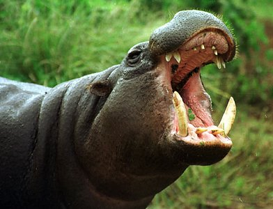
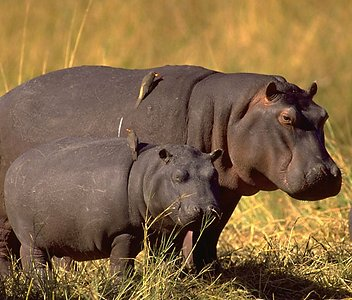

---
aliases:
  - Hippopotamidae
title: Hippopotamidae
---

# [[Hippopotamidae]] 

 
 

## #has_/text_of_/abstract 

> **Hippopotamidae** is a family of stout, naked-skinned, and semiaquatic artiodactyl mammals, 
> possessing three-chambered stomachs and walking on four toes on each foot. 
> 
> While they resemble pigs physiologically, their closest living relatives are the cetaceans. 
> They are formally referred to as hippopotamids.
>
> There are two living species of hippopotamid in two genera; 
> - the pygmy hippo, Choeropsis liberiensis of the forests of west Africa, and 
> - the common hippo, Hippopotamus amphibius. 
> 
> The term hippopotamus can also be applied to hippopotamids in general, 
> although it is most frequently used for the common hippo and its respective genus.
>
> [Wikipedia](https://en.wikipedia.org/wiki/Hippopotamidae) 

### Information on the Internet

-   [Animal Diversity Web: Family     Hippopotamidae](http://animaldiversity.ummz.umich.edu/site/accounts/information/Hippopotamidae.html)
-   [ARKive - *Hippopotamus     amphibius*](http://www.arkive.org/species/GES/mammals/Hippopotamus_amphibius/)
-   [Hippos: Wildlife summary from the African Wildlife     Foundation](http://www.awf.org/wildlives/140)
-   [IUCN Pigs, Peccaries and Hippopotamus Specialist     group](http://www.iucn.org/themes/ssc/sgs/pphsg/APchap3-1.htm)

## Phylogeny 

-   « Ancestral Groups  
    -  [Artiodactyla](../Artiodactyla.md) 
    -  [Eutheria](../../Eutheria.md) 
    -  [Mammal](../../../Mammal.md) 
    -   [Therapsida](../../../../Therapsida.md)
    -   [Synapsida](../../../../../Synapsida.md)
    -   [Amniota](../../../../../../Amniota.md)
    -   [Terrestrial Vertebrates](../../../../../../../Terrestrial.md)
    -   [Sarcopterygii](../../../../../../../../Sarc.md)
    -   [Gnathostomata](../../../../../../../../../Gnath.md)
    -   [Vertebrata](../../../../../../../../../../Vertebrata.md)
    -   [Craniata](../../../../../../../../../../../Craniata.md)
    -   [Chordata](../../../../../../../../../../../../Chordata.md)
    -   [Deuterostomia](../../../../../../../../../../../../../Deutero.md)
    -  [Bilateria](../../../../../../../../../../../../../../Bilateria.md) 
    -  [Animals](../../../../../../../../../../../../../../../Animals.md) 
    -  [Eukarya](../../../../../../../../../../../../../../../../Eukarya.md) 
    -   [Tree of Life](../../../../../../../../../../../../../../../../Tree_of_Life.md)

-   ◊ Sibling Groups of  Artiodactyla
    -   [Suid](Suid.md)
    -   [Tayassuidae](Tayassuidae.md)
    -   Hippopotamidae
    -   [Tylopoda](Tylopoda.md)
    -   [Ruminants](Ruminants.md)
    -   [Miscellaneous fossil         artiodactyls](Miscellaneous_fossil_artiodactyls)

-   » Sub-Groups 

## Title Illustrations

-------------------------------------------------------------------------
Scientific Name ::     Hexaprotodon liberiensis
Location ::           Mk Kenya Safari Club, Kenya
Comments             This captive originated in West Africa.
Specimen Condition   Live Specimen
Identified By        David Bygott
Behavior             Displaying tusks
Sex ::                Male
Life Cycle Stage ::     Adult
Body Part            Head
View                 Fronto-lateral
Copyright ::            © 2005 [David Bygott](mailto:davidbygott@yahoo.com) 

-------------------------------------------------------------------------

Scientific Name ::     Hippopotamus amphibius
Location ::           Okavango Delta of Botswana
Comments             hippo adult and 3-4-month-old juvenile on bank
Specimen Condition   Live Specimen
Copyright ::            © 1993 [Greg and Marybeth Dimijian](http://www.dimijianimages.com/) 

## Confidential Links & Embeds: 

### #is_/same_as :: [[/_Standards/bio/bio~Domain/Eukarya/Animal/Bilateria/Deutero/Chordata/Craniata/Vertebrata/Gnath/Sarc/Tetrapods/Amniota/Synapsida/Therapsida/Mammal/Eutheria/Artiodactyla/Hippopotamidae|Hippopotamidae]] 

### #is_/same_as :: [[/_public/bio/bio~Domain/Eukarya/Animal/Bilateria/Deutero/Chordata/Craniata/Vertebrata/Gnath/Sarc/Tetrapods/Amniota/Synapsida/Therapsida/Mammal/Eutheria/Artiodactyla/Hippopotamidae.public|Hippopotamidae.public]] 

### #is_/same_as :: [[/_internal/bio/bio~Domain/Eukarya/Animal/Bilateria/Deutero/Chordata/Craniata/Vertebrata/Gnath/Sarc/Tetrapods/Amniota/Synapsida/Therapsida/Mammal/Eutheria/Artiodactyla/Hippopotamidae.internal|Hippopotamidae.internal]] 

### #is_/same_as :: [[/_protect/bio/bio~Domain/Eukarya/Animal/Bilateria/Deutero/Chordata/Craniata/Vertebrata/Gnath/Sarc/Tetrapods/Amniota/Synapsida/Therapsida/Mammal/Eutheria/Artiodactyla/Hippopotamidae.protect|Hippopotamidae.protect]] 

### #is_/same_as :: [[/_private/bio/bio~Domain/Eukarya/Animal/Bilateria/Deutero/Chordata/Craniata/Vertebrata/Gnath/Sarc/Tetrapods/Amniota/Synapsida/Therapsida/Mammal/Eutheria/Artiodactyla/Hippopotamidae.private|Hippopotamidae.private]] 

### #is_/same_as :: [[/_personal/bio/bio~Domain/Eukarya/Animal/Bilateria/Deutero/Chordata/Craniata/Vertebrata/Gnath/Sarc/Tetrapods/Amniota/Synapsida/Therapsida/Mammal/Eutheria/Artiodactyla/Hippopotamidae.personal|Hippopotamidae.personal]] 

### #is_/same_as :: [[/_secret/bio/bio~Domain/Eukarya/Animal/Bilateria/Deutero/Chordata/Craniata/Vertebrata/Gnath/Sarc/Tetrapods/Amniota/Synapsida/Therapsida/Mammal/Eutheria/Artiodactyla/Hippopotamidae.secret|Hippopotamidae.secret]] 

