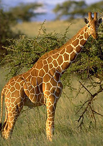
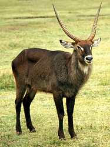

---
aliases:
- Atgremotāji
- Atrajotojai
- Biby mandinika
- Daier
- drøvtyggere
- Déieren, déi idderzen
- Firemavedrøvtygger
- Gevişgetirenler
- Gövşəyənlər
- Hausnarkari
- herkauwers
- hewan pemamah biak
- idisslare
- jortedyr
- Jórturdýr
- Kavsh qaytaruvchilar
- Kwetjkauern
- kérődzők
- Kéwan nggayemi
- Küýis qaýıratındar
- mäletsejalised
- märehtijät
- Oñamindu'uva
- Phân bộ Nhai lại
- Preživari
- Preživači
- Prežúvavce
- przeżuwacze
- přežvýkaví
- Remaĉuloj
- Remugant
- roemiant
- Rumegătoare
- Ruminan
- Ruminansia
- Ruminant
- Ruminante
- Ruminantes
- Ruminantia
- Ruminants
- smieretteijeeh
- smirezastit
- Timesluffaẓ
- Wiederkäuer
- Wjerkôgers
- Ƶovandaho
- Μηρυκαστικά
- жвачные
- жвачныя
- Жовандаҳо
- Жуйкавыя
- жуйні
- Кепшөөчүлөр
- Күйіс қайыратындар
- күшәүчеләр
- Көйшәүселәр
- нохдохурш
- нух хьекхаду
- преживари
- преживни
- Որոճողներ
- מעלי גירה
- بهايم لي كايجرو
- كۇيىس قايىراتىندار
- مجترات
- نشخوارکنندگان
- อันดับย่อยสัตว์เคี้ยวเอื้อง
- စားမြုံပြန်ကောင်
- მცოხნელები
- ウシ亜目
- 反刍亚目
- 反芻亞目
- 反芻動物
- 반추류
has_id_wikidata: Q192164
title: Ruminantia
dv_has_:
  name_:
    an: Ruminantia
    ar: مجترات
    ary: بهايم لي كايجرو
    arz: مجترات
    ast: Ruminantia
    az: Gövşəyənlər
    ba: Көйшәүселәр
    ban: Ruminantia
    be: жвачныя
    be-tarask: Жуйкавыя
    bg: преживни
    bjn: Ruminansia
    ca: Remugant
    ce: нохдохурш
    ceb: Ruminantia
    cs: přežvýkaví
    da: Firemavedrøvtygger
    de: Wiederkäuer
    el: Μηρυκαστικά
    en: ruminants
    en-ca: Ruminantia
    en-gb: Ruminantia
    eo: Remaĉuloj
    es: Ruminantia
    et: mäletsejalised
    eu: Hausnarkari
    ext: Ruminantia
    fa: نشخوارکنندگان
    fi: märehtijät
    fr: Ruminantia
    frr: Kwetjkauern
    fy: Wjerkôgers
    ga: Ruminantia
    gl: Ruminante
    gn: Oñamindu'uva
    gsw: Daier
    he: מעלי גירה
    hr: Preživači
    hu: kérődzők
    hy: Որոճողներ
    ia: Ruminantia
    id: hewan pemamah biak
    ie: Ruminantia
    inh: нух хьекхаду
    io: Ruminantia
    is: Jórturdýr
    it: Ruminantia
    ja: ウシ亜目
    jv: Kéwan nggayemi
    ka: მცოხნელები
    kab: Timesluffaẓ
    kk: Күйіс қайыратындар
    kk-arab: كۇيىس قايىراتىندار
    kk-cn: كۇيىس قايىراتىندار
    kk-cyrl: Күйіс қайыратындар
    kk-kz: Күйіс қайыратындар
    kk-latn: Küýis qaýıratındar
    kk-tr: Küýis qaýıratındar
    ko: 반추류
    ky: Кепшөөчүлөр
    la: Ruminantia
    lb: Déieren, déi idderzen
    lt: Atrajotojai
    lv: Atgremotāji
    mg: Biby mandinika
    mk: преживари
    ms: Ruminan
    mul: Ruminantia
    my: စားမြုံပြန်ကောင်
    nb: drøvtyggere
    nl: herkauwers
    nn: jortedyr
    oc: Ruminantia
    pl: przeżuwacze
    pt: Ruminantes
    pt-br: Ruminantia
    ro: Rumegătoare
    ru: жвачные
    sco: Ruminantia
    se: smirezastit
    sh: Preživači
    sk: Prežúvavce
    sl: Ruminantia
    smn: smieretteijeeh
    sq: Ruminantia
    sr: Preživari
    sv: idisslare
    tg: Жовандаҳо
    tg-latn: Ƶovandaho
    th: อันดับย่อยสัตว์เคี้ยวเอื้อง
    tl: Ruminantia
    tr: Gevişgetirenler
    tt: күшәүчеләр
    uk: жуйні
    uz: Kavsh qaytaruvchilar
    vi: Phân bộ Nhai lại
    vls: Herkauwers
    vo: Ruminantia
    wa: roemiant
    war: Ruminantia
    wuu: 反刍亚目
    yue: 反芻動物
    zh: 反刍亚目
    zh-cn: 反刍亚目
    zh-hans: 反刍亚目
    zh-hant: 反芻亞目
    zh-hk: 反芻亞目
    zh-sg: 反刍亚目
    zh-tw: 反芻亞目
---
# [[Ruminants]] 

      

#is_/same_as :: [[../../../../../../../../../../../../../../../../../../WikiData/WD~Ruminantia,192164|WD~Ruminantia,192164]] 

## #has_/text_of_/abstract 

> Ruminants are herbivorous grazing or browsing artiodactyls 
> belonging to the suborder **Ruminantia** that are able to acquire nutrients from plant-based food 
> by fermenting it in a specialized stomach prior to digestion, principally through microbial actions. 
> The process, which takes place in the front part of the digestive system 
> and therefore is called foregut fermentation, 
> typically requires the fermented ingesta (known as cud) to be regurgitated and chewed again. 
> 
> The process of rechewing the cud to further break down plant matter 
> and stimulate digestion is called rumination. 
> The word "ruminant" comes from the Latin ruminare, which means "to chew over again".
>
> The roughly 200 species of ruminants include both domestic and wild species. Ruminating mammals include cattle, all domesticated and wild bovines, goats, sheep, giraffes, deer, gazelles, and antelopes. It has also been suggested that notoungulates also relied on rumination, as opposed to other atlantogenatans that rely on the more typical hindgut fermentation, though this is not entirely certain.
>
> Ruminants represent the most diverse group of living ungulates. The suborder Ruminantia includes six different families: Tragulidae, Giraffidae, Antilocapridae, Cervidae, Moschidae, and Bovidae.
>
> [Wikipedia](https://en.wikipedia.org/wiki/Ruminant) 

## Phylogeny 

-   « Ancestral Groups  
    -  [Artiodactyla](../Artiodactyla.md) 
    -  [Eutheria](../../Eutheria.md) 
    -  [Mammal](../../../Mammal.md) 
    -   [Therapsida](../../../../Therapsida.md)
    -   [Synapsida](../../../../../Synapsida.md)
    -   [Amniota](../../../../../../Amniota.md)
    -   [Terrestrial Vertebrates](../../../../../../../Terrestrial.md)
    -   [Sarcopterygii](../../../../../../../../Sarc.md)
    -   [Gnathostomata](../../../../../../../../../Gnath.md)
    -   [Vertebrata](../../../../../../../../../../Vertebrata.md)
    -   [Craniata](../../../../../../../../../../../Craniata.md)
    -   [Chordata](../../../../../../../../../../../../Chordata.md)
    -   [Deuterostomia](../../../../../../../../../../../../../Deutero.md)
    -  [Bilateria](../../../../../../../../../../../../../../Bilateria.md) 
    -  [Animals](../../../../../../../../../../../../../../../Animals.md) 
    -  [Eukarya](../../../../../../../../../../../../../../../../Eukarya.md) 
    -   [Tree of Life](../../../../../../../../../../../../../../../../Tree_of_Life.md)

-   ◊ Sibling Groups of  Artiodactyla
    -   [Suid](Suid.md)
    -   [Tayassuidae](Tayassuidae.md)
    -   [Hippopotamidae](Hippopotamidae.md)
    -   [Tylopoda](Tylopoda.md)
    -   Ruminantia
    -   [Miscellaneous fossil         artiodactyls](Miscellaneous_fossil_artiodactyls)

-   » Sub-Groups
    -   [Bovidae](Ruminants/Bovidae.md)
    -   [Moschidae](Ruminants/Moschidae.md)
    -   [Giraffoidea](Ruminants/Giraffoidea.md)
    -   [Antilocapridae](Ruminants/Antilocapridae.md)
    -   [Miscellaneous fossil         pecorans](Miscellaneous_fossil_pecorans)
    -   [Tragulidae](Ruminants/Tragulidae.md)

## Title Illustrations

----------------------------------

scientific_name ::     Giraffa camelopardalis reticulata
location ::           Samburu National Park (Kenya)
Creator              Gerald and Buff Corsi
specimen_condition ::  Live Specimen
Source Collection    [CalPhotos](http://calphotos.berkeley.edu/)
copyright ::            © 1999 [California Academy of Sciences](http://www.calacademy.org/) 

------------------------------------------------------------------------------ 
 
scientific_name ::     Kobus ellipsiprymnus
location ::           East Africa
Comments             waterbuck
Acknowledgements     Photograph courtesy [InsectImages.org](http://www.insectimages.org/) (#4321001)
specimen_condition ::  Live Specimen
Sex ::                Male
Life Cycle Stage ::     adult
Source Collection    [InsectImages.org](http://www.insectimages.org/)
copyright ::            © Kenneth M. Gale

------------------------------

scientific_name ::     Cervus elaphus
Reference            Photograph courtesy [Yellowstone Digital Slide](http://www.nps.gov/yell/slidefile/index.htm)
Creator              Ed Austin/Herb Jones
specimen_condition ::  Live Specimen
Sex ::                Male

## Confidential Links & Embeds: 

### #is_/same_as :: [[/_Standards/bio/bio~Domain/Eukarya/Animal/Bilateria/Deutero/Chordata/Craniata/Vertebrata/Gnath/Sarc/Tetrapods/Amniota/Synapsida/Therapsida/Mammal/Eutheria/Artiodactyla/Ruminants|Ruminants]] 

### #is_/same_as :: [[/_public/bio/bio~Domain/Eukarya/Animal/Bilateria/Deutero/Chordata/Craniata/Vertebrata/Gnath/Sarc/Tetrapods/Amniota/Synapsida/Therapsida/Mammal/Eutheria/Artiodactyla/Ruminants.public|Ruminants.public]] 

### #is_/same_as :: [[/_internal/bio/bio~Domain/Eukarya/Animal/Bilateria/Deutero/Chordata/Craniata/Vertebrata/Gnath/Sarc/Tetrapods/Amniota/Synapsida/Therapsida/Mammal/Eutheria/Artiodactyla/Ruminants.internal|Ruminants.internal]] 

### #is_/same_as :: [[/_protect/bio/bio~Domain/Eukarya/Animal/Bilateria/Deutero/Chordata/Craniata/Vertebrata/Gnath/Sarc/Tetrapods/Amniota/Synapsida/Therapsida/Mammal/Eutheria/Artiodactyla/Ruminants.protect|Ruminants.protect]] 

### #is_/same_as :: [[/_private/bio/bio~Domain/Eukarya/Animal/Bilateria/Deutero/Chordata/Craniata/Vertebrata/Gnath/Sarc/Tetrapods/Amniota/Synapsida/Therapsida/Mammal/Eutheria/Artiodactyla/Ruminants.private|Ruminants.private]] 

### #is_/same_as :: [[/_personal/bio/bio~Domain/Eukarya/Animal/Bilateria/Deutero/Chordata/Craniata/Vertebrata/Gnath/Sarc/Tetrapods/Amniota/Synapsida/Therapsida/Mammal/Eutheria/Artiodactyla/Ruminants.personal|Ruminants.personal]] 

### #is_/same_as :: [[/_secret/bio/bio~Domain/Eukarya/Animal/Bilateria/Deutero/Chordata/Craniata/Vertebrata/Gnath/Sarc/Tetrapods/Amniota/Synapsida/Therapsida/Mammal/Eutheria/Artiodactyla/Ruminants.secret|Ruminants.secret]] 

