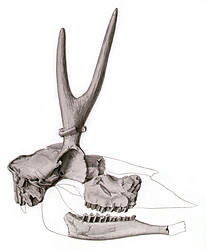

---
aliases:
- Antilocapridae
- antilocàprids
- Antilokapredoj
- gaffelantilopen
- hanka-antiloopit
- harksarviklased
- Haçabuynuzlar
- kinzoleem
- syeriantiloopeh
- Vidlorohovité
- vidlorohovití
- villásszarvúantilop-félék
- Widłorogowate
- Šakiaraginiai
- Ашамүйізділер
- Віларогавыя
- вилороги
- Вилорогові
- вилорогови
- Вилороговые
- אנטילוקפריים
- شاخچنگالان
- ظباء شائكة القرون
- プロングホーン科
- 叉角羚科
- 영양붙이과
title: Antilocapridae
has_id_wikidata: Q3581369
dv_has_:
  name_:
    an: Antilocapridae
    ar: ظباء شائكة القرون
    arz: ظباء شائكة القرون
    ast: Antilocapridae
    avk: kinzoleem
    az: Haçabuynuzlar
    be_tarask: Віларогавыя
    bg: вилорогови
    ca: antilocàprids
    ceb: Antilocapridae
    cs: vidlorohovití
    de: Antilocapridae
    en: Antilocapridae
    eo: Antilokapredoj
    es: Antilocapridae
    et: harksarviklased
    eu: Antilocapridae
    ext: Antilocapridae
    fa: شاخچنگالان
    fi: hanka-antiloopit
    fr: Antilocapridae
    ga: Antilocapridae
    gl: Antilocapridae
    he: אנטילוקפריים
    hu: villásszarvúantilop-félék
    ia: Antilocapridae
    id: Antilocapridae
    ie: Antilocapridae
    io: Antilocapridae
    it: Antilocapridae
    ja: プロングホーン科
    kk: Ашамүйізділер
    ko: 영양붙이과
    la: Antilocapridae
    lt: Šakiaraginiai
    mk: вилороги
    ms: Antilocapridae
    mul: Antilocapridae
    nl: gaffelantilopen
    oc: Antilocapridae
    pl: Widłorogowate
    pt: Antilocapridae
    pt_br: Antilocapridae
    ro: Antilocapridae
    ru: Вилороговые
    sk: Vidlorohovité
    smn: syeriantiloopeh
    sq: Antilocapridae
    tr: Antilocapridae
    uk: Вилорогові
    vi: Antilocapridae
    vo: Antilocapridae
    war: Antilocapridae
    zh: 叉角羚科
    zh_cn: 叉角羚科
    zh_hans: 叉角羚科
    zh_tw: 叉角羚科
---

# [[Antilocapridae]] 
 

## #has_/text_of_/abstract 

> The **Antilocapridae** are a family of ruminant artiodactyls endemic to North America. 
> Their closest extant relatives are the giraffids. 
> 
> Only one species, the pronghorn (Antilocapra americana), is living today; 
> all other members of the family are extinct. 
> The living pronghorn is a small ruminant mammal resembling an antelope.
>
> [Wikipedia](https://en.wikipedia.org/wiki/Antilocapridae) 

## Phylogeny 

-   « Ancestral Groups  
    -   [Ruminants](../Ruminants.md)
    -  [Artiodactyla](../../Artiodactyla.md) 
    -  [Eutheria](../../../Eutheria.md) 
    -  [Mammal](../../../../Mammal.md) 
    -   [Therapsida](../../../../../Therapsida.md)
    -   [Synapsida](../../../../../../Synapsida.md)
    -   [Amniota](../../../../../../../Amniota.md)
    -   [Terrestrial Vertebrates](../../../../../../../../Terrestrial.md)
    -   [Sarcopterygii](../../../../../../../../../Sarc.md)
    -   [Gnathostomata](../../../../../../../../../../Gnath.md)
    -   [Vertebrata](../../../../../../../../../../../Vertebrata.md)
    -   [Craniata](../../../../../../../../../../../../Craniata.md)
    -   [Chordata](../../../../../../../../../../../../../Chordata.md)
    -   [Deuterostomia](../../../../../../../../../../../../../../Deutero.md)
    -  [Bilateria](../../../../../../../../../../../../../../../Bilateria.md) 
    -  [Animals](../../../../../../../../../../../../../../../../Animals.md) 
    -  [Eukarya](../../../../../../../../../../../../../../../../../Eukarya.md) 
    -   [Tree of Life](../../../../../../../../../../../../../../../../../Tree_of_Life.md)

-   ◊ Sibling Groups of  Ruminantia
    -   [Bovidae](Bovidae.md)
    -   [Moschidae](Moschidae.md)
    -   [Giraffoidea](Giraffoidea.md)
    -   Antilocapridae
    -   [Miscellaneous fossil         pecorans](Miscellaneous_fossil_pecorans)
    -   [Tragulidae](Tragulidae.md)

-   » Sub-Groups
    -  [Antilocapra americana](Antilocapridae/Antilocapra.md) 
	-   *Ceratomeryx* †
	-   *Cosoryx* †
	-   *Hayoceros* †
	-   *Hexameryx* †
	-   *Hexobelomeryx* †
	-   *Ilingoceros* †
	-   *Merriamoceros* †
	-   *Merycodus* †
	-   *Osbornoceros* †
	-   *Ottoceros* †
	-   *Paracosoryx* †
	-   *Plioceros* †
	-   *Proantilocapra* †
	-   *Ramoceros* †
	-   *Sphenophalos* †
	-   *Stockoceros* †
	-   *Subantilocapra* †
	-   *Tetrameryx* †
	-   *Texoceros* †

### Information on the Internet

-   [Hagerman: Where the Deer and the Antilocaprids     Played](http://www.nps.gov/hafo/crittercorner/antiloc.htm). Hagerman
    Fossil Beds\' CRITTER CORNER by Dr. Greg McDonald.

## Title Illustrations

----------------------------------------------------------------------------

scientific_name ::     Capromeryx mexicana
location ::           near Tequixquiac, Mexico
Reference            Furlong, E. L. 1925. Notes on the occurrence of mammalian remains in the Pleistocene of Mexico, with a description of a new species Capromeryx mexicana. University of California Publications in Geological Science 15(5):137-152.
specimen_condition ::  Fossil
Body Part            skull
View                 lateral
Type                 holotype

---------------------------------------------------------------------------- 
 
scientific_name ::     Merycodus necatus
location ::           Barstow, San Bernardino County, California, USA
Reference            Furlong, E. L. 1927. The occurrence and phylogenetic status of Merycodus from the Mohave Desert Tertiary. University of California Publications. Bulletin of the Department of Geological Sciences 17(4):145-186.
specimen_condition ::  Fossil
Body Part            skull
View                 lateral

-----------------------------------------------------------------------
 
scientific_name ::     Antilocapra americana
Comments             pronghorn
Creator              Photograph by James C. Leupold
Acknowledgements     Photograph courtesy of the U.S. Fish and Wildlife Service
specimen_condition ::  Live Specimen
Sex ::                Male

## Confidential Links & Embeds: 

### #is_/same_as :: [[/_Standards/bio/bio~Domain/Eukarya/Animal/Bilateria/Deutero/Chordata/Craniata/Vertebrata/Gnath/Sarc/Tetrapods/Amniota/Synapsida/Therapsida/Mammal/Eutheria/Artiodactyla/Ruminants/Antilocapridae|Antilocapridae]] 

### #is_/same_as :: [[/_public/bio/bio~Domain/Eukarya/Animal/Bilateria/Deutero/Chordata/Craniata/Vertebrata/Gnath/Sarc/Tetrapods/Amniota/Synapsida/Therapsida/Mammal/Eutheria/Artiodactyla/Ruminants/Antilocapridae.public|Antilocapridae.public]] 

### #is_/same_as :: [[/_internal/bio/bio~Domain/Eukarya/Animal/Bilateria/Deutero/Chordata/Craniata/Vertebrata/Gnath/Sarc/Tetrapods/Amniota/Synapsida/Therapsida/Mammal/Eutheria/Artiodactyla/Ruminants/Antilocapridae.internal|Antilocapridae.internal]] 

### #is_/same_as :: [[/_protect/bio/bio~Domain/Eukarya/Animal/Bilateria/Deutero/Chordata/Craniata/Vertebrata/Gnath/Sarc/Tetrapods/Amniota/Synapsida/Therapsida/Mammal/Eutheria/Artiodactyla/Ruminants/Antilocapridae.protect|Antilocapridae.protect]] 

### #is_/same_as :: [[/_private/bio/bio~Domain/Eukarya/Animal/Bilateria/Deutero/Chordata/Craniata/Vertebrata/Gnath/Sarc/Tetrapods/Amniota/Synapsida/Therapsida/Mammal/Eutheria/Artiodactyla/Ruminants/Antilocapridae.private|Antilocapridae.private]] 

### #is_/same_as :: [[/_personal/bio/bio~Domain/Eukarya/Animal/Bilateria/Deutero/Chordata/Craniata/Vertebrata/Gnath/Sarc/Tetrapods/Amniota/Synapsida/Therapsida/Mammal/Eutheria/Artiodactyla/Ruminants/Antilocapridae.personal|Antilocapridae.personal]] 

### #is_/same_as :: [[/_secret/bio/bio~Domain/Eukarya/Animal/Bilateria/Deutero/Chordata/Craniata/Vertebrata/Gnath/Sarc/Tetrapods/Amniota/Synapsida/Therapsida/Mammal/Eutheria/Artiodactyla/Ruminants/Antilocapridae.secret|Antilocapridae.secret]] 

