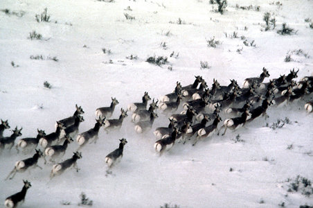
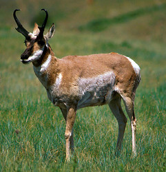

---
aliases:
- antelope-goat
- Antilocapra
- Kinzol (Antilocapra)
- شاخچنگالها
has_id_wikidata: Q19817351
title: Antilocapra americana
dv_has_:
  name_:
    an: Antilocapra
    ast: Antilocapra
    avk: Kinzol (Antilocapra)
    bg: Antilocapra
    ca: Antilocapra
    ceb: Antilocapra
    de: Antilocapra
    en: Antilocapra
    eo: Antilocapra
    es: Antilocapra
    eu: Antilocapra
    ext: Antilocapra
    fa: شاخچنگالها
    fi: Antilocapra
    fr: Antilocapra
    ga: Antilocapra
    gl: Antilocapra
    hu: Antilocapra
    ia: Antilocapra
    id: Antilocapra
    ie: Antilocapra
    io: Antilocapra
    it: Antilocapra
    la: Antilocapra
    mul: Antilocapra
    nl: Antilocapra
    oc: Antilocapra
    pl: Antilocapra
    pt: Antilocapra
    pt-br: Antilocapra
    ro: Antilocapra
    ru: Antilocapra
    sq: Antilocapra
    tr: Antilocapra
    uk: Antilocapra
    vi: Antilocapra
    vo: Antilocapra
    war: Antilocapra
---
# [[Antilocapra]] 

#is_/same_as :: [[../../../../../../../../../../../../../../../../../../../../WikiData/WD~Antilocapra,19817351|WD~Antilocapra,19817351]] 

## Pronghorn, American antelope 

## #has_/text_of_/abstract 

> **Antilocapra** is a genus of the family Antilocapridae, which contains only a single living species, the pronghorn (Antilocapra americana). 
> Another species, the Pacific pronghorn, lived in California during the Late Pleistocene and survived as recently as 12,000 BP. 
> The name means "antelope-goat".
>
> Antilocapra is the only surviving genus of pronghorn, though three other genera  (Capromeryx, Stockoceros and Tetrameryx) existed in North America up until the end of the Pleistocene.
>
> [Wikipedia](https://en.wikipedia.org/wiki/Antilocapra) 

## Phylogeny 

-   « Ancestral Groups  
    -   [Antilocapridae](../Antilocapridae.md)
    -   [Ruminants](../../Ruminants.md)
    -  [Artiodactyla](../../../Artiodactyla.md) 
    -  [Eutheria](../../../../Eutheria.md) 
    -  [Mammal](../../../../../Mammal.md) 
    -   [Therapsida](../../../../../../Therapsida.md)
    -   [Synapsida](../../../../../../../Synapsida.md)
    -   [Amniota](../../../../../../../../Amniota.md)
    -   [Terrestrial Vertebrates](../../../../../../../../../Terrestrial.md)
    -   [Sarcopterygii](../../../../../../../../../../Sarc.md)
    -   [Gnathostomata](../../../../../../../../../../../Gnath.md)
    -   [Vertebrata](../../../../../../../../../../../../Vertebrata.md)
    -   [Craniata](../../../../../../../../../../../../../Craniata.md)
    -   [Chordata](../../../../../../../../../../../../../../Chordata.md)
    -   [Deuterostomia](../../../../../../../../../../../../../../../Deutero.md)
    -  [Bilateria](../../../../../../../../../../../../../../../../Bilateria.md) 
    -  [Animals](../../../../../../../../../../../../../../../../../Animals.md) 
    -  [Eukarya](../../../../../../../../../../../../../../../../../../Eukarya.md) 
    -   [Tree of Life](../../../../../../../../../../../../../../../../../../Tree_of_Life.md)

-   ◊ Sibling Groups of  Antilocapridae
    -   Antilocapra americana

-   » Sub-Groups 

-   *Antilocapra americana americana*
-   *Antilocapra americana mexicana*
-   *Antilocapra americana peninsularis* [(peninsular
    pronghorn)]
-   *Antilocapra americana sonoriensis* [(Sonoran
    pronghorn)]

Containing group: [Antilocapridae](../Antilocapridae.md)

### Information on the Internet

-   [Pronghorns\--Survivors of the American     Savanna](http://nationalzoo.si.edu/Publications/ZooGoer/2001/6/pronghornssavanna.cfm).
    Article by Alex Hawes. ZooGoer 30(6) 2001. Friends of the National
    Zoo.
-   [Antilocapra americana     (pronghorn)](http://animaldiversity.ummz.umich.edu/site/accounts/information/Antilocapra_americana.html).
    Animal Diversity Web.

## Title Illustrations 

----------------------------------

scientific_name ::     Antilocapra americana
Reference            Photograph courtesy [Yellowstone Digital Slide](http://www.nps.gov/yell/slidefile/index.htm)
Creator              JR Douglass
specimen_condition ::  Live Specimen

----------------------------------

scientific_name ::     Antilocapra americana
Creator              Photograph by H. Hoops
Acknowledgements     Photograph courtesy of the U.S. Fish and Wildlife Service
specimen_condition ::  Live Specimen

## Confidential Links & Embeds: 

### #is_/same_as :: [[/_Standards/bio/bio~Domain/Eukarya/Animal/Bilateria/Deutero/Chordata/Craniata/Vertebrata/Gnath/Sarc/Tetrapods/Amniota/Synapsida/Therapsida/Mammal/Eutheria/Artiodactyla/Ruminants/Antilocapridae/Antilocapra|Antilocapra]] 

### #is_/same_as :: [[/_public/bio/bio~Domain/Eukarya/Animal/Bilateria/Deutero/Chordata/Craniata/Vertebrata/Gnath/Sarc/Tetrapods/Amniota/Synapsida/Therapsida/Mammal/Eutheria/Artiodactyla/Ruminants/Antilocapridae/Antilocapra.public|Antilocapra.public]] 

### #is_/same_as :: [[/_internal/bio/bio~Domain/Eukarya/Animal/Bilateria/Deutero/Chordata/Craniata/Vertebrata/Gnath/Sarc/Tetrapods/Amniota/Synapsida/Therapsida/Mammal/Eutheria/Artiodactyla/Ruminants/Antilocapridae/Antilocapra.internal|Antilocapra.internal]] 

### #is_/same_as :: [[/_protect/bio/bio~Domain/Eukarya/Animal/Bilateria/Deutero/Chordata/Craniata/Vertebrata/Gnath/Sarc/Tetrapods/Amniota/Synapsida/Therapsida/Mammal/Eutheria/Artiodactyla/Ruminants/Antilocapridae/Antilocapra.protect|Antilocapra.protect]] 

### #is_/same_as :: [[/_private/bio/bio~Domain/Eukarya/Animal/Bilateria/Deutero/Chordata/Craniata/Vertebrata/Gnath/Sarc/Tetrapods/Amniota/Synapsida/Therapsida/Mammal/Eutheria/Artiodactyla/Ruminants/Antilocapridae/Antilocapra.private|Antilocapra.private]] 

### #is_/same_as :: [[/_personal/bio/bio~Domain/Eukarya/Animal/Bilateria/Deutero/Chordata/Craniata/Vertebrata/Gnath/Sarc/Tetrapods/Amniota/Synapsida/Therapsida/Mammal/Eutheria/Artiodactyla/Ruminants/Antilocapridae/Antilocapra.personal|Antilocapra.personal]] 

### #is_/same_as :: [[/_secret/bio/bio~Domain/Eukarya/Animal/Bilateria/Deutero/Chordata/Craniata/Vertebrata/Gnath/Sarc/Tetrapods/Amniota/Synapsida/Therapsida/Mammal/Eutheria/Artiodactyla/Ruminants/Antilocapridae/Antilocapra.secret|Antilocapra.secret]] 

