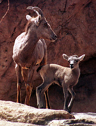
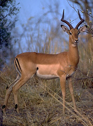
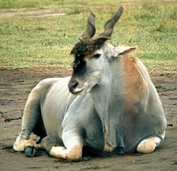

---
aliases:
  - Bovidae: ''
  - Bovidae
has_id_wikidata: Q25497
title:
  Bovidae: ''
confidential: private
cssclasses:
  - private
  - note
draft: true
excalidraw_autoexport: svg
excalidraw_open_md: true
excalidraw_plugin: parsed
expiryDate: ''
has_Template: '[[Extract~Note~Template]]'
has_time_started:
  '{ "date:YYYY-MM-DD": null }': ''
isDeleted: false
isReadOnly: false
keywords:
  Bovidae: ''
lang: en
layout: ''
license: (c)copyrighted
linkTitle:
  Bovidae: ''
publish: false
publishDate: ''
tags:
  - Bovidae: ''
  - excalidraw
type: private_note
---

# [[Bovidae]]

#is_/same_as :: [[../../../../../../../../../../../../../../../../../../../WikiData/WD~Bovidae,25497|WD~Bovidae,25497]] 
## Cattle, sheep, goats, and antelopes 

 

## #has_/text_of_/abstract 

> The **Bovidae** comprise the biological family of cloven-hoofed, ruminant mammals that includes 
> cattle, bison, buffalo, antelopes (including goat-antelopes), sheep and goats. 
> 
> A member of this family is called a bovid. With 143 extant species and 300 known extinct species, the family Bovidae consists of 11 (or two) major subfamilies and thirteen major tribes. The family evolved 20 million years ago, in the early Miocene.
>
> The bovids show great variation in size and pelage colouration. 
> Except some domesticated forms, all male bovids have two or more horns, 
> and in many species, females possess horns, too. 
> The size and shape of the horns vary greatly, 
> but the basic structure is always one or more pairs of simple bony protrusions without branches, 
> often having a spiral, twisted or fluted form, each covered in a permanent sheath of keratin. 
> Most bovids bear 30 to 32 teeth.
>
> Most bovids are diurnal. 
> Social activity and feeding usually peak during dawn and dusk. 
> Bovids typically rest before dawn, during midday, and after dark. 
> They have various methods of social organisation and social behaviour, 
> which are classified into solitary and gregarious behaviour. 
> 
> Bovids use different forms of vocal, olfactory, and tangible communication. 
> Most species alternately feed and ruminate throughout the day. 
> While small bovids forage in dense and closed habitat, 
> larger species feed on high-fiber vegetation in open grasslands. 
> 
> Most bovids are polygynous. Mature bovids mate at least once a year and smaller species may even mate twice. In some species, neonate bovids remain hidden for a week to two months, regularly nursed by their mothers; in other species, neonates are followers, accompanying their dams, rather than tending to remain hidden.
>
> The greatest diversities of bovids occur in Africa. The maximum concentration of species is in the savannas of Eastern Africa. Other bovid species also occur in Europe, Asia, and North America. Bovidae includes a number of domesticated species, including three whose use has spread worldwide, namely cattle, sheep, and goats. Dairy products, such as milk, butter, and cheese, are manufactured largely from domestic cattle. Bovids are also raised for their leather, meat, and wool.
>
> [Wikipedia](https://en.wikipedia.org/wiki/Bovidae) 

### Information on the Internet

-   [Antelope Specialist Group Report](http://www.asg-antelope.org/).
    IUCN - The World Conservation Union. Species Survival Commission.

### Distribution

Africa, Europe, Asia, North America.

## Phylogeny 

-   « Ancestral Groups  
    -   [Ruminants](../Ruminants.md)
    -  [Artiodactyla](../../Artiodactyla.md))
    -  [Eutheria](../../../Eutheria.md))
    -  [Mammal](../../../../Mammal.md))
    -   [Therapsida](../../../../../Therapsida.md)
    -   [Synapsida](../../../../../../Synapsida.md)
    -   [Amniota](../../../../../../../Amniota.md)
    -   [Terrestrial Vertebrates](../../../../../../../../Terrestrial.md)
    -   [Sarcopterygii](../../../../../../../../../Sarc.md)
    -   [Gnathostomata](../../../../../../../../../../Gnath.md)
    -   [Vertebrata](../../../../../../../../../../../Vertebrata.md)
    -   [Craniata](../../../../../../../../../../../../Craniata.md)
    -   [Chordata](../../../../../../../../../../../../../Chordata.md)
    -   [Deuterostomia](../../../../../../../../../../../../../../Deutero.md)
    -  [Bilateria](../../../../../../../../../../../../../../../Bilateria.md))
    -  [Animals](../../../../../../../../../../../../../../../../Animals.md))
    -  [Eukarya](../../../../../../../../../../../../../../../../../Eukarya.md))
    -   [Tree of Life](../../../../../../../../../../../../../../../../../Tree_of_Life.md)

-   ◊ Sibling Groups of  Ruminantia
    -   Bovidae
    -   [Moschidae](Moschidae.md)
    -   [Giraffoidea](Giraffoidea.md)
    -   [Antilocapridae](Antilocapridae.md)
    -   [Miscellaneous fossil         pecorans](Miscellaneous_fossil_pecorans)
    -   [Tragulidae](Tragulidae.md)

-   » Sub-Groups
    -   [Oreotragus oreotragus](Oreotragus_oreotragus)
    -   [Alcelaphinae](Bovidae/Alcelaphinae.md)
    -   [Hippotraginae](Bovidae/Hippotraginae.md)
    -   [Caprinae](Bovidae/Caprinae.md)
    -   [Aepyceros melampus](Bovidae/Impala.md)
    -   [Cephalophinae](Bovidae/Cephalophinae.md)
    -   [Reduncinae](Bovidae/Reduncinae.md)
    -   [Antelope](Bovidae/Antelope.md)
    -   [Neotragus](Bovidae/Neotragus.md)
    -   [Miscellaneous fossil         bovids](Miscellaneous_fossil_bovids)

## Title Illustrations

-------------------------------------------------------------------------)
Scientific Name ::     Ovis canadensis
Location ::           Arizona Sonora Desert Museum, Tucson, USA
Comments             Mother with month-old lamb
Specimen Condition   Live Specimen
Identified By        David Bygott
Sex ::                Female
Life Cycle Stage ::     Adult and young
Copyright ::            © 2005 [David Bygott](mailto:davidbygott@yahoo.com) 

-------------------------------------------------------------------------
 
Scientific Name ::     Aepyceros melampus
Location ::           Okavango Delta, Botswana
Comments             impala
Specimen Condition   Live Specimen
Copyright ::            © 1991 [Greg and Marybeth Dimijian](http://www.dimijianimages.com/) 

------------------------------------------------------------------------------

Scientific Name ::     Taurotragus oryx
Location ::           Ngorogoro Wildlife Lodge, Tanzania
Acknowledgements     Photograph courtesy [InsectImages.org](http://www.insectimages.org/) (#4321056)
Specimen Condition   Live Specimen
Source Collection    [InsectImages.org](http://www.insectimages.org/)
Copyright ::            © Kenneth M. Gale

## Confidential Links & Embeds: 

### #is_/same_as :: [Bovidae](/_Standards/bio/bio~Domain/Eukarya/Animal/Bilateria/Deutero/Chordata/Craniata/Vertebrata/Gnath/Sarc/Tetrapods/Amniota/Synapsida/Therapsida/Mammal/Eutheria/Artiodactyla/Ruminants/Bovidae.md) 

### #is_/same_as :: [Bovidae.public](/_public/bio/bio~Domain/Eukarya/Animal/Bilateria/Deutero/Chordata/Craniata/Vertebrata/Gnath/Sarc/Tetrapods/Amniota/Synapsida/Therapsida/Mammal/Eutheria/Artiodactyla/Ruminants/Bovidae.public.md) 

### #is_/same_as :: [Bovidae.internal](/_internal/bio/bio~Domain/Eukarya/Animal/Bilateria/Deutero/Chordata/Craniata/Vertebrata/Gnath/Sarc/Tetrapods/Amniota/Synapsida/Therapsida/Mammal/Eutheria/Artiodactyla/Ruminants/Bovidae.internal.md) 

### #is_/same_as :: [Bovidae.protect](/_protect/bio/bio~Domain/Eukarya/Animal/Bilateria/Deutero/Chordata/Craniata/Vertebrata/Gnath/Sarc/Tetrapods/Amniota/Synapsida/Therapsida/Mammal/Eutheria/Artiodactyla/Ruminants/Bovidae.protect.md) 

### #is_/same_as :: [Bovidae.private](/_private/bio/bio~Domain/Eukarya/Animal/Bilateria/Deutero/Chordata/Craniata/Vertebrata/Gnath/Sarc/Tetrapods/Amniota/Synapsida/Therapsida/Mammal/Eutheria/Artiodactyla/Ruminants/Bovidae.private.md) 

### #is_/same_as :: [Bovidae.personal](/_personal/bio/bio~Domain/Eukarya/Animal/Bilateria/Deutero/Chordata/Craniata/Vertebrata/Gnath/Sarc/Tetrapods/Amniota/Synapsida/Therapsida/Mammal/Eutheria/Artiodactyla/Ruminants/Bovidae.personal.md) 

### #is_/same_as :: [Bovidae.secret](/_secret/bio/bio~Domain/Eukarya/Animal/Bilateria/Deutero/Chordata/Craniata/Vertebrata/Gnath/Sarc/Tetrapods/Amniota/Synapsida/Therapsida/Mammal/Eutheria/Artiodactyla/Ruminants/Bovidae.secret.md)

