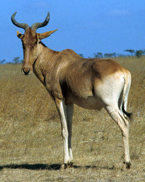

---
aliases:
- "Alcelaphus buselaphus"
- kongoni
- kaama
- Hartebeest
title: "Alcelaphus buselaphus"
---

# Alcelaphus buselaphus 
)

## #has_/text_of_/abstract 

> The hartebeest (; **Alcelaphus buselaphus**), also known as kongoni or kaama, is an African antelope. 
> It is the only member of the genus Alcelaphus. 
> Eight subspecies have been described, including two sometimes considered to be independent species. A large antelope, the hartebeest stands just over 1 m (3 ft 3 in) at the shoulder, and has a typical head-and-body length of 200 to 250 cm (79 to 98 in). The weight ranges from 100 to 200 kg (220 to 440 lb). It has a particularly elongated forehead and oddly-shaped horns, a short neck, and pointed ears. Its legs, which often have black markings, are unusually long. The coat is generally short and shiny. Coat colour varies by the subspecies, from the sandy brown of the western hartebeest to the chocolate brown of the Swayne's hartebeest. Both sexes of all subspecies have horns, with those of females being more slender. Horns can reach lengths of 45–70 cm (18–28 in). Apart from its long face, the large chest and the sharply sloping back differentiate the hartebeest from other antelopes. A conspicuous hump over the shoulders is due to the long dorsal processes of the vertebrae in this region.
>
> Gregarious animals, hartebeest form herds of 20 to 300 individuals. They are very alert and non-aggressive. They are primarily grazers, with their diets consisting mainly of grasses. Mating in hartebeest takes place throughout the year with one or two peaks, and depends upon the subspecies and local factors. Both males and females reach sexual maturity at one to two years of age. Gestation is eight to nine months long, after which a single calf is born. Births usually peak in the dry season. The lifespan is 12 to 15 years.
>
> Inhabiting dry savannas and wooded grasslands, hartebeest often move to more arid places after rainfall. They have been reported from altitudes on Mount Kenya up to 4,000 m (13,000 ft). The hartebeest was formerly widespread in Africa, but populations have undergone a drastic decline due to habitat destruction, hunting, human settlement, and competition with livestock for food. Each of the eight subspecies of the hartebeest has a different conservation status. The Bubal hartebeest was declared extinct by the International Union for Conservation of Nature (IUCN) in 1994. While the populations of the red hartebeest are on the rise, those of the Tora hartebeest, already Critically Endangered, are falling. The hartebeest is extinct in Algeria, Egypt, Lesotho, Libya, Morocco, Somalia, and Tunisia; but has been introduced into Eswatini and Zimbabwe. It is a popular game animal due to its highly regarded meat.
>
> [Wikipedia](https://en.wikipedia.org/wiki/Hartebeest) 

## Phylogeny 

-   « Ancestral Groups  
    -   [Alcelaphinae](../Alcelaphinae.md)
    -   [Bovidae](../../Bovidae.md)
    -   [Ruminants](../../../Ruminants.md)
    -  [Artiodactyla](../../../../Artiodactyla.md))
    -  [Eutheria](../../../../../Eutheria.md))
    -  [Mammal](../../../../../../Mammal.md))
    -   [Therapsida](../../../../../../../Therapsida.md)
    -   [Synapsida](../../../../../../../../Synapsida.md)
    -   [Amniota](../../../../../../../../../Amniota.md)
    -   [Terrestrial Vertebrates](../../../../../../../../../../Terrestrial.md)
    -   [Sarcopterygii](../../../../../../../../../../../Sarc.md)
    -   [Gnathostomata](../../../../../../../../../../../../Gnath.md)
    -   [Vertebrata](../../../../../../../../../../../../../Vertebrata.md)
    -   [Craniata](../../../../../../../../../../../../../../Craniata.md)
    -   [Chordata](../../../../../../../../../../../../../../../Chordata.md)
    -   [Deuterostomia](../../../../../../../../../../../../../../../../Deutero.md)
    -  [Bilateria](../../../../../../../../../../../../../../../../../Bilateria.md))
    -  [Animals](../../../../../../../../../../../../../../../../../../Animals.md))
    -  [Eukarya](../../../../../../../../../../../../../../../../../../../Eukarya.md))
    -   [Tree of Life](../../../../../../../../../../../../../../../../../../../Tree_of_Life.md)

-   ◊ Sibling Groups of  Alcelaphinae
    -   [Connochaetes taurinus](Connochaetes_taurinus)
    -   [Damaliscus lunatus](Damaliscus_lunatus)
    -   [Damaliscus pygargus](Damaliscus_pygargus)
    -   Alcelaphus buselaphus

-   » Sub-Groups 

## Title Illustrations

------------------------------)
Scientific Name ::     Alcelaphus buselaphus
Location ::           Kenya
Comments             Hartbebeest
Acknowledgements     Photograph courtesy [InsectImages.org](http://www.insectimages.org/) (#1428038)
Specimen Condition   Live Specimen
Source Collection    [InsectImages.org](http://www.insectimages.org/)
Copyright ::            © William M. Ciesla, Forest Health Management International

## Confidential Links & Embeds: 

### #is_/same_as ::[Hartebeest](Hartebeest.md)) 

### #is_/same_as :: [Hartebeest.public](/_public/bio/bio~Domain/Eukarya/Animal/Bilateria/Deutero/Chordata/Craniata/Vertebrata/Gnath/Sarc/Tetrapods/Amniota/Synapsida/Therapsida/Mammal/Eutheria/Artiodactyla/Ruminants/Bovidae/Alcelaphinae/Hartebeest.public.md) 

### #is_/same_as :: [Hartebeest.internal](/_internal/bio/bio~Domain/Eukarya/Animal/Bilateria/Deutero/Chordata/Craniata/Vertebrata/Gnath/Sarc/Tetrapods/Amniota/Synapsida/Therapsida/Mammal/Eutheria/Artiodactyla/Ruminants/Bovidae/Alcelaphinae/Hartebeest.internal.md) 

### #is_/same_as :: [Hartebeest.protect](/_protect/bio/bio~Domain/Eukarya/Animal/Bilateria/Deutero/Chordata/Craniata/Vertebrata/Gnath/Sarc/Tetrapods/Amniota/Synapsida/Therapsida/Mammal/Eutheria/Artiodactyla/Ruminants/Bovidae/Alcelaphinae/Hartebeest.protect.md) 

### #is_/same_as :: [Hartebeest.private](/_private/bio/bio~Domain/Eukarya/Animal/Bilateria/Deutero/Chordata/Craniata/Vertebrata/Gnath/Sarc/Tetrapods/Amniota/Synapsida/Therapsida/Mammal/Eutheria/Artiodactyla/Ruminants/Bovidae/Alcelaphinae/Hartebeest.private.md) 

### #is_/same_as :: [Hartebeest.personal](/_personal/bio/bio~Domain/Eukarya/Animal/Bilateria/Deutero/Chordata/Craniata/Vertebrata/Gnath/Sarc/Tetrapods/Amniota/Synapsida/Therapsida/Mammal/Eutheria/Artiodactyla/Ruminants/Bovidae/Alcelaphinae/Hartebeest.personal.md) 

### #is_/same_as :: [Hartebeest.secret](/_secret/bio/bio~Domain/Eukarya/Animal/Bilateria/Deutero/Chordata/Craniata/Vertebrata/Gnath/Sarc/Tetrapods/Amniota/Synapsida/Therapsida/Mammal/Eutheria/Artiodactyla/Ruminants/Bovidae/Alcelaphinae/Hartebeest.secret.md)

