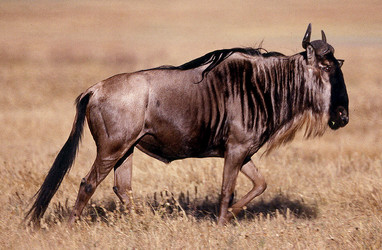

---
aliases:
- Agnu
- antilopes gnu
- Antilopės gnu
- Bualgarow
- Connochaetes
- Connochaetes taurinus
- eyundoleem
- Gno
- gnoes
- Gnou
- gnu
- gnuer
- Gnuo
- Gnuovi
- Gnus
- gnuud
- Gnuus
- gnuut
- gnú
- Jádí dághaaʼígíí
- Kgokong
- Linh dương đầu bò
- Ngongoni
- nyu
- Nyumbu
- Pakôň
- pakůň
- Qnu
- Wildebeast
- Wildebees
- Wildebeest
- ñu
- Ñu (mymba)
- Γκνου
- антилопа гну
- гну
- Гнулар
- гнута
- גנו
- ئاسکی ڕیشدار
- جنگلی بینسا
- نو
- پاڑا
- گاو وحشی
- विल्डबीस्ट
- ਵਿਲਡਬੀਸਟ
- വിൽഡെബീസ്റ്റ്
- วิลเดอบีสต์
- ဆတ်ကျွဲ
- გნუ
- ወንደቢ
- ヌー
- 牛羚
- 角马
- 누
has_id_wikidata: Q7609
title: Connochaetes taurinus
parent_taxon: '[[_Standards/WikiData/WD~Alcelaphinae,615263]]'
described_by_source:
- "[[_Standards/WikiData/WD~Otto's_encyclopedia,2041543]]"
- '[[_Standards/WikiData/WD~Great_Soviet_Encyclopedia_(1926_1947),20078554]]'
instance_of: '[[_Standards/WikiData/WD~taxon,16521]]'
endemic_to: '[[_Standards/WikiData/WD~Africa,15]]'
longest_observed_lifespan: 20
litter_size: 1.5
taxon_rank: '[[_Standards/WikiData/WD~genus,34740]]'
period_of_lactation: 7.5
gestation_period: 8.5
OmegaWiki_Defined_Meaning: 7294
taxon_common_name:
- гну
- ñu
- антилопа гну
ITIS_TSN: 624963
start_time: -2500000-01-01T00:00:00Z
image: http://commons.wikimedia.org/wiki/Special:FilePath/Blue%20Wildebeest%2C%20Ngorongoro.jpg
taxon_range_map_image: http://commons.wikimedia.org/wiki/Special:FilePath/Connochaetes%20map.png
EPPO_Code: 1CONNG
Iconclass_notation: 25F24(GNU)
Commons_category: Connochaetes
taxon_name: Connochaetes
dv_has_:
  name_:
    af: Wildebees
    am: ወንደቢ
    ar: نو
    arz: نو
    ast: Connochaetes
    av: Гну
    avk: eyundoleem
    az: Qnu
    ba: Гну
    ban: Gnu
    be_tarask: гну
    bg: гнута
    br: Gnou
    ca: nyu
    ceb: Connochaetes
    ckb: ئاسکی ڕیشدار
    cs: pakůň
    da: gnu
    de: Gnus
    el: Γκνου
    en: wildebeest
    en_ca: Wildebeest
    en_gb: wildebeest
    eo: Gnuo
    es: Connochaetes
    et: gnuud
    eu: Ñu
    fa: گاو وحشی
    fi: gnuut
    fr: gnou
    frr: Gnuus
    ga: gnú
    gd: Wildebeest
    gl: ñu
    gn: Ñu (mymba)
    he: גנו
    hi: विल्डबीस्ट
    hr: Gnu
    hu: gnú
    ia: gnu
    id: Nyumbu
    io: Gnuo
    it: Connochaetes
    ja: ヌー
    jv: Gnu
    ka: გნუ
    kab: Agnu
    kk: Гнулар
    ko: 누
    kw: Bualgarow
    ky: Гну
    la: Connochaetes
    lez: Гну
    lt: Antilopės gnu
    lv: antilopes gnu
    mg: Gno
    mhr: Гну
    mk: гну
    ml: വിൽഡെബീസ്റ്റ്
    ms: Gnu
    mul: Connochaetes
    mwl: Ñu
    my: ဆတ်ကျွဲ
    nb: gnuer
    nl: gnoes
    nn: gnu
    nso: Kgokong
    nv: Jádí dághaaʼígíí
    oc: Gno
    pa: ਵਿਲਡਬੀਸਟ
    pl: Gnu
    pnb: جنگلی بینسا
    pt: gnu
    pt_br: Gnu
    qu: Ñu
    ro: Connochaetes
    ru: Гну
    sh: Gnuovi
    sk: Pakôň
    sl: Gnu
    sn: Ngongoni
    sq: Connochaetes
    sr: гну
    sr_ec: Гну
    sv: Gnuer
    sw: Nyumbu
    th: วิลเดอบีสต์
    tl: Gnu
    tr: Gnu
    tt: Гну
    udm: Гну
    uk: Гну
    ur: پاڑا
    uz: Gnu
    vi: Linh dương đầu bò
    war: Connochaetes
    wuu: 角马
    yue: 牛羚
    zh: 角马
    zh_tw: 牛羚
---
# [[Wildebeest]] 

#is_/same_as :: [[../../../../../../../../../../../../../../../../../../../../../WikiData/WD~Wildebeest,7609|WD~Wildebeest,7609]]  

## #has_/text_of_/abstract 

> **Wildebeest** ( WIL-di-beest,  VIL-,), also called gnu ( NOO or NEW), 
> are antelopes of the genus Connochaetes and native to Eastern and Southern Africa. 
> 
> They belong to the family Bovidae, which includes 
> true antelopes, cattle, goats, sheep, and other even-toed horned ungulates. 
> 
> There are two species of wildebeest: 
> - the black wildebeest or white-tailed gnu (C. gnou), and 
> - the blue wildebeest or brindled gnu (C. taurinus).
>
> Fossil records suggest these two species diverged about one million years ago, 
> resulting in a northern and a southern species. 
> 
> The blue wildebeest remained in its original range 
> and changed very little from the ancestral species, 
> while the black wildebeest changed more 
> as adaptation to its open grassland habitat in the south. 
> 
> The most obvious ways of telling the two species apart 
> are the differences in their colouring and in the way their horns are oriented.
>
> In East Africa, the blue wildebeest is the most abundant big-game species; 
> some populations perform an annual migration to new grazing grounds, 
> but the black wildebeest is merely nomadic. 
> 
> Breeding in both takes place over a short period of time 
> at the end of the rainy season and the calves are soon active 
> and are able to move with the herd, a fact necessary for their survival. 
> Nevertheless, some fall prey to large carnivores, especially the spotted hyena.
>
> Wildebeest often graze in mixed herds with zebras, which gives heightened awareness of potential predators. They are also alert to the warning signals emitted by other animals such as baboons. Wildebeest are a tourist attraction but compete with domesticated livestock for pasture and are sometimes blamed by farmers for transferring diseases and parasites to their cattle. Illegal hunting does take place but the population trend is fairly stable. Wildebeest can also be found in national parks or on private land. The International Union for Conservation of Nature lists both kinds of wildebeest as least-concern species.
>
> [Wikipedia](https://en.wikipedia.org/wiki/Wildebeest) 

## Phylogeny 

-   « Ancestral Groups  
    -   [Alcelaphinae](../Alcelaphinae.md)
    -   [Bovidae](../../Bovidae.md)
    -   [Ruminants](../../../Ruminants.md)
    -  [Artiodactyla](../../../../Artiodactyla.md) 
    -  [Eutheria](../../../../../Eutheria.md) 
    -  [Mammal](../../../../../../Mammal.md) 
    -   [Therapsida](../../../../../../../Therapsida.md)
    -   [Synapsida](../../../../../../../../Synapsida.md)
    -   [Amniota](../../../../../../../../../Amniota.md)
    -   [Terrestrial Vertebrates](../../../../../../../../../../Terrestrial.md)
    -   [Sarcopterygii](../../../../../../../../../../../Sarc.md)
    -   [Gnathostomata](../../../../../../../../../../../../Gnath.md)
    -   [Vertebrata](../../../../../../../../../../../../../Vertebrata.md)
    -   [Craniata](../../../../../../../../../../../../../../Craniata.md)
    -   [Chordata](../../../../../../../../../../../../../../../Chordata.md)
    -   [Deuterostomia](../../../../../../../../../../../../../../../../Deutero.md)
    -  [Bilateria](../../../../../../../../../../../../../../../../../Bilateria.md) 
    -  [Animals](../../../../../../../../../../../../../../../../../../Animals.md) 
    -  [Eukarya](../../../../../../../../../../../../../../../../../../../Eukarya.md) 
    -   [Tree of Life](../../../../../../../../../../../../../../../../../../../Tree_of_Life.md)

-   ◊ Sibling Groups of  Alcelaphinae
    -   Connochaetes taurinus
    -   [Damaliscus lunatus](Damaliscus_lunatus)
    -   [Damaliscus pygargus](Damaliscus_pygargus)
    -   [Alcelaphus buselaphus](Alcelaphus_buselaphus)

-   » Sub-Groups 

## Title Illustrations

------------------------------------------------------------------------------

scientific_name ::  Connochaetes taurinus
location ::        Seronera area of Serengeti National Park, Tanzania
Behavior          wildebeest drinking in shallow stream
copyright ::         © 1989 [Greg and Marybeth Dimijian](http://www.dimijianimages.com/) 

## Confidential Links & Embeds: 

### #is_/same_as :: [[/_Standards/bio/bio~Domain/Eukarya/Animal/Bilateria/Deutero/Chordata/Craniata/Vertebrata/Gnath/Sarc/Tetrapods/Amniota/Synapsida/Therapsida/Mammal/Eutheria/Artiodactyla/Ruminants/Bovidae/Alcelaphinae/Wildebeest|Wildebeest]] 

### #is_/same_as :: [[/_public/bio/bio~Domain/Eukarya/Animal/Bilateria/Deutero/Chordata/Craniata/Vertebrata/Gnath/Sarc/Tetrapods/Amniota/Synapsida/Therapsida/Mammal/Eutheria/Artiodactyla/Ruminants/Bovidae/Alcelaphinae/Wildebeest.public|Wildebeest.public]] 

### #is_/same_as :: [[/_internal/bio/bio~Domain/Eukarya/Animal/Bilateria/Deutero/Chordata/Craniata/Vertebrata/Gnath/Sarc/Tetrapods/Amniota/Synapsida/Therapsida/Mammal/Eutheria/Artiodactyla/Ruminants/Bovidae/Alcelaphinae/Wildebeest.internal|Wildebeest.internal]] 

### #is_/same_as :: [[/_protect/bio/bio~Domain/Eukarya/Animal/Bilateria/Deutero/Chordata/Craniata/Vertebrata/Gnath/Sarc/Tetrapods/Amniota/Synapsida/Therapsida/Mammal/Eutheria/Artiodactyla/Ruminants/Bovidae/Alcelaphinae/Wildebeest.protect|Wildebeest.protect]] 

### #is_/same_as :: [[/_private/bio/bio~Domain/Eukarya/Animal/Bilateria/Deutero/Chordata/Craniata/Vertebrata/Gnath/Sarc/Tetrapods/Amniota/Synapsida/Therapsida/Mammal/Eutheria/Artiodactyla/Ruminants/Bovidae/Alcelaphinae/Wildebeest.private|Wildebeest.private]] 

### #is_/same_as :: [[/_personal/bio/bio~Domain/Eukarya/Animal/Bilateria/Deutero/Chordata/Craniata/Vertebrata/Gnath/Sarc/Tetrapods/Amniota/Synapsida/Therapsida/Mammal/Eutheria/Artiodactyla/Ruminants/Bovidae/Alcelaphinae/Wildebeest.personal|Wildebeest.personal]] 

### #is_/same_as :: [[/_secret/bio/bio~Domain/Eukarya/Animal/Bilateria/Deutero/Chordata/Craniata/Vertebrata/Gnath/Sarc/Tetrapods/Amniota/Synapsida/Therapsida/Mammal/Eutheria/Artiodactyla/Ruminants/Bovidae/Alcelaphinae/Wildebeest.secret|Wildebeest.secret]] 

