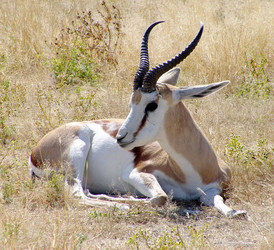
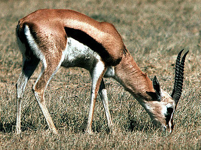
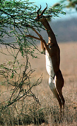

---
aliases:
  - Antelope
  - Antilopinae
has_id_wikidata: Q25894
title: Antilopinae
taxon_known_by_this_common_name:
  - '[[_Standards/WikiData/WD~Reduncinae,132631]]'
  - '[[_Standards/WikiData/WD~Pantholops_hodgsonii,272293]]'
  - '[[_Standards/WikiData/WD~duiker,273997]]'
  - '[[_Standards/WikiData/WD~Tragelaphus,311375]]'
  - '[[_Standards/WikiData/WD~Antilopinae,462736]]'
  - '[[_Standards/WikiData/WD~Alcelaphinae,615263]]'
  - '[[_Standards/WikiData/WD~Boselaphini,722385]]'
  - '[[_Standards/WikiData/WD~Hippotraginae,725271]]'
  - '[[_Standards/WikiData/WD~Aepycerotinae,2825559]]'
  - '[[_Standards/WikiData/WD~Nesotragus,26878806]]'
  - '[[_Standards/WikiData/WD~Oreotraginae,46998365]]'
described_by_source:
  - '[[../../../../../../../../../../../../../../../../../../../../WikiData/WD~Brockhaus_and_Efron_Encyclopedic_Dictionary,602358]]'
  - '[[_Standards/WikiData/WD~Encyclopædia_Britannica_11th_edition,867541]]'
  - '[[_Standards/WikiData/WD~New_International_Encyclopedia,1029706]]'
  - '[[_Standards/WikiData/WD~The_Nuttall_Encyclopædia,3181656]]'
  - "[[_Standards/WikiData/WD~The_New_Student's_Reference_Work,16082057]]"
  - '[[_Standards/WikiData/WD~Small_Brockhaus_and_Efron_Encyclopedic_Dictionary,19180675]]'
  - '[[_Standards/WikiData/WD~Meyers_Konversations_Lexikon,_4th_edition_(1885_1890),19219752]]'
  - '[[_Standards/WikiData/WD~Great_Soviet_Encyclopedia_(1926_1947),20078554]]'
  - '[[_Standards/WikiData/WD~Encyclopædia_Britannica_Ninth_Edition,20096917]]'
  - '[[_Standards/WikiData/WD~The_Domestic_Encyclopædia;_Or,_A_Dictionary_Of_Facts,_And_Useful_Knowledge,56441911]]'
  - '[[_Standards/WikiData/WD~Metropolitan_Museum_of_Art_Tagging_Vocabulary,106727050]]'
  - '[[_Standards/WikiData/WD~Armenian_Soviet_Encyclopedia,_vol._1,123560817]]'
  - '[[_Standards/WikiData/WD~Encyclopædia_Britannica,455]]'
different_from: '[[_Standards/WikiData/WD~deer,29838690]]'
instance_of: '[[_Standards/WikiData/WD~organisms_known_by_a_particular_common_name,55983715]]'
OmegaWiki_Defined_Meaning: 808314
image: http://commons.wikimedia.org/wiki/Special:FilePath/Blackbuck%20male%20female.jpg
U_S_National_Archives_Identifier: 10647854
Commons_category: Antelopes
MeSH_tree_code: B01.050.150.900.649.313.500.380.100
Krugosvet_article: nauka_i_tehnika/biologiya/ANTILOPI.html
---

# [[Antilopinae]] 

#is_/same_as :: [[../../../../../../../../../../../../../../../../../../../../WikiData/WD~Antelope,25894|WD~Antelope,25894]] 

## #has_/text_of_/abstract 

> **Antilopinae** is a subfamily of even-toed ungulates in the family Bovidae. 
> The members of tribe Antilopini are often referred to as true antelopes, 
> and include the gazelles, blackbucks, springboks, gerenuks, dibatags, and Central Asian gazelles. 
> 
> True antelopes occur in much of Africa and Asia, with the highest concentration of species occurring in East Africa in Sudan, Eritrea, Ethiopia, Somalia, Kenya, and Tanzania. 
> 
> The saiga (tribe Saigini) inhabits Central and Western Asia, 
> mostly in regions from the Tibetan Plateau and north of the Indian Subcontinent. 
> The dwarf antelope species of tribe Neotragini live entirely in sub-Saharan Africa.
>
> [Wikipedia](https://en.wikipedia.org/wiki/Antilopinae) 

## Phylogeny 

-   « Ancestral Groups  
    -   [Bovidae](../Bovidae.md)
    -   [Ruminants](../../Ruminants.md)
    -  [Artiodactyla](../../../Artiodactyla.md))
    -  [Eutheria](../../../../Eutheria.md))
    -  [Mammal](../../../../../Mammal.md))
    -   [Therapsida](../../../../../../Therapsida.md)
    -   [Synapsida](../../../../../../../Synapsida.md)
    -   [Amniota](../../../../../../../../Amniota.md)
    -   [Terrestrial Vertebrates](../../../../../../../../../Terrestrial.md)
    -   [Sarcopterygii](../../../../../../../../../../Sarc.md)
    -   [Gnathostomata](../../../../../../../../../../../Gnath.md)
    -   [Vertebrata](../../../../../../../../../../../../Vertebrata.md)
    -   [Craniata](../../../../../../../../../../../../../Craniata.md)
    -   [Chordata](../../../../../../../../../../../../../../Chordata.md)
    -   [Deuterostomia](../../../../../../../../../../../../../../../Deutero.md)
    -  [Bilateria](../../../../../../../../../../../../../../../../Bilateria.md))
    -  [Animals](../../../../../../../../../../../../../../../../../Animals.md))
    -  [Eukarya](../../../../../../../../../../../../../../../../../../Eukarya.md))
    -   [Tree of Life](../../../../../../../../../../../../../../../../../../Tree_of_Life.md)

-   ◊ Sibling Groups of  Bovidae
    -   [Oreotragus oreotragus](Oreotragus_oreotragus)
    -   [Alcelaphinae](Alcelaphinae.md)
    -   [Hippotraginae](Hippotraginae.md)
    -   [Caprinae](Caprinae.md)
    -   [Aepyceros melampus](Impala.md)
    -   [Cephalophinae](Cephalophinae.md)
    -   [Reduncinae](Reduncinae.md)
    -   Antilopinae
    -   [Neotragus](Neotragus.md)
    -   [Miscellaneous fossil         bovids](Miscellaneous_fossil_bovids)

-   » Sub-Groups
    -   [Gazelle](Antilopinae/Gazelle.md)
    -   [Ourebia ourebi](Ourebia_ourebi)
    -   [Antidorcas marsupialis](Antidorcas_marsupialis)
    -   [Antilope cervicapra](Antilope_cervicapra)
    -   [Litocranius walleri](Litocranius_walleri)
    -   [Dik-dik](Antilopinae/Dik-dik.md)
    -   [Procapra](Antilopinae/Procapra.md)
    -   [Raphicerus](Antilopinae/Raphicerus.md)

	-   *Dorcadoryx* †
	-   *Gazellospira* †
	-   *Hispanodorcas* †
	-   *Nisidorcas* †
	-   *Ouzocerus* †
	-   *Parastrepsiceros* †
	-   *Prostrepsiceros* †
	-   *Protragelaphus* †
	-   *Qurliqnoria* †
	-   *Sinapocerus* †
	-   *Sinoreas* †
	-   *Spirocerus* †
	-   *Tragospira* †

## Title Illustrations

------------------------------------------------------------------
 
Scientific Name ::     Antidorcas marsupialis
Location ::           Etosha National Park, Namibia
Acknowledgements     This image is licensed under the [Attribution-NonCommercial-ShareAlike 2.0 Creative Commons License](http://creativecommons.org/licenses/by-nc-sa/2.0/).
Specimen Condition   Live Specimen
Image Use ::    [Attribution-NonCommercial-ShareAlike 2.0 Creative Commons License](http://creativecommons.org/licenses/by-nc-sa/2.0/).
Copyright ::            © 2006 [Damien du Toit](http://flickr.com/people/coda/)

------------------------------------------------------------------
 
Location ::           Serengeti National Park, Tanzania
Comments             Thomson\'s gazelle is specialized to graze short grass, seeking the new shoots rich in water and protein.
Specimen Condition   Live Specimen
Identified By        David Bygott
Sex ::                Male
Life Cycle Stage ::     Adult
View                 Lateral
Copyright ::            © 2005 [David Bygott](mailto:davidbygott@yahoo.com) 

-------------------------------------------------------------------------

Scientific Name ::     Litocranius walleri
Location ::           Samburu Game Reserve, Kenya
Comments             The gerenuk or giraffe antelope has a long neck and the ability to stand on its hind legs. It can thus reach nutritious acacia foliage up to 2m above the ground, at times when all other vegetation is dry and brown.
Specimen Condition   Live Specimen
Identified By        David Bygott
Behavior             Feeding, standing bipedal
Sex ::                Male
Life Cycle Stage ::     Adult
View                 Ventral
Copyright ::            © 2005 [David Bygott](mailto:davidbygott@yahoo.com) 

## Confidential Links & Embeds: 

### #is_/same_as :: [Antelope](/_Standards/bio/bio~Domain/Eukarya/Animal/Bilateria/Deutero/Chordata/Craniata/Vertebrata/Gnath/Sarc/Tetrapods/Amniota/Synapsida/Therapsida/Mammal/Eutheria/Artiodactyla/Ruminants/Bovidae/Antelope.md) 

### #is_/same_as :: [Antelope.public](/_public/bio/bio~Domain/Eukarya/Animal/Bilateria/Deutero/Chordata/Craniata/Vertebrata/Gnath/Sarc/Tetrapods/Amniota/Synapsida/Therapsida/Mammal/Eutheria/Artiodactyla/Ruminants/Bovidae/Antelope.public.md) 

### #is_/same_as :: [Antelope.internal](/_internal/bio/bio~Domain/Eukarya/Animal/Bilateria/Deutero/Chordata/Craniata/Vertebrata/Gnath/Sarc/Tetrapods/Amniota/Synapsida/Therapsida/Mammal/Eutheria/Artiodactyla/Ruminants/Bovidae/Antelope.internal.md) 

### #is_/same_as :: [Antelope.protect](/_protect/bio/bio~Domain/Eukarya/Animal/Bilateria/Deutero/Chordata/Craniata/Vertebrata/Gnath/Sarc/Tetrapods/Amniota/Synapsida/Therapsida/Mammal/Eutheria/Artiodactyla/Ruminants/Bovidae/Antelope.protect.md) 

### #is_/same_as :: [Antelope.private](/_private/bio/bio~Domain/Eukarya/Animal/Bilateria/Deutero/Chordata/Craniata/Vertebrata/Gnath/Sarc/Tetrapods/Amniota/Synapsida/Therapsida/Mammal/Eutheria/Artiodactyla/Ruminants/Bovidae/Antelope.private.md) 

### #is_/same_as :: [Antelope.personal](/_personal/bio/bio~Domain/Eukarya/Animal/Bilateria/Deutero/Chordata/Craniata/Vertebrata/Gnath/Sarc/Tetrapods/Amniota/Synapsida/Therapsida/Mammal/Eutheria/Artiodactyla/Ruminants/Bovidae/Antelope.personal.md) 

### #is_/same_as :: [Antelope.secret](/_secret/bio/bio~Domain/Eukarya/Animal/Bilateria/Deutero/Chordata/Craniata/Vertebrata/Gnath/Sarc/Tetrapods/Amniota/Synapsida/Therapsida/Mammal/Eutheria/Artiodactyla/Ruminants/Bovidae/Antelope.secret.md)

