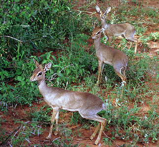

---
aliases:
  - Madoqua
  - dik-dik
  - Dik-dik
title: Madoqua
---

# [[Dik-dik]]

## dik-diks 

## #has_/text_of_/abstract 

> A dik-dik is the name for any of four species of small antelope in the genus **Madoqua**, which live in the bushlands of eastern and southern Africa.
>
> Dik-diks stand about 30–40 centimetres (12–15.5 in) at the shoulder, are 50–70 cm (19.5–27.5 in) long, weigh 3–6 kilograms (6.6–13.2 lb) and can live for up to 10 years. Dik-diks are named for the alarm calls of the females. In addition to the females' alarm call, both the male and female make a shrill, whistling sound. These calls may alert other animals to predators.
>
> [Wikipedia](https://en.wikipedia.org/wiki/Dik-dik)

## Phylogeny 

-   « Ancestral Groups  
    -  [Antelope](../Antelope.md) 
    -   [Bovidae](../../Bovidae.md)
    -   [Ruminants](../../../Ruminants.md)
    -  [Artiodactyla](../../../../Artiodactyla.md) 
    -  [Eutheria](../../../../../Eutheria.md) 
    -  [Mammal](../../../../../../Mammal.md) 
    -   [Therapsida](../../../../../../../Therapsida.md)
    -   [Synapsida](../../../../../../../../Synapsida.md)
    -   [Amniota](../../../../../../../../../Amniota.md)
    -   [Terrestrial Vertebrates](../../../../../../../../../../Terrestrial.md)
    -   [Sarcopterygii](../../../../../../../../../../../Sarc.md)
    -   [Gnathostomata](../../../../../../../../../../../../Gnath.md)
    -   [Vertebrata](../../../../../../../../../../../../../Vertebrata.md)
    -   [Craniata](../../../../../../../../../../../../../../Craniata.md)
    -   [Chordata](../../../../../../../../../../../../../../../Chordata.md)
    -   [Deuterostomia](../../../../../../../../../../../../../../../../Deutero.md)
    -  [Bilateria](../../../../../../../../../../../../../../../../../Bilateria.md) 
    -  [Animals](../../../../../../../../../../../../../../../../../../Animals.md) 
    -  [Eukarya](../../../../../../../../../../../../../../../../../../../Eukarya.md) 
    -   [Tree of Life](../../../../../../../../../../../../../../../../../../../Tree_of_Life.md)

-   ◊ Sibling Groups of  Antilopinae
    -   [Gazelle](Gazelle.md)
    -   [Ourebia ourebi](Ourebia_ourebi)
    -   [Antidorcas marsupialis](Antidorcas_marsupialis)
    -   [Antilope cervicapra](Antilope_cervicapra)
    -   [Litocranius walleri](Litocranius_walleri)
    -   Madoqua
    -   [Procapra](Procapra.md)
    -   [Raphicerus](Raphicerus.md)

-   » Sub-Groups 

	-   *Madoqua guentheri* [(Günther\'s dik-dik)]
	-   *Madoqua kirkii* [(Kirk\'s dik-dik)]
	-   *Madoqua piacentinii* [(silver dik-dik)]
	-   *Madoqua saltiana* [(Salt\'s dik-dik)]

## Title Illustrations

------------------------------------------------------------------------- 
)
Scientific Name ::     Madoqua kirkii
Location ::           Samburu Reserve, Kenya
Comments             These small antelopes normally live as territorial pairs in bush country. This pair is accompanied by their nearly mature offspring. Note the small horns of the male (center).
Specimen Condition   Live Specimen
Identified By        David Bygott
Sex ::                Male and female
Life Cycle Stage ::     Adult and immature
View                 Lateral
Copyright ::            © 2005 [David Bygott](mailto:davidbygott@yahoo.com) 

## Confidential Links & Embeds: 

### #is_/same_as :: [Dik-dik](/_Standards/bio/bio~Domain/Eukarya/Animal/Bilateria/Deutero/Chordata/Craniata/Vertebrata/Gnath/Sarc/Tetrapods/Amniota/Synapsida/Therapsida/Mammal/Eutheria/Artiodactyla/Ruminants/Bovidae/Antelope/Dik-dik.md) 

### #is_/same_as :: [Dik-dik.public](/_public/bio/bio~Domain/Eukarya/Animal/Bilateria/Deutero/Chordata/Craniata/Vertebrata/Gnath/Sarc/Tetrapods/Amniota/Synapsida/Therapsida/Mammal/Eutheria/Artiodactyla/Ruminants/Bovidae/Antelope/Dik-dik.public.md) 

### #is_/same_as :: [Dik-dik.internal](/_internal/bio/bio~Domain/Eukarya/Animal/Bilateria/Deutero/Chordata/Craniata/Vertebrata/Gnath/Sarc/Tetrapods/Amniota/Synapsida/Therapsida/Mammal/Eutheria/Artiodactyla/Ruminants/Bovidae/Antelope/Dik-dik.internal.md) 

### #is_/same_as :: [Dik-dik.protect](/_protect/bio/bio~Domain/Eukarya/Animal/Bilateria/Deutero/Chordata/Craniata/Vertebrata/Gnath/Sarc/Tetrapods/Amniota/Synapsida/Therapsida/Mammal/Eutheria/Artiodactyla/Ruminants/Bovidae/Antelope/Dik-dik.protect.md) 

### #is_/same_as :: [Dik-dik.private](/_private/bio/bio~Domain/Eukarya/Animal/Bilateria/Deutero/Chordata/Craniata/Vertebrata/Gnath/Sarc/Tetrapods/Amniota/Synapsida/Therapsida/Mammal/Eutheria/Artiodactyla/Ruminants/Bovidae/Antelope/Dik-dik.private.md) 

### #is_/same_as :: [Dik-dik.personal](/_personal/bio/bio~Domain/Eukarya/Animal/Bilateria/Deutero/Chordata/Craniata/Vertebrata/Gnath/Sarc/Tetrapods/Amniota/Synapsida/Therapsida/Mammal/Eutheria/Artiodactyla/Ruminants/Bovidae/Antelope/Dik-dik.personal.md) 

### #is_/same_as :: [Dik-dik.secret](/_secret/bio/bio~Domain/Eukarya/Animal/Bilateria/Deutero/Chordata/Craniata/Vertebrata/Gnath/Sarc/Tetrapods/Amniota/Synapsida/Therapsida/Mammal/Eutheria/Artiodactyla/Ruminants/Bovidae/Antelope/Dik-dik.secret.md)

