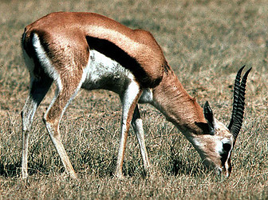

---
aliases:
  - Gazella
  - Gazelle
title: Gazella
has_id_wikidata: Q190858
described_by_source:
  - "[[../../../../../../../../../../../../../../../../../../../../../WikiData/WD~Brockhaus_and_Efron_Encyclopedic_Dictionary,602358]]"
  - "[[_Standards/WikiData/WD~Jewish_Encyclopedia_of_Brockhaus_and_Efron,4173137]]"
  - "[[_Standards/WikiData/WD~Small_Brockhaus_and_Efron_Encyclopedic_Dictionary,19180675]]"
  - "[[_Standards/WikiData/WD~Great_Soviet_Encyclopedia_(1926_1947),20078554]]"
  - "[[_Standards/WikiData/WD~Armenian_Soviet_Encyclopedia,_vol._1,123560817]]"
parent_taxon: "[[_Standards/WikiData/WD~Antilopini,924023]]"
different_from: "[[_Standards/WikiData/WD~gazelle,29001815]]"
taxonomic_type: "[[_Standards/WikiData/WD~Capra_dorcas,109647099]]"
homonymous_taxon:
  - "[[_Standards/WikiData/WD~Gazella_Pallas,_1769,122352120]]"
  - "[[_Standards/WikiData/WD~Gazella_Lichtenstein,_1814,122352832]]"
  - "[[_Standards/WikiData/WD~Gazella_Rafinesque,_1815,122353006]]"
taxon_synonym:
  - "[[_Standards/WikiData/WD~Gazella_Pallas,_1769,122352120]]"
  - "[[_Standards/WikiData/WD~Gazella_Lichtenstein,_1814,122352832]]"
  - "[[_Standards/WikiData/WD~Gazella_Rafinesque,_1815,122353006]]"
instance_of: "[[_Standards/WikiData/WD~taxon,16521]]"
taxon_rank: "[[_Standards/WikiData/WD~genus,34740]]"
OmegaWiki_Defined_Meaning: "1018466"
ITIS_TSN: "624969"
image:
  - http://commons.wikimedia.org/wiki/Special:FilePath/Thompson%27s%20Gazelle.jpeg
  - http://commons.wikimedia.org/wiki/Special:FilePath/Slender-horned%20gazelle%20%28Cincinnati%20Zoo%29.jpg
Commons_gallery: Gazella
Commons_category: Gazella
taxon_name: Gazella
exact_match: http://wordnet-rdf.princeton.edu/wn30/02423022-n
NBN_System_Key: NHMSYS0000376679
---

# [[Gazelle]] 

#is_/same_as :: [[../../../../../../../../../../../../../../../../../../../../../WikiData/WD~Gazella,190858|WD~Gazella,190858]] 
## Phylogeny 

-   « Ancestral Groups  
    -  [Antelope](../Antelope.md))
    -   [Bovidae](../../Bovidae.md)
    -   [Ruminants](../../../Ruminants.md)
    -  [Artiodactyla](../../../../Artiodactyla.md))
    -  [Eutheria](../../../../../Eutheria.md))
    -  [Mammal](../../../../../../Mammal.md))
    -   [Therapsida](../../../../../../../Therapsida.md)
    -   [Synapsida](../../../../../../../../Synapsida.md)
    -   [Amniota](../../../../../../../../../Amniota.md)
    -   [Terrestrial Vertebrates](../../../../../../../../../../Terrestrial.md)
    -   [Sarcopterygii](../../../../../../../../../../../Sarc.md)
    -   [Gnathostomata](../../../../../../../../../../../../Gnath.md)
    -   [Vertebrata](../../../../../../../../../../../../../Vertebrata.md)
    -   [Craniata](../../../../../../../../../../../../../../Craniata.md)
    -   [Chordata](../../../../../../../../../../../../../../../Chordata.md)
    -   [Deuterostomia](../../../../../../../../../../../../../../../../Deutero.md)
    -  [Bilateria](../../../../../../../../../../../../../../../../../Bilateria.md))
    -  [Animals](../../../../../../../../../../../../../../../../../../Animals.md))
    -  [Eukarya](../../../../../../../../../../../../../../../../../../../Eukarya.md))
    -   [Tree of Life](../../../../../../../../../../../../../../../../../../../Tree_of_Life.md)

-   ◊ Sibling Groups of  Antilopinae
    -   Gazella
    -   [Ourebia ourebi](Ourebia_ourebi)
    -   [Antidorcas marsupialis](Antidorcas_marsupialis)
    -   [Antilope cervicapra](Antilope_cervicapra)
    -   [Litocranius walleri](Litocranius_walleri)
    -   [Dik-dik](Dik-dik.md)
    -   [Procapra](Procapra.md)
    -   [Raphicerus](Raphicerus.md)

-   » Sub-Groups
    -   [Gazella dorcas](Gazella_dorcas)
    -   [Gazella granti](Gazella_granti)
    -   [Gazella thomsonii](Gazella_thomsonii)

	-   *Gazella arabica* [(Arabian gazelle)]
	-   *Gazella bennettii* [(Indian gazelle)]
	-   *Gazella bilkis* [(Queen of Sheba\'s gazelle)]
	-   *Gazella cuvieri* [(Cuvier\'s gazelle or mountain
	    gazelle)]
	-   *Gazella dama* [(dama gazelle)]
	-   *[Gazella dorcas](Gazella_dorcas)*
	    [(Dorcas gazelle)]
	-   *Gazella gazella* [(Arabian gazelle or mountain
	    gazelle)]
	-   *[Gazella granti](Gazella_granti)*
	    [(Grant\'s gazelle)]
	-   *Gazella leptoceros* [(rhim gazelle or slender-horned
	    gazelle)]
	-   *Gazella rufifrons* [(red-fronted gazelle)]
	-   *Gazella rufina* [(red gazelle)]
	-   *Gazella saudiya* [(Saudi Arabian gazelle)]
	-   *Gazella soemmerringii* [(Sömmerring\'s gazelle)]
	-   *Gazella spekei* [(Speke\'s gazelle)]
	-   *Gazella subgutturosa* [(goitered gazelle)]
	-   *[Gazella     thomsonii](Gazella_thomsonii)*
	    [(Thomson\'s gazelle)]

## Title Illustrations

------------------------------

Scientific Name ::     Gazella granti
Location ::           Ngorongoro Crater, Tanzania
Comments             Grant\'s gazelle
Acknowledgements     Photograph courtesy [InsectImages.org](http://www.insectimages.org/) (#1428052)
Specimen Condition   Live Specimen
Source Collection    [InsectImages.org](http://www.insectimages.org/)
Copyright ::            © William M. Ciesla, Forest Health Management International

------------------------------

Scientific Name ::     Gazella thomsonii
Location ::           at Mount Kenya, Kenya
Acknowledgements     Photograph courtesy [InsectImages.org](http://www.insectimages.org/) (#4320041)
Specimen Condition   Live Specimen
Source Collection    [InsectImages.org](http://www.insectimages.org/)
Copyright ::            © Kenneth M. Gale

## Confidential Links & Embeds: 

### #is_/same_as :: [Gazelle](/_Standards/bio/bio~Domain/Eukarya/Animal/Bilateria/Deutero/Chordata/Craniata/Vertebrata/Gnath/Sarc/Tetrapods/Amniota/Synapsida/Therapsida/Mammal/Eutheria/Artiodactyla/Ruminants/Bovidae/Antelope/Gazelle.md) 

### #is_/same_as :: [Gazelle.public](/_public/bio/bio~Domain/Eukarya/Animal/Bilateria/Deutero/Chordata/Craniata/Vertebrata/Gnath/Sarc/Tetrapods/Amniota/Synapsida/Therapsida/Mammal/Eutheria/Artiodactyla/Ruminants/Bovidae/Antelope/Gazelle.public.md) 

### #is_/same_as :: [Gazelle.internal](/_internal/bio/bio~Domain/Eukarya/Animal/Bilateria/Deutero/Chordata/Craniata/Vertebrata/Gnath/Sarc/Tetrapods/Amniota/Synapsida/Therapsida/Mammal/Eutheria/Artiodactyla/Ruminants/Bovidae/Antelope/Gazelle.internal.md) 

### #is_/same_as :: [Gazelle.protect](/_protect/bio/bio~Domain/Eukarya/Animal/Bilateria/Deutero/Chordata/Craniata/Vertebrata/Gnath/Sarc/Tetrapods/Amniota/Synapsida/Therapsida/Mammal/Eutheria/Artiodactyla/Ruminants/Bovidae/Antelope/Gazelle.protect.md) 

### #is_/same_as :: [Gazelle.private](/_private/bio/bio~Domain/Eukarya/Animal/Bilateria/Deutero/Chordata/Craniata/Vertebrata/Gnath/Sarc/Tetrapods/Amniota/Synapsida/Therapsida/Mammal/Eutheria/Artiodactyla/Ruminants/Bovidae/Antelope/Gazelle.private.md) 

### #is_/same_as :: [Gazelle.personal](/_personal/bio/bio~Domain/Eukarya/Animal/Bilateria/Deutero/Chordata/Craniata/Vertebrata/Gnath/Sarc/Tetrapods/Amniota/Synapsida/Therapsida/Mammal/Eutheria/Artiodactyla/Ruminants/Bovidae/Antelope/Gazelle.personal.md) 

### #is_/same_as :: [Gazelle.secret](/_secret/bio/bio~Domain/Eukarya/Animal/Bilateria/Deutero/Chordata/Craniata/Vertebrata/Gnath/Sarc/Tetrapods/Amniota/Synapsida/Therapsida/Mammal/Eutheria/Artiodactyla/Ruminants/Bovidae/Antelope/Gazelle.secret.md)

