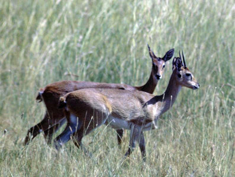

---
aliases:
  - Ourebia
title: Ourebia ourebi
has_id_wikidata: Q275615
---
# Ourebia ourebi 
 

## #has_/text_of_/abstract 

> The oribi (; **Ourebia** ourebi) is a small antelope found in eastern, southern and western Africa. The sole member of its genus, it was described by the German zoologist Eberhard August Wilhelm von Zimmermann in 1783. While this is the only member in the genus Ourebia, eight subspecies are identified. The oribi reaches nearly 50–67 centimetres (20–26 in) at the shoulder and weighs 12–22 kilograms (26–49 lb). It possesses a slightly raised back, and long neck and limbs. The glossy, yellowish to rufous brown coat contrasts with the white chin, throat, underparts and rump. Only males possess horns; the thin, straight horns, 8–18 centimetres (3.1–7.1 in) long, are smooth at the tips and ringed at the base.
>
> Typically diurnal, the oribi is active mainly during the day. Small herds of up to four members are common; males defend their group's territory, 25–100 hectares (62–247 acres) large. It is primarily a grazer, and prefers fresh grasses but also browses occasionally. A seasonal breeder, the time when mating occurs varies geographically. Unlike all other small antelopes, oribi can exhibit three types of mating systems, depending on the habitat – polyandry, polygyny and polygynandry. Gestation lasts for six to seven months, following which a single calf is born; births peak from November to December in southern Africa. Weaning takes place at four to five months.
>
> The oribi occurs in a variety of habitats – from savannahs, floodplains and tropical grasslands with 10–100 centimetres (3.9–39.4 in) tall grasses to montane grasslands at low altitudes, up to 2,000 metres (6,600 ft) above the sea level. This antelope is highly sporadic in distribution, ranging from Senegal in the west to Ethiopia and Eritrea in the east and southward to Angola and the Eastern Cape (South Africa). The oribi has been classified as Least Concern by the IUCN; numbers have declined due to agricultural expansion and competition from livestock.
>
> [Wikipedia](https://en.wikipedia.org/wiki/Oribi) 

## Phylogeny 

-   « Ancestral Groups  
    -  [Antelope](../Antelope.md) 
    -   [Bovidae](../../Bovidae.md)
    -   [Ruminants](../../../Ruminants.md)
    -  [Artiodactyla](../../../../Artiodactyla.md) 
    -  [Eutheria](../../../../../Eutheria.md) 
    -  [Mammal](../../../../../../Mammal.md) 
    -   [Therapsida](../../../../../../../Therapsida.md)
    -   [Synapsida](../../../../../../../../Synapsida.md)
    -   [Amniota](../../../../../../../../../Amniota.md)
    -   [Terrestrial Vertebrates](../../../../../../../../../../Terrestrial.md)
    -   [Sarcopterygii](../../../../../../../../../../../Sarc.md)
    -   [Gnathostomata](../../../../../../../../../../../../Gnath.md)
    -   [Vertebrata](../../../../../../../../../../../../../Vertebrata.md)
    -   [Craniata](../../../../../../../../../../../../../../Craniata.md)
    -   [Chordata](../../../../../../../../../../../../../../../Chordata.md)
    -   [Deuterostomia](../../../../../../../../../../../../../../../../Deutero.md)
    -  [Bilateria](../../../../../../../../../../../../../../../../../Bilateria.md) 
    -  [Animals](../../../../../../../../../../../../../../../../../../Animals.md) 
    -  [Eukarya](../../../../../../../../../../../../../../../../../../../Eukarya.md) 
    -   [Tree of Life](../../../../../../../../../../../../../../../../../../../Tree_of_Life.md)

-   ◊ Sibling Groups of  Antilopinae
    -   [Gazelle](Gazelle.md)
    -   Ourebia ourebi
    -   [Antidorcas marsupialis](Antidorcas_marsupialis)
    -   [Antilope cervicapra](Antilope_cervicapra)
    -   [Litocranius walleri](Litocranius_walleri)
    -   [Dik-dik](Dik-dik.md)
    -   [Procapra](Procapra.md)
    -   [Raphicerus](Raphicerus.md)

-   » Sub-Groups 

## Title Illustrations

------------------------------------------------------------- 
 
scientific_name ::     Ourebia ourebi
location ::           Murchison Falls, Bunyoro, Uganda
specimen_condition ::  Live Specimen
Sex ::                male and female
Source               [Pair of Oribi](http://flickr.com/photos/ogcodes/95205255/)
Image Use ::    [Attribution-NonCommercial 2.0 Creative Commons License](http://creativecommons.org/licenses/by-nc/2.0/).
copyright ::            © 2006 [Michael Jefferies](http://flickr.com/people/ogcodes/)

## Confidential Links & Embeds: 

### #is_/same_as :: [[/_Standards/bio/bio~Domain/Eukarya/Animal/Bilateria/Deutero/Chordata/Craniata/Vertebrata/Gnath/Sarc/Tetrapods/Amniota/Synapsida/Therapsida/Mammal/Eutheria/Artiodactyla/Ruminants/Bovidae/Antelope/Ourebia|Ourebia]] 

### #is_/same_as :: [[/_public/bio/bio~Domain/Eukarya/Animal/Bilateria/Deutero/Chordata/Craniata/Vertebrata/Gnath/Sarc/Tetrapods/Amniota/Synapsida/Therapsida/Mammal/Eutheria/Artiodactyla/Ruminants/Bovidae/Antelope/Ourebia.public|Ourebia.public]] 

### #is_/same_as :: [[/_internal/bio/bio~Domain/Eukarya/Animal/Bilateria/Deutero/Chordata/Craniata/Vertebrata/Gnath/Sarc/Tetrapods/Amniota/Synapsida/Therapsida/Mammal/Eutheria/Artiodactyla/Ruminants/Bovidae/Antelope/Ourebia.internal|Ourebia.internal]] 

### #is_/same_as :: [[/_protect/bio/bio~Domain/Eukarya/Animal/Bilateria/Deutero/Chordata/Craniata/Vertebrata/Gnath/Sarc/Tetrapods/Amniota/Synapsida/Therapsida/Mammal/Eutheria/Artiodactyla/Ruminants/Bovidae/Antelope/Ourebia.protect|Ourebia.protect]] 

### #is_/same_as :: [[/_private/bio/bio~Domain/Eukarya/Animal/Bilateria/Deutero/Chordata/Craniata/Vertebrata/Gnath/Sarc/Tetrapods/Amniota/Synapsida/Therapsida/Mammal/Eutheria/Artiodactyla/Ruminants/Bovidae/Antelope/Ourebia.private|Ourebia.private]] 

### #is_/same_as :: [[/_personal/bio/bio~Domain/Eukarya/Animal/Bilateria/Deutero/Chordata/Craniata/Vertebrata/Gnath/Sarc/Tetrapods/Amniota/Synapsida/Therapsida/Mammal/Eutheria/Artiodactyla/Ruminants/Bovidae/Antelope/Ourebia.personal|Ourebia.personal]] 

### #is_/same_as :: [[/_secret/bio/bio~Domain/Eukarya/Animal/Bilateria/Deutero/Chordata/Craniata/Vertebrata/Gnath/Sarc/Tetrapods/Amniota/Synapsida/Therapsida/Mammal/Eutheria/Artiodactyla/Ruminants/Bovidae/Antelope/Ourebia.secret|Ourebia.secret]] 

