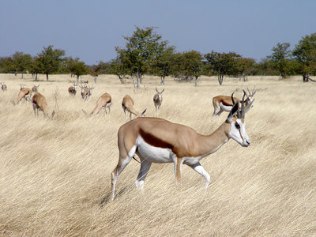

---
aliases:
- Amabhokobhoko
- Antidorcas
- Antidorcas marsupialis
- antilopa skákavá
- Boortee xulubaa
- Cabra-de-leque
- Dienvidāfrikas gazele
- gasela saltadora del Cap
- hyppygaselli
- Hüpikgasell
- ibhadi
- Jádí nahachaʼígíí
- Keseli Ceylan
- Linh dương nhảy
- Putcumol (Antidorcas marsupialis)
- Skocznik antylopi
- skokonoga gazela
- Springbock
- springbok
- Springbok antilopa
- springbuck
- Springbuk
- springbukk
- Springbôka
- Springböcke
- spriongboc
- Stökkhafur
- Swala Mrukaji
- tembu lompat
- vándorantilop
- Šoklioji gazelė
- газела-скокач
- планински скакач
- Спрингбок
- Спрингбок антилопа
- Спрынгбок
- Սփրինգբոկ
- דלגן
- سپرنگبوک
- غزال جهنده
- قوفز
- قوقز
- ਸਪਰਨਗਬੋਕ
- துள்ளல் மான்
- ಜಿಗಿಜಿಂಕೆ
- สปริงบ็อก
- စပရင်းဗုတ်တောဆိတ်
- სპრინგბოკი
- スプリングボック
- 跳羚
- 스프링복
title: Antidorcas marsupialis
has_id_wikidata: Q213084
dv_has_:
  name_:
    af: Springbok
    ar: قوفز
    arz: قوقز
    ast: Antidorcas marsupialis
    av: Спрингбок
    avk: Putcumol (Antidorcas marsupialis)
    ban: Springbok
    be: Спрынгбок
    be_tarask: спрынгбок
    bg: планински скакач
    br: Springbok
    ca: gasela saltadora del Cap
    ceb: Antidorcas marsupialis
    cs: antilopa skákavá
    da: Springbuk
    de: Springböcke
    en: springbok
    es: Antidorcas marsupialis
    et: Hüpikgasell
    eu: Springbok
    fa: غزال جهنده
    fi: hyppygaselli
    fr: springbok
    frr: Antidorcas
    ga: spriongboc
    gd: Antidorcas marsupialis
    gl: Antidorcas marsupialis
    he: דלגן
    hr: Springbok
    hu: vándorantilop
    hy: Սփրինգբոկ
    ia: Antidorcas marsupialis
    id: Springbok
    is: Stökkhafur
    it: Antidorcas marsupialis
    ja: スプリングボック
    ka: სპრინგბოკი
    kk: Спрингбок
    kn: ಜಿಗಿಜಿಂಕೆ
    ko: 스프링복
    la: Antidorcas marsupialis
    lez: Спрингбок
    lt: Šoklioji gazelė
    lv: Dienvidāfrikas gazele
    mg: Springbôka
    mk: газела-скокач
    ms: tembu lompat
    mul: Antidorcas marsupialis
    my: စပရင်းဗုတ်တောဆိတ်
    nb: springbukk
    nl: springbok
    nv: Jádí nahachaʼígíí
    om: Boortee xulubaa
    pa: ਸਪਰਨਗਬੋਕ
    pl: Skocznik antylopi
    pnb: سپرنگبوک
    pt: Cabra-de-leque
    ro: Antidorcas marsupialis
    ru: Спрингбок
    sh: Springbok antilopa
    sk: Antilopa skákavá
    sl: skokonoga gazela
    sq: Antidorcas marsupialis
    sr: Спрингбок антилопа
    sr_ec: Спрингбок антилопа
    sr_el: Springbok antilopa
    sv: Springbock
    sw: Swala Mrukaji
    ta: துள்ளல் மான்
    th: สปริงบ็อก
    tr: Keseli Ceylan
    udm: Спрингбок
    uk: Спрингбок
    vi: Linh dương nhảy
    war: Antidorcas marsupialis
    wuu: 跳羚
    xh: ibhadi
    yo: Springbok
    yue: 跳羚
    zh: 跳羚
    zh_cn: 跳羚
    zh_hans: 跳羚
    zh_hant: 跳羚
    zh_hk: 跳羚
    zh_sg: 跳羚
    zh_tw: 跳羚
    zu: Amabhokobhoko
---
[Temporary Page](tree/home.pages/pagestatus.html)

# [[Springbok]] 

## #has_/text_of_/abstract 

> The springbok or springbuck (**Antidorcas marsupialis**) 
> is an antelope found mainly in south and southwest Africa. 
> 
> The sole member of the genus Antidorcas, 
> this bovid was first described by the German zoologist Eberhard August Wilhelm von Zimmermann in 1780. 
> Three subspecies are identified. A slender, long-legged antelope, the springbok reaches 71 to 86 cm (28 to 34 in) at the shoulder and weighs between 27 and 42 kg (60 and 93 lb). Both sexes have a pair of black, 35-to-50 cm (14-to-20 in) long horns that curve backwards. The springbok is characterised by a white face, a dark stripe running from the eyes to the mouth, a light brown coat marked by a reddish-brown stripe that runs from the upper foreleg to the buttocks across the flanks like the Thomson's gazelle, and a white rump flap.
>
> Active mainly at dawn and dusk, springbok form harems (mixed-sex herds). In earlier times, springbok of the Kalahari Desert and Karoo migrated in large numbers across the countryside, a practice known as trekbokking. A feature, peculiar but not unique, to the springbok is pronking, in which the springbok performs multiple leaps into the air, up to 2 m (6.6 ft) above the ground, in a stiff-legged posture, with the back bowed and the white flap lifted. Primarily a browser, the springbok feeds on shrubs and succulents; this antelope can live without drinking water for years, meeting its requirements through eating succulent vegetation. Breeding takes place year-round, and peaks in the rainy season, when forage is most abundant. A single calf is born after a five- to six-month-long pregnancy; weaning occurs at nearly six months of age, and the calf leaves its mother a few months later.
>
> Springbok inhabit the dry areas of south and southwestern Africa. The International Union for Conservation of Nature and Natural Resources classifies the springbok as a least concern species. No major threats to the long-term survival of the species are known; the springbok, in fact, is one of the few antelope species considered to have an expanding population. They are popular game animals, and are valued for their meat and skin. The springbok is the national animal of South Africa.
>
> [Wikipedia](https://en.wikipedia.org/wiki/Springbok) 

## Phylogeny 

-   « Ancestral Groups  
    -  [Antelope](../Antelope.md) 
    -   [Bovidae](../../Bovidae.md)
    -   [Ruminants](../../../Ruminants.md)
    -  [Artiodactyla](../../../../Artiodactyla.md) 
    -  [Eutheria](../../../../../Eutheria.md) 
    -  [Mammal](../../../../../../Mammal.md) 
    -   [Therapsida](../../../../../../../Therapsida.md)
    -   [Synapsida](../../../../../../../../Synapsida.md)
    -   [Amniota](../../../../../../../../../Amniota.md)
    -   [Terrestrial Vertebrates](../../../../../../../../../../Terrestrial.md)
    -   [Sarcopterygii](../../../../../../../../../../../Sarc.md)
    -   [Gnathostomata](../../../../../../../../../../../../Gnath.md)
    -   [Vertebrata](../../../../../../../../../../../../../Vertebrata.md)
    -   [Craniata](../../../../../../../../../../../../../../Craniata.md)
    -   [Chordata](../../../../../../../../../../../../../../../Chordata.md)
    -   [Deuterostomia](../../../../../../../../../../../../../../../../Deutero.md)
    -  [Bilateria](../../../../../../../../../../../../../../../../../Bilateria.md) 
    -  [Animals](../../../../../../../../../../../../../../../../../../Animals.md) 
    -  [Eukarya](../../../../../../../../../../../../../../../../../../../Eukarya.md) 
    -   [Tree of Life](../../../../../../../../../../../../../../../../../../../Tree_of_Life.md)
-   )]«
-   ◊ Sibling Groups of  Antilopinae
    -   [Gazelle](Gazelle.md)
    -   [Ourebia ourebi](Ourebia_ourebi)
    -   Antidorcas marsupialis
    -   [Antilope cervicapra](Antilope_cervicapra)
    -   [Litocranius walleri](Litocranius_walleri)
    -   [Dik-dik](Dik-dik.md)
    -   [Procapra](Procapra.md)
    -   [Raphicerus](Raphicerus.md)
-   []^
-   []v
-   » Sub-Groups 

## Title Illustrations

------------------------------------------------------------------

scientific_name ::     Antidorcas marsupialis
location ::           Etosha National Park, Namibia
Acknowledgements     This image is licensed under the [Attribution-NonCommercial-ShareAlike 2.0 Creative Commons License](http://creativecommons.org/licenses/by-nc-sa/2.0/).
specimen_condition ::  Live Specimen
Image Use ::    [Attribution-NonCommercial-ShareAlike 2.0 Creative Commons License](http://creativecommons.org/licenses/by-nc-sa/2.0/).
copyright ::            © 2005 [Charles Roffey](http://flickr.com/people/charlesfred/)

------------------------------------------------------------------
]( "view full image and data in a new window")
scientific_name ::     Antidorcas marsupialis
location ::           Etosha National Park, Namibia
Acknowledgements     This image is licensed under the [Attribution-NonCommercial-ShareAlike 2.0 Creative Commons License](http://creativecommons.org/licenses/by-nc-sa/2.0/).
specimen_condition ::  Live Specimen
Image Use ::    [Attribution-NonCommercial-ShareAlike 2.0 Creative Commons License](http://creativecommons.org/licenses/by-nc-sa/2.0/).
copyright ::            © 2006 [Damien du Toit](http://flickr.com/people/coda/)

## Confidential Links & Embeds: 

### #is_/same_as :: [[/_Standards/bio/bio~Domain/Eukarya/Animal/Bilateria/Deutero/Chordata/Craniata/Vertebrata/Gnath/Sarc/Tetrapods/Amniota/Synapsida/Therapsida/Mammal/Eutheria/Artiodactyla/Ruminants/Bovidae/Antelope/Springbok|Springbok]] 

### #is_/same_as :: [[/_public/bio/bio~Domain/Eukarya/Animal/Bilateria/Deutero/Chordata/Craniata/Vertebrata/Gnath/Sarc/Tetrapods/Amniota/Synapsida/Therapsida/Mammal/Eutheria/Artiodactyla/Ruminants/Bovidae/Antelope/Springbok.public|Springbok.public]] 

### #is_/same_as :: [[/_internal/bio/bio~Domain/Eukarya/Animal/Bilateria/Deutero/Chordata/Craniata/Vertebrata/Gnath/Sarc/Tetrapods/Amniota/Synapsida/Therapsida/Mammal/Eutheria/Artiodactyla/Ruminants/Bovidae/Antelope/Springbok.internal|Springbok.internal]] 

### #is_/same_as :: [[/_protect/bio/bio~Domain/Eukarya/Animal/Bilateria/Deutero/Chordata/Craniata/Vertebrata/Gnath/Sarc/Tetrapods/Amniota/Synapsida/Therapsida/Mammal/Eutheria/Artiodactyla/Ruminants/Bovidae/Antelope/Springbok.protect|Springbok.protect]] 

### #is_/same_as :: [[/_private/bio/bio~Domain/Eukarya/Animal/Bilateria/Deutero/Chordata/Craniata/Vertebrata/Gnath/Sarc/Tetrapods/Amniota/Synapsida/Therapsida/Mammal/Eutheria/Artiodactyla/Ruminants/Bovidae/Antelope/Springbok.private|Springbok.private]] 

### #is_/same_as :: [[/_personal/bio/bio~Domain/Eukarya/Animal/Bilateria/Deutero/Chordata/Craniata/Vertebrata/Gnath/Sarc/Tetrapods/Amniota/Synapsida/Therapsida/Mammal/Eutheria/Artiodactyla/Ruminants/Bovidae/Antelope/Springbok.personal|Springbok.personal]] 

### #is_/same_as :: [[/_secret/bio/bio~Domain/Eukarya/Animal/Bilateria/Deutero/Chordata/Craniata/Vertebrata/Gnath/Sarc/Tetrapods/Amniota/Synapsida/Therapsida/Mammal/Eutheria/Artiodactyla/Ruminants/Bovidae/Antelope/Springbok.secret|Springbok.secret]] 

