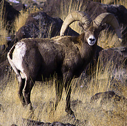
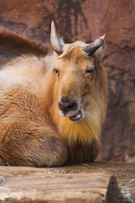

## Phylogeny 

-   « Ancestral Groups  
    -   [Bovidae](../Bovidae.md)
    -   [Ruminants](../../Ruminants.md)
    -  [Artiodactyla](../../../Artiodactyla.md))
    -  [Eutheria](../../../../Eutheria.md))
    -  [Mammal](../../../../../Mammal.md))
    -   [Therapsida](../../../../../../Therapsida.md)
    -   [Synapsida](../../../../../../../Synapsida.md)
    -   [Amniota](../../../../../../../../Amniota.md)
    -   [Terrestrial Vertebrates](../../../../../../../../../Terrestrial.md)
    -   [Sarcopterygii](../../../../../../../../../../Sarc.md)
    -   [Gnathostomata](../../../../../../../../../../../Gnath.md)
    -   [Vertebrata](../../../../../../../../../../../../Vertebrata.md)
    -   [Craniata](../../../../../../../../../../../../../Craniata.md)
    -   [Chordata](../../../../../../../../../../../../../../Chordata.md)
    -   [Deuterostomia](../../../../../../../../../../../../../../../Deutero.md)
    -  [Bilateria](../../../../../../../../../../../../../../../../Bilateria.md))
    -  [Animals](../../../../../../../../../../../../../../../../../Animals.md))
    -  [Eukarya](../../../../../../../../../../../../../../../../../../Eukarya.md))
    -   [Tree of Life](../../../../../../../../../../../../../../../../../../Tree_of_Life.md)

-   ◊ Sibling Groups of  Bovidae
    -   [Oreotragus oreotragus](Oreotragus_oreotragus)
    -   [Alcelaphinae](Alcelaphinae.md)
    -   [Hippotraginae](Hippotraginae.md)
    -   Caprinae
    -   [Aepyceros melampus](Impala.md)
    -   [Cephalophinae](Cephalophinae.md)
    -   [Reduncinae](Reduncinae.md)
    -  [Antelope](Antelope.md))
    -   [Neotragus](Neotragus.md)
    -   [Miscellaneous fossil         bovids](Miscellaneous_fossil_bovids)

-   » Sub-Groups
    -   [Capra](Caprinae/Capra.md)
    -   [Ammotragus lervia](Ammotragus_lervia)
    -   [Ovibos moschatus](Caprinae/Ovibos.md)
    -   [Budorcas taxicolor](Budorcas_taxicolor)
    -   [Hemitragus](Caprinae/Hemitragus.md)
    -   [Ovis](Caprinae/Ovis.md)
    -   [Pseudois](Caprinae/Pseudois.md)
    -   [Naemorhedus](Caprinae/Naemorhedus.md)
    -   [Oreamnos americanus](Caprinae/Oreamnos.md)
    -   [Rupicapra](Caprinae/Rupicapra.md)
    -   [Fossil Caprinae](Caprinae/Fossil.md)

# Caprinae 

Containing group: [Bovidae](../Bovidae.md)

### Information on the Internet

-   [IUCN/SSC - Caprinae Specialist     Group](http://www.callisto.si.usherb.ca:8080/caprinae/iucnwork.htm)
-   [Workshop on Caprinae taxonomy     (2000)](http://www.callisto.si.usherb.ca:8080/caprinae/taxo.htm)

### References

Feng, J., C. Lajia, D.J. Taylor, and M. S. Webster. 2001. Genetic
distinctiveness of endangered dwarf blue sheep (Pseudois nayaur
schaeferi): evidence from mitochondrial control region and Y-linked ZFY
intron sequences. The Journal of Heredity 92:9-15.

Fernández, M. H. and E. S. Vrba. 2005. A complete estimate of the
phylogenetic relationships in Ruminantia: a dated species-level
supertree of the extant ruminants. Biological Reviews 80(2):269-302.

Gentry, A. W. 2000. Caprinae and Hippotragini (Bovidae, Mammalia) in the
Upper Miocene. Pages 65-83 in Antelopes, Deer, and Relatives. E. S. Vrba
and G. B. Schaller, eds. Yale University Press, New Haven.

Groves P. and G. F. Shields. 1996. Phylogenetics of the Caprinae based
on cytochrome b sequence. Molecular Phylogenetics and Evolution
5:467-476.

Groves, P. and G. F. Shields. 1997. Cytochrome B sequences suggest
convergent evolution of the Asian takin and arctic muskox. Molecular
Phylogenetics and Evolution 8:363-374.

Hassanin, A., E. Pasquet, and J.-D. Vigne. 1998. Molecular systematics
of the subfamily Caprinae (Artiodactyla, Bovidae) as determined from
cytochrome b sequences. Journal of Mammalian Evolution 5:217-236.

Kurt, F. and G. B. Hartl. 1995. Socio-ethogram of adult males versus
biochemical-genetic variation in assessing phylogenetic relationships of
the Caprinae. Acta Theriologica 3(Suppl.):183-197.

Ludwig, A. and S. Fischer. 1998. New aspects of an old discussion
-phylogenetic relationships of Ammotragus and Pseudois within the
subfamily Caprinae based on comparison of the 12S rDNA sequences.
Journal of Zoology and Evolutionary Research 36:173-178.

Ludwig, V.A. and J. Knoll. 1998. Multivariate morphometrische Analysen
der Gattung Ovis Linnaeus, 1758 (Mammalia, Caprinae). Zeitschrift fur
Säugetierkunde 63:210-219.

Masini, F. and S. Lovari. 1988. Systematics, phylogenetic relationships,
and dispersal of the chamois (Rupicapra spp.). Quaternary Research
30:339-349.

Ropiquet , A. and A. Hassanin. 2005. Molecular phylogeny of caprines
(Bovidae, Antilopinae): the question of their origin and diversification
during the Miocene. Journal of Zoological Systematics and Evolutionary
Research 43:49--60.

Schaller, G. B. 1977. Mountain Monarchs: Wild Sheep and Goats of the
Himalaya. University of Chicago Press, Chicago, 425 p.

Shackleton, D. M. 1997. Wild Sheep and Goats and their Relatives: Status
Survey and Conservation Action Plan. IUCN/SSC Caprinae Specialist Group
IUCN, Switzerland and Cambridge, Gland, 390 p.

## Title Illustrations

)

  ------------------------------
  Scientific Name ::     Ovis canadensis
  Comments             bighorn sheep
  Acknowledgements     Photograph courtesy [InsectImages.org](http://www.insectimages.org/) (#1374216)
  Specimen Condition   Live Specimen
  Source Collection    [InsectImages.org](http://www.insectimages.org/)
  Copyright ::            © Terry Spivey, USDA Forest Service
  ------------------------------

  ------------------------------
  Scientific Name ::     Oreamnos americanus
  Location ::           Glacier National Park, Montana, USA
  Comments             mountain goat
  Acknowledgements     Photograph courtesy [InsectImages.org](http://www.insectimages.org/) (#1929018)
  Specimen Condition   Live Specimen
  Source Collection    [InsectImages.org](http://www.insectimages.org/)
  Copyright ::            © G. Keith Douce, The University of Georgia
  ------------------------------
)

  --------------------------------------------------------
  Scientific Name ::     Budorcas taxicolor
  Location ::           captive
  Specimen Condition   Live Specimen
  Source               [It is dissatisfied](http://flickr.com/photos/suneko/92395489/)
  Source Collection    [Flickr](http://flickr.com/)
  Image Use ::    [Attribution 2.0 Creative Commons License](http://creativecommons.org/licenses/by/2.0/).
  Copyright ::            © 2006 [su neko](http://flickr.com/people/suneko/)
  --------------------------------------------------------

## Confidential Links & Embeds: 

### #is_/same_as :: [Caprinae](/_Standards/bio/bio~Domain/Eukarya/Animal/Bilateria/Deutero/Chordata/Craniata/Vertebrata/Gnath/Sarc/Tetrapods/Amniota/Synapsida/Therapsida/Mammal/Eutheria/Artiodactyla/Ruminants/Bovidae/Caprinae.md) 

### #is_/same_as :: [Caprinae.public](/_public/bio/bio~Domain/Eukarya/Animal/Bilateria/Deutero/Chordata/Craniata/Vertebrata/Gnath/Sarc/Tetrapods/Amniota/Synapsida/Therapsida/Mammal/Eutheria/Artiodactyla/Ruminants/Bovidae/Caprinae.public.md) 

### #is_/same_as :: [Caprinae.internal](/_internal/bio/bio~Domain/Eukarya/Animal/Bilateria/Deutero/Chordata/Craniata/Vertebrata/Gnath/Sarc/Tetrapods/Amniota/Synapsida/Therapsida/Mammal/Eutheria/Artiodactyla/Ruminants/Bovidae/Caprinae.internal.md) 

### #is_/same_as :: [Caprinae.protect](/_protect/bio/bio~Domain/Eukarya/Animal/Bilateria/Deutero/Chordata/Craniata/Vertebrata/Gnath/Sarc/Tetrapods/Amniota/Synapsida/Therapsida/Mammal/Eutheria/Artiodactyla/Ruminants/Bovidae/Caprinae.protect.md) 

### #is_/same_as :: [Caprinae.private](/_private/bio/bio~Domain/Eukarya/Animal/Bilateria/Deutero/Chordata/Craniata/Vertebrata/Gnath/Sarc/Tetrapods/Amniota/Synapsida/Therapsida/Mammal/Eutheria/Artiodactyla/Ruminants/Bovidae/Caprinae.private.md) 

### #is_/same_as :: [Caprinae.personal](/_personal/bio/bio~Domain/Eukarya/Animal/Bilateria/Deutero/Chordata/Craniata/Vertebrata/Gnath/Sarc/Tetrapods/Amniota/Synapsida/Therapsida/Mammal/Eutheria/Artiodactyla/Ruminants/Bovidae/Caprinae.personal.md) 

### #is_/same_as :: [Caprinae.secret](/_secret/bio/bio~Domain/Eukarya/Animal/Bilateria/Deutero/Chordata/Craniata/Vertebrata/Gnath/Sarc/Tetrapods/Amniota/Synapsida/Therapsida/Mammal/Eutheria/Artiodactyla/Ruminants/Bovidae/Caprinae.secret.md)

