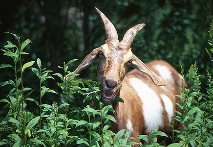

# [[Capra]] 

![[Capra/Goat/Goat.jpg]]  

#is_/same_as :: [[../../../../../../../../../../../../../../../../../../../../../WikiData/WD~Capra,172923|WD~Capra,172923]] 
## #has_/text_of_/abstract 

> **Capra** is a genus of mammals, the goats, comprising ten species, 
> including the markhor and several species known as ibexes. 
> 
> The domestic goat (Capra hircus) is a domesticated species derived from the bezoar ibex 
> (Capra aegagrus aegagrus). 
> It is one of the oldest domesticated species of animal—according to archaeological evidence 
> its earliest domestication occurred in Iran at 10,000 calibrated calendar years ago.
>
> Wild goats are animals of mountain habitats. 
> They are very agile and hardy, able to climb on bare rock and survive on sparse vegetation. 
> They can be distinguished from the genus Ovis, which includes sheep, 
> by the presence of scent glands close to the feet, in the groin, and in front of the eyes, 
> and the absence of other facial glands, 
> and by the presence of a beard in some specimens, 
> and of hairless calluses on the knees of the forelegs.
>
> [Wikipedia](https://en.wikipedia.org/wiki/Capra%20(genus))

## Phylogeny 

-   « Ancestral Groups  
    -   [Caprinae](../Caprinae.md)
    -   [Bovidae](../../Bovidae.md)
    -   [Ruminants](../../../Ruminants.md)
    -  [Artiodactyla](../../../../Artiodactyla.md))
    -  [Eutheria](../../../../../Eutheria.md))
    -  [Mammal](../../../../../../Mammal.md))
    -   [Therapsida](../../../../../../../Therapsida.md)
    -   [Synapsida](../../../../../../../../Synapsida.md)
    -   [Amniota](../../../../../../../../../Amniota.md)
    -   [Terrestrial Vertebrates](../../../../../../../../../../Terrestrial.md)
    -   [Sarcopterygii](../../../../../../../../../../../Sarc.md)
    -   [Gnathostomata](../../../../../../../../../../../../Gnath.md)
    -   [Vertebrata](../../../../../../../../../../../../../Vertebrata.md)
    -   [Craniata](../../../../../../../../../../../../../../Craniata.md)
    -   [Chordata](../../../../../../../../../../../../../../../Chordata.md)
    -   [Deuterostomia](../../../../../../../../../../../../../../../../Deutero.md)
    -  [Bilateria](../../../../../../../../../../../../../../../../../Bilateria.md))
    -  [Animals](../../../../../../../../../../../../../../../../../../Animals.md))
    -  [Eukarya](../../../../../../../../../../../../../../../../../../../Eukarya.md))
    -   [Tree of Life](../../../../../../../../../../../../../../../../../../../Tree_of_Life.md)

-   ◊ Sibling Groups of  Caprinae
    -   Capra
    -   [Ammotragus lervia](Ammotragus_lervia)
    -   [Ovibos moschatus](Ovibos_moschatus)
    -   [Budorcas taxicolor](Budorcas_taxicolor)
    -   [Hemitragus](Hemitragus.md)
    -   [Ovis](Ovis.md)
    -   [Pseudois](Pseudois.md)
    -   [Naemorhedus](Naemorhedus.md)
    -   [Oreamnos americanus](Oreamnos_americanus)
    -   [Rupicapra](Rupicapra.md)
    -   [Fossil Caprinae](Fossil_Caprinae)

-   » Sub-Groups 

# *Capra* 

-   *Capra caucasica* [(West Caucasian tur)]
-   *Capra cylindricornis* [(East Caucasian tur)]
-   *Capra falconeri* [(markhor)]
-   *Capra hircus* [(domestic goat, feral goat)]
-   *Capra ibex* [(ibex)]
-   *Capra nubiana* [(nubian ibex)]
-   *Capra pyrenaica* [(Iberian mountain goat or Spanish
    ibex)]
-   *Capra sibirica* [(Siberian ibex)]
-   *Capra walie* [(Walia ibex)]

Containing group: [Caprinae](../Caprinae.md)

### References

Ropiquet, A. and A. Hassanin. 2006. Hybrid origin of the Pliocene
ancestor of wild goats. Molecular Phylogenetics and Evolution
41(2):395-404.

Manceau, V., L. Despres, J. Bouvet, and P. Taberlet. 1999. Systematics
of the genus Capra inferred from mitochondrial DNA sequence data.
Molecular Phylogenetics and Evolution 13:504-510.

Pidancier, N., S. Jordan, G. Luikart and P. Taberlet. 2006. Evolutionary
history of the genus Capra (Mammalia, Artiodactyla): Discordance between
mitochondrial DNA and Y-chromosome phylogenies. Molecular Phylogenetics
and Evolution 40(3):739-749.

## Title Illustrations

)

  ---------------------------
  Scientific Name ::     Capra hircus
  Creator              Photograph by Scott Bauer
  Acknowledgements     courtesy [USDA Agricultural Research Service](http://www.ars.usda.gov/)
  Specimen Condition   Live Specimen
  ---------------------------

## Confidential Links & Embeds: 

### #is_/same_as :: [Capra](Capra.md) 

### #is_/same_as :: [Capra.public](/_public/bio/bio~Domain/Eukarya/Animal/Bilateria/Deutero/Chordata/Craniata/Vertebrata/Gnath/Sarc/Tetrapods/Amniota/Synapsida/Therapsida/Mammal/Eutheria/Artiodactyla/Ruminants/Bovidae/Caprinae/Capra.public.md) 

### #is_/same_as :: [Capra.internal](/_internal/bio/bio~Domain/Eukarya/Animal/Bilateria/Deutero/Chordata/Craniata/Vertebrata/Gnath/Sarc/Tetrapods/Amniota/Synapsida/Therapsida/Mammal/Eutheria/Artiodactyla/Ruminants/Bovidae/Caprinae/Capra.internal.md) 

### #is_/same_as :: [Capra.protect](/_protect/bio/bio~Domain/Eukarya/Animal/Bilateria/Deutero/Chordata/Craniata/Vertebrata/Gnath/Sarc/Tetrapods/Amniota/Synapsida/Therapsida/Mammal/Eutheria/Artiodactyla/Ruminants/Bovidae/Caprinae/Capra.protect.md) 

### #is_/same_as :: [Capra.private](/_private/bio/bio~Domain/Eukarya/Animal/Bilateria/Deutero/Chordata/Craniata/Vertebrata/Gnath/Sarc/Tetrapods/Amniota/Synapsida/Therapsida/Mammal/Eutheria/Artiodactyla/Ruminants/Bovidae/Caprinae/Capra.private.md) 

### #is_/same_as :: [Capra.personal](/_personal/bio/bio~Domain/Eukarya/Animal/Bilateria/Deutero/Chordata/Craniata/Vertebrata/Gnath/Sarc/Tetrapods/Amniota/Synapsida/Therapsida/Mammal/Eutheria/Artiodactyla/Ruminants/Bovidae/Caprinae/Capra.personal.md) 

### #is_/same_as :: [Capra.secret](/_secret/bio/bio~Domain/Eukarya/Animal/Bilateria/Deutero/Chordata/Craniata/Vertebrata/Gnath/Sarc/Tetrapods/Amniota/Synapsida/Therapsida/Mammal/Eutheria/Artiodactyla/Ruminants/Bovidae/Caprinae/Capra.secret.md)

