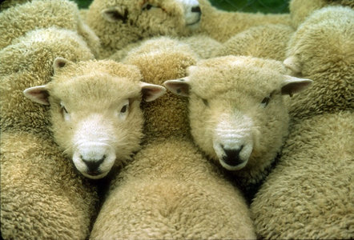

---
aliases:
- "Ovis aries"
- aries
- Sheep
title: "Ovis aries"
---

## Phylogeny 

-   « Ancestral Groups  
    -   [Ovis](../Ovis.md)
    -   [Caprinae](../../Caprinae.md)
    -   [Bovidae](../../../Bovidae.md)
    -   [Ruminants](../../../../Ruminants.md)
    -  [Artiodactyla](../../../../../Artiodactyla.md))
    -  [Eutheria](../../../../../../Eutheria.md))
    -  [Mammal](../../../../../../../Mammal.md))
    -   [Therapsida](../../../../../../../../Therapsida.md)
    -   [Synapsida](../../../../../../../../../Synapsida.md)
    -   [Amniota](../../../../../../../../../../Amniota.md)
    -   [Terrestrial Vertebrates](../../../../../../../../../../../Terrestrial.md)
    -   [Sarcopterygii](../../../../../../../../../../../../Sarc.md)
    -   [Gnathostomata](../../../../../../../../../../../../../Gnath.md)
    -   [Vertebrata](../../../../../../../../../../../../../../Vertebrata.md)
    -   [Craniata](../../../../../../../../../../../../../../../Craniata.md)
    -   [Chordata](../../../../../../../../../../../../../../../../Chordata.md)
    -   [Deuterostomia](../../../../../../../../../../../../../../../../../Deutero.md)
    -  [Bilateria](../../../../../../../../../../../../../../../../../../Bilateria.md))
    -  [Animals](../../../../../../../../../../../../../../../../../../../Animals.md))
    -  [Eukarya](../../../../../../../../../../../../../../../../../../../../Eukarya.md))
    -   [Tree of Life](../../../../../../../../../../../../../../../../../../../../Tree_of_Life.md)

-   ◊ Sibling Groups of  Ovis
    -   Ovis aries

-   » Sub-Groups 

# *Ovis aries* 

Containing group: *[Ovis](../Ovis.md)*

## #has_/text_of_/abstract 

> **Sheep** (pl.: sheep) or domestic sheep  (Ovis aries) are a domesticated, ruminant mammal typically kept as livestock. Although the term sheep can apply to other species in the genus Ovis, in everyday usage it almost always refers to domesticated sheep. Like all ruminants, sheep are members of the order Artiodactyla, the even-toed ungulates. Numbering a little over one billion, domestic sheep are also the most numerous species of sheep. An adult female is referred to as a ewe ( yoo), an intact male as a ram, occasionally a tup, a castrated male as a wether, and a young sheep as a lamb.
>
> Sheep are most likely descended from the wild mouflon of Europe and Asia, with Iran being a geographic envelope of the domestication center. One of the earliest animals to be domesticated for agricultural purposes, sheep are raised for fleeces, meat (lamb, hogget or mutton), and milk. A sheep's wool is the most widely used animal fiber, and is usually harvested by shearing. In Commonwealth countries, ovine meat is called lamb when from younger animals and mutton when from older ones; in the United States, meat from both older and younger animals is usually called lamb. Sheep continue to be important for wool and meat today, and are also occasionally raised for pelts, as dairy animals, or as model organisms for science.
>
> Sheep husbandry is practised throughout the majority of the inhabited world, and has been fundamental to many civilizations. In the modern era, Australia, New Zealand, the southern and central South American nations, and the British Isles are most closely associated with sheep production.
>
> There is a large lexicon of unique terms for sheep husbandry which vary considerably by region and dialect. Use of the word sheep began in Middle English as a derivation of the Old English word scēap. A group of sheep is called a flock. Many other specific terms for the various life stages of sheep exist, generally related to lambing, shearing, and age.
>
> As a key animal in the history of farming, sheep have a deeply entrenched place in human culture, and are represented in much modern language and symbolism. As livestock, sheep are most often associated with pastoral, Arcadian imagery. Sheep figure in many mythologies—such as the Golden Fleece—and major religions, especially the Abrahamic traditions. In both ancient and modern religious ritual, sheep are used as sacrificial animals.
>
> [Wikipedia](https://en.wikipedia.org/wiki/Sheep)

### References

Hiendleder, S., B. Kaupe, R. Wassmuth, and A. Janke. 2002 Molecular
analysis of wild and domestic sheep questions current nomenclature and
provides evidence for domestication from two different subspecies.
Proceedings of the Royal Society Series B 269:893-904.

Hiendleder, S., K. Mainz, Y. Plante, and H. Lewalski. 1998. Analysis of
mitochondrial DNA indicates that domestic sheep are derived from two
different ancestral maternal sources: no evidence for contributions from
urial and argali sheep. Journal of Heredity 89:113-120.

Pedrosa, S., M. Uzun, J.-J. Arranz, B. Gutiérrez-Gil, F. San Primitivo,
and Y. Bayón. 2005. Evidence of three maternal lineages in near eastern
sheep supporting multiple domestication events. Proceedings of the Royal
Society Series B 272:2211-2217.

Tapio, M., N. Marzanov, M. Ozerov, M. Cinkulov, G. Gonzarenko, T.
Kiselyova, M. Murawski, H. Viinalass, and J. Kantanen. 2006. Sheep
Mitochondrial DNA Variation in European, Caucasian, and Central Asian
Areas. Molecular Biology and Evolution 23(9):1776-1783.

## Title Illustrations

)

  -----------------------------------------------------------------------------
  Scientific Name ::     Ovis aries
  Location ::           South Island, New Zealand
  Comments             Romney sheep
  Specimen Condition   Live Specimen
  Body Part            head
  Copyright ::            © [Greg and Marybeth Dimijian](http://www.dimijianimages.com/) 
  -----------------------------------------------------------------------------

## Confidential Links & Embeds: 

### #is_/same_as :: [Sheep](/_Standards/bio/bio~Domain/Eukarya/Animal/Bilateria/Deutero/Chordata/Craniata/Vertebrata/Gnath/Sarc/Tetrapods/Amniota/Synapsida/Therapsida/Mammal/Eutheria/Artiodactyla/Ruminants/Bovidae/Caprinae/Ovis/Sheep.md) 

### #is_/same_as :: [Sheep.public](/_public/bio/bio~Domain/Eukarya/Animal/Bilateria/Deutero/Chordata/Craniata/Vertebrata/Gnath/Sarc/Tetrapods/Amniota/Synapsida/Therapsida/Mammal/Eutheria/Artiodactyla/Ruminants/Bovidae/Caprinae/Ovis/Sheep.public.md) 

### #is_/same_as :: [Sheep.internal](/_internal/bio/bio~Domain/Eukarya/Animal/Bilateria/Deutero/Chordata/Craniata/Vertebrata/Gnath/Sarc/Tetrapods/Amniota/Synapsida/Therapsida/Mammal/Eutheria/Artiodactyla/Ruminants/Bovidae/Caprinae/Ovis/Sheep.internal.md) 

### #is_/same_as :: [Sheep.protect](/_protect/bio/bio~Domain/Eukarya/Animal/Bilateria/Deutero/Chordata/Craniata/Vertebrata/Gnath/Sarc/Tetrapods/Amniota/Synapsida/Therapsida/Mammal/Eutheria/Artiodactyla/Ruminants/Bovidae/Caprinae/Ovis/Sheep.protect.md) 

### #is_/same_as :: [Sheep.private](/_private/bio/bio~Domain/Eukarya/Animal/Bilateria/Deutero/Chordata/Craniata/Vertebrata/Gnath/Sarc/Tetrapods/Amniota/Synapsida/Therapsida/Mammal/Eutheria/Artiodactyla/Ruminants/Bovidae/Caprinae/Ovis/Sheep.private.md) 

### #is_/same_as :: [Sheep.personal](/_personal/bio/bio~Domain/Eukarya/Animal/Bilateria/Deutero/Chordata/Craniata/Vertebrata/Gnath/Sarc/Tetrapods/Amniota/Synapsida/Therapsida/Mammal/Eutheria/Artiodactyla/Ruminants/Bovidae/Caprinae/Ovis/Sheep.personal.md) 

### #is_/same_as :: [Sheep.secret](/_secret/bio/bio~Domain/Eukarya/Animal/Bilateria/Deutero/Chordata/Craniata/Vertebrata/Gnath/Sarc/Tetrapods/Amniota/Synapsida/Therapsida/Mammal/Eutheria/Artiodactyla/Ruminants/Bovidae/Caprinae/Ovis/Sheep.secret.md)

