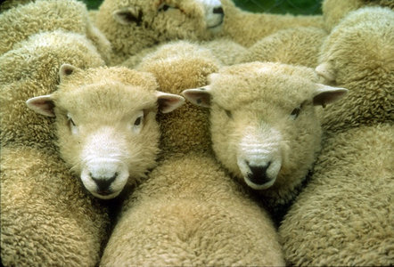

---
aliases:
- aita
- alẽ
- amɛ̈lbaai
- anneerü
- ardi
- aries
- arọọn̄
- atụrụ
- avis
- avės
- bakro
- bedots
- bherra
- biescia
- Biri-biri
- bric
- bubiri
- bédo
- canhona
- caora
- crastu
- cừu
- dafad
- dañvad
- dele
- dhumbhâ
- dibé
- dimeme
- domaća ovca
- domba
- domjaca wowca
- domôcô òwca
- dìmi᷆
- får
- fèja
- Hausschaf
- heu
- hipi
- hoolaa
- hwayi
- ichcatl
- ido
- imvu
- iwija
- Jip
- juh
- karnero
- kavır
- keyrrey
- kondoo-kaya
- kosa
- lambaz
- lammas
- lɛngbɔ
- mamoe
- martcenic
- mbelele
- melle
- mih
- mit
- mièn-yòng
- mouton
- mukoku
- mutono
- mémé
- mî-iûⁿ
- nagħġa
- namulol
- oai
- oaie domestică
- odwan
- ondry
- ovca
- ovca domáca
- ovce domácí
- ove
- ovea
- ovecha
- oveja
- ovelha
- ovella
- oveya
- ovis
- Ovis aries
- Ovis orientalis aries
- owca domowa
- pecora
- pecura
- peego/
- peosgo
- piègora
- piɛɣu
- pɛ'og
- qoy
- qoyun
- qoʻy
- rago
- saga
- sau
- sauðfé
- sauʒʒ
- savzâ
- Schaap
- Schoap
- Schof
- scēap
- seyður
- Sheep
- Shof
- sizi
- Sjaop
- Sjip
- skaap
- skoap
- sávza
- sïrve
- tamfår
- tamsau
- tupa
- ufisa
- uwiha
- walitaba
- wedhus gembel
- yegusha
- zonseap
- àgùtàn
- ústaģ
- ŝafo
- πρόβατο
- авечка
- авечка свойская
- баля
- вівця
- гӯсфанд
- кой
- овца
- реве
- сарык
- сурăх
- тта
- уча
- фыс
- хеб
- хой
- хонин
- хонь
- хөн
- чахъу
- ыж
- қой
- һарыҡ
- ոչխար
- כבש הבית
- שאף
- بھیڈ
- بھیڑ
- بھیݙ
- خروف
- رڍ
- سلاله خرفان
- كبش
- مەڕ
- کَٹھ
- گسفن
- گوسفند
- گۊسۊند
- ߛߊ߱
- फइ
- भेड़
- भेडा
- मेंढी
- ভেড়া
- ਭੇਡ
- ମେଣ୍ଢା
- செம்மறியாடு
- గొర్రె
- ಕುರಿ
- ചെമ്മരിയാട്
- බැටළුවා
- แกะ
- ལུག
- မေႈ
- သိုး
- შინაური ცხვარი
- በግ
- ᡥᠣᠨᡳᠨ
- ᥛᥥᥲ
- ᱵᱷᱤᱰᱤ
- ⵉⵀⵔⴰⵢ
- ヒツジ
- 绵羊
- 羊
- 양
- "\U0001033B\U00010330\U0001033C\U00010331"
has_id_wikidata: Q7368
title: Ovis aries
described_by_source:
- '[[../../../../../../../../../../../../../../../../../../../../../../WikiData/WD~Brockhaus_and_Efron_Encyclopedic_Dictionary,602358|WD~Brockhaus_and_Efron_Encyclopedic_Dictionary,602358]]'
- '[[_Standards/WikiData/WD~Encyclopædia_Britannica_11th_edition,867541|WD~Encyclopædia_Britannica_11th_edition,867541]]'
- '[[_Standards/WikiData/WD~Great_Complete_Encyclopedia_of_All_Sciences_and_Arts,1547546|WD~Great_Complete_Encyclopedia_of_All_Sciences_and_Arts,1547546]]'
- '[[_Standards/WikiData/WD~Explanatory_Dictionary_of_the_Living_Great_Russian_Language,1970746|WD~Explanatory_Dictionary_of_the_Living_Great_Russian_Language,1970746]]'
- '[[_Standards/WikiData/WD~Bible_Encyclopedia_of_Archimandrite_Nicephorus,4086271|WD~Bible_Encyclopedia_of_Archimandrite_Nicephorus,4086271]]'
- '[[_Standards/WikiData/WD~Small_Brockhaus_and_Efron_Encyclopedic_Dictionary,19180675|WD~Small_Brockhaus_and_Efron_Encyclopedic_Dictionary,19180675]]'
- '[[_Standards/WikiData/WD~New_Encyclopedic_Dictionary,19190511|WD~New_Encyclopedic_Dictionary,19190511]]'
- '[[_Standards/WikiData/WD~Great_Soviet_Encyclopedia_(1926_1947),20078554|WD~Great_Soviet_Encyclopedia_(1926_1947),20078554]]'
- '[[_Standards/WikiData/WD~The_Domestic_Encyclopædia;_Or,_A_Dictionary_Of_Facts,_And_Useful_Knowledge,56441911|WD~The_Domestic_Encyclopædia;_Or,_A_Dictionary_Of_Facts,_And_Useful_Knowledge,56441911]]'
- '[[_Standards/WikiData/WD~Metropolitan_Museum_of_Art_Tagging_Vocabulary,106727050|WD~Metropolitan_Museum_of_Art_Tagging_Vocabulary,106727050]]'
subclass_of:
- '[[_Standards/WikiData/WD~ruminant,842175|WD~ruminant,842175]]'
- '[[_Standards/WikiData/WD~productive_animal,1797813|WD~productive_animal,1797813]]'
- '[[_Standards/WikiData/WD~domesticated_mammal,57814795|WD~domesticated_mammal,57814795]]'
- '[[_Standards/WikiData/WD~herbivore,59099|WD~herbivore,59099]]'
habitat: '[[_Standards/WikiData/WD~pen,858177|WD~pen,858177]]'
history_of_topic: '[[_Standards/WikiData/WD~history_of_sheep,5868809|WD~history_of_sheep,5868809]]'
has_characteristic: '[[_Standards/WikiData/WD~sheep_breed,15622363|WD~sheep_breed,15622363]]'
permanent_duplicated_item: '[[_Standards/WikiData/WD~Q21286850,21286850|WD~Q21286850,21286850]]'
different_from:
- '[[_Standards/WikiData/WD~domesticated_sheep,22073013|WD~domesticated_sheep,22073013]]'
- '[[_Standards/WikiData/WD~Ovis_aries,29350771|WD~Ovis_aries,29350771]]'
has_part_s_:
- '[[_Standards/WikiData/WD~domesticated_sheep,22073013|WD~domesticated_sheep,22073013]]'
- '[[_Standards/WikiData/WD~Ovis,22724|WD~Ovis,22724]]'
taxon_known_by_this_common_name: '[[_Standards/WikiData/WD~Ovis_aries,29350771|WD~Ovis_aries,29350771]]'
instance_of: '[[_Standards/WikiData/WD~organisms_known_by_a_particular_common_name,55983715|WD~organisms_known_by_a_particular_common_name,55983715]]'
produced_sound: '[[_Standards/WikiData/WD~bleat,59939570|WD~bleat,59939570]]'
this_taxon_is_source_of:
- '[[_Standards/WikiData/WD~Q118869033,118869033|WD~Q118869033,118869033]]'
- '[[_Standards/WikiData/WD~wool,42329|WD~wool,42329]]'
has_use:
- '[[_Standards/WikiData/WD~milk,8495|WD~milk,8495]]'
- '[[_Standards/WikiData/WD~meat,10990|WD~meat,10990]]'
- '[[_Standards/WikiData/WD~wool,42329|WD~wool,42329]]'
longest_observed_lifespan: 22.8
OmegaWiki_Defined_Meaning: 5819
ITIS_TSN: 552475
image:
- http://commons.wikimedia.org/wiki/Special:FilePath/Yorkshire%20dales%20sheep.jpg
- http://commons.wikimedia.org/wiki/Special:FilePath/Ber%C3%A5%20Tirehaline%20x%20Timhadite.jpg
- http://commons.wikimedia.org/wiki/Special:FilePath/Flock%20of%20sheep.jpg
- http://commons.wikimedia.org/wiki/Special:FilePath/Sheep%20skeleton%20at%20MAV-USP.jpg
- http://commons.wikimedia.org/wiki/Special:FilePath/Sheep%20grazing%20on%20grass.jpg
pronunciation_audio:
- http://commons.wikimedia.org/wiki/Special:FilePath/LL-Q8752%20%28eus%29-Xabier%20Ca%C3%B1as-ardi.wav
- http://commons.wikimedia.org/wiki/Special:FilePath/LL-Q33965%20%28sat%29-Ramjit%20Tudu-%E1%B1%B5%E1%B1%B7%E1%B1%A4%E1%B1%B0%E1%B1%A4.wav
- http://commons.wikimedia.org/wiki/Special:FilePath/LL-Q5218%20%28que%29-Eavq-Uwiha.wav
name:
- ਭੇਡ
- بھیڈ
Iconclass_notation: 47I213
Commons_category: Sheep
UNSPSC_Code: 10101507
audio: http://commons.wikimedia.org/wiki/Special:FilePath/Sheep%20bleating.ogg
3D_model: http://commons.wikimedia.org/wiki/Special:FilePath/0%20A.D.%20Sheep%20smooth%20edit.stl
model_image: http://commons.wikimedia.org/wiki/Special:FilePath/Didactic%20model%20of%20a%20sheep%20muscular%20system%2001-FMVZ%20USP-28.jpeg
video: http://commons.wikimedia.org/wiki/Special:FilePath/DreibornerHochfl%C3%A4cheSchafherde.webm
Unicode_character:
- "\U0001F40F"
- "\U0001F411"
MeSH_tree_code: B01.050.150.900.649.313.500.380.791
Colon_Classification: KX783
Krugosvet_article_archived_: nauka_i_tehnika/biologiya/OVTSA.html
dv_has_:
  name_:
    ace: bubiri
    af: skaap
    am: በግ
    an: Ovis orientalis aries
    ang: scēap
    ann: arọọn̄
    anp: भेड़
    ar: خروف
    arn: ufisa
    ary: كبش
    arz: سلاله خرفان
    as: ভেড়া
    ast: oveya
    atj: martcenic
    av: чахъу
    avk: namulol
    awa: भेडा
    ay: iwija
    az: qoyun
    ba: һарыҡ
    ban: domba
    bar: Schof
    be: авечка свойская
    be_tarask: авечка
    bg: овца
    bm: saga
    bn: ভেড়া
    bo: ལུག
    br: dañvad
    brh: melle
    bs: ovca
    bxr: хонин
    ca: ovella
    ce: ústaģ
    ceb: Ovis aries
    chy: kosa
    ckb: مەڕ
    co: pecura
    crh: qoy
    cs: ovce domácí
    csb: domôcô òwca
    cv: сурăх
    cy: dafad
    da: får
    dag: piɛɣu
    de: Hausschaf
    de_ch: Hausschaf
    din: amɛ̈lbaai
    diq: kavır
    ee: alẽ
    el: πρόβατο
    eml: bric
    en: sheep
    en_ca: sheep
    en_gb: sheep
    en-us: sheep
    eo: ŝafo
    es: oveja
    et: lammas
    eu: ardi
    ext: Ovis orientalis aries
    fa: گوسفند
    fi: lammas
    fo: seyður
    fon: lɛngbɔ
    fr: mouton
    frr: Sjip
    ga: caora
    gan: 羊
    gd: caora
    gl: ovella
    glk: گۊسۊند
    gn: ovecha
    got: "\U0001033B\U00010330\U0001033C\U00010331"
    gsw: Hausschaf
    guc: anneerü
    gur: peego/
    gv: keyrrey
    ha: rago
    hak: mièn-yòng
    he: כבש הבית
    hi: भेड़
    hif: bherra
    hr: domaća ovca
    hsb: domjaca wowca
    ht: mouton
    hu: juh
    hy: ոչխար
    hyw: ոչխար
    ia: ove
    id: domba
    ig: atụrụ
    ilo: karnero
    io: mutono
    is: sauðfé
    it: pecora
    ja: ヒツジ
    jv: wedhus gembel
    ka: შინაური ცხვარი
    kbp: heu
    kcg: zonseap
    kg: dimeme
    kge: Biri-biri
    kk: қой
    kn: ಕುರಿ
    ko: 양
    koi: баля
    ks: کَٹھ
    ksh: Shof
    ku: mih
    kus: pɛ'og
    ky: кой
    la: ovis
    lad: oveja
    lb: Schof
    lbe: тта
    lez: хеб
    lfn: ovea
    li: Sjaop
    lij: Ovis Aries
    lld: biescia
    lmo: Ovis orientalis aries
    ln: mémé
    lt: avis
    lua: mukoku
    lv: aita
    lzh: 羊
    mad: dhumbhâ
    mcn: dìmi᷆
    mdf: уча
    mg: ondry
    mi: hipi
    min: domba
    mk: овца
    ml: ചെമ്മരിയാട്
    mn: хонь
    mnc: ᡥᠣᠨᡳᠨ
    mos: peosgo
    mr: मेंढी
    ms: biri-biri
    mt: nagħġa
    mul: Ovis aries
    mwl: canhona
    my: သိုး
    myv: реве
    mzn: گسفن
    nah: ichcatl
    nan: mî-iûⁿ
    nb: tamsau
    nds: Schaap
    nds_nl: skoap
    ne: भेडा
    new: फइ
    nl: schaap
    nn: sau
    nqo: ߛߊ߱
    nrm: mouton
    nv: dibé
    oc: Ovis aries
    om: hoolaa
    or: ମେଣ୍ଢା
    os: фыс
    pa: ਭੇਡ
    pam: tupa
    pcd: bédo
    pdc: sheep
    pl: owca domowa
    pms: fèja
    pnb: بھیڈ
    pt: ovelha
    pt_br: ovelha
    qu: uwiha
    rmf: bakro
    ro: oaie domestică
    ru: овца
    rup: oai
    sah: хой
    sat: ᱵᱷᱤᱰᱤ
    sc: Ovis aries
    scn: crastu
    sco: sheep
    sd: رڍ
    se: sávza
    sg: walitaba
    sgs: avės
    sh: ovca
    shn: မေႈ
    si: බැටළුවා
    sk: ovca domáca
    skr: بھیݙ
    sl: ovca
    sm: mamoe
    sma: sïrve
    smn: savzâ
    sms: sauʒʒ
    sn: hwayi
    so: ido
    sq: dele
    sr: овца
    sr_ec: овца
    su: domba
    sv: tamfår
    sw: kondoo-kaya
    szy: sizi
    ta: செம்மறியாடு
    tay: mit
    tcy: ಕುರಿ
    tdd: ᥛᥥᥲ
    te: గొర్రె
    tg: гӯсфанд
    th: แกะ
    tl: tupa
    tr: Ovis aries
    tt: сарык
    tum: mbelele
    tw: odwan
    tyv: хой
    udm: ыж
    uk: вівця
    ur: بھیڑ
    uz: qoʻy
    vec: piègora
    vep: lambaz
    vi: cừu
    vls: Schoap
    vo: Jip
    vro: lammas
    wa: bedots
    war: karnero
    wuu: 绵羊
    xal: хөн
    xh: yegusha
    yi: שאף
    yo: àgùtàn
    yue: 羊
    zgh: ⵉⵀⵔⴰⵢ
    zh: 羊
    zh_cn: 羊
    zh_hans: 羊
    zh_hant: 羊
    zh_hk: 羊
    zu: imvu
---

# [[Sheep]] 🐏 

#is_/same_as :: [[../../../../../../../../../../../../../../../../../../../../../../WikiData/WD~Sheep,7368|WD~Sheep,7368]] 

## #has_/text_of_/abstract 

> **Sheep** (pl.: sheep) or domestic sheep  (Ovis aries) are a domesticated, ruminant mammal typically kept as livestock. Although the term sheep can apply to other species in the genus Ovis, in everyday usage it almost always refers to domesticated sheep. Like all ruminants, sheep are members of the order Artiodactyla, the even-toed ungulates. Numbering a little over one billion, domestic sheep are also the most numerous species of sheep. An adult female is referred to as a ewe ( yoo), an intact male as a ram, occasionally a tup, a castrated male as a wether, and a young sheep as a lamb.
>
> Sheep are most likely descended from the wild mouflon of Europe and Asia, with Iran being a geographic envelope of the domestication center. One of the earliest animals to be domesticated for agricultural purposes, sheep are raised for fleeces, meat (lamb, hogget or mutton), and milk. A sheep's wool is the most widely used animal fiber, and is usually harvested by shearing. In Commonwealth countries, ovine meat is called lamb when from younger animals and mutton when from older ones; in the United States, meat from both older and younger animals is usually called lamb. Sheep continue to be important for wool and meat today, and are also occasionally raised for pelts, as dairy animals, or as model organisms for science.
>
> Sheep husbandry is practised throughout the majority of the inhabited world, and has been fundamental to many civilizations. In the modern era, Australia, New Zealand, the southern and central South American nations, and the British Isles are most closely associated with sheep production.
>
> There is a large lexicon of unique terms for sheep husbandry which vary considerably by region and dialect. Use of the word sheep began in Middle English as a derivation of the Old English word scēap. A group of sheep is called a flock. Many other specific terms for the various life stages of sheep exist, generally related to lambing, shearing, and age.
>
> As a key animal in the history of farming, sheep have a deeply entrenched place in human culture, and are represented in much modern language and symbolism. As livestock, sheep are most often associated with pastoral, Arcadian imagery. Sheep figure in many mythologies—such as the Golden Fleece—and major religions, especially the Abrahamic traditions. In both ancient and modern religious ritual, sheep are used as sacrificial animals.
>
> [Wikipedia](https://en.wikipedia.org/wiki/Sheep) 

## Phylogeny 

-   « Ancestral Groups  
    -   [Ovis](../Ovis.md)
    -   [Caprinae](../../Caprinae.md)
    -   [Bovidae](../../../Bovidae.md)
    -   [Ruminants](../../../../Ruminants.md)
    -  [Artiodactyla](../../../../../Artiodactyla.md) 
    -  [Eutheria](../../../../../../Eutheria.md) 
    -  [Mammal](../../../../../../../Mammal.md) 
    -   [Therapsida](../../../../../../../../Therapsida.md)
    -   [Synapsida](../../../../../../../../../Synapsida.md)
    -   [Amniota](../../../../../../../../../../Amniota.md)
    -   [Terrestrial Vertebrates](../../../../../../../../../../../Terrestrial.md)
    -   [Sarcopterygii](../../../../../../../../../../../../Sarc.md)
    -   [Gnathostomata](../../../../../../../../../../../../../Gnath.md)
    -   [Vertebrata](../../../../../../../../../../../../../../Vertebrata.md)
    -   [Craniata](../../../../../../../../../../../../../../../Craniata.md)
    -   [Chordata](../../../../../../../../../../../../../../../../Chordata.md)
    -   [Deuterostomia](../../../../../../../../../../../../../../../../../Deutero.md)
    -  [Bilateria](../../../../../../../../../../../../../../../../../../Bilateria.md) 
    -  [Animals](../../../../../../../../../../../../../../../../../../../Animals.md) 
    -  [Eukarya](../../../../../../../../../../../../../../../../../../../../Eukarya.md) 
    -   [Tree of Life](../../../../../../../../../../../../../../../../../../../../Tree_of_Life.md)

-   ◊ Sibling Groups of  Ovis
    -   Ovis aries

-   » Sub-Groups 
- 
Containing group: *[Ovis](../Ovis.md)*

### References

Hiendleder, S., B. Kaupe, R. Wassmuth, and A. Janke. 2002 Molecular
analysis of wild and domestic sheep questions current nomenclature and
provides evidence for domestication from two different subspecies.
Proceedings of the Royal Society Series B 269:893-904.

Hiendleder, S., K. Mainz, Y. Plante, and H. Lewalski. 1998. Analysis of
mitochondrial DNA indicates that domestic sheep are derived from two
different ancestral maternal sources: no evidence for contributions from
urial and argali sheep. Journal of Heredity 89:113-120.

Pedrosa, S., M. Uzun, J.-J. Arranz, B. Gutiérrez-Gil, F. San Primitivo,
and Y. Bayón. 2005. Evidence of three maternal lineages in near eastern
sheep supporting multiple domestication events. Proceedings of the Royal
Society Series B 272:2211-2217.

Tapio, M., N. Marzanov, M. Ozerov, M. Cinkulov, G. Gonzarenko, T.
Kiselyova, M. Murawski, H. Viinalass, and J. Kantanen. 2006. Sheep
Mitochondrial DNA Variation in European, Caucasian, and Central Asian
Areas. Molecular Biology and Evolution 23(9):1776-1783.

## Title Illustrations

 

  -----------------------------------------------------------------------------
  scientific_name ::     Ovis aries
  location ::           South Island, New Zealand
  Comments             Romney sheep
  specimen_condition ::  Live Specimen
  Body Part            head
  copyright ::            © [Greg and Marybeth Dimijian](http://www.dimijianimages.com/) 
 
  -----------------------------------------------------------------------------

## Confidential Links & Embeds: 

### #is_/same_as :: [[/_Standards/bio/bio~Domain/Eukarya/Animal/Bilateria/Deutero/Chordata/Craniata/Vertebrata/Gnath/Sarc/Tetrapods/Amniota/Synapsida/Therapsida/Mammal/Eutheria/Artiodactyla/Ruminants/Bovidae/Caprinae/Ovis/Sheep|Sheep]] 

### #is_/same_as :: [[/_public/bio/bio~Domain/Eukarya/Animal/Bilateria/Deutero/Chordata/Craniata/Vertebrata/Gnath/Sarc/Tetrapods/Amniota/Synapsida/Therapsida/Mammal/Eutheria/Artiodactyla/Ruminants/Bovidae/Caprinae/Ovis/Sheep.public|Sheep.public]] 

### #is_/same_as :: [[/_internal/bio/bio~Domain/Eukarya/Animal/Bilateria/Deutero/Chordata/Craniata/Vertebrata/Gnath/Sarc/Tetrapods/Amniota/Synapsida/Therapsida/Mammal/Eutheria/Artiodactyla/Ruminants/Bovidae/Caprinae/Ovis/Sheep.internal|Sheep.internal]] 

### #is_/same_as :: [[/_protect/bio/bio~Domain/Eukarya/Animal/Bilateria/Deutero/Chordata/Craniata/Vertebrata/Gnath/Sarc/Tetrapods/Amniota/Synapsida/Therapsida/Mammal/Eutheria/Artiodactyla/Ruminants/Bovidae/Caprinae/Ovis/Sheep.protect|Sheep.protect]] 

### #is_/same_as :: [[/_private/bio/bio~Domain/Eukarya/Animal/Bilateria/Deutero/Chordata/Craniata/Vertebrata/Gnath/Sarc/Tetrapods/Amniota/Synapsida/Therapsida/Mammal/Eutheria/Artiodactyla/Ruminants/Bovidae/Caprinae/Ovis/Sheep.private|Sheep.private]] 

### #is_/same_as :: [[/_personal/bio/bio~Domain/Eukarya/Animal/Bilateria/Deutero/Chordata/Craniata/Vertebrata/Gnath/Sarc/Tetrapods/Amniota/Synapsida/Therapsida/Mammal/Eutheria/Artiodactyla/Ruminants/Bovidae/Caprinae/Ovis/Sheep.personal|Sheep.personal]] 

### #is_/same_as :: [[/_secret/bio/bio~Domain/Eukarya/Animal/Bilateria/Deutero/Chordata/Craniata/Vertebrata/Gnath/Sarc/Tetrapods/Amniota/Synapsida/Therapsida/Mammal/Eutheria/Artiodactyla/Ruminants/Bovidae/Caprinae/Ovis/Sheep.secret|Sheep.secret]] 

