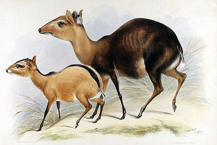

---
title: Cephalophinae
---

## Phylogeny 

-   « Ancestral Groups  
    -   [Bovidae](../Bovidae.md)
    -   [Ruminants](../../Ruminants.md)
    -  [Artiodactyla](../../../Artiodactyla.md))
    -  [Eutheria](../../../../Eutheria.md))
    -  [Mammal](../../../../../Mammal.md))
    -   [Therapsida](../../../../../../Therapsida.md)
    -   [Synapsida](../../../../../../../Synapsida.md)
    -   [Amniota](../../../../../../../../Amniota.md)
    -   [Terrestrial Vertebrates](../../../../../../../../../Terrestrial.md)
    -   [Sarcopterygii](../../../../../../../../../../Sarc.md)
    -   [Gnathostomata](../../../../../../../../../../../Gnath.md)
    -   [Vertebrata](../../../../../../../../../../../../Vertebrata.md)
    -   [Craniata](../../../../../../../../../../../../../Craniata.md)
    -   [Chordata](../../../../../../../../../../../../../../Chordata.md)
    -   [Deuterostomia](../../../../../../../../../../../../../../../Deutero.md)
    -  [Bilateria](../../../../../../../../../../../../../../../../Bilateria.md))
    -  [Animals](../../../../../../../../../../../../../../../../../Animals.md))
    -  [Eukarya](../../../../../../../../../../../../../../../../../../Eukarya.md))
    -   [Tree of Life](../../../../../../../../../../../../../../../../../../Tree_of_Life.md)

-   ◊ Sibling Groups of  Bovidae
    -   [Oreotragus oreotragus](Oreotragus_oreotragus)
    -   [Alcelaphinae](Alcelaphinae.md)
    -   [Hippotraginae](Hippotraginae.md)
    -   [Caprinae](Caprinae.md)
    -   [Aepyceros melampus](Impala.md)
    -   Cephalophinae
    -   [Reduncinae](Reduncinae.md)
    -  [Antelope](Antelope.md))
    -   [Neotragus](Neotragus.md)
    -   [Miscellaneous fossil         bovids](Miscellaneous_fossil_bovids)

-   » Sub-Groups
    -   [Cephalophus nigrifrons](Cephalophus_nigrifrons)

# Cephalophinae

## duikers 

Containing group: [Bovidae](../Bovidae.md)

### References

Fernández, M. H. and E. S. Vrba. 2005. A complete estimate of the
phylogenetic relationships in Ruminantia: a dated species-level
supertree of the extant ruminants. Biological Reviews 80(2):269-302.

Robinson, T. J., V. Wilson, D. S. Gallagher, Jr., J. F. Taylor, S. K.
Davis, W. R. Harrison, F. F. Elder. 1996. Chromosomal evolution in
duiker antelope (Cephalophinae: Bovidae): karyotype comparisons,
fluorescence in situ hybridization, and rampant X chromosome variation.
Cytogenetics and Cell Genetics 73(1-2):116-122.

Van Vuuren, B. J. and T. J. Robinson. 2001. Retrieval of four adaptive
lineages in duiker antelope: evidence from mitochondrial DNA sequences
and fluorescence in situ hybridation. Molecular Phylogenetics and
Evolution 20:409-425.

## Title Illustrations

)

  ----------------------------------
  Scientific Name ::  Cephalophus niger and Cephalophus dorsalis
  Comments          Cephalophus dorsalis (left) and Cephalophus niger (right)
  Reference         Gleanings from the Menagerie and Aviary at Knowsley Hall, by John Edward Gray, Liverpool, 1846.
  ----------------------------------

## Confidential Links & Embeds: 

### #is_/same_as ::[Cephalophinae](Cephalophinae.md)) 

### #is_/same_as :: [Cephalophinae.public](/_public/bio/bio~Domain/Eukarya/Animal/Bilateria/Deutero/Chordata/Craniata/Vertebrata/Gnath/Sarc/Tetrapods/Amniota/Synapsida/Therapsida/Mammal/Eutheria/Artiodactyla/Ruminants/Bovidae/Cephalophinae.public.md) 

### #is_/same_as :: [Cephalophinae.internal](/_internal/bio/bio~Domain/Eukarya/Animal/Bilateria/Deutero/Chordata/Craniata/Vertebrata/Gnath/Sarc/Tetrapods/Amniota/Synapsida/Therapsida/Mammal/Eutheria/Artiodactyla/Ruminants/Bovidae/Cephalophinae.internal.md) 

### #is_/same_as :: [Cephalophinae.protect](/_protect/bio/bio~Domain/Eukarya/Animal/Bilateria/Deutero/Chordata/Craniata/Vertebrata/Gnath/Sarc/Tetrapods/Amniota/Synapsida/Therapsida/Mammal/Eutheria/Artiodactyla/Ruminants/Bovidae/Cephalophinae.protect.md) 

### #is_/same_as :: [Cephalophinae.private](/_private/bio/bio~Domain/Eukarya/Animal/Bilateria/Deutero/Chordata/Craniata/Vertebrata/Gnath/Sarc/Tetrapods/Amniota/Synapsida/Therapsida/Mammal/Eutheria/Artiodactyla/Ruminants/Bovidae/Cephalophinae.private.md) 

### #is_/same_as :: [Cephalophinae.personal](/_personal/bio/bio~Domain/Eukarya/Animal/Bilateria/Deutero/Chordata/Craniata/Vertebrata/Gnath/Sarc/Tetrapods/Amniota/Synapsida/Therapsida/Mammal/Eutheria/Artiodactyla/Ruminants/Bovidae/Cephalophinae.personal.md) 

### #is_/same_as :: [Cephalophinae.secret](/_secret/bio/bio~Domain/Eukarya/Animal/Bilateria/Deutero/Chordata/Craniata/Vertebrata/Gnath/Sarc/Tetrapods/Amniota/Synapsida/Therapsida/Mammal/Eutheria/Artiodactyla/Ruminants/Bovidae/Cephalophinae.secret.md)

