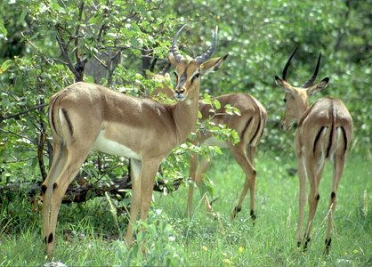

---
aliases:
- Aepyceros melampus
- Black-faced Impala
- Common Impala
- Impala
- impala zwyczajna
- Impalahjörtur
- Impalas
- Impalo
- Impara
- Inpala
- iompála
- Jádí bideeʼ yisdizígíí
- Linh dương Impala
- Mhara
- Phala
- putcudol
- rooibok
- Schwarzfersenantilope
- Swala pala
- Ïmpala
- İmpala
- İmpalalar
- Ιμπάλα
- Імпала
- імпаля
- Импала
- Пала гөрөөс
- Իմպալա
- אימפלה
- إمبالة
- امباله
- امپالا
- ایمپالا
- ىيمپالا
- इंपाला
- इम्पाला
- ଇମ୍ପାଲା
- ஆப்பிரிக்கச் சிறுமான்
- ಇಂಪಾಲ
- ഇംപാല
- อิมพาลา
- იმპალა
- インパラ
- 高角羚
- 黑斑羚
- 임팔라
has_id_wikidata: Q132576
title: Aepyceros melampus
taxon_common_name:
- Імпала
- Impala
- 高角羚
- Impala
- impala
- Impala
- Impala
- Impala
- Impala
- Impala
- Impala
- อิมพาลา
- Impala
- Rooibok
- impala
- Импала
- Impala
- Impala
- impala
- Schwarzfersenantilope
- Black-faced Impala
- Common Impala
- Impalo
- Impala
- אימפלה
- Impala
- インパラ
- Impala
- Impala
- Impala
- Импала
- Impala
- impala zwyczajna
- Impala
- Impala
- Импала
- Impala
- İmpala
IUCN_conservation_status: '[[_Standards/WikiData/WD~Least_Concern,211005]]'
described_by_source:
- '[[../../../../../../../../../../../../../../../../../../../../WikiData/WD~Brockhaus_and_Efron_Encyclopedic_Dictionary,602358]]'
- '[[_Standards/WikiData/WD~Encyclopædia_Britannica_11th_edition,867541]]'
parent_taxon: '[[_Standards/WikiData/WD~Aepyceros,10730799]]'
maintained_by_WikiProject: '[[_Standards/WikiData/WD~WikiProject_Invasion_Biology,56241615]]'
original_combination: '[[_Standards/WikiData/WD~Antilope_melampus,122418440]]'
taxon_rank: '[[_Standards/WikiData/WD~species,7432]]'
instance_of: '[[_Standards/WikiData/WD~taxon,16521]]'
subclass_of: '[[_Standards/WikiData/WD~antelope,25894]]'
longest_observed_lifespan: 25.6
gestation_period: 6.75
ITIS_TSN: 625076
short_name: A. melampus
taxon_range_map_image: http://commons.wikimedia.org/wiki/Special:FilePath/Aepyceros%20melampus.svg
image:
- http://commons.wikimedia.org/wiki/Special:FilePath/Aepyceros%20melampus%20-%20001.jpg
- http://commons.wikimedia.org/wiki/Special:FilePath/Female%20impala.jpg
- http://commons.wikimedia.org/wiki/Special:FilePath/Impala%2C%20Chobe%20National%20Park%2C%20Botswana%20%2851879018932%29.jpg
Commons_gallery: Aepyceros melampus
Commons_category: Aepyceros melampus
taxon_name: Aepyceros melampus
EPPO_Code: AEPYME
UMLS_CUI: C0325295
GenBank_assembly_accession_number: GCA_006408695.1
dv_has_:
  name_:
    af: Rooibok
    ar: إمبالة
    arz: امباله
    ast: Aepyceros melampus
    av: Импала
    avk: putcudol
    az: İmpalalar
    ban: Impala
    be-tarask: імпаля
    bg: импала
    br: Impala
    ca: impala
    ceb: Aepyceros melampus
    cs: impala
    cy: Impala
    da: Impala
    de: Impala
    el: Ιμπάλα
    en: impala
    en-ca: Impala
    en-gb: Impala
    eo: Impalo
    es: Aepyceros melampus
    et: Impala
    eu: Inpala
    fa: ایمپالا
    fi: impala
    fr: impala
    frr: Impalas
    fy: Impala
    ga: iompála
    gd: Aepyceros melampus
    gl: Impala
    he: אימפלה
    hi: इंपाला
    hr: Impala
    hu: impala
    hy: Իմպալա
    ia: impala
    id: Impala
    is: Impalahjörtur
    it: Aepyceros melampus
    ja: インパラ
    jv: Impala
    ka: იმპალა
    kk: Импала
    kk-arab: ىيمپالا
    kk-cn: ىيمپالا
    kk-cyrl: Импала
    kk-kz: Импала
    kk-latn: Ïmpala
    kk-tr: Ïmpala
    kn: ಇಂಪಾಲ
    ko: 임팔라
    kw: Impala
    la: Impala
    lb: Impala
    lez: Импала
    lfn: Impala
    lt: Impala
    lv: Impala
    mg: Impala
    mhr: Импала
    ml: ഇംപാല
    mn: Пала гөрөөс
    mr: इम्पाला
    ms: Impala
    mul: Aepyceros melampus
    nb: impala
    nl: impala
    nn: Aepyceros melampus
    nso: Phala
    nv: Jádí bideeʼ yisdizígíí
    oc: Aepyceros melampus
    or: ଇମ୍ପାଲା
    pl: impala zwyczajna
    pnb: امپالا
    pt: Impala
    pt-br: Impala
    ro: Impala
    ru: Импала
    rw: Impara
    sco: Impala
    sh: Impala
    sl: impala
    sn: Mhara
    sq: Aepyceros melampus
    sr: импала
    sr-ec: Импала
    sr-el: Impala
    sv: Impala
    sw: Swala pala
    ta: ஆப்பிரிக்கச் சிறுமான்
    th: อิมพาลา
    tl: Impala
    tr: İmpala
    udm: Импала
    uk: Імпала
    ur: امپالا
    uz: Impala
    vi: Linh dương Impala
    war: Aepyceros melampus
    wuu: 高角羚
    yue: 黑斑羚
    zh: 高角羚
    zh-cn: 高角羚
    zh-hans: 高角羚
    zh-hant: 高角羚
    zh-hk: 高角羚
    zh-sg: 高角羚
    zh-tw: 高角羚
---
# [[Impala]] 

#is_/same_as :: [[../../../../../../../../../../../../../../../../../../../../WikiData/WD~Impala,132576|WD~Impala,132576]] 
## Aepyceros melampus

## #has_/text_of_/abstract 

> The **Impala** or rooibok (Aepyceros melampus, lit. 'black-footed high-horn' in Ancient Greek) 
> is a medium-sized antelope found in eastern and southern Africa. 
> 
> The only extant member of the genus Aepyceros, and tribe Aepycerotini, 
> it was first described to Europeans by German zoologist Hinrich Lichtenstein in 1812. 
> Two subspecies are recognised—the grassland-dwelling common impala 
> (sometimes referred to as the Kenyan impala), and the larger and darker black-faced impala, 
> which lives in slightly more arid, scrubland environments. 
> 
> The impala reaches 70–92 cm (28–36 in) at the shoulder and weighs 40–76 kg (88–168 lb). 
> It features a glossy, reddish brown coat. 
> The male's slender, lyre-shaped horns are 45–92 cm (18–36 in) long.
>
> Active mainly during the day, the impala may be gregarious or territorial 
> depending upon the climate and geography. 
> 
> Three distinct social groups can be observed: the territorial males, bachelor herds and female herds. The impala is known for two characteristic leaps that constitute an anti-predator strategy. Browsers as well as grazers, impala feed on monocots, dicots, forbs, fruits and acacia pods (whenever available). An annual, three-week-long rut takes place toward the end of the wet season, typically in May. Rutting males fight over dominance, and the victorious male courts females in oestrus. Gestation lasts six to seven months, following which a single calf is born and immediately concealed in cover. Calves are suckled for four to six months; young males—forced out of the all-female groups—join bachelor herds, while females may stay back.
>
> The impala is found in woodlands and sometimes on the interface (ecotone) between woodlands and savannahs; it inhabits places near water. While the black-faced impala is confined to southwestern Angola and Kaokoland in northwestern Namibia, the common impala is widespread across its range and has been reintroduced in Gabon and southern Africa. The International Union for Conservation of Nature (IUCN) classifies the impala as a species of least concern; the black-faced subspecies has been classified as a vulnerable species, with fewer than 1,000 individuals remaining in the wild as of 2008.
>
> [Wikipedia](https://en.wikipedia.org/wiki/Impala) 

## Phylogeny 

-   « Ancestral Groups  
    -   [Bovidae](../Bovidae.md)
    -   [Ruminants](../../Ruminants.md)
    -  [Artiodactyla](../../../Artiodactyla.md) 
    -  [Eutheria](../../../../Eutheria.md) 
    -  [Mammal](../../../../../Mammal.md) 
    -   [Therapsida](../../../../../../Therapsida.md)
    -   [Synapsida](../../../../../../../Synapsida.md)
    -   [Amniota](../../../../../../../../Amniota.md)
    -   [Terrestrial Vertebrates](../../../../../../../../../Terrestrial.md)
    -   [Sarcopterygii](../../../../../../../../../../Sarc.md)
    -   [Gnathostomata](../../../../../../../../../../../Gnath.md)
    -   [Vertebrata](../../../../../../../../../../../../Vertebrata.md)
    -   [Craniata](../../../../../../../../../../../../../Craniata.md)
    -   [Chordata](../../../../../../../../../../../../../../Chordata.md)
    -   [Deuterostomia](../../../../../../../../../../../../../../../Deutero.md)
    -  [Bilateria](../../../../../../../../../../../../../../../../Bilateria.md) 
    -  [Animals](../../../../../../../../../../../../../../../../../Animals.md) 
    -  [Eukarya](../../../../../../../../../../../../../../../../../../Eukarya.md) 
    -   [Tree of Life](../../../../../../../../../../../../../../../../../../Tree_of_Life.md)

-   ◊ Sibling Groups of  Bovidae
    -   [Oreotragus oreotragus](Oreotragus_oreotragus)
    -   [Alcelaphinae](Alcelaphinae.md)
    -   [Hippotraginae](Hippotraginae.md)
    -   [Caprinae](Caprinae.md)
    -   Aepyceros melampus
    -   [Cephalophinae](Cephalophinae.md)
    -   [Reduncinae](Reduncinae.md)
    -  [Antelope](Antelope.md) 
    -   [Neotragus](Neotragus.md)
    -   [Miscellaneous fossil         bovids](Miscellaneous_fossil_bovids)

-   » Sub-Groups 

## Title Illustrations

-----------------------------

scientific_name ::                    Aepyceros melampus
location ::                          South Africa
Acknowledgements                    The copyright owner has released this image under the
								  [Attribution-NonCommercial-NoDerivs 2.0 Creative Commons                                       license](http://creativecommons.org/licenses/by-nc-nd/2.0/).\
								  source: [flickr:                                       Impala](http://flickr.com/photos/der_aufzynd/255914488/)
specimen_condition ::                 Live Specimen
Source Collection                   [Flickr](http://flickr.com/)
copyright ::                           © 2006 [der_aufzynd](http://flickr.com/people/der_aufzynd/)

## Confidential Links & Embeds: 

### #is_/same_as :: [[/_Standards/bio/bio~Domain/Eukarya/Animal/Bilateria/Deutero/Chordata/Craniata/Vertebrata/Gnath/Sarc/Tetrapods/Amniota/Synapsida/Therapsida/Mammal/Eutheria/Artiodactyla/Ruminants/Bovidae/Impala|Impala]] 

### #is_/same_as :: [[/_public/bio/bio~Domain/Eukarya/Animal/Bilateria/Deutero/Chordata/Craniata/Vertebrata/Gnath/Sarc/Tetrapods/Amniota/Synapsida/Therapsida/Mammal/Eutheria/Artiodactyla/Ruminants/Bovidae/Impala.public|Impala.public]] 

### #is_/same_as :: [[/_internal/bio/bio~Domain/Eukarya/Animal/Bilateria/Deutero/Chordata/Craniata/Vertebrata/Gnath/Sarc/Tetrapods/Amniota/Synapsida/Therapsida/Mammal/Eutheria/Artiodactyla/Ruminants/Bovidae/Impala.internal|Impala.internal]] 

### #is_/same_as :: [[/_protect/bio/bio~Domain/Eukarya/Animal/Bilateria/Deutero/Chordata/Craniata/Vertebrata/Gnath/Sarc/Tetrapods/Amniota/Synapsida/Therapsida/Mammal/Eutheria/Artiodactyla/Ruminants/Bovidae/Impala.protect|Impala.protect]] 

### #is_/same_as :: [[/_private/bio/bio~Domain/Eukarya/Animal/Bilateria/Deutero/Chordata/Craniata/Vertebrata/Gnath/Sarc/Tetrapods/Amniota/Synapsida/Therapsida/Mammal/Eutheria/Artiodactyla/Ruminants/Bovidae/Impala.private|Impala.private]] 

### #is_/same_as :: [[/_personal/bio/bio~Domain/Eukarya/Animal/Bilateria/Deutero/Chordata/Craniata/Vertebrata/Gnath/Sarc/Tetrapods/Amniota/Synapsida/Therapsida/Mammal/Eutheria/Artiodactyla/Ruminants/Bovidae/Impala.personal|Impala.personal]] 

### #is_/same_as :: [[/_secret/bio/bio~Domain/Eukarya/Animal/Bilateria/Deutero/Chordata/Craniata/Vertebrata/Gnath/Sarc/Tetrapods/Amniota/Synapsida/Therapsida/Mammal/Eutheria/Artiodactyla/Ruminants/Bovidae/Impala.secret|Impala.secret]] 

