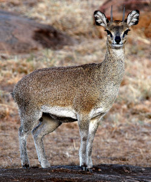
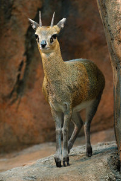

---
aliases:
- "Oreotragus oreotragus"
- Oreotragus
- klipspringer
title: "Oreotragus oreotragus"
---

# [[Klipspringer]] 

 

## Phylogeny 

-   « Ancestral Groups  
    -   [Bovidae](../Bovidae.md)
    -   [Ruminants](../../Ruminants.md)
    -  [Artiodactyla](../../../Artiodactyla.md))
    -  [Eutheria](../../../../Eutheria.md))
    -  [Mammal](../../../../../Mammal.md))
    -   [Therapsida](../../../../../../Therapsida.md)
    -   [Synapsida](../../../../../../../Synapsida.md)
    -   [Amniota](../../../../../../../../Amniota.md)
    -   [Terrestrial Vertebrates](../../../../../../../../../Terrestrial.md)
    -   [Sarcopterygii](../../../../../../../../../../Sarc.md)
    -   [Gnathostomata](../../../../../../../../../../../Gnath.md)
    -   [Vertebrata](../../../../../../../../../../../../Vertebrata.md)
    -   [Craniata](../../../../../../../../../../../../../Craniata.md)
    -   [Chordata](../../../../../../../../../../../../../../Chordata.md)
    -   [Deuterostomia](../../../../../../../../../../../../../../../Deutero.md)
    -  [Bilateria](../../../../../../../../../../../../../../../../Bilateria.md))
    -  [Animals](../../../../../../../../../../../../../../../../../Animals.md))
    -  [Eukarya](../../../../../../../../../../../../../../../../../../Eukarya.md))
    -   [Tree of Life](../../../../../../../../../../../../../../../../../../Tree_of_Life.md)

-   ◊ Sibling Groups of  Bovidae
    -   Oreotragus oreotragus
    -   [Alcelaphinae](Alcelaphinae.md)
    -   [Hippotraginae](Hippotraginae.md)
    -   [Caprinae](Caprinae.md)
    -   [Aepyceros melampus](Impala.md)
    -   [Cephalophinae](Cephalophinae.md)
    -   [Reduncinae](Reduncinae.md)
    -  [Antelope](Antelope.md))
    -   [Neotragus](Neotragus.md)
    -   [Miscellaneous fossil         bovids](Miscellaneous_fossil_bovids)

-   » Sub-Groups 

## Title Illustrations

-------------------------------------------------------------
 
Scientific Name ::     Oreotragus oreotragus
Location ::           Africa
Specimen Condition   Live Specimen
Source               [Klipspringer](http://flickr.com/photos/by-ken/198457969/)
Source Collection    [Flickr](http://flickr.com/)
Image Use ::    [Attribution-NonCommercial 2.0 Creative Commons License](http://creativecommons.org/licenses/by-nc/2.0/).
Copyright ::            © 2005 [Ken Clifton](http://flickr.com/people/47662556@N00/)

-------------------------------------------------------------
 
Scientific Name ::     Oreotragus oreotragus
Location ::           captive at Brookfield Zoo, Chicago, USA
Acknowledgements     The copyright owner has released this image under the [Attribution-NonCommercial-NoDerivs 2.0 Creative Commons license](http://creativecommons.org/licenses/by-nc-nd/2.0/).
Specimen Condition   Live Specimen
Copyright ::            © 2006 [Ben Seese](http://flickr.com/people/benseese/)

## Confidential Links & Embeds: 

### #is_/same_as ::[Klipspringer](Klipspringer.md)) 

### #is_/same_as :: [Klipspringer.public](/_public/bio/bio~Domain/Eukarya/Animal/Bilateria/Deutero/Chordata/Craniata/Vertebrata/Gnath/Sarc/Tetrapods/Amniota/Synapsida/Therapsida/Mammal/Eutheria/Artiodactyla/Ruminants/Bovidae/Klipspringer.public.md) 

### #is_/same_as :: [Klipspringer.internal](/_internal/bio/bio~Domain/Eukarya/Animal/Bilateria/Deutero/Chordata/Craniata/Vertebrata/Gnath/Sarc/Tetrapods/Amniota/Synapsida/Therapsida/Mammal/Eutheria/Artiodactyla/Ruminants/Bovidae/Klipspringer.internal.md) 

### #is_/same_as :: [Klipspringer.protect](/_protect/bio/bio~Domain/Eukarya/Animal/Bilateria/Deutero/Chordata/Craniata/Vertebrata/Gnath/Sarc/Tetrapods/Amniota/Synapsida/Therapsida/Mammal/Eutheria/Artiodactyla/Ruminants/Bovidae/Klipspringer.protect.md) 

### #is_/same_as :: [Klipspringer.private](/_private/bio/bio~Domain/Eukarya/Animal/Bilateria/Deutero/Chordata/Craniata/Vertebrata/Gnath/Sarc/Tetrapods/Amniota/Synapsida/Therapsida/Mammal/Eutheria/Artiodactyla/Ruminants/Bovidae/Klipspringer.private.md) 

### #is_/same_as :: [Klipspringer.personal](/_personal/bio/bio~Domain/Eukarya/Animal/Bilateria/Deutero/Chordata/Craniata/Vertebrata/Gnath/Sarc/Tetrapods/Amniota/Synapsida/Therapsida/Mammal/Eutheria/Artiodactyla/Ruminants/Bovidae/Klipspringer.personal.md) 

### #is_/same_as :: [Klipspringer.secret](/_secret/bio/bio~Domain/Eukarya/Animal/Bilateria/Deutero/Chordata/Craniata/Vertebrata/Gnath/Sarc/Tetrapods/Amniota/Synapsida/Therapsida/Mammal/Eutheria/Artiodactyla/Ruminants/Bovidae/Klipspringer.secret.md)

