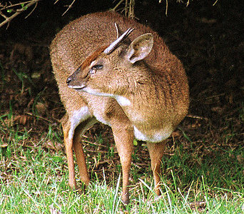

---
aliases:
  - Neotragus
title: Neotragus
---

# [[Neotragus]] 

 

## #has_/text_of_/abstract 

> **Neotragus** is a genus of dwarf antelope, native to Africa.
>
> The genus includes only a single species without any dispute, namely Neotragus pygmaeus. This species, the royal antelope, is the smallest antelope in the world, usually weighing around 5 to 7 pounds. They live in conditions that are warm and moist and are found in the tropical forests of Western Africa. The royal antelope's diet consists of high-nutrient food sources, such as leaves, flowers, plants, fruits, and the growing tips of shoots. Recent nucleic acid studies now suggest that the other two species formerly included in the genus are not closely related, and should be assigned to the genus Nesotragus. Members of the Nesotragus genus are the only surviving members of the subfamily Nesotraginae or tribe Nesotragini and are more closely related to the impala, while the royal antelope is still considered a member of the subfamily Antilopinae or tribe Antilopini.
>
> [Wikipedia](https://en.wikipedia.org/wiki/Neotragus) 

## Phylogeny 

-   « Ancestral Groups  
    -   [Bovidae](../Bovidae.md)
    -   [Ruminants](../../Ruminants.md)
    -  [Artiodactyla](../../../Artiodactyla.md) 
    -  [Eutheria](../../../../Eutheria.md) 
    -  [Mammal](../../../../../Mammal.md) 
    -   [Therapsida](../../../../../../Therapsida.md)
    -   [Synapsida](../../../../../../../Synapsida.md)
    -   [Amniota](../../../../../../../../Amniota.md)
    -   [Terrestrial Vertebrates](../../../../../../../../../Terrestrial.md)
    -   [Sarcopterygii](../../../../../../../../../../Sarc.md)
    -   [Gnathostomata](../../../../../../../../../../../Gnath.md)
    -   [Vertebrata](../../../../../../../../../../../../Vertebrata.md)
    -   [Craniata](../../../../../../../../../../../../../Craniata.md)
    -   [Chordata](../../../../../../../../../../../../../../Chordata.md)
    -   [Deuterostomia](../../../../../../../../../../../../../../../Deutero.md)
    -  [Bilateria](../../../../../../../../../../../../../../../../Bilateria.md) 
    -  [Animals](../../../../../../../../../../../../../../../../../Animals.md) 
    -  [Eukarya](../../../../../../../../../../../../../../../../../../Eukarya.md) 
    -   [Tree of Life](../../../../../../../../../../../../../../../../../../Tree_of_Life.md)

-   ◊ Sibling Groups of  Bovidae
    -   [Oreotragus oreotragus](Oreotragus_oreotragus)
    -   [Alcelaphinae](Alcelaphinae.md)
    -   [Hippotraginae](Hippotraginae.md)
    -   [Caprinae](Caprinae.md)
    -   [Aepyceros melampus](Impala.md)
    -   [Cephalophinae](Cephalophinae.md)
    -   [Reduncinae](Reduncinae.md)
    -  [Antelope](Antelope.md) 
    -   Neotragus
    -   [Miscellaneous fossil         bovids](Miscellaneous_fossil_bovids)

-   » Sub-Groups 

	-   *Neotragus batesi* [(dwarf antelope)]
	-   *Neotragus moschatus* [(suni)]
	-   *Neotragus pygmaeus* [(royal antelope)]

## Title Illustrations

------------------------------------------------------------------------- 
 
scientific_name ::     Neotragus moschatus
location ::           Mt Kenya Safari Club, Kenya
Comments             Captive, probably from Mt Kenya population.
specimen_condition ::  Live Specimen
Identified By        David Bygott
Sex ::                Male
Life Cycle Stage ::     Adult
View                 Fronto-lateral
copyright ::            © 2005 [David Bygott](mailto:davidbygott@yahoo.com) 

## Confidential Links & Embeds: 

### #is_/same_as :: [[/_Standards/bio/bio~Domain/Eukarya/Animal/Bilateria/Deutero/Chordata/Craniata/Vertebrata/Gnath/Sarc/Tetrapods/Amniota/Synapsida/Therapsida/Mammal/Eutheria/Artiodactyla/Ruminants/Bovidae/Neotragus|Neotragus]] 

### #is_/same_as :: [[/_public/bio/bio~Domain/Eukarya/Animal/Bilateria/Deutero/Chordata/Craniata/Vertebrata/Gnath/Sarc/Tetrapods/Amniota/Synapsida/Therapsida/Mammal/Eutheria/Artiodactyla/Ruminants/Bovidae/Neotragus.public|Neotragus.public]] 

### #is_/same_as :: [[/_internal/bio/bio~Domain/Eukarya/Animal/Bilateria/Deutero/Chordata/Craniata/Vertebrata/Gnath/Sarc/Tetrapods/Amniota/Synapsida/Therapsida/Mammal/Eutheria/Artiodactyla/Ruminants/Bovidae/Neotragus.internal|Neotragus.internal]] 

### #is_/same_as :: [[/_protect/bio/bio~Domain/Eukarya/Animal/Bilateria/Deutero/Chordata/Craniata/Vertebrata/Gnath/Sarc/Tetrapods/Amniota/Synapsida/Therapsida/Mammal/Eutheria/Artiodactyla/Ruminants/Bovidae/Neotragus.protect|Neotragus.protect]] 

### #is_/same_as :: [[/_private/bio/bio~Domain/Eukarya/Animal/Bilateria/Deutero/Chordata/Craniata/Vertebrata/Gnath/Sarc/Tetrapods/Amniota/Synapsida/Therapsida/Mammal/Eutheria/Artiodactyla/Ruminants/Bovidae/Neotragus.private|Neotragus.private]] 

### #is_/same_as :: [[/_personal/bio/bio~Domain/Eukarya/Animal/Bilateria/Deutero/Chordata/Craniata/Vertebrata/Gnath/Sarc/Tetrapods/Amniota/Synapsida/Therapsida/Mammal/Eutheria/Artiodactyla/Ruminants/Bovidae/Neotragus.personal|Neotragus.personal]] 

### #is_/same_as :: [[/_secret/bio/bio~Domain/Eukarya/Animal/Bilateria/Deutero/Chordata/Craniata/Vertebrata/Gnath/Sarc/Tetrapods/Amniota/Synapsida/Therapsida/Mammal/Eutheria/Artiodactyla/Ruminants/Bovidae/Neotragus.secret|Neotragus.secret]] 

