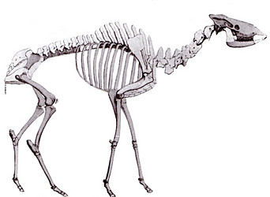

---
title: Giraffidae
---

# [[Giraffidae]] 

## #has_/text_of_/abstract 

> The **Giraffidae** are a family of ruminant artiodactyl mammals that share a recent common ancestor with deer and bovids. This family, once a diverse group spread throughout Eurasia and Africa, presently comprises only two extant genera, the giraffe (between one and eight, usually four, species of Giraffa, depending on taxonomic interpretation) and the okapi (the only known species of Okapia). Both are confined to sub-Saharan Africa: the giraffe to the open savannas, and the okapi to the dense rainforest of the Congo. The two genera look very different on first sight, but share a number of common features, including a long, dark-coloured tongue, lobed canine teeth, and horns covered in skin, called ossicones.
>
> [Wikipedia](https://en.wikipedia.org/wiki/Giraffidae) 

## Phylogeny 

-   « Ancestral Groups  
    -   [Giraffoidea](../Giraffoidea.md)
    -   [Ruminants](../../Ruminants.md)
    -  [Artiodactyla](../../../Artiodactyla.md))
    -  [Eutheria](../../../../Eutheria.md))
    -  [Mammal](../../../../../Mammal.md))
    -   [Therapsida](../../../../../../Therapsida.md)
    -   [Synapsida](../../../../../../../Synapsida.md)
    -   [Amniota](../../../../../../../../Amniota.md)
    -   [Terrestrial Vertebrates](../../../../../../../../../Terrestrial.md)
    -   [Sarcopterygii](../../../../../../../../../../Sarc.md)
    -   [Gnathostomata](../../../../../../../../../../../Gnath.md)
    -   [Vertebrata](../../../../../../../../../../../../Vertebrata.md)
    -   [Craniata](../../../../../../../../../../../../../Craniata.md)
    -   [Chordata](../../../../../../../../../../../../../../Chordata.md)
    -   [Deuterostomia](../../../../../../../../../../../../../../../Deutero.md)
    -  [Bilateria](../../../../../../../../../../../../../../../../Bilateria.md))
    -  [Animals](../../../../../../../../../../../../../../../../../Animals.md))
    -  [Eukarya](../../../../../../../../../../../../../../../../../../Eukarya.md))
    -   [Tree of Life](../../../../../../../../../../../../../../../../../../Tree_of_Life.md)

-   ◊ Sibling Groups of  Giraffoidea
    -   Giraffidae

-   » Sub-Groups
    -   [Giraffe](Giraffidae/Giraffe.md)
    -   [Okapia johnstoni](Okapia_johnstoni)

	-   *Birgerbohlinia* †
	-   *Bramatherium* †
	-   *Bohlinia* †
	-   *Csakvarotherium* †
	-   *Decennatherium* †
	-   *[Giraffe](Giraffidae/Giraffe.md "go to ToL page")*
	    [(giraffes)]
	-   *Helladotherium* †
	-   *Honanotherium* †
	-   *Hydaspitherium* †
	-   *Karsimatherium* †
	-   *Macedonitherium* †
	-   *Mitilanotherium* †
	-   *[Okapia     johnstoni](Okapia_johnstoni)*
	    [(okapi)]
	-   *Praepalaeotragus* †
	-   *Palaeotragus* †
	-   *Samotherium* †
	-   *Sivatherium* †
	-   *Sogdianotherium* †
	-   *Vishnutherium* †

## Title Illustrations

-----------------------------

Scientific Name ::     Sivatherium
Location ::           Sewalik Hills, India
Reference            Lankester, E. R. 1905. Extinct Animals. Archibald Constable & Co. Ltd., London
Specimen Condition   Fossil \-- Period: Miocene
Body Part            restored skull

-----------------------------

Scientific Name ::     Helladotherium
Location ::           Pikermi, Greece
Reference            Lankester, E. R. 1905. Extinct Animals. Archibald Constable & Co. Ltd., London
Creator              M. Gaudry
Specimen Condition   Fossil \-- Period: Miocene
Body Part            restored skeleton

## Confidential Links & Embeds: 

### #is_/same_as ::[Giraffidae](Giraffidae.md)) 

### #is_/same_as :: [Giraffidae.public](/_public/bio/bio~Domain/Eukarya/Animal/Bilateria/Deutero/Chordata/Craniata/Vertebrata/Gnath/Sarc/Tetrapods/Amniota/Synapsida/Therapsida/Mammal/Eutheria/Artiodactyla/Ruminants/Giraffoidea/Giraffidae.public.md) 

### #is_/same_as :: [Giraffidae.internal](/_internal/bio/bio~Domain/Eukarya/Animal/Bilateria/Deutero/Chordata/Craniata/Vertebrata/Gnath/Sarc/Tetrapods/Amniota/Synapsida/Therapsida/Mammal/Eutheria/Artiodactyla/Ruminants/Giraffoidea/Giraffidae.internal.md) 

### #is_/same_as :: [Giraffidae.protect](/_protect/bio/bio~Domain/Eukarya/Animal/Bilateria/Deutero/Chordata/Craniata/Vertebrata/Gnath/Sarc/Tetrapods/Amniota/Synapsida/Therapsida/Mammal/Eutheria/Artiodactyla/Ruminants/Giraffoidea/Giraffidae.protect.md) 

### #is_/same_as :: [Giraffidae.private](/_private/bio/bio~Domain/Eukarya/Animal/Bilateria/Deutero/Chordata/Craniata/Vertebrata/Gnath/Sarc/Tetrapods/Amniota/Synapsida/Therapsida/Mammal/Eutheria/Artiodactyla/Ruminants/Giraffoidea/Giraffidae.private.md) 

### #is_/same_as :: [Giraffidae.personal](/_personal/bio/bio~Domain/Eukarya/Animal/Bilateria/Deutero/Chordata/Craniata/Vertebrata/Gnath/Sarc/Tetrapods/Amniota/Synapsida/Therapsida/Mammal/Eutheria/Artiodactyla/Ruminants/Giraffoidea/Giraffidae.personal.md) 

### #is_/same_as :: [Giraffidae.secret](/_secret/bio/bio~Domain/Eukarya/Animal/Bilateria/Deutero/Chordata/Craniata/Vertebrata/Gnath/Sarc/Tetrapods/Amniota/Synapsida/Therapsida/Mammal/Eutheria/Artiodactyla/Ruminants/Giraffoidea/Giraffidae.secret.md)

