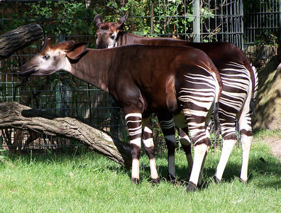

---
aliases:
- Bijáád noodǫ́ǫzii
- Hươu đùi vằn
- I-Okapi
- Mondonga
- ocapi
- Okaapi
- Okapi
- okapi leśne
- Okapia
- Okapia johnstoni
- Okapia pralesná
- Okapija
- Okapio
- Okapis
- onkapi
- Zuxol (Okapia johnstoni)
- Ókapi
- Ôkapy
- Οκάπι
- Акапі
- Окапі
- Окапи
- Օկապի
- אוקאפי
- أكاب
- اكاب
- اوکاپی
- اوکاپی زرافه
- اکاپی
- زەڕافەی مل کورت
- ओकापी
- ওকাপি
- ஓக்காப்பி
- ಒಕಾಪಿ
- ഓകാപി
- โอคาพี
- ოკაპი
- オカピ
- 㺢㹢狓
- 㺢㹢狓屬
- 霍加狓
- 오카피
title: Okapia johnstoni
has_id_wikidata: Q82037
dv_has_:
  name_:
    af: Okapi
    an: Okapia johnstoni
    ar: أكاب
    arz: اكاب
    ast: Okapi
    avk: Zuxol (Okapia johnstoni)
    az: Okapi
    azb: اوکاپی زرافه
    ban: Okapi
    bcl: Okapi
    be: Акапі
    bg: окапи
    bn: ওকাপি
    br: Okapi
    bs: Okapi
    ca: ocapi
    ceb: Okapia johnstoni
    ckb: زەڕافەی مل کورت
    cs: okapi
    cv: Окапи
    cy: Ocapi
    da: okapi
    de: Okapi
    de-ch: Okapi
    el: Οκάπι
    en: Okapia johnstoni
    en-ca: Okapi
    en-gb: Okapi
    eo: Okapio
    es: Okapia johnstoni
    et: Okaapi
    eu: Okapi
    ext: Okapia johnstoni
    fa: اکاپی
    fi: okapi
    fr: okapi
    frp: Ocapi
    frr: Okapi
    ga: Okapia johnstoni
    gl: Ocapi
    he: אוקאפי
    hi: ओकापी
    hr: Okapi
    hu: okapi
    hy: Օկապի
    ia: Okapia johnstoni
    id: Okapi
    ie: Okapia johnstoni
    io: Okapio
    is: Ókapi
    it: Okapia johnstoni
    ja: オカピ
    jbo: onkapi
    jv: Okapi
    ka: ოკაპი
    kg: Okapi
    kk: Окапи
    kn: ಒಕಾಪಿ
    ko: 오카피
    la: Okapia johnstoni
    lbe: Окапи
    ln: Mondonga
    lt: Okapija
    lv: Okapi
    mg: Ôkapy
    mhr: Окапи
    mk: Окапи
    ml: ഓകാപി
    ms: Okapi
    mul: Okapia johnstoni
    nan: Okapi
    nb: okapi
    nl: okapi
    nn: okapi
    nrm: Okapi
    nv: Bijáád noodǫ́ǫzii
    oc: Okapia johnstoni
    pl: okapi leśne
    pnb: اوکاپی
    pt: Okapia johnstoni
    pt-br: Okapia johnstoni
    ro: Okapi
    ru: Окапи
    sco: okapi
    sh: Okapi
    sk: Okapia pralesná
    sl: Okapi
    smn: Okapi
    sn: Okapi
    so: Okapi
    sq: Okapia johnstoni
    sr: окапи
    sv: okapi
    sw: Okapi
    ta: ஓக்காப்பி
    th: โอคาพี
    tl: Okapi
    tr: Okapi
    udm: Окапи
    uk: Окапі
    vi: Hươu đùi vằn
    vls: Okapi
    vo: Okapia johnstoni
    war: Okapia johnstoni
    wuu: 㺢㹢狓
    xmf: ოკაპი
    yue: 㺢㹢狓屬
    zh: 㺢㹢狓
    zh-cn: 霍加狓
    zh-tw: 㺢㹢狓
    zu: I-Okapi
---
## Phylogeny 

-   « Ancestral Groups  
    -   [Giraffidae](../Giraffidae.md)
    -   [Giraffoidea](../../Giraffoidea.md)
    -   [Ruminants](../../../Ruminants.md)
    -  [Artiodactyla](../../../../Artiodactyla.md) 
    -  [Eutheria](../../../../../Eutheria.md) 
    -  [Mammal](../../../../../../Mammal.md) 
    -   [Therapsida](../../../../../../../Therapsida.md)
    -   [Synapsida](../../../../../../../../Synapsida.md)
    -   [Amniota](../../../../../../../../../Amniota.md)
    -   [Terrestrial Vertebrates](../../../../../../../../../../Terrestrial.md)
    -   [Sarcopterygii](../../../../../../../../../../../Sarc.md)
    -   [Gnathostomata](../../../../../../../../../../../../Gnath.md)
    -   [Vertebrata](../../../../../../../../../../../../../Vertebrata.md)
    -   [Craniata](../../../../../../../../../../../../../../Craniata.md)
    -   [Chordata](../../../../../../../../../../../../../../../Chordata.md)
    -   [Deuterostomia](../../../../../../../../../../../../../../../../Deutero.md)
    -  [Bilateria](../../../../../../../../../../../../../../../../../Bilateria.md) 
    -  [Animals](../../../../../../../../../../../../../../../../../../Animals.md) 
    -  [Eukarya](../../../../../../../../../../../../../../../../../../../Eukarya.md) 
    -   [Tree of Life](../../../../../../../../../../../../../../../../../../../Tree_of_Life.md)

-   ◊ Sibling Groups of  Giraffidae
    -   [Giraffe](Giraffe.md)
    -   Okapia johnstoni

-   » Sub-Groups 

# Okapia johnstoni

## Okapi 

 

## #has_/text_of_/abstract 

> The okapi (; **Okapia** johnstoni), also known as the forest giraffe, Congolese giraffe and zebra giraffe, is an artiodactyl mammal that is endemic to the northeast Democratic Republic of the Congo in central Africa. However, non-invasive genetic identification has suggested that a population has occurred south-west of the Congo River as well. It is the only species in the genus Okapia. Although the okapi has striped markings reminiscent of zebras, it is most closely related to the giraffe. The okapi and the giraffe are the only living members of the family Giraffidae.
>
> The okapi stands about 1.5 m (4 ft 11 in) tall at the shoulder and has a typical body length around 2.5 m (8 ft 2 in). Its weight ranges from 200 to 350 kg (440 to 770 lb). It has a long neck, and large, flexible ears. Its coat is a chocolate to reddish brown, much in contrast with the white horizontal stripes and rings on the legs, and white ankles. Male okapis have short, distinct horn-like protuberances on their heads called ossicones, less than 15 cm (5.9 in) in length. Females possess hair whorls, and ossicones are absent.
>
> Okapis are primarily diurnal, but may be active for a few hours in darkness. They are essentially solitary, coming together only to breed. Okapis are herbivores, feeding on tree leaves and buds, grasses, ferns, fruits, and fungi. Rut in males and estrus in females does not depend on the season. In captivity, estrus cycles recur every 15 days. The gestational period is around 440 to 450 days long, following which usually a single calf is born. The juveniles are kept in hiding, and nursing takes place infrequently. Juveniles start taking solid food from three months, and weaning takes place at six months.
>
> Okapis inhabit canopy forests at altitudes of 500–1,500 m (1,600–4,900 ft). The International Union for the Conservation of Nature and Natural Resources classifies the okapi as endangered. Major threats include habitat loss due to logging and human settlement. Illegal mining and extensive hunting for bushmeat and skin have also led to a decline in populations. The Okapi Conservation Project was established in 1987 to protect okapi populations.
>
> [Wikipedia](https://en.wikipedia.org/wiki/Okapi) 

## Title Illustrations

------------------------------------------------------------------
 
scientific_name ::     Okapia johnstoni
location ::           captive at Berlin Zoo, Germany
Acknowledgements     This image is licensed under the [Attribution-NonCommercial-ShareAlike 2.0 Creative Commons License](http://creativecommons.org/licenses/by-nc-sa/2.0/).
specimen_condition ::  Live Specimen
Image Use ::    [Attribution-NonCommercial-ShareAlike 2.0 Creative Commons License](http://creativecommons.org/licenses/by-nc-sa/2.0/).
copyright ::            © 2004 [Phil](http://flickr.com/people/philbull11/)

## Confidential Links & Embeds: 

### #is_/same_as :: [[/_Standards/bio/bio~Domain/Eukarya/Animal/Bilateria/Deutero/Chordata/Craniata/Vertebrata/Gnath/Sarc/Tetrapods/Amniota/Synapsida/Therapsida/Mammal/Eutheria/Artiodactyla/Ruminants/Giraffoidea/Giraffidae/Okapi|Okapi]] 

### #is_/same_as :: [[/_public/bio/bio~Domain/Eukarya/Animal/Bilateria/Deutero/Chordata/Craniata/Vertebrata/Gnath/Sarc/Tetrapods/Amniota/Synapsida/Therapsida/Mammal/Eutheria/Artiodactyla/Ruminants/Giraffoidea/Giraffidae/Okapi.public|Okapi.public]] 

### #is_/same_as :: [[/_internal/bio/bio~Domain/Eukarya/Animal/Bilateria/Deutero/Chordata/Craniata/Vertebrata/Gnath/Sarc/Tetrapods/Amniota/Synapsida/Therapsida/Mammal/Eutheria/Artiodactyla/Ruminants/Giraffoidea/Giraffidae/Okapi.internal|Okapi.internal]] 

### #is_/same_as :: [[/_protect/bio/bio~Domain/Eukarya/Animal/Bilateria/Deutero/Chordata/Craniata/Vertebrata/Gnath/Sarc/Tetrapods/Amniota/Synapsida/Therapsida/Mammal/Eutheria/Artiodactyla/Ruminants/Giraffoidea/Giraffidae/Okapi.protect|Okapi.protect]] 

### #is_/same_as :: [[/_private/bio/bio~Domain/Eukarya/Animal/Bilateria/Deutero/Chordata/Craniata/Vertebrata/Gnath/Sarc/Tetrapods/Amniota/Synapsida/Therapsida/Mammal/Eutheria/Artiodactyla/Ruminants/Giraffoidea/Giraffidae/Okapi.private|Okapi.private]] 

### #is_/same_as :: [[/_personal/bio/bio~Domain/Eukarya/Animal/Bilateria/Deutero/Chordata/Craniata/Vertebrata/Gnath/Sarc/Tetrapods/Amniota/Synapsida/Therapsida/Mammal/Eutheria/Artiodactyla/Ruminants/Giraffoidea/Giraffidae/Okapi.personal|Okapi.personal]] 

### #is_/same_as :: [[/_secret/bio/bio~Domain/Eukarya/Animal/Bilateria/Deutero/Chordata/Craniata/Vertebrata/Gnath/Sarc/Tetrapods/Amniota/Synapsida/Therapsida/Mammal/Eutheria/Artiodactyla/Ruminants/Giraffoidea/Giraffidae/Okapi.secret|Okapi.secret]] 

