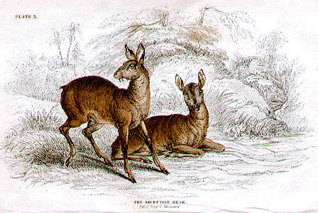

# Moschidae

## Musk deer 

 

## #has_/text_of_/abstract 

> **Moschidae** is a family of pecoran even-toed ungulates, 
> containing the musk deer (Moschus) and its extinct relatives. 
> 
> They are characterized by long "saber teeth" instead of horns, 
> antlers or ossicones, modest size (Moschus only reaches 37 lb (17 kg); 
> other taxa were even smaller) and a lack of facial glands. 
> 
> While various Oligocene and Miocene pecorans were previously assigned to this family, recent studies find that most should be assigned to their own clades, although further research would need to confirm these traits. As a result, Micromeryx, Hispanomeryx, and Moschus are the only undisputed moschid members, making them known from at least 18 Ma. The group was abundant across Eurasia and North America during the Miocene, but afterwards declined to only the extant genus Moschus by the early Pleistocene.
>
> [Wikipedia](https://en.wikipedia.org/wiki/Moschidae)

## Phylogeny 

-   « Ancestral Groups  
    -   [Ruminants](../Ruminants.md)
    -  [Artiodactyla](../../Artiodactyla.md))
    -  [Eutheria](../../../Eutheria.md))
    -  [Mammal](../../../../Mammal.md))
    -   [Therapsida](../../../../../Therapsida.md)
    -   [Synapsida](../../../../../../Synapsida.md)
    -   [Amniota](../../../../../../../Amniota.md)
    -   [Terrestrial Vertebrates](../../../../../../../../Terrestrial.md)
    -   [Sarcopterygii](../../../../../../../../../Sarc.md)
    -   [Gnathostomata](../../../../../../../../../../Gnath.md)
    -   [Vertebrata](../../../../../../../../../../../Vertebrata.md)
    -   [Craniata](../../../../../../../../../../../../Craniata.md)
    -   [Chordata](../../../../../../../../../../../../../Chordata.md)
    -   [Deuterostomia](../../../../../../../../../../../../../../Deutero.md)
    -  [Bilateria](../../../../../../../../../../../../../../../Bilateria.md))
    -  [Animals](../../../../../../../../../../../../../../../../Animals.md))
    -  [Eukarya](../../../../../../../../../../../../../../../../../Eukarya.md))
    -   [Tree of Life](../../../../../../../../../../../../../../../../../Tree_of_Life.md)

-   ◊ Sibling Groups of  Ruminantia
    -   [Bovidae](Bovidae.md)
    -   Moschidae
    -   [Giraffoidea](Giraffoidea.md)
    -   [Antilocapridae](Antilocapridae.md)
    -   [Miscellaneous fossil         pecorans](Miscellaneous_fossil_pecorans)
    -   [Tragulidae](Tragulidae.md)

-   » Sub-Groups 

	-   *Moschus berezovskii* [(Chinese forest musk deer)]
	-   *Moschus chrysogaster* [(Alpine musk deer)]
	-   *Moschus cupreus* [(Kashmir musk deer)]
	-   *Moschus fuscus* [(black musk deer or dusky musk
	    deer)]
	-   *Moschus leucogaster* [(Himalayan musk deer or white-bellied musk
	    deer)]
	-   *Moschus moschiferus* [(Siberian musk deer )]
	-   *Micromeryx* †

### Distribution

China and adjacent areas.

## Title Illustrations

-----------------------)
Scientific Name ::  Moschidae
Comments          The Thibetian Musk
Reference         Sir William Jardine\'s Naturalist\'s Library, Mammalia, 1835

## Confidential Links & Embeds: 

### #is_/same_as :: [Moschidae](/_Standards/bio/bio~Domain/Eukarya/Animal/Bilateria/Deutero/Chordata/Craniata/Vertebrata/Gnath/Sarc/Tetrapods/Amniota/Synapsida/Therapsida/Mammal/Eutheria/Artiodactyla/Ruminants/Moschidae.md) 

### #is_/same_as :: [Moschidae.public](/_public/bio/bio~Domain/Eukarya/Animal/Bilateria/Deutero/Chordata/Craniata/Vertebrata/Gnath/Sarc/Tetrapods/Amniota/Synapsida/Therapsida/Mammal/Eutheria/Artiodactyla/Ruminants/Moschidae.public.md) 

### #is_/same_as :: [Moschidae.internal](/_internal/bio/bio~Domain/Eukarya/Animal/Bilateria/Deutero/Chordata/Craniata/Vertebrata/Gnath/Sarc/Tetrapods/Amniota/Synapsida/Therapsida/Mammal/Eutheria/Artiodactyla/Ruminants/Moschidae.internal.md) 

### #is_/same_as :: [Moschidae.protect](/_protect/bio/bio~Domain/Eukarya/Animal/Bilateria/Deutero/Chordata/Craniata/Vertebrata/Gnath/Sarc/Tetrapods/Amniota/Synapsida/Therapsida/Mammal/Eutheria/Artiodactyla/Ruminants/Moschidae.protect.md) 

### #is_/same_as :: [Moschidae.private](/_private/bio/bio~Domain/Eukarya/Animal/Bilateria/Deutero/Chordata/Craniata/Vertebrata/Gnath/Sarc/Tetrapods/Amniota/Synapsida/Therapsida/Mammal/Eutheria/Artiodactyla/Ruminants/Moschidae.private.md) 

### #is_/same_as :: [Moschidae.personal](/_personal/bio/bio~Domain/Eukarya/Animal/Bilateria/Deutero/Chordata/Craniata/Vertebrata/Gnath/Sarc/Tetrapods/Amniota/Synapsida/Therapsida/Mammal/Eutheria/Artiodactyla/Ruminants/Moschidae.personal.md) 

### #is_/same_as :: [Moschidae.secret](/_secret/bio/bio~Domain/Eukarya/Animal/Bilateria/Deutero/Chordata/Craniata/Vertebrata/Gnath/Sarc/Tetrapods/Amniota/Synapsida/Therapsida/Mammal/Eutheria/Artiodactyla/Ruminants/Moschidae.secret.md)

