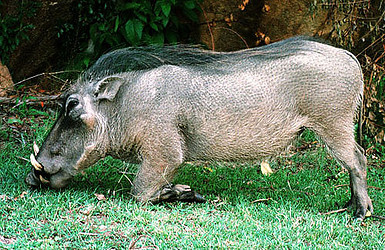

---
aliases:
  - Suidae
  - Suid
title: Suidae
---

# [[Suid]]

#is_/same_as :: 

## hogs and pigs 

)

## #has_/text_of_/abstract 

> **Suidae** is a family of artiodactyl mammals which are commonly called pigs, hogs, or swine. In addition to numerous fossil species, 18 extant species are currently recognized (or 19 counting domestic pigs and wild boars separately), classified into between four and eight genera. Within this family, the genus Sus includes the domestic pig, Sus scrofa domesticus or Sus domesticus, and many species of wild pig from Europe to the Pacific. Other genera include babirusas and warthogs. All suids, or swine, are native to the Old World, ranging from Asia to Europe and Africa.
>
> The earliest fossil suids date from the Oligocene epoch in Asia, and their descendants reached Europe during the Miocene. Several fossil species are known and show adaptations to a wide range of different diets, from strict herbivory to possible carrion-eating (in Tetraconodontinae).
>
> [Wikipedia](https://en.wikipedia.org/wiki/Suidae)

## Phylogeny 

-   « Ancestral Groups  
    -  [Artiodactyla](../Artiodactyla.md))
    -  [Eutheria](../../Eutheria.md))
    -  [Mammal](../../../Mammal.md))
    -   [Therapsida](../../../../Therapsida.md)
    -   [Synapsida](../../../../../Synapsida.md)
    -   [Amniota](../../../../../../Amniota.md)
    -   [Terrestrial Vertebrates](../../../../../../../Terrestrial.md)
    -   [Sarcopterygii](../../../../../../../../Sarc.md)
    -   [Gnathostomata](../../../../../../../../../Gnath.md)
    -   [Vertebrata](../../../../../../../../../../Vertebrata.md)
    -   [Craniata](../../../../../../../../../../../Craniata.md)
    -   [Chordata](../../../../../../../../../../../../Chordata.md)
    -   [Deuterostomia](../../../../../../../../../../../../../Deutero.md)
    -  [Bilateria](../../../../../../../../../../../../../../Bilateria.md))
    -  [Animals](../../../../../../../../../../../../../../../Animals.md))
    -  [Eukarya](../../../../../../../../../../../../../../../../Eukarya.md))
    -   [Tree of Life](../../../../../../../../../../../../../../../../Tree_of_Life.md)

-   ◊ Sibling Groups of  Artiodactyla
    -   Suidae
    -   [Tayassuidae](Tayassuidae.md)
    -   [Hippopotamidae](Hippopotamidae.md)
    -   [Tylopoda](Tylopoda.md)
    -   [Ruminants](Ruminants.md)
    -   [Miscellaneous fossil         artiodactyls](Miscellaneous_fossil_artiodactyls)

-   » Sub-Groups
    -  [Suinae](Suid/Suinae.md))
    -  [Hyotheriinae](Suid/Hyotheriinae.md))
    -  [Kubanochoerinae](Suid/Kubanochoerinae.md))
    -  [Listriodontinae](Suid/Listriodontinae.md))
    -  [Palaeochoerinae](Suid/Palaeochoerinae.md))
    -  [Tetraconodontinae](Suid/Tetraconodontinae.md))

	-   [Hyotheriinae](Suid/Hyotheriinae.md "go to ToL page"))*
	    †
	-   [Kubanochoerinae](Suid/Kubanochoerinae.md "go to ToL page"))*
	    †
	-   [Listriodontinae](Suid/Listriodontinae.md "go to ToL page"))*
	    †
	-   *Namachoerus* †
	-   [Palaeochoerinae](Suid/Palaeochoerinae.md "go to ToL page"))*
	    †
	-   *Siamochoerus* †
	-   *Sinapriculus* †
	-   [Tetraconodontinae](Suid/Tetraconodontinae.md "go to ToL page"))*†

## Title Illustrations

-------------------------------------------------------------------------)
Scientific Name ::   Phacochoerus aethiopicus
Location ::         Matopos National Park, Zimbabwe
Comments           Warthogs typically \"kneel\" to graze.
Identified By      David Bygott
Behavior           Grazing
Sex ::              Male
Life Cycle Stage ::   Young
View               Lateral
Copyright ::          © 2005 [David Bygott](mailto:davidbygott@yahoo.com) 

## Confidential Links & Embeds: 

### #is_/same_as :: [Suid](/_Standards/bio/bio~Domain/Eukarya/Animal/Bilateria/Deutero/Chordata/Craniata/Vertebrata/Gnath/Sarc/Tetrapods/Amniota/Synapsida/Therapsida/Mammal/Eutheria/Artiodactyla/Suid.md) 

### #is_/same_as :: [Suid.public](/_public/bio/bio~Domain/Eukarya/Animal/Bilateria/Deutero/Chordata/Craniata/Vertebrata/Gnath/Sarc/Tetrapods/Amniota/Synapsida/Therapsida/Mammal/Eutheria/Artiodactyla/Suid.public.md) 

### #is_/same_as :: [Suid.internal](/_internal/bio/bio~Domain/Eukarya/Animal/Bilateria/Deutero/Chordata/Craniata/Vertebrata/Gnath/Sarc/Tetrapods/Amniota/Synapsida/Therapsida/Mammal/Eutheria/Artiodactyla/Suid.internal.md) 

### #is_/same_as :: [Suid.protect](/_protect/bio/bio~Domain/Eukarya/Animal/Bilateria/Deutero/Chordata/Craniata/Vertebrata/Gnath/Sarc/Tetrapods/Amniota/Synapsida/Therapsida/Mammal/Eutheria/Artiodactyla/Suid.protect.md) 

### #is_/same_as :: [Suid.private](/_private/bio/bio~Domain/Eukarya/Animal/Bilateria/Deutero/Chordata/Craniata/Vertebrata/Gnath/Sarc/Tetrapods/Amniota/Synapsida/Therapsida/Mammal/Eutheria/Artiodactyla/Suid.private.md) 

### #is_/same_as :: [Suid.personal](/_personal/bio/bio~Domain/Eukarya/Animal/Bilateria/Deutero/Chordata/Craniata/Vertebrata/Gnath/Sarc/Tetrapods/Amniota/Synapsida/Therapsida/Mammal/Eutheria/Artiodactyla/Suid.personal.md) 

### #is_/same_as :: [Suid.secret](/_secret/bio/bio~Domain/Eukarya/Animal/Bilateria/Deutero/Chordata/Craniata/Vertebrata/Gnath/Sarc/Tetrapods/Amniota/Synapsida/Therapsida/Mammal/Eutheria/Artiodactyla/Suid.secret.md)

