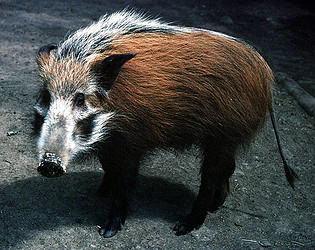

---
aliases:
- Buschschweine
- busksvin og penselsvin
- Dzikan
- Krūmyninės kiaulės
- pensselisiat
- Potamochoerus
- Potamochère
- Potamoker
- povodna svinja
- wafokoleem
- štětkoun
- Ποταμόχοιρος
- Кистеухие свиньи
- חזיר אדום
- خنزير النهر
- رودخوکها
- पोटामोकोएरस
- カワイノシシ属
- 非洲野猪属
- 非洲野豬
- 非洲野豬屬
- 강멧돼지속
title: Potamochoerus
has_id_wikidata: Q632928
dv_has_:
  name_:
    an: Potamochoerus
    ar: خنزير النهر
    arz: خنزير النهر
    ast: Potamochoerus
    avk: wafokoleem
    ban: Potamochoerus
    bg: Potamochoerus
    br: Potamoker
    ca: Potamochoerus
    ceb: Potamochoerus
    cs: štětkoun
    de: Buschschweine
    el: Ποταμόχοιρος
    en: Potamochoerus
    eo: Potamochoerus
    es: Potamochoerus
    eu: Potamochoerus
    ext: Potamochoerus
    fa: رودخوکها
    fi: pensselisiat
    fr: Potamochère
    ga: Potamochoerus
    gl: Potamochoerus
    he: חזיר אדום
    hi: पोटामोकोएरस
    hu: Potamochoerus
    ia: Potamochoerus
    ie: Potamochoerus
    io: Potamochoerus
    it: Potamochoerus
    ja: カワイノシシ属
    ko: 강멧돼지속
    la: Potamochoerus
    lt: Krūmyninės kiaulės
    mul: Potamochoerus
    nb: busksvin og penselsvin
    nl: Potamochoerus
    oc: Potamochoerus
    pl: Dzikan
    pt: Potamochoerus
    pt-br: Potamochoerus
    ro: Potamochoerus
    ru: Кистеухие свиньи
    sl: povodna svinja
    sq: Potamochoerus
    sv: Potamochoerus
    uk: Potamochoerus
    vi: Potamochoerus
    vo: Potamochoerus
    war: Potamochoerus
    yue: 非洲野豬
    zh: 非洲野猪属
    zh-cn: 非洲野猪属
    zh-tw: 非洲野豬屬
---
# [[Potamochoerus]] 
 

## #has_/text_of_/abstract 

> **Potamochoerus** (from Ancient Greek: ποταμο-χοῖρος  - potamo-choîros, meaning "river pig") 
> is a genus in the pig family (Suidae). 
> 
> The two species are restricted to sub-Saharan Africa, although the bushpig, possibly due to introduction by humans, also occurs in Madagascar and nearby islands. Early in the 20th century, there were considered to be as many as five different species within the genus. These were gradually consolidated, until, in the 1970s, it was generally agreed that all were representatives of just a single species (P. porcus). The bushpig was again recognised as a separate species from about 1993.
>
> The oldest fossils that can be assigned to the genus date from the mid Pliocene in Europe, and are first seen in Africa from least the mid Pleistocene, suggesting that it originally evolved in somewhere in Eurasia. However, molecular phylogenetic evidence suggests that the genus first diverged from the line leading to the giant forest hog and the warthogs much earlier, in the late Miocene, between 11.9 and 5.6 million years ago. The same studies suggest that the two living species diverged from one another between 4.8 and 0.2 million years ago.
>
> [Wikipedia](https://en.wikipedia.org/wiki/Potamochoerus) 

## Phylogeny 

-   « Ancestral Groups  
    -  [Suinae](../Suinae.md) 
    -  [Suid](../../Suid.md) 
    -  [Artiodactyla](../../../Artiodactyla.md) 
    -  [Eutheria](../../../../Eutheria.md) 
    -  [Mammal](../../../../../Mammal.md) 
    -   [Therapsida](../../../../../../Therapsida.md)
    -   [Synapsida](../../../../../../../Synapsida.md)
    -   [Amniota](../../../../../../../../Amniota.md)
    -   [Terrestrial Vertebrates](../../../../../../../../../Terrestrial.md)
    -   [Sarcopterygii](../../../../../../../../../../Sarc.md)
    -   [Gnathostomata](../../../../../../../../../../../Gnath.md)
    -   [Vertebrata](../../../../../../../../../../../../Vertebrata.md)
    -   [Craniata](../../../../../../../../../../../../../Craniata.md)
    -   [Chordata](../../../../../../../../../../../../../../Chordata.md)
    -   [Deuterostomia](../../../../../../../../../../../../../../../Deutero.md)
    -  [Bilateria](../../../../../../../../../../../../../../../../Bilateria.md) 
    -  [Animals](../../../../../../../../../../../../../../../../../Animals.md) 
    -  [Eukarya](../../../../../../../../../../../../../../../../../../Eukarya.md) 
    -   [Tree of Life](../../../../../../../../../../../../../../../../../../Tree_of_Life.md)

-   ◊ Sibling Groups of  Suinae
    -   [Pig](Pig.md)
    -   [Babyrousa babyrussa](Babyrousa_babyrussa.md)
    -   [Warthog](Warthog.md)
    -   Potamochoerus

-   » Sub-Groups 

	-   *Potamochoerus porcus* [(red river hog)]
	-   *Potamochoerus larvatus* [(bushpig)]

### Information on the Internet

[Pigs, Peccaries, and Hippos](http://iucn.org/themes/ssc/sgs/pphsg/Contents.htm). IUCN Status
Survey and Conservation Action Plan.

## Title Illustrations

------------------------------------------------------------- 
 
scientific_name ::     Potamochoerus larvatus
location ::           captive, Uganda
specimen_condition ::  Live Specimen
Source               [A captive bushpig](http://flickr.com/photos/ogcodes/126136127/)
Source Collection    [Flickr](http://flickr.com/)
Image Use ::    [Attribution-NonCommercial 2.0 Creative Commons License](http://creativecommons.org/licenses/by-nc/2.0/).
copyright ::            © 2006 [Michael Jefferies](http://flickr.com/people/ogcodes/)

-------------------------------------------------------------

scientific_name ::     Potamochoerus porcus
location ::           Arusha, Tanzania
Comments             Young captive specimen probably from the Mt Meru population.
specimen_condition ::  Live Specimen
Identified By        David Bygott
Life Cycle Stage ::     Young adult
View                 Lateral
copyright ::            © 2005 [David Bygott](mailto:davidbygott@yahoo.com) 

## Confidential Links & Embeds: 

### #is_/same_as :: [[/_Standards/bio/bio~Domain/Eukarya/Animal/Bilateria/Deutero/Chordata/Craniata/Vertebrata/Gnath/Sarc/Tetrapods/Amniota/Synapsida/Therapsida/Mammal/Eutheria/Artiodactyla/Suid/Suinae/Potamochoerus|Potamochoerus]] 

### #is_/same_as :: [[/_public/bio/bio~Domain/Eukarya/Animal/Bilateria/Deutero/Chordata/Craniata/Vertebrata/Gnath/Sarc/Tetrapods/Amniota/Synapsida/Therapsida/Mammal/Eutheria/Artiodactyla/Suid/Suinae/Potamochoerus.public|Potamochoerus.public]] 

### #is_/same_as :: [[/_internal/bio/bio~Domain/Eukarya/Animal/Bilateria/Deutero/Chordata/Craniata/Vertebrata/Gnath/Sarc/Tetrapods/Amniota/Synapsida/Therapsida/Mammal/Eutheria/Artiodactyla/Suid/Suinae/Potamochoerus.internal|Potamochoerus.internal]] 

### #is_/same_as :: [[/_protect/bio/bio~Domain/Eukarya/Animal/Bilateria/Deutero/Chordata/Craniata/Vertebrata/Gnath/Sarc/Tetrapods/Amniota/Synapsida/Therapsida/Mammal/Eutheria/Artiodactyla/Suid/Suinae/Potamochoerus.protect|Potamochoerus.protect]] 

### #is_/same_as :: [[/_private/bio/bio~Domain/Eukarya/Animal/Bilateria/Deutero/Chordata/Craniata/Vertebrata/Gnath/Sarc/Tetrapods/Amniota/Synapsida/Therapsida/Mammal/Eutheria/Artiodactyla/Suid/Suinae/Potamochoerus.private|Potamochoerus.private]] 

### #is_/same_as :: [[/_personal/bio/bio~Domain/Eukarya/Animal/Bilateria/Deutero/Chordata/Craniata/Vertebrata/Gnath/Sarc/Tetrapods/Amniota/Synapsida/Therapsida/Mammal/Eutheria/Artiodactyla/Suid/Suinae/Potamochoerus.personal|Potamochoerus.personal]] 

### #is_/same_as :: [[/_secret/bio/bio~Domain/Eukarya/Animal/Bilateria/Deutero/Chordata/Craniata/Vertebrata/Gnath/Sarc/Tetrapods/Amniota/Synapsida/Therapsida/Mammal/Eutheria/Artiodactyla/Suid/Suinae/Potamochoerus.secret|Potamochoerus.secret]] 

