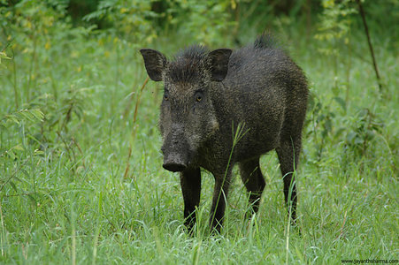

---
aliases:
  - Sus
  - pigs
  - pig
title: Sus
has_id_wikidata: Q787
GenBank_assembly_accession_number:
  - GCA_017957985.1
  - GCA_020567905.1
  - GCA_029890225.1
Commons_category: Sus scrofa domesticus
taxon_name: Sus scrofa domesticus
Commons_gallery: Sus scrofa domesticus
taxon_common_name:
  - gochu
  - Domestic pig
  - tamgris
  - domači prašič
  - świnia domowa
  - Hausschwein
taxon_rank: "[[_Standards/WikiData/WD~subspecies,68947]]"
subclass_of:
  - "[[_Standards/WikiData/WD~omnivore,164509]]"
  - "[[_Standards/WikiData/WD~productive_animal,1797813]]"
  - "[[_Standards/WikiData/WD~domesticated_mammal,57814795]]"
this_taxon_is_source_of:
  - "[[_Standards/WikiData/WD~pork,191768]]"
  - "[[_Standards/WikiData/WD~pork_tail,2255703]]"
  - "[[_Standards/WikiData/WD~knuckle,10498626]]"
  - "[[_Standards/WikiData/WD~pork_liver,18384179]]"
  - "[[_Standards/WikiData/WD~Crackling,28650565]]"
  - "[[_Standards/WikiData/WD~pig_nail,55758199]]"
  - "[[_Standards/WikiData/WD~pig's_bladder,96756123]]"
  - "[[_Standards/WikiData/WD~pig's_intestine,96756805]]"
described_by_source:
  - "[[_Standards/WikiData/WD~Encyclopædia_Britannica_11th_edition,867541]]"
  - "[[_Standards/WikiData/WD~Gujin_Tushu_Jicheng,1768721]]"
  - "[[_Standards/WikiData/WD~The_Domestic_Encyclopædia;_Or,_A_Dictionary_Of_Facts,_And_Useful_Knowledge,56441911]]"
has_part_s_:
  - "[[_Standards/WikiData/WD~male_pig,1484022]]"
  - "[[_Standards/WikiData/WD~female_pig,15942027]]"
  - "[[_Standards/WikiData/WD~pig's_tail,98058768]]"
depicted_by: "[[_Standards/WikiData/WD~Il_porcellino,131501675]]"
earliest_date: -15000-01-01T00:00:00Z
instance_of: "[[_Standards/WikiData/WD~taxon,16521]]"
longest_observed_lifespan: 27
parent_taxon: "[[_Standards/WikiData/WD~Sus_scrofa,58697]]"
OmegaWiki_Defined_Meaning: "5836"
ITIS_TSN: "898917"
image: http://commons.wikimedia.org/wiki/Special:FilePath/Sow%20with%20piglet.jpg
pronunciation_audio:
  - http://commons.wikimedia.org/wiki/Special:FilePath/LL-Q8752%20%28eus%29-Xabier%20Ca%C3%B1as-txerri.wav
  - http://commons.wikimedia.org/wiki/Special:FilePath/Pa-%E0%A8%B8%E0%A9%82%E0%A8%B0.oga
  - http://commons.wikimedia.org/wiki/Special:FilePath/Ka-ghori.ogg
audio: http://commons.wikimedia.org/wiki/Special:FilePath/Mudchute%20pig%201.ogg
Iconclass_notation: 47I212
video: http://commons.wikimedia.org/wiki/Special:FilePath/Pigsinapen-usdavideo.ogv
3D_model: http://commons.wikimedia.org/wiki/Special:FilePath/0%20A.D.%20pig%20smooth.stl
label_in_sign_language: http://commons.wikimedia.org/wiki/Special:FilePath/Cochon%20Nm%201%201%201%20-%20Elix.webm
model_image: http://commons.wikimedia.org/wiki/Special:FilePath/Domestic%20pig%20muscles%2001.jpg
icon: http://commons.wikimedia.org/wiki/Special:FilePath/Pig-47824.svg
Unicode_character:
  - 🐖
  - 🐷
UNSPSC_Code: "10101511"
MeSH_tree_code: B01.050.150.900.649.313.500.880
---

# [[Pig]] 

## Eurasian pigs 

#is_/same_as :: [[../../../../../../../../../../../../../../../../../../../../WikiData/WD~Pig,787|WD~Pig,787]] 

## #has_/text_of_/abstract 

> Sus is the genus of domestic and wild pigs, 
> within the even-toed ungulate family Suidae. 
> 
> Sus includes domestic pigs (Sus domesticus) and their ancestor, 
> the common Eurasian wild boar (Sus scrofa), 
> along with various other species. 
> Sus species, like all suids, are native to the Eurasian and African continents, 
> ranging from Europe to the Pacific islands.
>
> Juvenile pigs are known as piglets. 
> Pigs live in complex social groups 
> and are considered one of the more intelligent mammals, 
> as reflected in their ability to learn.
>
> With around 1 billion of this species alive at any time, 
> the domestic pig is among the most populous large mammals in the world. 
> 
> Pigs are omnivores and can consume a wide range of food. 
> Pigs are biologically similar to humans 
> and are thus frequently used for human medical research.
>
> [Wikipedia](https://en.wikipedia.org/wiki/Sus%20(genus))

## Phylogeny 

-   « Ancestral Groups  
    -  [Suinae](../Suinae.md))
    -  [Suidae](../../Suidae.md))
    -  [Artiodactyla](../../../Artiodactyla.md))
    -  [Eutheria](../../../../Eutheria.md))
    -  [Mammal](../../../../../Mammal.md))
    -   [Therapsida](../../../../../../Therapsida.md)
    -   [Synapsida](../../../../../../../Synapsida.md)
    -   [Amniota](../../../../../../../../Amniota.md)
    -   [Terrestrial Vertebrates](../../../../../../../../../Terrestrial.md)
    -   [Sarcopterygii](../../../../../../../../../../Sarc.md)
    -   [Gnathostomata](../../../../../../../../../../../Gnath.md)
    -   [Vertebrata](../../../../../../../../../../../../Vertebrata.md)
    -   [Craniata](../../../../../../../../../../../../../Craniata.md)
    -   [Chordata](../../../../../../../../../../../../../../Chordata.md)
    -   [Deuterostomia](../../../../../../../../../../../../../../../Deutero.md)
    -  [Bilateria](../../../../../../../../../../../../../../../../Bilateria.md))
    -  [Animals](../../../../../../../../../../../../../../../../../Animals.md))
    -  [Eukarya](../../../../../../../../../../../../../../../../../../Eukarya.md))
    -   [Tree of Life](../../../../../../../../../../../../../../../../../../Tree_of_Life.md)

-   ◊ Sibling Groups of  Suinae
    -   Sus
    -   [Babyrousa babyrussa](Babyrousa_babyrussa.md)
    -   [Warthog](Warthog.md)
    -   [Potamochoerus](Potamochoerus.md)

-   » Sub-Groups
    -   [Sus scrofa](Pig/Sus_scrofa.md)

	-   *Sus barbatus* [(bearded pig)]
	-   *Sus salvanius* [(pygmy hog)]
	-   *[Sus scrofa](Pig/Sus_scrofa.md "go to ToL page")* [(wild
	    boar)]
	-   *Sus verrucosus* [(Javan pig)]
	-   *Sus bucculentus* [(Vietnam warty pig)]
	-   *Sus cebifrons* [(Visayan warty pig)]
	-   *Sus celebensis* [(Celebes wild boar)]
	-   *Sus heureni* [(Flores warty pig)]
	-   *Sus philippensis* [(Philippine warty pig)]
	-   *Sus timoriensis* [(Timor wild boar)]

## Title Illustrations

----------------------------------------------------------------
Scientific Name ::     Sus scrofa
Location ::           India
Specimen Condition   Live Specimen
Source               [Wild Boar](http://flickr.com/photos/jayanthsharma/54607385/)
Source Collection    [Flickr](http://flickr.com/)
Image Use ::    [Attribution-NonCommercial-NoDerivs 2.0 Creative Commons License](http://creativecommons.org/licenses/by-nc-nd/2.0/).
Copyright ::            © 2005 [Jayanth Sharma](http://flickr.com/people/jayanthsharma/)

## Confidential Links & Embeds: 

### #is_/same_as :: [Pig](/_Standards/bio/bio~Domain/Eukarya/Animal/Bilateria/Deutero/Chordata/Craniata/Vertebrata/Gnath/Sarc/Tetrapods/Amniota/Synapsida/Therapsida/Mammal/Eutheria/Artiodactyla/Suidae/Suinae/Pig.md) 

### #is_/same_as :: [Pig.public](/_public/bio/bio~Domain/Eukarya/Animal/Bilateria/Deutero/Chordata/Craniata/Vertebrata/Gnath/Sarc/Tetrapods/Amniota/Synapsida/Therapsida/Mammal/Eutheria/Artiodactyla/Suidae/Suinae/Pig.public.md) 

### #is_/same_as :: [Pig.internal](/_internal/bio/bio~Domain/Eukarya/Animal/Bilateria/Deutero/Chordata/Craniata/Vertebrata/Gnath/Sarc/Tetrapods/Amniota/Synapsida/Therapsida/Mammal/Eutheria/Artiodactyla/Suidae/Suinae/Pig.internal.md) 

### #is_/same_as :: [Pig.protect](/_protect/bio/bio~Domain/Eukarya/Animal/Bilateria/Deutero/Chordata/Craniata/Vertebrata/Gnath/Sarc/Tetrapods/Amniota/Synapsida/Therapsida/Mammal/Eutheria/Artiodactyla/Suidae/Suinae/Pig.protect.md) 

### #is_/same_as :: [Pig.private](/_private/bio/bio~Domain/Eukarya/Animal/Bilateria/Deutero/Chordata/Craniata/Vertebrata/Gnath/Sarc/Tetrapods/Amniota/Synapsida/Therapsida/Mammal/Eutheria/Artiodactyla/Suidae/Suinae/Pig.private.md) 

### #is_/same_as :: [Pig.personal](/_personal/bio/bio~Domain/Eukarya/Animal/Bilateria/Deutero/Chordata/Craniata/Vertebrata/Gnath/Sarc/Tetrapods/Amniota/Synapsida/Therapsida/Mammal/Eutheria/Artiodactyla/Suidae/Suinae/Pig.personal.md) 

### #is_/same_as :: [Pig.secret](/_secret/bio/bio~Domain/Eukarya/Animal/Bilateria/Deutero/Chordata/Craniata/Vertebrata/Gnath/Sarc/Tetrapods/Amniota/Synapsida/Therapsida/Mammal/Eutheria/Artiodactyla/Suidae/Suinae/Pig.secret.md)

