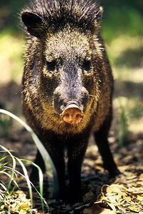
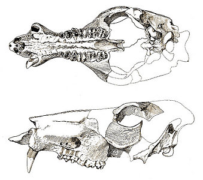

---
aliases:
  - Peccaries
  - javelinas
  - skunk pigs
  - Tayassuidae
  - pekariji
has_id_wikidata: Q232866
title: Tayassuidae
described_by_source: "[[_Standards/WikiData/WD~Otto's_encyclopedia,2041543]]"
CITES_Appendix: '[[_Standards/WikiData/WD~Appendix_II_of_CITES,2851527]]'
this_taxon_is_source_of: '[[_Standards/WikiData/WD~peccary,70388489]]'
code_of_nomenclature: '[[_Standards/WikiData/WD~International_Code_of_Zoological_Nomenclature,13011]]'
instance_of: '[[_Standards/WikiData/WD~taxon,16521]]'
taxon_rank: '[[_Standards/WikiData/WD~family,35409]]'
ITIS_TSN: 180723
image: http://commons.wikimedia.org/wiki/Special:FilePath/Collared%20peccary02%20-%20melbourne%20zoo.jpg
start_time: -33900000-01-01T00:00:00Z
taxon_range_map_image: http://commons.wikimedia.org/wiki/Special:FilePath/Peccary%20range.png
EPPO_Code: 1TAYAF
Commons_category: Tayassuidae
taxon_name: Tayassuidae
taxon_common_name: pekariji
---

# [[Tayassuidae]]

#is_/same_as :: [[../../../../../../../../../../../../../../../../../../WikiData/WD~Tayassuidae,232866|WD~Tayassuidae,232866]] 

## Dicotylidae, peccaries 

)

## #has_/text_of_/abstract 

> Peccaries (also javelinas or skunk pigs) 
> are pig-like ungulates of the family **Tayassuidae** (New World pigs). 
> 
> They are found throughout Central and South America, Trinidad in the Caribbean, 
> and in the southwestern area of North America. 
> 
> Peccaries usually measure between 90 and 130 cm (2 ft 11 in and 4 ft 3 in) in length, 
> and a full-grown adult usually weighs about 20 to 40 kg (44 to 88 lb). 
> 
> They represent the closest relatives of the family Suidae, which contains pigs and relatives. 
> Together Tayassuidae and Suidae are grouped in the suborder Suina within the order Artiodactyla (even-toed ungulates).
>
> Peccaries are social creatures that live in herds. They are omnivores and eat roots, grubs, and a variety of other foods. 
> 
> They can identify each other by their strong odors. 
> A group of peccaries that travel and live together is called a squadron. 
> A squadron of peccaries averages between six and nine members.
>
> Peccaries first appeared in North America during the Miocene and migrated into South America during the Pliocene–Pleistocene as part of the Great American Interchange.
>
> When the two occur in the wild in similar ranges, they are often confused with feral domestic pigs, commonly known as "razorback" hogs in many parts of the United States.
>
> The Maya kept herds of peccaries, using them in rituals and for food. They are kept as pets in many countries in addition to being raised on farms as a source of food.
>
> [Wikipedia](https://en.wikipedia.org/wiki/Peccary) 

## Phylogeny 

-   « Ancestral Groups  
    -  [Artiodactyla](../Artiodactyla.md) 
    -  [Eutheria](../../Eutheria.md) 
    -  [Mammal](../../../Mammal.md) 
    -   [Therapsida](../../../../Therapsida.md)
    -   [Synapsida](../../../../../Synapsida.md)
    -   [Amniota](../../../../../../Amniota.md)
    -   [Terrestrial Vertebrates](../../../../../../../Terrestrial.md)
    -   [Sarcopterygii](../../../../../../../../Sarc.md)
    -   [Gnathostomata](../../../../../../../../../Gnath.md)
    -   [Vertebrata](../../../../../../../../../../Vertebrata.md)
    -   [Craniata](../../../../../../../../../../../Craniata.md)
    -   [Chordata](../../../../../../../../../../../../Chordata.md)
    -   [Deuterostomia](../../../../../../../../../../../../../Deutero.md)
    -  [Bilateria](../../../../../../../../../../../../../../Bilateria.md) 
    -  [Animals](../../../../../../../../../../../../../../../Animals.md) 
    -  [Eukarya](../../../../../../../../../../../../../../../../Eukarya.md) 
    -   [Tree of Life](../../../../../../../../../../../../../../../../Tree_of_Life.md)

-   ◊ Sibling Groups of  Artiodactyla
    -   [Suid](Suid.md)
    -   Tayassuidae
    -   [Hippopotamidae](Hippopotamidae.md)
    -   [Tylopoda](Tylopoda.md)
    -   [Ruminants](Ruminants.md)
    -   [Miscellaneous fossil         artiodactyls](Miscellaneous_fossil_artiodactyls)

-   » Sub-Groups
    -  [Pecari tajacu](Tayassuidae/Pecari_tajacu.md) 

	-   *Tayassuinae*
	    -   *Catagonus wagneri* [(Chacoan peccary)]
	    -   *Tayassu pecari* [(white-lipped peccary)]
	    -   [Pecari tajacu](Tayassuidae/Pecari_tajacu.md "go to ToL page"))*
	        [(collared peccary, javelina)]
	    -   *Argyrohyus* †
	    -   *Brasiliochoerus* †
	    -   *Chaenohyus* †
	    -   *Cynorca* †
	    -   *Dyseohyus* †
	    -   *Egatochoerus* †
	    -   *Hesperhys* †
	    -   *Mylohyus* †
	    -   *Perchoerus* †
	    -   *Platygonus* †
	    -   *Prosthennops* †
	    -   *Thinohyus* †
	-   *Doliochoerinae* †
	    -   *Doliochoerus* †
	    -   *Taucanamo* †
	    -   *Pecarichoerus* †
	    -   *Barberahyus* †
	    -   *Schizochoerus* †

## Title Illustrations

)

-----------------
Scientific Name ::     Tayassu tajacu
Creator              Tom Stehn
Acknowledgements     courtesy U.S. Fish and Wildlife Service
Specimen Condition   Live Specimen
-----------------
)

--------------------------------------------------------------
Scientific Name ::     Platygonus
Location ::           Rancho La Brea, California, USA
Reference            Merriam, J. C. and C. Stock. 1921. Notes on peccary remains from Rancho La Brea. University of California Publications. Bulletin of the Department of Geological Sciences 13(2):9-17.
Specimen Condition   Fossil
Body Part            skull
--------------------------------------------------------------

## Confidential Links & Embeds: 

### #is_/same_as :: [Tayassuidae](/_Standards/bio/bio~Domain/Eukarya/Animal/Bilateria/Deutero/Chordata/Craniata/Vertebrata/Gnath/Sarc/Tetrapods/Amniota/Synapsida/Therapsida/Mammal/Eutheria/Artiodactyla/Tayassuidae.md) 

### #is_/same_as :: [Tayassuidae.public](/_public/bio/bio~Domain/Eukarya/Animal/Bilateria/Deutero/Chordata/Craniata/Vertebrata/Gnath/Sarc/Tetrapods/Amniota/Synapsida/Therapsida/Mammal/Eutheria/Artiodactyla/Tayassuidae.public.md) 

### #is_/same_as :: [Tayassuidae.internal](/_internal/bio/bio~Domain/Eukarya/Animal/Bilateria/Deutero/Chordata/Craniata/Vertebrata/Gnath/Sarc/Tetrapods/Amniota/Synapsida/Therapsida/Mammal/Eutheria/Artiodactyla/Tayassuidae.internal.md) 

### #is_/same_as :: [Tayassuidae.protect](/_protect/bio/bio~Domain/Eukarya/Animal/Bilateria/Deutero/Chordata/Craniata/Vertebrata/Gnath/Sarc/Tetrapods/Amniota/Synapsida/Therapsida/Mammal/Eutheria/Artiodactyla/Tayassuidae.protect.md) 

### #is_/same_as :: [Tayassuidae.private](/_private/bio/bio~Domain/Eukarya/Animal/Bilateria/Deutero/Chordata/Craniata/Vertebrata/Gnath/Sarc/Tetrapods/Amniota/Synapsida/Therapsida/Mammal/Eutheria/Artiodactyla/Tayassuidae.private.md) 

### #is_/same_as :: [Tayassuidae.personal](/_personal/bio/bio~Domain/Eukarya/Animal/Bilateria/Deutero/Chordata/Craniata/Vertebrata/Gnath/Sarc/Tetrapods/Amniota/Synapsida/Therapsida/Mammal/Eutheria/Artiodactyla/Tayassuidae.personal.md) 

### #is_/same_as :: [Tayassuidae.secret](/_secret/bio/bio~Domain/Eukarya/Animal/Bilateria/Deutero/Chordata/Craniata/Vertebrata/Gnath/Sarc/Tetrapods/Amniota/Synapsida/Therapsida/Mammal/Eutheria/Artiodactyla/Tayassuidae.secret.md)

