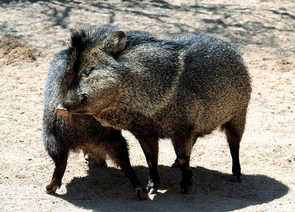

---
aliases:
  - Pecari_tajacu
  - Pecari tajacu
title: Pecari tajacu
---

# Pecari tajacu

## collared peccary, javelina 
 

## #has_/text_of_/abstract 

> The collared peccary (Dicotyles tajacu) is a peccary, 
> a species of artiodactyl (even-toed) mammal in the family Tayassuidae 
> found in North, Central, and South America. 
> 
> It is the only member of the genus Dicotyles. 
> They are commonly referred to as javelina, saíno, taitetu, or báquiro, 
> although these terms are also used to describe other species in the family. 
> The species is also known as the musk hog. 
> In Trinidad, it is colloquially known as quenk.
>
> [Wikipedia](https://en.wikipedia.org/wiki/Collared%20peccary)

## Phylogeny 

-   « Ancestral Groups  
    -  [Tayassuidae](../Tayassuidae.md) 
    -  [Artiodactyla](../../Artiodactyla.md) 
    -  [Eutheria](../../../Eutheria.md) 
    -  [Mammal](../../../../Mammal.md) 
    -   [Therapsida](../../../../../Therapsida.md)
    -   [Synapsida](../../../../../../Synapsida.md)
    -   [Amniota](../../../../../../../Amniota.md)
    -   [Terrestrial Vertebrates](../../../../../../../../Terrestrial.md)
    -   [Sarcopterygii](../../../../../../../../../Sarc.md)
    -   [Gnathostomata](../../../../../../../../../../Gnath.md)
    -   [Vertebrata](../../../../../../../../../../../Vertebrata.md)
    -   [Craniata](../../../../../../../../../../../../Craniata.md)
    -   [Chordata](../../../../../../../../../../../../../Chordata.md)
    -   [Deuterostomia](../../../../../../../../../../../../../../Deutero.md)
    -  [Bilateria](../../../../../../../../../../../../../../../Bilateria.md) 
    -  [Animals](../../../../../../../../../../../../../../../../Animals.md) 
    -  [Eukarya](../../../../../../../../../../../../../../../../../Eukarya.md) 
    -   [Tree of Life](../../../../../../../../../../../../../../../../../Tree_of_Life.md)

-   ◊ Sibling Groups of  Tayassuidae
    -   Pecari tajacu

-   » Sub-Groups 

### Information on the Internet

-   [Collared Peccary](http://www.nsrl.ttu.edu/tmot1/tayataja.htm). The Mammals of Texas.
-   [The Collared Peccary, or     Javelina](http://www.nps.gov/bibe/naturescience/javelina.htm). Nig Bend National Park.
-   [Collared Peccary a.k.a.     javelina](http://www.livingdesert.org/Animal/collared_peccary.asp) The Living Desert.

## Title Illustrations

---------------------------- 
 
Scientific Name ::                    Tayassu tajacu
Location ::                          Living Desert State Park, New Mexico, USA
Acknowledgements                    The copyright owner has released this image under the
								  [Attribution-NoDerivs 2.0 Creative Commons                                       license](http://creativecommons.org/licenses/by-nd/2.0/).\
								  source:
								  [flickr](http://flickr.com/photos/fustian/121975688/)
Specimen Condition                  Live Specimen
Copyright ::                           © 2006 [marissa b.](http://flickr.com/people/fustian/)

## Confidential Links & Embeds: 

### #is_/same_as :: [[/_Standards/bio/bio~Domain/Eukarya/Animal/Bilateria/Deutero/Chordata/Craniata/Vertebrata/Gnath/Sarc/Tetrapods/Amniota/Synapsida/Therapsida/Mammal/Eutheria/Artiodactyla/Tayassuidae/Pecari_tajacu|Pecari_tajacu]] 

### #is_/same_as :: [[/_public/bio/bio~Domain/Eukarya/Animal/Bilateria/Deutero/Chordata/Craniata/Vertebrata/Gnath/Sarc/Tetrapods/Amniota/Synapsida/Therapsida/Mammal/Eutheria/Artiodactyla/Tayassuidae/Pecari_tajacu.public|Pecari_tajacu.public]] 

### #is_/same_as :: [[/_internal/bio/bio~Domain/Eukarya/Animal/Bilateria/Deutero/Chordata/Craniata/Vertebrata/Gnath/Sarc/Tetrapods/Amniota/Synapsida/Therapsida/Mammal/Eutheria/Artiodactyla/Tayassuidae/Pecari_tajacu.internal|Pecari_tajacu.internal]] 

### #is_/same_as :: [[/_protect/bio/bio~Domain/Eukarya/Animal/Bilateria/Deutero/Chordata/Craniata/Vertebrata/Gnath/Sarc/Tetrapods/Amniota/Synapsida/Therapsida/Mammal/Eutheria/Artiodactyla/Tayassuidae/Pecari_tajacu.protect|Pecari_tajacu.protect]] 

### #is_/same_as :: [[/_private/bio/bio~Domain/Eukarya/Animal/Bilateria/Deutero/Chordata/Craniata/Vertebrata/Gnath/Sarc/Tetrapods/Amniota/Synapsida/Therapsida/Mammal/Eutheria/Artiodactyla/Tayassuidae/Pecari_tajacu.private|Pecari_tajacu.private]] 

### #is_/same_as :: [[/_personal/bio/bio~Domain/Eukarya/Animal/Bilateria/Deutero/Chordata/Craniata/Vertebrata/Gnath/Sarc/Tetrapods/Amniota/Synapsida/Therapsida/Mammal/Eutheria/Artiodactyla/Tayassuidae/Pecari_tajacu.personal|Pecari_tajacu.personal]] 

### #is_/same_as :: [[/_secret/bio/bio~Domain/Eukarya/Animal/Bilateria/Deutero/Chordata/Craniata/Vertebrata/Gnath/Sarc/Tetrapods/Amniota/Synapsida/Therapsida/Mammal/Eutheria/Artiodactyla/Tayassuidae/Pecari_tajacu.secret|Pecari_tajacu.secret]] 

