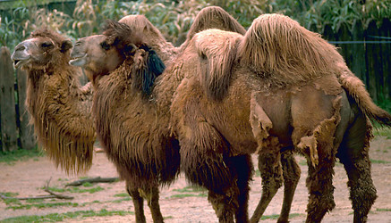

---
aliases:
- Camelidae
- camelides
- camèlids
- Camélidos
- cwoleem
- Deve
- Devegiller
- Dəvəkimilər
- Famîleya hêştiran
- Họ Lạc đà
- Kaamellased
- kameelachtigen
- Kameelagtige
- Kameelen
- Kameldjur
- kameldyr
- Kamele
- Kameledoj
- Kameler og lamaer
- kamelfamilien
- Kamelido
- kamelit
- Kamieleftigen
- Kamieļu dzimta
- Kaméiler
- Kemelachtign
- Kemelechtege
- kumte
- Kupranugariniai
- tevefélék
- Tileɣmatin
- Tüýetärizdiler
- velbloudovití
- wielbłądowate
- Καμηλίδες
- Верблюдові
- Верблюдовые
- вярблюдавыя
- Инкала куце дийнаташ
- Камили
- камилови
- Түйетәрізділер
- Тӱе-влак
- גמליים
- اونٹھ ٹبر
- تۇيەتارىزدىلەر
- جمليات
- شترسانان
- فامیلەیا هێشتران
- उष्ट्रगण
- ഉഷ്ട്രവംശി
- อูฐ
- აქლემისებრნი
- ラクダ科
- 駱駝科
- 骆驼科
- 낙타과
title: Camelidae
has_id_wikidata: Q135022
dv_has_:
  name_:
    af: Kameelagtige
    an: Camelidae
    ar: جمليات
    arz: جمليات
    ast: Camelidae
    avk: cwoleem
    az: Dəvəkimilər
    be: вярблюдавыя
    be_tarask: Вярблюдавыя
    bg: камилови
    br: Camelidae
    ca: camèlids
    ceb: Camelidae
    cs: velbloudovití
    da: Kameler og lamaer
    de: Kamele
    el: Καμηλίδες
    en: Camelidae
    eo: Kameledoj
    es: Camelidae
    et: Kaamellased
    eu: Kamelido
    ext: Camelidae
    fa: شترسانان
    fi: kamelit
    fr: Camelidae
    frr: Kameelen
    fy: Kamieleftigen
    ga: Camelidae
    gd: Camelidae
    gl: Camélidos
    he: גמליים
    hi: उष्ट्रगण
    hr: Deve
    hu: tevefélék
    ia: camelides
    id: Camelidae
    ie: Camelidae
    inh: Инкала куце дийнаташ
    io: Camelidae
    it: Camelidae
    ja: ラクダ科
    jbo: kumte
    jv: Camelidae
    ka: აქლემისებრნი
    kab: Tileɣmatin
    kk: Түйетәрізділер
    kk_arab: تۇيەتارىزدىلەر
    kk-cn: تۇيەتارىزدىلەر
    kk_cyrl: Түйетәрізділер
    kk-kz: Түйетәрізділер
    kk_latn: Tüýetärizdiler
    kk-tr: Tüýetärizdiler
    ko: 낙타과
    ku: Famîleya hêştiran
    ku_arab: فامیلەیا هێشتران
    ku_latn: Famîleya hêştiran
    la: Camelidae
    lb: Kaméiler
    li: Kemelechtege
    lt: Kupranugariniai
    lv: Kamieļu dzimta
    mhr: Тӱе-влак
    mk: Камили
    ml: ഉഷ്ട്രവംശി
    mul: Camelidae
    nb: kameldyr
    nl: kameelachtigen
    nn: kamelfamilien
    oc: Camelidae
    pl: wielbłądowate
    pnb: اونٹھ ٹبر
    pt: Camelidae
    pt_br: Camelidae
    ro: Camelidae
    ru: Верблюдовые
    scn: Camelidae
    sco: Camelidae
    sl: kamele
    sq: Camelidae
    sr: Camelidae
    sv: Kameldjur
    th: อูฐ
    tl: Camelidae
    tr: Devegiller
    uk: Верблюдові
    vi: Họ Lạc đà
    vls: Kemelachtign
    vo: Camelidae
    war: Camelidae
    wuu: 骆驼科
    yue: 駱駝科
    zh: 骆驼科
    zh_cn: 骆驼科
    zh_hans: 骆驼科
    zh_hant: 駱駝科
    zh_hk: 駱駝科
    zh_sg: 骆驼科
    zh_tw: 駱駝科
Unicode_character: 🐪
---
# [[Camelidae]] 🐪 

## #has_/text_of_/abstract 

> Camelids are members of the biological family **Camelidae**, 
> the only currently living family in the suborder Tylopoda. 
> 
> The seven extant members of this group are: 
> - dromedary camels, 
> - Bactrian camels, 
> - wild Bactrian camels, 
> - llamas, 
> - alpacas, 
> - vicuñas, and 
> - guanacos. 
> 
> Camelids are even-toed ungulates classified in the order Artiodactyla, 
> along with species including whales, pigs, deer, cattle, and antelopes.
>
> [Wikipedia](https://en.wikipedia.org/wiki/Camelidae) 

## Phylogeny 

-   « Ancestral Groups  
    -  [Tylopoda](../Tylopoda.md) 
    -  [Artiodactyla](../../Artiodactyla.md) 
    -  [Eutheria](../../../Eutheria.md) 
    -  [Mammal](../../../../Mammal.md) 
    -   [Therapsida](../../../../../Therapsida.md)
    -   [Synapsida](../../../../../../Synapsida.md)
    -   [Amniota](../../../../../../../Amniota.md)
    -   [Terrestrial Vertebrates](../../../../../../../../Terrestrial.md)
    -   [Sarcopterygii](../../../../../../../../../Sarc.md)
    -   [Gnathostomata](../../../../../../../../../../Gnath.md)
    -   [Vertebrata](../../../../../../../../../../../Vertebrata.md)
    -   [Craniata](../../../../../../../../../../../../Craniata.md)
    -   [Chordata](../../../../../../../../../../../../../Chordata.md)
    -   [Deuterostomia](../../../../../../../../../../../../../../Deutero.md)
    -  [Bilateria](../../../../../../../../../../../../../../../Bilateria.md) 
    -  [Animals](../../../../../../../../../../../../../../../../Animals.md) 
    -  [Eukarya](../../../../../../../../../../../../../../../../../Eukarya.md) 
    -   [Tree of Life](../../../../../../../../../../../../../../../../../Tree_of_Life.md)

-   ◊ Sibling Groups of  Tylopoda
    -   Camelidae

-   » Sub-Groups
    -   [Camel](Camelidae/Camel.md)
	-   *[Camel](Camelidae/Camel.md "go to ToL page")* [(camels,
	    llamas, and their relatives)]
	-   *Floridatragulinae* †
	    -   *Floridatragulus* †
	    -   *Aguascalientia* †
	-   *Miolabinae* †
	    -   *Paramiolabis* †
	    -   *Miolabis* †
	    -   *Cuyamacamelus* †
	    -   *Nothotylopus* †
	    -   *Capricamelus* †
	-   *Protolabinae* †
	    -   *Tanymykter* †
	    -   *Protolabis* †
	    -   *Michenia* †
	-   *Stenomylinae* †
	    -   *Stenomylus* †
	    -   *Blickomylus* †
	    -   *Rakomylus* †
	    -   *Pseudolabis* †
	    -   *Miotylopus* †
	-   *Poebrodon* †
	-   *Hidrosotherium* †
	-   *Poebrotherium* †
	-   *Paralabis* †
	-   *Paratylopus* †
	-   *Oxydactylus* †[ (incertae
	    sedis) ]
	-   *Australocamelus* †[
	    (incertae sedis) ]
	-   *Priscocamelus* †[ (incertae
	    sedis) ]
	-   *Nothokemas* †[ (incertae
	    sedis) ]
	-   *Gentilicamelus* †[ (incertae
	    sedis) ]

## Title Illustrations

-----------------------

scientific_name ::     Camelus bactrianus
Creator              Photograph by Gary M. Stolz
Acknowledgements     Photograph courtesy of the U.S. Fish and Wildlife Service
specimen_condition ::  Live Specimen

## Confidential Links & Embeds: 

### #is_/same_as :: [[/_Standards/bio/bio~Domain/Eukarya/Animal/Bilateria/Deutero/Chordata/Craniata/Vertebrata/Gnath/Sarc/Tetrapods/Amniota/Synapsida/Therapsida/Mammal/Eutheria/Artiodactyla/Tylopoda/Camelidae|Camelidae]] 

### #is_/same_as :: [[/_public/bio/bio~Domain/Eukarya/Animal/Bilateria/Deutero/Chordata/Craniata/Vertebrata/Gnath/Sarc/Tetrapods/Amniota/Synapsida/Therapsida/Mammal/Eutheria/Artiodactyla/Tylopoda/Camelidae.public|Camelidae.public]] 

### #is_/same_as :: [[/_internal/bio/bio~Domain/Eukarya/Animal/Bilateria/Deutero/Chordata/Craniata/Vertebrata/Gnath/Sarc/Tetrapods/Amniota/Synapsida/Therapsida/Mammal/Eutheria/Artiodactyla/Tylopoda/Camelidae.internal|Camelidae.internal]] 

### #is_/same_as :: [[/_protect/bio/bio~Domain/Eukarya/Animal/Bilateria/Deutero/Chordata/Craniata/Vertebrata/Gnath/Sarc/Tetrapods/Amniota/Synapsida/Therapsida/Mammal/Eutheria/Artiodactyla/Tylopoda/Camelidae.protect|Camelidae.protect]] 

### #is_/same_as :: [[/_private/bio/bio~Domain/Eukarya/Animal/Bilateria/Deutero/Chordata/Craniata/Vertebrata/Gnath/Sarc/Tetrapods/Amniota/Synapsida/Therapsida/Mammal/Eutheria/Artiodactyla/Tylopoda/Camelidae.private|Camelidae.private]] 

### #is_/same_as :: [[/_personal/bio/bio~Domain/Eukarya/Animal/Bilateria/Deutero/Chordata/Craniata/Vertebrata/Gnath/Sarc/Tetrapods/Amniota/Synapsida/Therapsida/Mammal/Eutheria/Artiodactyla/Tylopoda/Camelidae.personal|Camelidae.personal]] 

### #is_/same_as :: [[/_secret/bio/bio~Domain/Eukarya/Animal/Bilateria/Deutero/Chordata/Craniata/Vertebrata/Gnath/Sarc/Tetrapods/Amniota/Synapsida/Therapsida/Mammal/Eutheria/Artiodactyla/Tylopoda/Camelidae.secret|Camelidae.secret]] 

