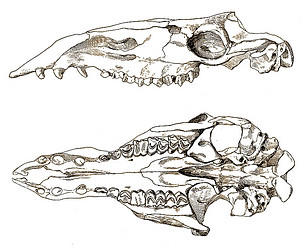

---
aliases:
- Altweltkamele
- Alɣem
- Aɖaɖa
- A̱lakumi
- camall
- Camel
- Camelinae
- Camell
- Camellu
- Camelo
- Camelus
- Cameyoh
- camiddu
- Camioe
- chameau
- Chamo
- Cwol (Camelus)
- Càmhal
- Cămilă
- deva
- Deve
- Deve starog svijeta
- Deveja
- Devä
- Dəvə
- Efunumu ponko
- Gaala
- Gameo
- Geel
- Ghą́ą́ʼaskʼidii
- Hêştir
- Ingamiya
- Kaamel
- Kaamli
- kameel
- Kameels
- Kamel
- Kamela
- kamelen
- kameler
- kamelio
- kamelit
- Kamelo
- kamelslekta
- Kamelur
- Kamelyo
- Kamielen
- Kamieļi
- Kamillu
- Kamél
- Kopranogarē
- Kowrvargh
- Kupranugariai
- Laakumi
- Lakunmi
- Lo̍k-thò
- Lo̍k-tô
- làmgídà
- Lŏk-dò̤
- Lạc đà
- Mymba'akãndu
- Ngamia
- ngeelooba
- Nghamera
- Odari
- olfend
- Onta
- Pa'e'pa'onáhe
- Pikukturuaq
- Rameva
- raƙumi
- teve
- Tuya
- Tylopodes
- töge
- Túye
- ucc
- Unta
- Unto
- Untth
- Uuntth
- velblod
- velbloud
- Verblüdad
- wielbłąd
- Émkal
- Úlfaldar
- Ťava
- κάμηλος
- καμήλα
- Варани
- верблюд
- верблюды
- вярблюд
- вярблюды
- Деве
- Дуе
- дуэ
- Дөйә
- дөя
- Инкалаш
- ишим
- камила
- камили
- Махъушэ
- Тĕве
- Темән
- Теуа
- Тэбиэн
- Тэмээ
- Тэмээн
- Түйелер
- Төө
- Тӱе
- Шутур
- ուղտեր
- גמל
- קעמל
- اونٹ
- اونٹھ
- اوښ
- اّٹھ
- اٺ
- تۆگە
- جمل
- دوه
- شتر
- وشتر
- ܓܡܠܐ
- उँट
- उंट
- उंथ
- उष्ट्रः
- ऊँट
- উট
- ਊਠ
- ஒட்டகம்
- ఒంటె
- ಒಂಟೆ
- ഒട്ടകം
- ඔටුවා
- อูฐ
- རྔ་མོང་།
- ကုလားအုတ်
- არქემი
- აქლემი
- ግመል
- ᎨᎻᎵ
- ᡨᡝᠮᡝᠨ
- ᱩᱸ~ᱴ
- ラクダ
- 駱駝
- 駱駝屬
- 骆驼
- 骆驼属
- 낙타
has_id_wikidata: Q7375
audio: http://commons.wikimedia.org/wiki/Special:FilePath/Cri%20du%20chameau.wav
Colon_Classification: KX446
Commons_category: Camelus
Commons_gallery: Camelus
depicted_by: '[[_Standards/WikiData/WD~The_Magical_Procession,131627550]]'
described_by_source:
- '[[../../../../../../../../../../../../../../../../../../../../WikiData/WD~Brockhaus_and_Efron_Encyclopedic_Dictionary,602358]]'
- '[[_Standards/WikiData/WD~Encyclopædia_Britannica_11th_edition,867541]]'
- '[[_Standards/WikiData/WD~Gujin_Tushu_Jicheng,1768721]]'
- '[[_Standards/WikiData/WD~Explanatory_Dictionary_of_the_Living_Great_Russian_Language,1970746]]'
- '[[_Standards/WikiData/WD~Bible_Encyclopedia_of_Archimandrite_Nicephorus,4086271]]'
- '[[_Standards/WikiData/WD~Sytin_Military_Encyclopedia,4114391]]'
- '[[_Standards/WikiData/WD~Jewish_Encyclopedia_of_Brockhaus_and_Efron,4173137]]'
- '[[_Standards/WikiData/WD~Small_Brockhaus_and_Efron_Encyclopedic_Dictionary,19180675]]'
different_from: '[[_Standards/WikiData/WD~Q55443222,55443222]]'
EPPO_Code: 1CMELG
exact_match: https://ids.clld.org/parameters/3-780
image: http://commons.wikimedia.org/wiki/Special:FilePath/Chameau%20de%20bactriane.JPG
instance_of: '[[_Standards/WikiData/WD~taxon,16521]]'
invasive_to: '[[_Standards/WikiData/WD~Australian_continent,3960]]'
ITIS_TSN: 624942
Krugosvet_article: nauka_i_tehnika/biologiya/VERBLYUDI.html
maintained_by_WikiProject: '[[_Standards/WikiData/WD~WikiProject_Invasion_Biology,56241615]]'
MeSH_tree_code: B01.050.150.900.649.313.500.190.180
natural_reservoir_of: '[[_Standards/WikiData/WD~Middle_East_respiratory_syndrome_coronavirus,4902157]]'
NBN_System_Key: NHMSYS0020976786
OmegaWiki_Defined_Meaning: 8069
permanent_duplicated_item: '[[_Standards/WikiData/WD~Q25691373,25691373]]'
pronunciation_audio: http://commons.wikimedia.org/wiki/Special:FilePath/LL-Q13955%20%28ara%29-Spotless%20Mind1988-%D8%AC%D9%85%D9%84.wav
start_time: -3600000-01-01
subclass_of: '[[_Standards/WikiData/WD~ungulate,1231177]]'
taxonomic_type: '[[_Standards/WikiData/WD~Camelus_bactrianus,132922]]'
taxon_author_citation: Linnaeus, 1758
taxon_name: Camelus
taxon_range_map_image: http://commons.wikimedia.org/wiki/Special:FilePath/Camel%20world%20population.png
taxon_rank: '[[_Standards/WikiData/WD~genus,34740]]'
title: Camelinae
UNSPSC_Code: 10101517
dv_has_:
  name_:
    acm: جمل
    ady: Махъушэ
    af: kameel
    ak: Efunumu ponko
    am: ግመል
    an: Camelus
    ang: olfend
    anp: ऊँट
    ar: جمل
    arc: ܓܡܠܐ
    ary: جمل
    arz: جمل
    as: উট
    ast: Camelus
    av: Варани
    avk: Cwol (Camelus)
    awa: उँट
    az: Dəvə
    azb: دوه
    ba: Дөйә
    ban: Unta
    bcl: Kamelyo
    be: вярблюды
    be_tarask: вярблюд
    bg: камили
    bi: Kamel
    bn: উট
    bo: རྔ་མོང་།
    br: Camelus
    brh: ucc
    bs: Deva
    bxr: Тэмээн
    ca: Camell
    cdo: Lŏk-dò̤
    ce: Émkal
    ceb: Camelus
    chr: ᎨᎻᎵ
    chy: Pa'e'pa'onáhe
    ckb: وشتر
    co: Camellu
    crh: Deve
    cs: velbloud
    csb: Kamél
    cv: Тĕве
    cy: camel
    da: Camelus
    dag: Laakumi
    de: Altweltkamele
    diq: Deve
    el: καμήλα
    en: Camelus
    en_ca: Camel
    en_gb: camel
    eo: kamelo
    es: Camelus
    et: Kaamel
    eu: Camelus
    ext: Camelus
    fa: شتر
    ff: ngeelooba
    fi: kamelit
    fo: Kamelur
    fon: Lakunmi
    fr: chameau
    fy: Kamielen
    ga: camall
    gag: Devä
    gd: Càmhal
    gl: Camelo
    gn: Mymba'akãndu
    gom: Untth
    grc: κάμηλος
    gsw: Altweltkamele
    ha: raƙumi
    hak: Lo̍k-thò
    he: גמל
    hi: ऊँट
    hif: Uuntth
    hr: Deve starog svijeta
    ht: Chamo
    hu: teve
    hy: ուղտեր
    hyw: Ուղտեր
    ia: Camelus
    id: unta
    ie: Camelus
    ig: Camelus
    ik: Pikukturuaq
    ilo: kamelio
    inh: Инкалаш
    io: Kamelo
    is: Úlfaldar
    it: Camelus
    ja: ラクダ
    jam: Kamel
    jv: Onta
    ka: აქლემი
    kaa: Túye
    kab: Alɣem
    kbp: Aɖaɖa
    kcg: A̱lakumi
    kk: Түйелер
    kn: ಒಂಟೆ
    ko: 낙타
    ku: Hêştir
    kw: Kowrvargh
    ky: Төө
    la: Camelus
    lad: Gameo
    lbe: Варани
    lez: Деве
    lfn: Camel
    lt: Kupranugariai
    lv: Kamieļi
    lzh: 駱駝
    mad: Onta
    mcn: làmgídà
    mdf: ишим
    mg: Rameva
    mhr: Тӱе
    min: Unto
    mk: камила
    ml: ഒട്ടകം
    mn: Тэмээ
    mnc: ᡨᡝᠮᡝᠨ
    mr: उंट
    ms: Unta
    mul: Camelus
    my: ကုလားအုတ်
    myv: Дуе
    mzn: شتر
    nah: Cameyoh
    nan: Lo̍k-tô
    nb: kameler
    nds: Kameels
    ne: उँट
    new: उंथ
    nl: kamelen
    nn: kamelslekta
    nso: Kamela
    nv: Ghą́ą́ʼaskʼidii
    oc: Tylopodes
    om: Gaala
    os: Теуа
    pa: ਊਠ
    pcd: Camioe
    pl: wielbłąd
    pnb: اونٹھ
    ps: اوښ
    pt: Camelus
    pt_br: Camelo
    qu: Kamillu
    rmy: Odari
    ro: Cămilă
    ru: верблюды
    rw: Ingamiya
    sa: उष्ट्रः
    sah: Тэбиэн
    sat: ᱩᱸ~ᱴ
    scn: camiddu
    sco: camel
    sd: اٺ
    sgs: Kopranogarē
    sh: deva
    si: ඔටුවා
    sk: Ťava
    skr: اّٹھ
    sl: velblod
    sn: Nghamera
    so: Geel
    sq: Deveja
    sr: камила
    su: Onta
    sv: Camelus
    sw: Ngamia
    szl: Kamela
    ta: ஒட்டகம்
    tcy: ಒಂಟೆ
    te: ఒంటె
    tg: Шутур
    th: อูฐ
    tl: Kamelyo
    tpi: Kamel
    tr: deve
    tt: дөя
    tt_cyrl: дөя
    udm: дуэ
    ug: تۆگە
    ug_latn: töge
    uk: верблюд
    ur: اونٹ
    uz: Tuya
    vep: Verblüdad
    vi: Lạc đà
    vls: Camelus
    vo: Camelus
    vro: Kaamli
    wa: Chamo
    war: Kamelyo
    wuu: 骆驼
    xal: Темән
    xmf: არქემი
    yi: קעמל
    yo: Camelus
    yue: 駱駝
    zh: 骆驼属
    zh_cn: 骆驼属
    zh_hans: 骆驼属
    zh_hant: 駱駝屬
    zh_tw: 駱駝屬
---

# [[Camel]] 

#is_/same_as :: [[../../../../../../../../../../../../../../../../../../../../WikiData/WD~Camelus,7375|WD~Camelus,7375]]  
![[Camel/Camelus_bactrianus.jpg]] 
  

> A **Camel** (from Latin: camelus and Ancient Greek: κάμηλος (kamēlos) from Ancient Semitic: gāmāl) 
> is an even-toed ungulate in the genus Camelus that bears distinctive fatty deposits known as "humps" on its back. Camels have long been domesticated and, as livestock, they provide food (camel milk and meat) and textiles (fiber and felt from camel hair). Camels are working animals especially suited to their desert habitat and are a vital means of transport for passengers and cargo. There are three surviving species of camel. The one-humped dromedary makes up 94% of the world's camel population, and the two-humped Bactrian camel makes up 6%. The wild Bactrian camel is a distinct species that is not ancestral to the domestic Bactrian camel, and is now critically endangered, with fewer than 1,000 individuals.
>
> The word camel is also used informally in a wider sense, where the more correct term is "camelid", to include all seven species of the family Camelidae: the true camels (the above three species), along with the "New World" camelids: the llama, the alpaca, the guanaco, and the vicuña, which belong to the separate tribe Lamini. Camelids originated in North America during the Eocene, with the ancestor of modern camels, Paracamelus, migrating across the Bering land bridge into Asia during the late Miocene, around 6 million years ago.
>
> [Wikipedia](https://en.wikipedia.org/wiki/Camel) 

### Information on the Internet

-   [The A-Z of Camels](http://www.arab.net/camels/welcome.html).
    ArabNet.

## Phylogeny 

-   « Ancestral Groups  
    -  [Camelidae](../Camelidae.md) 
    -  [Tylopoda](../../Tylopoda.md) 
    -  [Artiodactyla](../../../Artiodactyla.md) 
    -  [Eutheria](../../../../Eutheria.md) 
    -  [Mammal](../../../../../Mammal.md) 
    -   [Therapsida](../../../../../../Therapsida.md)
    -   [Synapsida](../../../../../../../Synapsida.md)
    -   [Amniota](../../../../../../../../Amniota.md)
    -   [Terrestrial Vertebrates](../../../../../../../../../Terrestrial.md)
    -   [Sarcopterygii](../../../../../../../../../../Sarc.md)
    -   [Gnathostomata](../../../../../../../../../../../Gnath.md)
    -   [Vertebrata](../../../../../../../../../../../../Vertebrata.md)
    -   [Craniata](../../../../../../../../../../../../../Craniata.md)
    -   [Chordata](../../../../../../../../../../../../../../Chordata.md)
    -   [Deuterostomia](../../../../../../../../../../../../../../../Deutero.md)
    -  [Bilateria](../../../../../../../../../../../../../../../../Bilateria.md) 
    -  [Animals](../../../../../../../../../../../../../../../../../Animals.md) 
    -  [Eukarya](../../../../../../../../../../../../../../../../../../Eukarya.md) 
    -   [Tree of Life](../../../../../../../../../../../../../../../../../../Tree_of_Life.md)

-   ◊ Sibling Groups of  Camelidae
    -   Camelinae

-   » Sub-Groups
    -   [Lama pacos](Camel/Lamini/Alpaca.md)
    -   [Camelus bactrianus](Camelus_bactrianus)
    -   [Lama guanicoe](Camel/Lamini/Guanaco.md)
    -   [Vicugna vicugna](Vicugna_vicugna)

	    -   *Megatylopus* †
	    -   *Titanotylopus* †
	    -   *Megacamelus* †
	    -   *Gigantocamelus* †
	-   *Lamini*
	    -   *[Lama guanicoe](Camel/Lamini/Guanaco.md)*
	        [(guanaco)]
	    -   *Lama glama* [(llama)]
	    -   *[Lama pacos](Camel/Lamini/Alpaca.md)*
	        [(alpaca)]
	    -   *[Vicugna         vicugna](Vicugna_vicugna)*
	        [(vicugna)]
	    -   *Hemiauchenia* †
	    -   *Pliauchenia* †
	    -   *Alforjas* †
	    -   *Blancocamelus* †
	    -   *Camelops* †
	    -   *Palaeolama* †
	    -   *Eulamaops* †
	    -   *Aepycamelus* †
	-   *Dyseotylopus* †
	-   *Delahomeryx* †
	-   *Hesperocamelus* †

## Title Illustrations

---------------------------------------------------------------

scientific_name ::     Pliauchenia merriami
location ::           Eden beds, California, USA
Reference            Frick, C. 1921. Extinct vertebrate faunas of the badlands of Bautista Creek and San Timoteo Canon, Southern California. University of California Publications in Geology 12(5):277-424.
specimen_condition ::  Fossil
Body Part            Anterior portion of upper and lower jaws
View                 lateral

---------------------------------------------------------------

scientific_name ::     Aepycamelus alexandrae
location ::           Barstow, San Bernardino County, California, USA
Reference            Davidson, P. 1923. Alticamelus alexandrae, a new camel from the Barstow Upper Miocene of the Mohave Desert. University of California Publications in Geological Science 14(12):397-408.
specimen_condition ::  Fossil
Body Part            skull
View                 ventral, lateral

## Confidential Links & Embeds: 

### #is_/same_as :: [[/_Standards/bio/bio~Domain/Eukarya/Animal/Bilateria/Deutero/Chordata/Craniata/Vertebrata/Gnath/Sarc/Tetrapods/Amniota/Synapsida/Therapsida/Mammal/Eutheria/Artiodactyla/Tylopoda/Camelidae/Camel|Camel]] 

### #is_/same_as :: [[/_public/bio/bio~Domain/Eukarya/Animal/Bilateria/Deutero/Chordata/Craniata/Vertebrata/Gnath/Sarc/Tetrapods/Amniota/Synapsida/Therapsida/Mammal/Eutheria/Artiodactyla/Tylopoda/Camelidae/Camel.public|Camel.public]] 

### #is_/same_as :: [[/_internal/bio/bio~Domain/Eukarya/Animal/Bilateria/Deutero/Chordata/Craniata/Vertebrata/Gnath/Sarc/Tetrapods/Amniota/Synapsida/Therapsida/Mammal/Eutheria/Artiodactyla/Tylopoda/Camelidae/Camel.internal|Camel.internal]] 

### #is_/same_as :: [[/_protect/bio/bio~Domain/Eukarya/Animal/Bilateria/Deutero/Chordata/Craniata/Vertebrata/Gnath/Sarc/Tetrapods/Amniota/Synapsida/Therapsida/Mammal/Eutheria/Artiodactyla/Tylopoda/Camelidae/Camel.protect|Camel.protect]] 

### #is_/same_as :: [[/_private/bio/bio~Domain/Eukarya/Animal/Bilateria/Deutero/Chordata/Craniata/Vertebrata/Gnath/Sarc/Tetrapods/Amniota/Synapsida/Therapsida/Mammal/Eutheria/Artiodactyla/Tylopoda/Camelidae/Camel.private|Camel.private]] 

### #is_/same_as :: [[/_personal/bio/bio~Domain/Eukarya/Animal/Bilateria/Deutero/Chordata/Craniata/Vertebrata/Gnath/Sarc/Tetrapods/Amniota/Synapsida/Therapsida/Mammal/Eutheria/Artiodactyla/Tylopoda/Camelidae/Camel.personal|Camel.personal]] 

### #is_/same_as :: [[/_secret/bio/bio~Domain/Eukarya/Animal/Bilateria/Deutero/Chordata/Craniata/Vertebrata/Gnath/Sarc/Tetrapods/Amniota/Synapsida/Therapsida/Mammal/Eutheria/Artiodactyla/Tylopoda/Camelidae/Camel.secret|Camel.secret]] 

