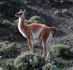

---
aliases:
  - guanaco
  - Lama guanicoe
  - Guanako
  - Guanaco
has_id_wikidata: Q172886
title: Lama guanicoe
IUCN_conservation_status: '[[_Standards/WikiData/WD~Least_Concern,211005]]'
parent_taxon: '[[_Standards/WikiData/WD~Lama,753853]]'
described_by_source: '[[_Standards/WikiData/WD~Encyclopædia_Britannica_11th_edition,867541]]'
this_taxon_is_source_of:
  - '[[_Standards/WikiData/WD~guanaco,1552716]]'
  - '[[_Standards/WikiData/WD~guanaco_fiber,28070615]]'
CITES_Appendix: '[[_Standards/WikiData/WD~Appendix_II_of_CITES,2851527]]'
original_combination: '[[_Standards/WikiData/WD~Camelus_guanicoe,27064372]]'
maintained_by_WikiProject: '[[_Standards/WikiData/WD~WikiProject_Invasion_Biology,56241615]]'
taxon_rank: '[[_Standards/WikiData/WD~species,7432]]'
instance_of: '[[_Standards/WikiData/WD~taxon,16521]]'
longest_observed_lifespan: 33.7
gestation_period: 352
ITIS_TSN: 625029
taxon_common_name:
  - Guanaco
  - Guanako
image:
  - http://commons.wikimedia.org/wiki/Special:FilePath/Guanaco%20at%20SF%20Zoo.jpg
  - http://commons.wikimedia.org/wiki/Special:FilePath/Guanaco%20Patagonico.jpg
winter_view: http://commons.wikimedia.org/wiki/Special:FilePath/Lama%20guanicoe%20455869946.jpg
taxon_range_map_image: http://commons.wikimedia.org/wiki/Special:FilePath/Lama%20guanicoe%20range.png
Commons_gallery: Lama guanicoe
Commons_category: Lama guanicoe
taxon_name: Lama guanicoe
NBN_System_Key: NHMSYS0020975298
short_name: L. guanicoe
---

# [[Guanaco]] 

#is_/same_as :: [[../../../../../../../../../../../../../../../../../../../../../../WikiData/WD~Guanaco,172886|WD~Guanaco,172886]] 

## #has_/text_of_/abstract 

> The **Guanaco** ( ghwuah-NAH-koh; Lama guanicoe) is a camelid native to South America, closely related to the llama. 
> 
> Guanacos are one of two wild South American camelids; 
> the other species is the vicuña, which lives at higher elevations.
>
> [Wikipedia](https://en.wikipedia.org/wiki/Guanaco) 

## Phylogeny 

-   « Ancestral Groups  
    -   [Camel](../../Camel.md)
    -  [Camelidae](../../../Camelidae.md) 
    -  [Tylopoda](../../../../Tylopoda.md) 
    -  [Artiodactyla](../../../../../Artiodactyla.md) 
    -  [Eutheria](../../../../../../Eutheria.md) 
    -  [Mammal](../../../../../../../Mammal.md) 
    -   [Therapsida](../../../../../../../../Therapsida.md)
    -   [Synapsida](../../../../../../../../../Synapsida.md)
    -   [Amniota](../../../../../../../../../../Amniota.md)
    -   [Terrestrial Vertebrates](../../../../../../../../../../../Terrestrial.md)
    -   [Sarcopterygii](../../../../../../../../../../../../Sarc.md)
    -   [Gnathostomata](../../../../../../../../../../../../../Gnath.md)
    -   [Vertebrata](../../../../../../../../../../../../../../Vertebrata.md)
    -   [Craniata](../../../../../../../../../../../../../../../Craniata.md)
    -   [Chordata](../../../../../../../../../../../../../../../../Chordata.md)
    -   [Deuterostomia](../../../../../../../../../../../../../../../../../Deutero.md)
    -  [Bilateria](../../../../../../../../../../../../../../../../../../Bilateria.md) 
    -  [Animals](../../../../../../../../../../../../../../../../../../../Animals.md) 
    -  [Eukarya](../../../../../../../../../../../../../../../../../../../../Eukarya.md) 
    -   [Tree of Life](../../../../../../../../../../../../../../../../../../../../Tree_of_Life.md)

-   ◊ Sibling Groups of  Camelinae
    -   [Lama pacos](Alpaca.md)
    -   [Camelus bactrianus](Camelus_bactrianus)
    -   Lama guanicoe
    -   [Vicugna vicugna](Vicugna_vicugna)

-   » Sub-Groups 

## Title Illustrations

------------------------------------------------------------

scientific_name ::     Lama guanicoe
location ::           Torres del Paine National Park, Chile
specimen_condition ::  Live Specimen
Source               [Guanaco](http://flickr.com/photos/merula/153179602/)
Source Collection    [Flickr](http://flickr.com/)
Image Use ::    [Attribution-ShareAlike 2.0 Creative Commons License](http://creativecommons.org/licenses/by-sa/2.0/).
copyright ::            © 2005 [Alastair Rae](http://flickr.com/people/merula/)

## Confidential Links & Embeds: 

### #is_/same_as :: [[/_Standards/bio/bio~Domain/Eukarya/Animal/Bilateria/Deutero/Chordata/Craniata/Vertebrata/Gnath/Sarc/Tetrapods/Amniota/Synapsida/Therapsida/Mammal/Eutheria/Artiodactyla/Tylopoda/Camelidae/Camel/Lamini/Guanaco|Guanaco]] 

### #is_/same_as :: [[/_public/bio/bio~Domain/Eukarya/Animal/Bilateria/Deutero/Chordata/Craniata/Vertebrata/Gnath/Sarc/Tetrapods/Amniota/Synapsida/Therapsida/Mammal/Eutheria/Artiodactyla/Tylopoda/Camelidae/Camel/Lamini/Guanaco.public|Guanaco.public]] 

### #is_/same_as :: [[/_internal/bio/bio~Domain/Eukarya/Animal/Bilateria/Deutero/Chordata/Craniata/Vertebrata/Gnath/Sarc/Tetrapods/Amniota/Synapsida/Therapsida/Mammal/Eutheria/Artiodactyla/Tylopoda/Camelidae/Camel/Lamini/Guanaco.internal|Guanaco.internal]] 

### #is_/same_as :: [[/_protect/bio/bio~Domain/Eukarya/Animal/Bilateria/Deutero/Chordata/Craniata/Vertebrata/Gnath/Sarc/Tetrapods/Amniota/Synapsida/Therapsida/Mammal/Eutheria/Artiodactyla/Tylopoda/Camelidae/Camel/Lamini/Guanaco.protect|Guanaco.protect]] 

### #is_/same_as :: [[/_private/bio/bio~Domain/Eukarya/Animal/Bilateria/Deutero/Chordata/Craniata/Vertebrata/Gnath/Sarc/Tetrapods/Amniota/Synapsida/Therapsida/Mammal/Eutheria/Artiodactyla/Tylopoda/Camelidae/Camel/Lamini/Guanaco.private|Guanaco.private]] 

### #is_/same_as :: [[/_personal/bio/bio~Domain/Eukarya/Animal/Bilateria/Deutero/Chordata/Craniata/Vertebrata/Gnath/Sarc/Tetrapods/Amniota/Synapsida/Therapsida/Mammal/Eutheria/Artiodactyla/Tylopoda/Camelidae/Camel/Lamini/Guanaco.personal|Guanaco.personal]] 

### #is_/same_as :: [[/_secret/bio/bio~Domain/Eukarya/Animal/Bilateria/Deutero/Chordata/Craniata/Vertebrata/Gnath/Sarc/Tetrapods/Amniota/Synapsida/Therapsida/Mammal/Eutheria/Artiodactyla/Tylopoda/Camelidae/Camel/Lamini/Guanaco.secret|Guanaco.secret]] 

