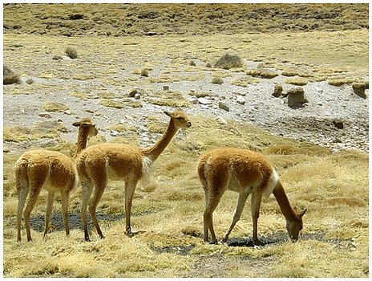

---
aliases:
- Bawazol (Vicugna vicugna)
- Bikuina
- Lama vikuňa
- Lạc đà thảo nguyên nhỏ
- Shádiʼááhdę́ę́ʼ tłʼízí dziłghą́ʼígíí
- viciúine
- Vicugna
- Vicugna vicugna
- Vicuna
- Vicunha
- Vicunya
- vicuña
- Vigogn
- Vigogne
- Vikuna
- Vikunija
- Vikunja
- Vikuno
- Vikunya
- vikuňa
- Wigòniô
- Wik'uña
- wikunia andyjska
- Βικούνια
- вікуньня звычайная
- Вікунья
- Викуња
- викунья
- викуня
- ויקוניה מצויה
- شترچه
- فكونة
- فكونه
- ویکونیا
- விக்குன்யா
- വികുന
- บิกุญญา
- ვიკუნია
- ビクーニャ
- 小羊駝
- 小羊驼
- 비쿠냐
has_id_wikidata: Q167797
title: Vicugna vicugna
has_characteristic: '[[_Standards/WikiData/WD~viviparity,120446]]'
different_from: '[[_Standards/WikiData/WD~Vicuña,201007]]'
IUCN_conservation_status: '[[_Standards/WikiData/WD~Least_Concern,211005]]'
described_by_source:
- '[[../../../../../../../../../../../../../../../../../../../../../../WikiData/WD~Brockhaus_and_Efron_Encyclopedic_Dictionary,602358]]'
- '[[_Standards/WikiData/WD~Great_Soviet_Encyclopedia_(1926_1947),20078554]]'
parent_taxon: '[[_Standards/WikiData/WD~Vicugna,2703941]]'
CITES_Appendix:
- '[[_Standards/WikiData/WD~Appendix_II_of_CITES,2851527]]'
- '[[_Standards/WikiData/WD~Appendix_I_of_CITES,2851528]]'
this_taxon_is_source_of: '[[_Standards/WikiData/WD~vicuña_wool,21064966]]'
original_combination: '[[_Standards/WikiData/WD~Camelus_vicugna,27064374]]'
maintained_by_WikiProject: '[[_Standards/WikiData/WD~WikiProject_Invasion_Biology,56241615]]'
taxon_range:
- '[[_Standards/WikiData/WD~Chile,298]]'
- '[[_Standards/WikiData/WD~Argentina,414]]'
- '[[_Standards/WikiData/WD~Peru,419]]'
- '[[_Standards/WikiData/WD~Bolivia,750]]'
taxon_rank: '[[_Standards/WikiData/WD~species,7432]]'
instance_of: '[[_Standards/WikiData/WD~taxon,16521]]'
gestation_period: 340
longest_observed_lifespan: 31.6
ITIS_TSN: 625031
taxon_common_name:
- Vigogne
- Vicuña
- Vicuna
- فكونة
- Вікунья
- Vicunya
- vikuňa
- Vikunja
- Vikunja
- Βικούνια
- Vicugna
- Vicugna vicugna
- Vikunja
- Bikuina
- شترچه
- ビクーニャ
- 비쿠냐
- 小羊駝
taxon_range_map_image:
- http://commons.wikimedia.org/wiki/Special:FilePath/Vicugna%20vicugna%20range.png
- http://commons.wikimedia.org/wiki/Special:FilePath/Vicugna%20vicugna%20range%20map.png
image: http://commons.wikimedia.org/wiki/Special:FilePath/Vicunacrop.jpg
NBN_System_Key: NHMSYS0000377321
Commons_gallery: Vicugna vicugna
Commons_category: Vicugna vicugna
taxon_name: Vicugna vicugna
short_name: V. vicugna
dv_has_:
  name_:
    an: Vicugna vicugna
    ar: فكونة
    arz: فكونه
    ast: Vicuña
    avk: Bawazol (Vicugna vicugna)
    az: Vikunya
    azb: ویکونیا
    be: Вікунья
    be_tarask: вікуньня звычайная
    bg: викуня
    br: Vigogn
    ca: vicunya
    ceb: Vicugna vicugna
    cs: vikuňa
    csb: Wigòniô
    da: Vikunja
    de: Vikunja
    el: Βικούνια
    en: vicuña
    en-us: vicuña
    eo: vikuno
    es: Vicugna vicugna
    et: Vikunja
    eu: Bikuina
    ext: Vicugna vicugna
    fa: ویکونیا
    fi: vikunja
    fr: vigogne
    frr: Vikunja
    ga: viciúine
    gl: Vicuña
    he: ויקוניה מצויה
    hu: vikunya
    ia: Vicugna vicugna
    id: Vikunya
    ie: Vicugna vicugna
    io: Vikuno
    it: Vicugna vicugna
    ja: ビクーニャ
    ka: ვიკუნია
    kab: Vikunya
    kk: Викунья
    ko: 비쿠냐
    la: Vicugna vicugna
    lb: Vikunja
    lt: Vikunija
    lv: vikunja
    mhr: Викунья
    mk: Викуња
    ml: വികുന
    ms: Vikuna
    mul: Vicugna vicugna
    nb: Vikunja
    nl: vicuña
    nn: Vikunja
    nv: Shádiʼááhdę́ę́ʼ tłʼízí dziłghą́ʼígíí
    oc: Vicugna vicugna
    os: викунья
    pl: wikunia andyjska
    pt: Vicunha
    pt_br: Vicugna vicugna
    qu: Wik'uña
    ro: Vicuña
    ru: викунья
    sco: vicuña
    sh: Vikunja
    sk: Lama vikuňa
    sl: vikunja
    sq: Vicugna vicugna
    sr: викуња
    sr_ec: викуња
    sr_el: vikunja
    sv: vikunja
    ta: விக்குன்யா
    th: บิกุญญา
    tr: Vikunya
    udm: Викунья
    uk: вікунья
    vi: Lạc đà thảo nguyên nhỏ
    vo: Vicugna vicugna
    war: Vicugna vicugna
    wuu: 小羊驼
    yue: 小羊駝
    zh: 小羊駝
    zh_cn: 小羊驼
    zh_hans: 小羊驼
    zh_hant: 小羊駝
    zh_hk: 小羊駝
    zh_sg: 小羊驼
    zh_tw: 小羊駝
---
# [[Vicugna]] vicugna 

#is_/same_as :: [[../../../../../../../../../../../../../../../../../../../../../../WikiData/WD~Vicuña,167797|WD~Vicuña,167797]] 

 

## #has_/text_of_/abstract 

> The **vicuña** (Lama vicugna) or vicuna (both , very rarely spelled vicugna, its former genus name) 
> is one of the two wild South American camelids, which live in the high alpine areas of the Andes; 
> the other camelid is the guanaco, which lives at lower elevations. 
> 
> Vicuñas are relatives of the llama, and are now believed to be the wild ancestor of domesticated alpacas, 
> which are raised for their coats. 
> 
> Vicuñas produce small amounts of extremely fine wool, which is very expensive 
> because the animal can be shorn only every three years and has to be caught from the wild. 
> 
> When knitted together, the product of the vicuña's wool is very soft and warm. 
> The Inca valued vicuñas highly for their wool, 
> and it was against the law for anyone but royalty to wear vicuña garments; today, 
> the vicuña is the national animal of Peru and appears on the Peruvian coat of arms.
>
> Both under the rule of the Inca and today, vicuñas have been protected by law, 
> but they were heavily hunted in the intervening period. 
> 
> When they were declared endangered in 1974, only about 6,000 animals were left. 
> Today, the vicuña population has recovered to about 350,000, 
> and although conservation organizations have reduced its level of threat classification, 
> they still call for active conservation programs to protect populations 
> from poaching, habitat loss, and other threats.
>
> Previously, the vicuña was not considered domesticated, 
> and the llama and the alpaca were regarded as descendants of the closely related guanaco. 
> However, DNA research published in 2001 has demonstrated that the alpaca may have vicuña parentage. 
> Today, the vicuña is mainly wild, but the local people still perform special rituals with these creatures, 
> including a fertility rite.
>
> [Wikipedia](https://en.wikipedia.org/wiki/Vicu%C3%B1a) 

## Phylogeny 

-   « Ancestral Groups  
    -   [Camel](../../Camel.md)
    -  [Camelidae](../../../Camelidae.md) 
    -  [Tylopoda](../../../../Tylopoda.md) 
    -  [Artiodactyla](../../../../../Artiodactyla.md) 
    -  [Eutheria](../../../../../../Eutheria.md) 
    -  [Mammal](../../../../../../../Mammal.md) 
    -   [Therapsida](../../../../../../../../Therapsida.md)
    -   [Synapsida](../../../../../../../../../Synapsida.md)
    -   [Amniota](../../../../../../../../../../Amniota.md)
    -   [Terrestrial Vertebrates](../../../../../../../../../../../Terrestrial.md)
    -   [Sarcopterygii](../../../../../../../../../../../../Sarc.md)
    -   [Gnathostomata](../../../../../../../../../../../../../Gnath.md)
    -   [Vertebrata](../../../../../../../../../../../../../../Vertebrata.md)
    -   [Craniata](../../../../../../../../../../../../../../../Craniata.md)
    -   [Chordata](../../../../../../../../../../../../../../../../Chordata.md)
    -   [Deuterostomia](../../../../../../../../../../../../../../../../../Deutero.md)
    -  [Bilateria](../../../../../../../../../../../../../../../../../../Bilateria.md) 
    -  [Animals](../../../../../../../../../../../../../../../../../../../Animals.md) 
    -  [Eukarya](../../../../../../../../../../../../../../../../../../../../Eukarya.md) 
    -   [Tree of Life](../../../../../../../../../../../../../../../../../../../../Tree_of_Life.md)

-   ◊ Sibling Groups of  Camelinae
    -   [Lama pacos](Alpaca.md)
    -   [Camelus bactrianus](Camelus_bactrianus)
    -   [Lama guanicoe](Guanaco.md)
    -   Vicugna vicugna

-   » Sub-Groups 

## Title Illustrations

  ------------------------------------------------------------------
  scientific_name ::     Vicugna vicugna
  location ::           Parque Nacional Lauca, Chile
  specimen_condition ::  Live Specimen
  Source               [Darkroom People: Vicuñas](http://www.darkroompeople.com/drp9/photos/lauca/imagepages/image003.php)
  Image Use ::    [Attribution-NonCommercial-ShareAlike 2.0 Creative Commons License](http://creativecommons.org/licenses/by-nc-sa/2.0/).
  copyright ::            © [Bruno Furnari](http://www.darkroompeople.com/)
  ------------------------------------------------------------------

## Confidential Links & Embeds: 

### #is_/same_as :: [[/_Standards/bio/bio~Domain/Eukarya/Animal/Bilateria/Deutero/Chordata/Craniata/Vertebrata/Gnath/Sarc/Tetrapods/Amniota/Synapsida/Therapsida/Mammal/Eutheria/Artiodactyla/Tylopoda/Camelidae/Camel/Lamini/Vicugna|Vicugna]] 

### #is_/same_as :: [[/_public/bio/bio~Domain/Eukarya/Animal/Bilateria/Deutero/Chordata/Craniata/Vertebrata/Gnath/Sarc/Tetrapods/Amniota/Synapsida/Therapsida/Mammal/Eutheria/Artiodactyla/Tylopoda/Camelidae/Camel/Lamini/Vicugna.public|Vicugna.public]] 

### #is_/same_as :: [[/_internal/bio/bio~Domain/Eukarya/Animal/Bilateria/Deutero/Chordata/Craniata/Vertebrata/Gnath/Sarc/Tetrapods/Amniota/Synapsida/Therapsida/Mammal/Eutheria/Artiodactyla/Tylopoda/Camelidae/Camel/Lamini/Vicugna.internal|Vicugna.internal]] 

### #is_/same_as :: [[/_protect/bio/bio~Domain/Eukarya/Animal/Bilateria/Deutero/Chordata/Craniata/Vertebrata/Gnath/Sarc/Tetrapods/Amniota/Synapsida/Therapsida/Mammal/Eutheria/Artiodactyla/Tylopoda/Camelidae/Camel/Lamini/Vicugna.protect|Vicugna.protect]] 

### #is_/same_as :: [[/_private/bio/bio~Domain/Eukarya/Animal/Bilateria/Deutero/Chordata/Craniata/Vertebrata/Gnath/Sarc/Tetrapods/Amniota/Synapsida/Therapsida/Mammal/Eutheria/Artiodactyla/Tylopoda/Camelidae/Camel/Lamini/Vicugna.private|Vicugna.private]] 

### #is_/same_as :: [[/_personal/bio/bio~Domain/Eukarya/Animal/Bilateria/Deutero/Chordata/Craniata/Vertebrata/Gnath/Sarc/Tetrapods/Amniota/Synapsida/Therapsida/Mammal/Eutheria/Artiodactyla/Tylopoda/Camelidae/Camel/Lamini/Vicugna.personal|Vicugna.personal]] 

### #is_/same_as :: [[/_secret/bio/bio~Domain/Eukarya/Animal/Bilateria/Deutero/Chordata/Craniata/Vertebrata/Gnath/Sarc/Tetrapods/Amniota/Synapsida/Therapsida/Mammal/Eutheria/Artiodactyla/Tylopoda/Camelidae/Camel/Lamini/Vicugna.secret|Vicugna.secret]] 

